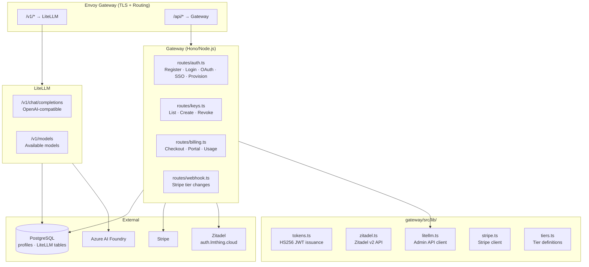

# Skill: Cloud Backend (Gateway + LiteLLM)

The **sole backend** for all lmthing products. There is no separate backend service — `cloud/` runs on Kubernetes (Kubespray) on an Azure VM with two services. Whenever any frontend needs server-side logic (new API endpoint, database operation, webhook handler), it **must be implemented in the gateway (`cloud/gateway/`) or as K8s configuration**. Do not create backend services elsewhere. All frontend apps are static SPAs that call `cloud/` API endpoints.

## The two services

- **LiteLLM** (`/v1/*`) — OpenAI-compatible LLM proxy routing to Azure AI Foundry, with per-user budget windows, rate limits, and a 15% token markup. Authenticates the API key, checks the tier's budget windows + rate limits, forwards to Azure, tracks token usage. Four models enabled (DeepSeek-V4-Flash, DeepSeek-V4-Pro, Kimi-K2.6, gpt-5.5), all available on every tier.
- **Gateway** (`/api/*`) — Hono/Node.js service for auth, API key management, billing, and Stripe webhooks. Users are managed by **Zitadel** (auth.lmthing.cloud) — email/password and GitHub OAuth via IDP Intent API. The gateway issues its own HS256 JWTs; clients never hold Zitadel tokens. Server-side data (profiles, LiteLLM tables) is stored in **PostgreSQL** (in-cluster). Billing/usage metering is handled by **Stripe** subscriptions, orchestrated through the gateway.

## Gateway libraries (`gateway/src/lib/`)

- `tokens.ts` — gateway JWT issuance/verification (HS256).
- `zitadel.ts` — Zitadel v2 API (users + IDP Intent).
- `litellm.ts` — LiteLLM admin API client.
- `stripe.ts` — Stripe client.
- `tiers.ts` — tier definitions + model lists.

## Gateway API routes

| Route                      | Method | Auth       | Purpose                                  |
| -------------------------- | ------ | ---------- | ---------------------------------------- |
| `/api/auth/register`       | POST   | Public     | Register → returns API key               |
| `/api/auth/login`          | POST   | Public     | Login → returns JWT + refresh token      |
| `/api/auth/oauth/url`      | GET    | Public     | Start GitHub OAuth via Zitadel IDP Intent |
| `/api/auth/oauth/callback` | GET    | Public     | IDP Intent callback — issues gateway tokens, redirects |
| `/api/auth/provision`      | POST   | JWT        | Provision LiteLLM user + Stripe customer |
| `/api/auth/refresh`        | POST   | Public     | Refresh access token                     |
| `/api/auth/me`             | GET    | JWT        | User info + tier                         |
| `/api/auth/sso/create`     | POST   | JWT        | Generate SSO authorization code          |
| `/api/auth/sso/exchange`   | POST   | Public     | Exchange SSO code for session            |
| `/api/keys`                | GET    | JWT        | List API keys                            |
| `/api/keys`                | POST   | JWT        | Create API key                           |
| `/api/keys/:token`         | DELETE | JWT        | Revoke API key                           |
| `/api/billing/checkout`    | POST   | JWT        | Stripe checkout session                  |
| `/api/billing/portal`      | POST   | JWT        | Stripe billing portal                    |
| `/api/billing/usage`       | GET    | JWT        | Budget usage info                        |
| `/api/billing/checkout/status` | GET | JWT       | Check Stripe checkout session status     |
| `/api/compute/version`     | GET    | none       | Latest built compute image tag           |
| `/api/compute/ensure`      | POST   | JWT        | Provision/wake pod; returns running `computeTag` |
| `/api/compute/status`      | GET    | JWT        | Compute pod status (incl. `computeTag`)  |
| `/api/compute/upgrade`     | POST   | JWT        | Rolling restart onto latest compute image |
| `/api/compute/env`         | GET    | JWT        | List user pod environment variables      |
| `/api/compute/env`         | PUT    | JWT        | Set user pod env vars (triggers restart) |
| `/api/stripe/webhook`      | POST   | Stripe sig | Subscription events → tier changes       |
| `/v1/chat/completions`     | POST   | API key    | OpenAI-compatible chat (via LiteLLM)     |
| `/v1/models`               | GET    | API key    | Available models (via LiteLLM)           |

## Tiers

Each tier defines three independent budget windows (1d / 7d / 30d spend caps), set on the
user's single API key via LiteLLM's multiple-budget-windows feature. All tiers can call all
four enabled models.

| Tier    | Price      | Budget (1d / 7d / 30d) | Rate Limits       |
| ------- | ---------- | ---------------------- | ----------------- |
| Free    | $0         | $0.30 / $2 / $6        | 10K tpm / 60 rpm  |
| Basic   | $10/month  | $1 / $4 / $10          | 50K tpm / 300 rpm |
| Pro     | $20/month  | $3 / $10 / $20         | 100K tpm / 1K rpm |
| Max     | $100/month | $10 / $30 / $100       | 1M tpm / 5K rpm   |

Adding a new tier touches files across the monorepo — see `@.claude/skills/add-tier.md`.

## Agent execution flow (request lifecycle)

1. Studio reads agent config from the VFS, then POSTs to `/v1/chat/completions` (OpenAI-compatible) with the user's LiteLLM API key.
2. LiteLLM authenticates the API key, checks budget + rate limits for the user's tier.
3. Request routed to the Azure AI Foundry model endpoint.
4. Response streams back to the browser; LiteLLM tracks token usage against the user's budget.

## Deployment

K8s manifests are in `devops/argocd/` (Envoy Gateway), auto-synced by ArgoCD. Develop the gateway locally (build + run the Hono server), deploy via `cd devops/ansible && make deploy`. See `devops/CLAUDE.md` and `@.claude/skills/authentication.md` for auth flows, SSO, and token details.
