# LMThing Architecture

## Domain Infrastructure

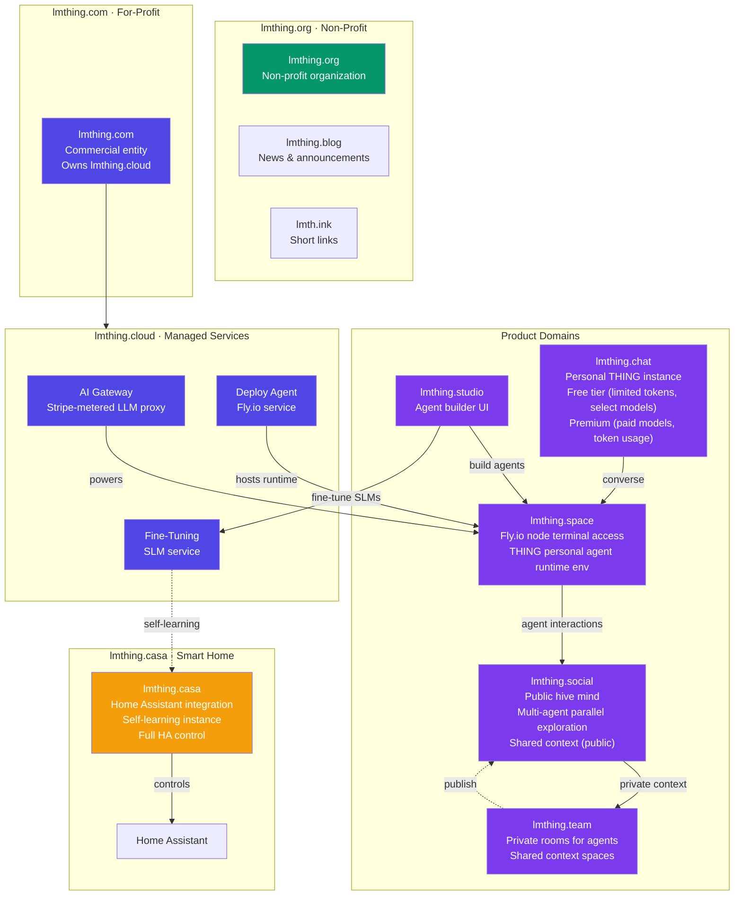

## System Overview

## Monorepo Structure

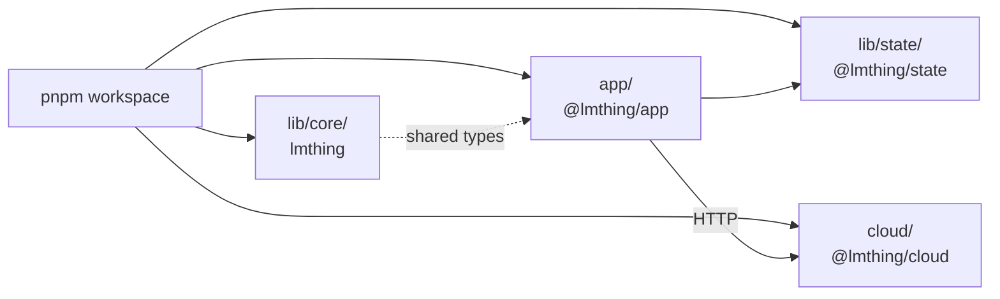

## Agent Execution Flow

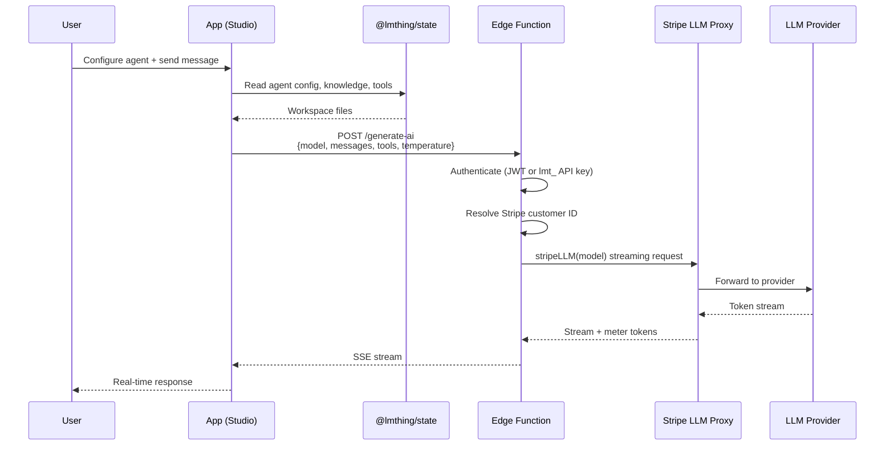

## Authentication

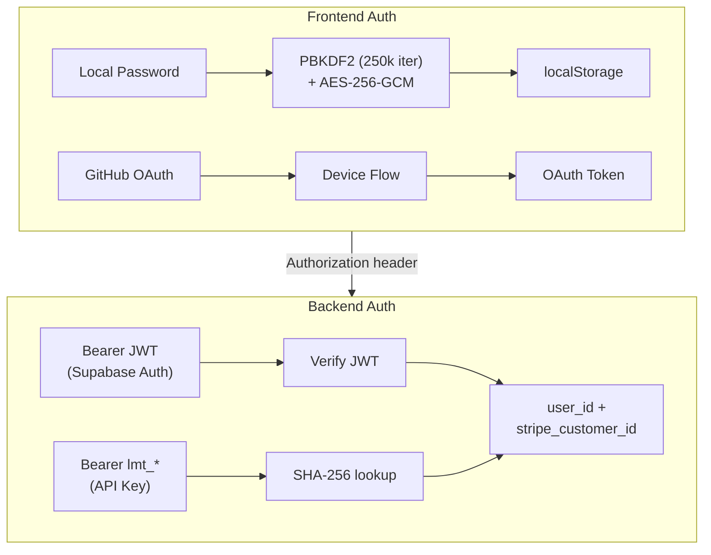

## Cloud Backend (Supabase Edge Functions)

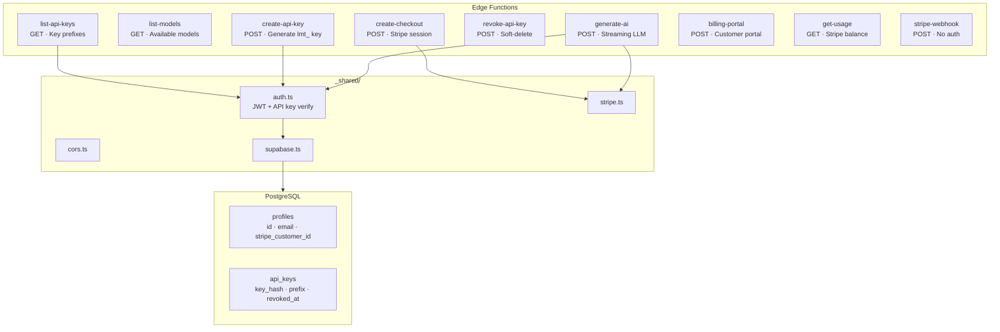

## Virtual File System (@lmthing/state)

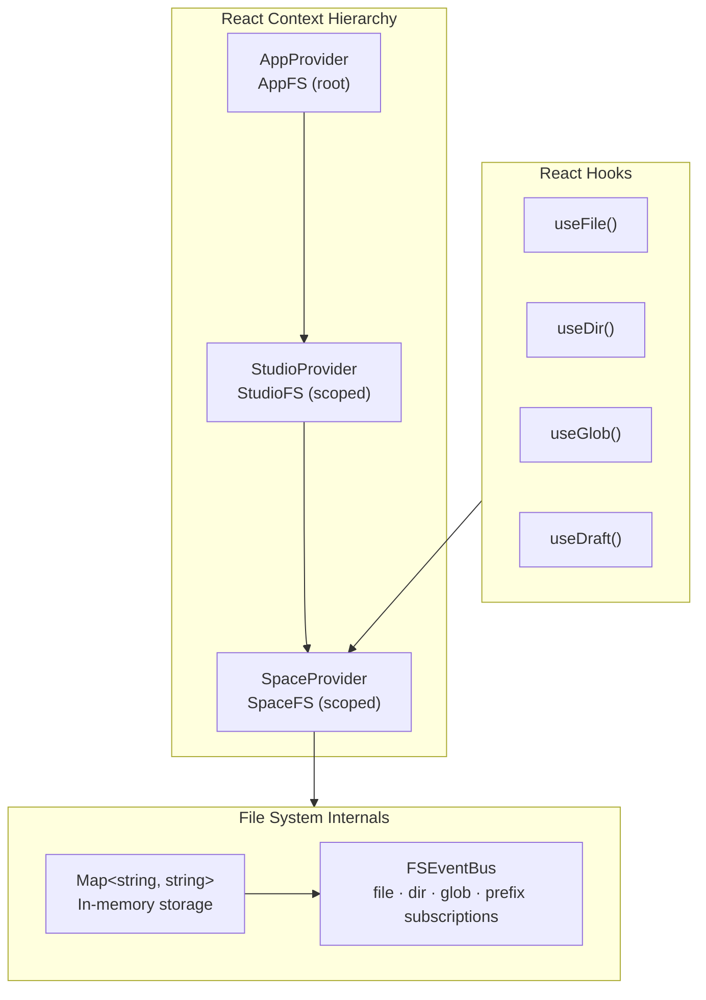

## Routing per Domain

### lmthing.studio

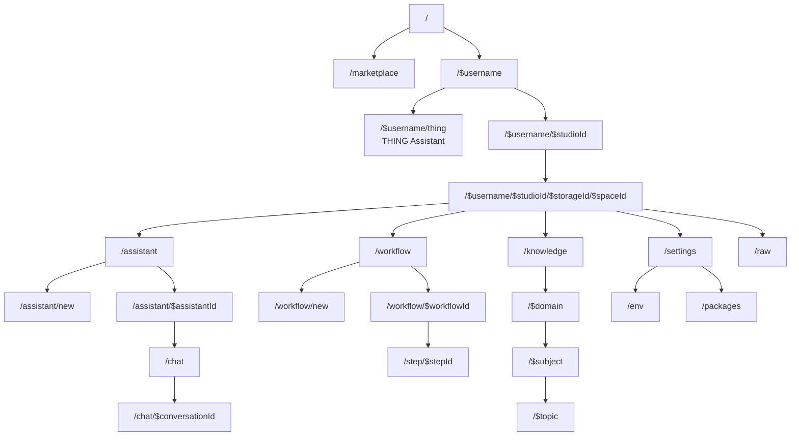

### lmthing.chat

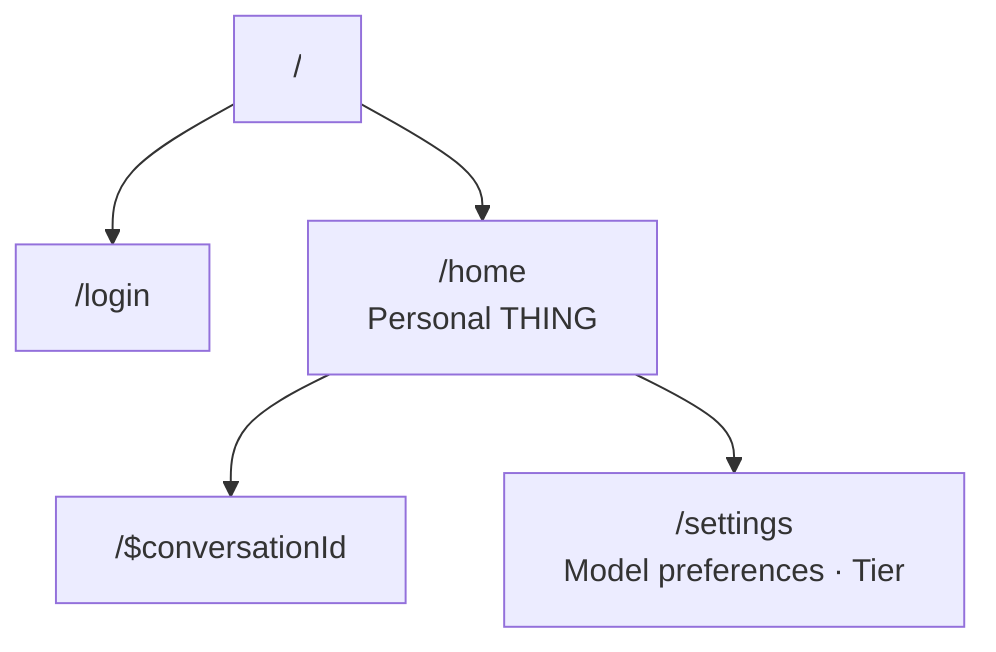

### lmthing.space

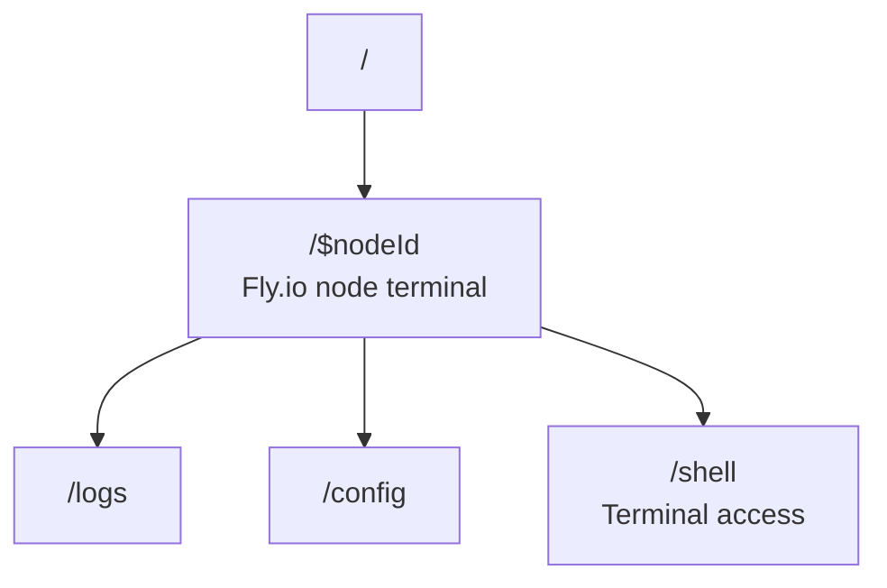

### lmthing.social

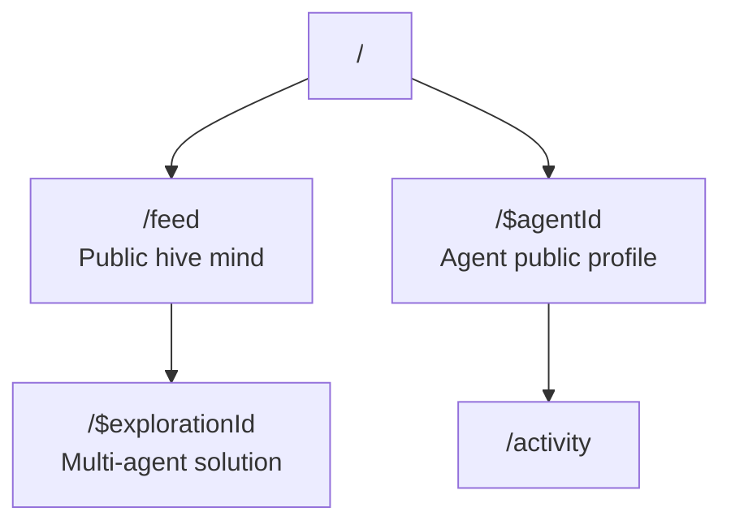

### lmthing.team

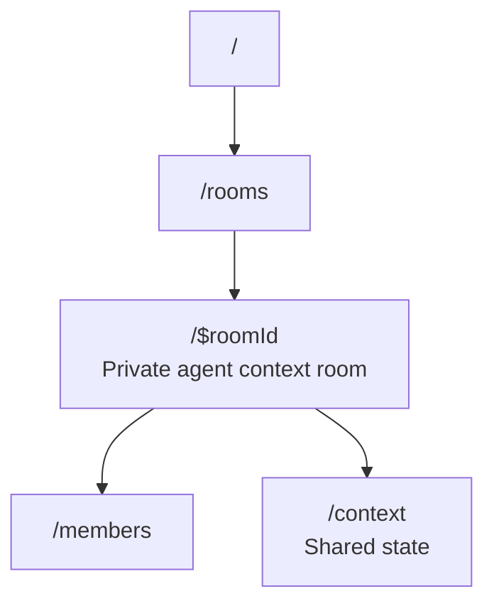

### lmthing.casa

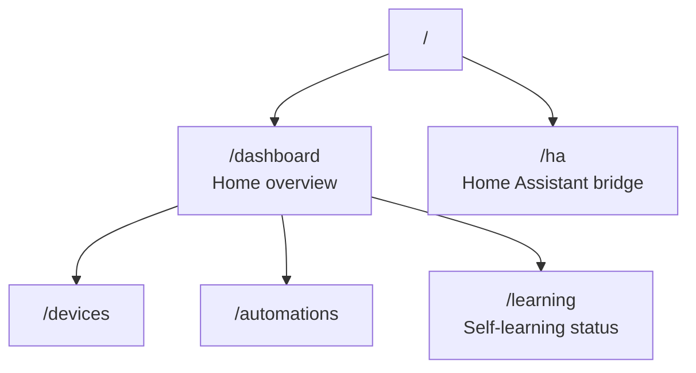

## Core Agent Framework (lib/core)

Agentic framework for stateful interactive chat and autonomous agents.

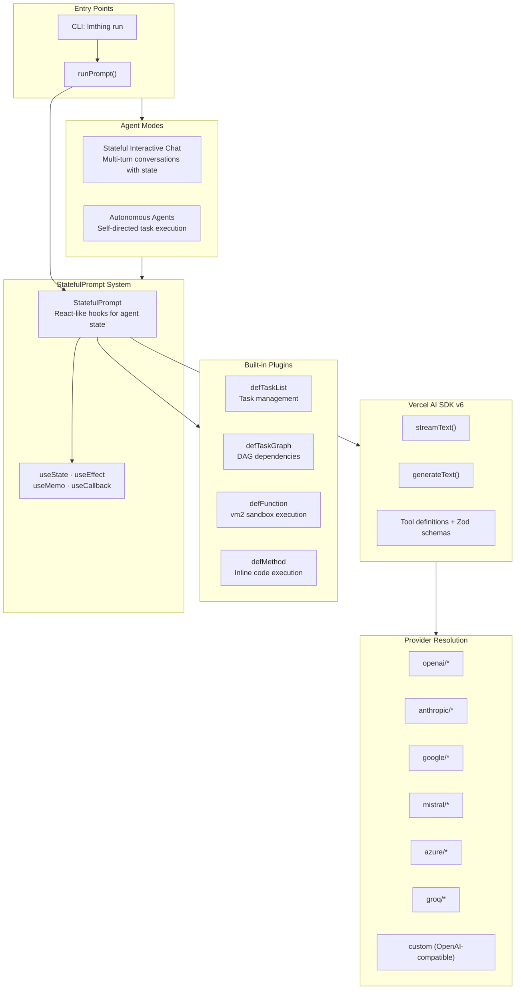

## Data Storage Map

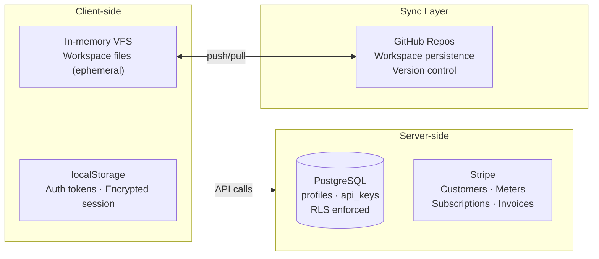
