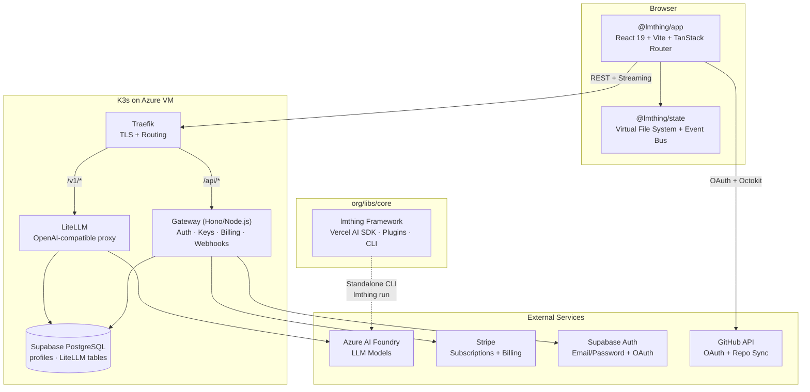
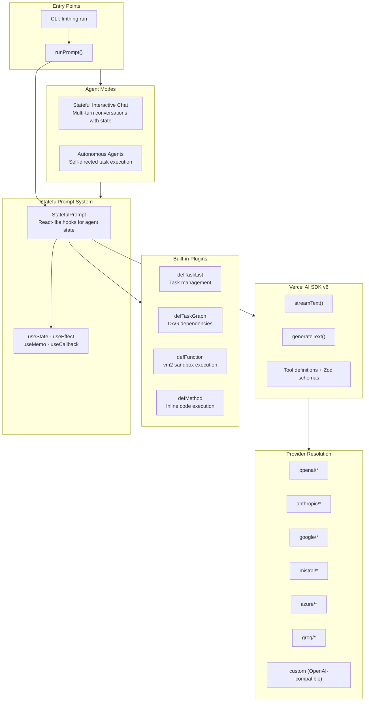
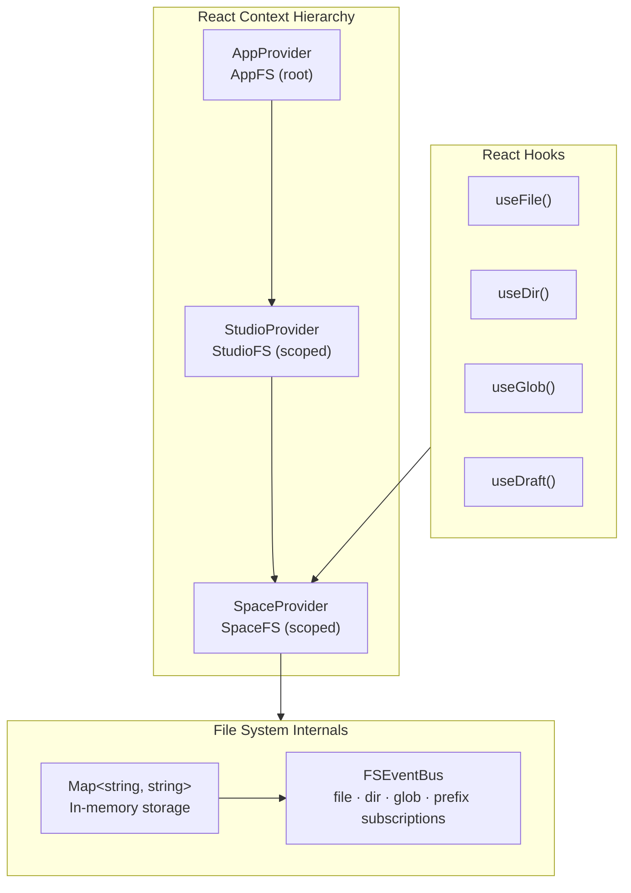
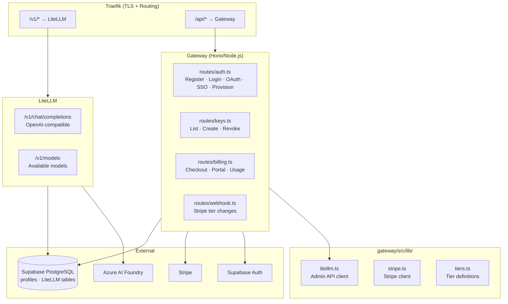
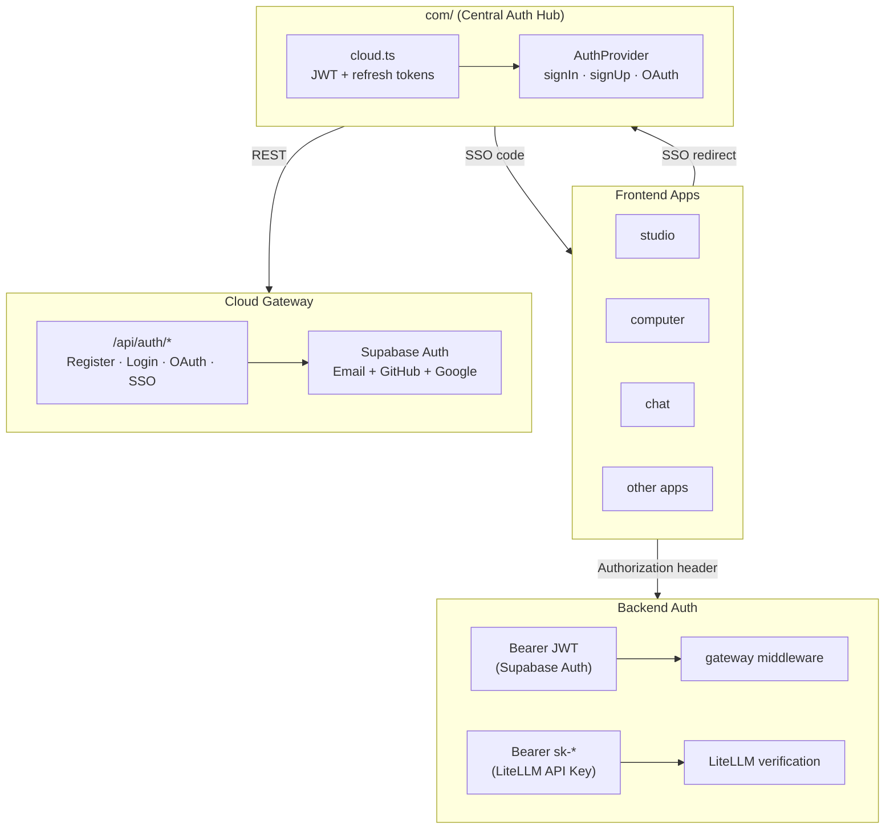
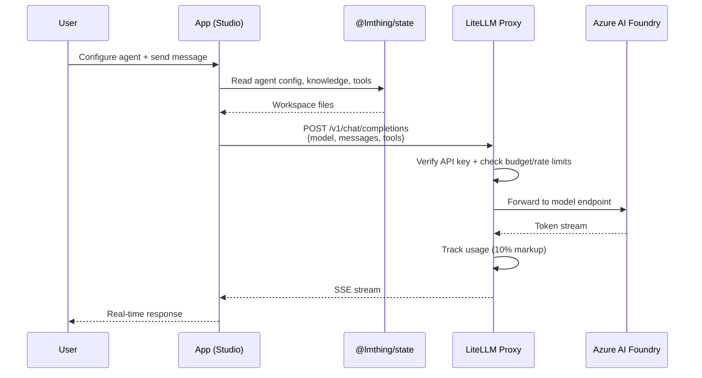
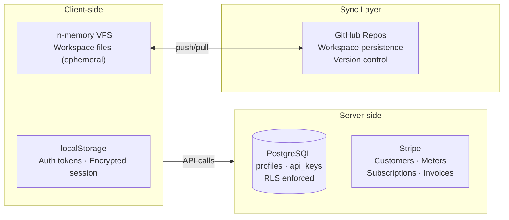

# LMThing Developer Onboarding Guide

Welcome to lmthing. This guide will get you set up and oriented in the codebase. For the full product and domain architecture, see [Architecture.md](./Architecture.md).

---

## Prerequisites

- **Node.js** ≥ 20
- **pnpm** ≥ 9
- **Git** (all workspace sync is git-based)
- A GitHub account (for OAuth and workspace persistence)

---

## Repository Structure

The monorepo is organized by TLD — each lmthing.\* domain has its own top-level directory.

```
lmthing/
├── org/                    # Non-profit / open-source
│   ├── libs/               # Shared libraries used across all domains
│   │   ├── core/           # lmthing — agentic framework (TypeScript, Vercel AI SDK v6)
│   │   ├── state/          # @lmthing/state — virtual file system (React hooks, Map-based VFS)
│   │   ├── css/            # Shared styles
│   │   ├── ui/             # Shared UI components
│   │   ├── auth/           # @lmthing/auth — cross-domain SSO client
│   │   ├── container/      # @lmthing/container — Fly.io Machines API client
│   │   ├── server/         # Container runtime server (WebSocket, PTY, metrics)
│   │   ├── thing/          # @lmthing/thing — THING agent system studio (built-in spaces)
│   │   └── utils/          # Shared build utilities (Vite config)
│   └── docs/               # Documentation
├── cloud/                  # lmthing.cloud — K3s API gateway (Hono/Node.js) + LiteLLM proxy
├── studio/                 # lmthing.studio — agent builder UI (React 19, Vite 7, TanStack Router)
├── chat/                   # lmthing.chat — personal THING interface
├── blog/                   # lmthing.blog — personalized AI news
├── computer/               # lmthing.computer — THING agent runtime (Fly.io node, terminal access)
├── space/                  # lmthing.space — deploy spaces & publish agents
├── social/                 # lmthing.social — public hive mind
├── team/                   # lmthing.team — private agent rooms
├── store/                  # lmthing.store — agent marketplace
├── casa/                   # lmthing.casa — smart home (Home Assistant)
├── com/                    # lmthing.com — commercial landing page
├── pnpm-workspace.yaml
└── package.json
```

---

## Backend Architecture — Important

**There is no separate backend service.** The `cloud/` directory is the **sole backend** for the entire project. It runs on **K3s** (lightweight Kubernetes) on an Azure VM, with two services:

- **LiteLLM** — OpenAI-compatible LLM proxy that routes to Azure AI Foundry models, with budget enforcement, rate limiting, and token usage tracking (10% markup over Azure pricing).
- **Gateway** — Hono/Node.js service handling auth, API key management, billing (Stripe subscriptions), and webhooks.

Key details:
- **Users and all server-side data are stored in Supabase PostgreSQL** (profiles, LiteLLM tables), with Supabase Auth for user management.
- **Billing and usage metering** are handled by Stripe subscriptions, orchestrated through the gateway.
- **LLM requests** go through LiteLLM (`/v1/*`), which enforces per-user budgets and rate limits based on their tier (Free/Starter/Basic/Pro/Max).
- **Whenever any service needs backend functionality** (new API endpoint, database operation, webhook handler, etc.), it **must be implemented in the gateway (`cloud/gateway/`) or as K8s configuration**. Do not create backend services elsewhere.
- All frontend apps are static SPAs — they call `cloud/` API endpoints for any server-side logic.

---

## Getting Started

```bash
# Clone and install
git clone git@github.com:lmthing/lmthing.git
cd lmthing
pnpm install

# Run Studio (the main development surface)
cd studio
pnpm dev
```

---

## System Overview



---

## Key Packages

### org/libs/core — Agent Framework

The agentic framework powering all of lmthing. Two modes of operation:

- **Stateful Interactive Chat** — multi-turn conversations where the agent maintains state across turns
- **Autonomous Agents** — self-directed task execution without human input

Key concepts:

- **StatefulPrompt** — React-like hooks (`useState`, `useEffect`, `useMemo`, `useCallback`) for managing agent state
- **Plugins** — `defTaskList` (task management), `defTaskGraph` (DAG dependencies), `defFunction` (vm2 sandbox), `defMethod` (inline code)
- **Provider resolution** — `openai/*`, `anthropic/*`, `google/*`, `mistral/*`, `azure/*`, `groq/*`, or any OpenAI-compatible endpoint
- **Entry points** — `runPrompt()` programmatic API, `lmthing run` CLI

Built on Vercel AI SDK v6 (`streamText()`, `generateText()`, Zod tool schemas).



### org/libs/state — Virtual File System

In-memory VFS for browser-based workspace management:

- `Map<string, string>` storage with `FSEventBus` for fine-grained subscriptions (file, dir, glob, prefix)
- React context hierarchy: `AppProvider` → `StudioProvider` → `SpaceProvider`
- Hooks: `useFile()`, `useDir()`, `useGlob()`, `useDraft()`
- Persistence via GitHub sync (push/pull), conflict resolution follows standard git merge workflows



### org/libs/thing — THING Agent System Studio

Built-in spaces that ship with the THING agent. These are system-level spaces providing meta-capabilities for the entire lmthing ecosystem — from teaching users how to create spaces, to controlling each service on behalf of the user.

7 built-in spaces (12 agents, 12 flows, 17 knowledge domains):

```
org/libs/thing/
├── package.json                          # @lmthing/thing
└── spaces/
    ├── space-creator/                    # Meta-space for creating spaces
    │   ├── agents/                       # SpaceArchitect, KnowledgeDesigner, FlowAuthor
    │   ├── flows/                        # flow_create_space (6 steps), flow_design_knowledge (5 steps)
    │   └── knowledge/                    # space-structure, knowledge-design, agent-design, naming-rules, creator-context
    ├── space-ecosystem/                  # Platform overview, account & billing management
    │   ├── agents/                       # PlatformGuide, AccountManager
    │   ├── flows/                        # flow_explore_platform, flow_manage_billing
    │   └── knowledge/                    # platform-map (10 services), billing-context, user-context
    ├── space-studio/                     # Agent building, workspace management, prompt optimization
    │   ├── agents/                       # WorkspaceManager, AgentBuilder, PromptCoach
    │   ├── flows/                        # flow_create_agent, flow_manage_workspace, flow_optimize_prompts
    │   └── knowledge/                    # workspace-ops, model-selection, prompt-patterns, user-context
    ├── space-chat/                       # Personal THING chat interface
    │   ├── agents/                       # ChatAssistant
    │   ├── flows/                        # flow_start_conversation
    │   └── knowledge/                    # chat-modes, model-guide
    ├── space-computer/                   # Fly.io computer node management & troubleshooting
    │   ├── agents/                       # ComputerAdmin, Troubleshooter
    │   ├── flows/                        # flow_setup_computer, flow_troubleshoot
    │   └── knowledge/                    # infrastructure, computer-ops, regions
    ├── space-deploy/                     # Space deployment lifecycle on Fly.io
    │   ├── agents/                       # DeployManager, SpaceMonitor
    │   ├── flows/                        # flow_deploy_space, flow_check_status
    │   └── knowledge/                    # space-lifecycle, deploy-config, regions
    └── space-store/                      # Agent marketplace publishing & optimization
        ├── agents/                       # StoreCurator, ListingOptimizer
        ├── flows/                        # flow_publish_agent, flow_optimize_listing
        └── knowledge/                    # distribution-models, pricing-strategy, listing-quality
```

### cloud/ — K3s API Gateway + LiteLLM (The Only Backend)

The **sole backend** for all lmthing products. Runs on K3s (lightweight Kubernetes) on an Azure VM with two services:

- **LiteLLM** (`/v1/*`) — OpenAI-compatible LLM proxy routing to Azure AI Foundry, with per-user budgets, rate limits, and 10% token markup.
- **Gateway** (`/api/*`) — Hono/Node.js service for auth, API keys, billing, and Stripe webhooks.

**Tiers:**

| Tier    | Price      | Budget  | Reset   | Rate Limits          |
|---------|------------|---------|---------|----------------------|
| Free    | $0         | $1      | 7 days  | 10K tpm / 60 rpm     |
| Starter | $5/month   | $5      | 30 days | 25K tpm / 150 rpm    |
| Basic   | $10/month  | $10     | 30 days | 50K tpm / 300 rpm    |
| Pro     | $20/month  | $20     | 30 days | 100K tpm / 1K rpm    |
| Max     | $100/month | $100    | 30 days | 1M tpm / 5K rpm      |

Adding a new tier touches files across the monorepo — see [Adding a New Tier](#adding-a-new-tier) below.

**Gateway API routes:**

| Route                          | Method | Auth       | Purpose                                      |
| ------------------------------ | ------ | ---------- | -------------------------------------------- |
| `/api/auth/register`           | POST   | Public     | Register → returns API key                   |
| `/api/auth/login`              | POST   | Public     | Login → returns JWT + refresh token          |
| `/api/auth/oauth/url`          | GET    | Public     | Get Supabase OAuth URL (GitHub/Google)       |
| `/api/auth/oauth/callback`     | GET    | Public     | OAuth callback (Supabase redirect)           |
| `/api/auth/provision`          | POST   | JWT        | Provision LiteLLM user + Stripe customer     |
| `/api/auth/refresh`            | POST   | Public     | Refresh access token                         |
| `/api/auth/me`                 | GET    | JWT        | User info + tier                             |
| `/api/auth/sso/create`         | POST   | JWT        | Generate SSO authorization code              |
| `/api/auth/sso/exchange`       | POST   | Public     | Exchange SSO code for session                |
| `/api/keys`                    | GET    | JWT        | List API keys                                |
| `/api/keys`                    | POST   | JWT        | Create API key                               |
| `/api/keys/:token`             | DELETE | JWT        | Revoke API key                               |
| `/api/billing/checkout`        | POST   | JWT        | Stripe checkout session                      |
| `/api/billing/portal`          | POST   | JWT        | Stripe billing portal                        |
| `/api/billing/usage`           | GET    | JWT        | Budget usage info                            |
| `/api/stripe/webhook`          | POST   | Stripe sig | Subscription events → tier changes           |
| `/v1/chat/completions`         | POST   | API key    | OpenAI-compatible chat (via LiteLLM)         |
| `/v1/models`                   | GET    | API key    | Available models (via LiteLLM)               |

**Gateway libraries** in `gateway/src/lib/`: `litellm.ts` (LiteLLM admin API client), `stripe.ts` (Stripe client), `tiers.ts` (tier definitions + model lists).

**K8s manifests** in `k8s/`: `litellm.yaml` (LiteLLM + model config), `gateway.yaml` (gateway service), `ingress.yaml.tpl` (Traefik routing), `traefik-config.yaml.tpl` (TLS).



---

## Authentication

Authentication is handled through **com/** (the central auth hub) which talks to the **cloud gateway API**. com/ has its own login/signup UI and uses the cloud gateway's auth routes (which proxy Supabase Auth). Other lmthing.* apps use cross-domain SSO via com/.

**Auth providers**: Email/password, GitHub OAuth, and Google OAuth (all via Supabase Auth, proxied through the gateway).

**com/ auth flow** (direct):
1. User visits com/ → signs up or logs in via `/api/auth/register`, `/api/auth/login`, or OAuth
2. OAuth flow: gateway returns Supabase OAuth URL → user authenticates → Supabase redirects to com/callback with tokens in hash fragment
3. com/callback stores JWT + refresh token, calls `/api/auth/provision` to create LiteLLM user + Stripe customer + API key
4. Token refresh handled automatically via `cloudFetch()` in `com/src/lib/cloud.ts`

**Cross-domain SSO flow** (other apps via `@lmthing/auth` library):
1. App detects no session → redirects to `com/auth/sso`
2. com/ checks for active session (redirects to `/login` if none)
3. com/ calls `/api/auth/sso/create` to generate a single-use auth code (60s TTL)
4. Redirects back to the app with `?code=...&state=...`
5. App exchanges the code for a session via `/api/auth/sso/exchange`

**Backend auth** — Supabase JWT (browser) or LiteLLM API key (SDK/scripts), verified by the gateway's auth middleware (`gateway/src/middleware/auth.ts`).



### Integrating Auth in a New Service

To add authentication to a new lmthing.\* app:

**1. Add the dependency:**

```bash
cd your-app/
pnpm add "@lmthing/auth@workspace:*"
```

**2. Wrap your app with `AuthProvider`:**

```tsx
// src/routes/__root.tsx (or equivalent entry point)
import { AuthProvider, useAuth } from "@lmthing/auth";

function AuthGate({ children }: { children: React.ReactNode }) {
  const { isAuthenticated, isLoading } = useAuth();
  if (isLoading) return null;
  if (!isAuthenticated) {
    // Redirect to com/ for login, or show a login button
    return <LoginScreen />;
  }
  return <>{children}</>;
}

function RootComponent() {
  return (
    <AuthProvider appName="your-app-name">
      <AuthGate>
        <Outlet />
      </AuthGate>
    </AuthProvider>
  );
}
```

**3. Use `useAuth()` anywhere in your app:**

```tsx
const { username, isAuthenticated, isLoading, login, logout } = useAuth();
```

- `login()` — redirects to com/ for SSO login
- `logout()` — clears the local session
- `username` — the user's email
- `session.accessToken` — JWT for calling cloud functions

**4. Ensure the Vite alias is registered** in `org/libs/utils/src/vite.mjs`:

```js
'@lmthing/auth': path.resolve(dirname, '../org/libs/auth/src'),
```

**5. Environment variables** (optional overrides — defaults are auto-resolved):

```
VITE_COM_URL=https://com.local       # defaults: com.local (dev) / lmthing.com (prod)
VITE_CLOUD_URL=https://cloud.local   # defaults: cloud.local (dev) / lmthing.cloud (prod)
```

---

## Agent Execution Flow

1. User configures agent + sends message in Studio
2. Studio reads agent config from VFS (`@lmthing/state`)
3. Studio POSTs to `/v1/chat/completions` (OpenAI-compatible) with the user's LiteLLM API key
4. LiteLLM authenticates the API key, checks budget + rate limits for the user's tier
5. Request routed to Azure AI Foundry model endpoint
6. Response streams back to browser; LiteLLM tracks token usage against user's budget



---

## Data Storage

| Layer              | What                            | Where               |
| ------------------ | ------------------------------- | ------------------- |
| Client (ephemeral) | Auth tokens, encrypted sessions | localStorage        |
| Client (ephemeral) | Workspace files                 | In-memory VFS       |
| Server             | User profiles, API keys (RLS)   | Supabase PostgreSQL |
| Server             | Billing, meters, subscriptions  | Stripe              |
| Sync               | Workspace persistence           | GitHub repositories |



---

## Agent Runtimes

Different products run agents in different environments:

| Product     | Runtime                                                  |
| ----------- | -------------------------------------------------------- |
| Studio      | Browser (WebContainer for free tier)                     |
| Computer    | Fly.io node (1 core, 1 GB) — THING agent + studio spaces |
| Space       | Fly.io container — deployed spaces + published agents    |
| Blog        | Shared serverless worker                                 |
| Casa        | Computer node → remote Home Assistant connection         |
| Social/Team | Shared VFS + conversation log                            |

---

## Development Workflow

- **Studio** is the primary development surface — most features are built and tested here
- **Cloud gateway** is developed locally — build and run the Hono server, or deploy to the K3s VM via `scripts/deploy.sh`
- **Core framework** changes can be tested via `lmthing run` CLI or within Studio
- All workspace data syncs through git — standard merge/conflict resolution applies

---

## Local Development

### Quick Start

```bash
pnpm install       # install all workspace dependencies
make proxy         # set up nginx reverse proxy (requires sudo)
make up            # start all services
```

### Service Ports & Domains

Each app runs on its own Vite dev server. The local proxy maps `*.local` domains via nginx.

| App      | Port | Local Domain                            |
| -------- | ---- | --------------------------------------- |
| Studio   | 3000 | [studio.local](http://studio.local)     |
| Chat     | 3001 | [chat.local](http://chat.local)         |
| Com      | 3002 | [com.local](http://com.local)           |
| Social   | 3003 | [social.local](http://social.local)     |
| Store    | 3004 | [store.local](http://store.local)       |
| Space    | 3005 | [space.local](http://space.local)       |
| Team     | 3006 | [team.local](http://team.local)         |
| Computer | 3010 | [computer.local](http://computer.local) |
| Blog     | 3007 | [blog.local](http://blog.local)         |
| Casa     | 3008 | [casa.local](http://casa.local)         |
| Cloud    | 3009 | [cloud.local](http://cloud.local)       |

Port assignments and domain mappings are defined in `services.yaml`.

### Make Targets

| Command            | Description                                                                       |
| ------------------ | --------------------------------------------------------------------------------- |
| `make up`          | Start all frontend dev servers in parallel                                        |
| `make down`        | Stop all running dev servers                                                      |
| `make proxy`       | Set up nginx + `/etc/hosts` for `*.local` domains (interactive, prompts for sudo) |
| `make proxy-clean` | Remove nginx configs and `/etc/hosts` entries                                     |
| `make install`     | Run `pnpm install`                                                                |

### Proxy Setup

`make proxy` runs `.etc/scripts/local-proxy.sh`, which:

1. Installs nginx if missing (apt/brew)
2. Adds `127.0.0.1 <app>.local` entries to `/etc/hosts`
3. Creates nginx server blocks that reverse-proxy each domain to its Vite port (including WebSocket upgrade for HMR)
4. Validates the config and restarts nginx

The script is idempotent — re-running it skips already-configured services. Use `make proxy-clean` to tear everything down.

### Running Individual Apps

To run a single app without `make up`:

```bash
cd studio && pnpm dev          # starts on default port
cd chat && pnpm vite --port 3001  # starts on assigned port
```

### Stack

All frontend apps share the same stack:

- **React 19** + **Vite 7** + **TanStack Router** (file-based routing)
- **Tailwind CSS v4** via `@tailwindcss/vite`
- Shared workspace libs: `@lmthing/ui`, `@lmthing/css`, `@lmthing/state`, `lmthing` (core)
- Path aliases: `@/` → `./src`, workspace libs resolved via Vite `resolve.alias`

---

## Adding a New Tier

Tiers are a cross-cutting concern spanning backend, frontend, infra, knowledge base, and documentation. Here is every file that must be updated, grouped by area.

### Backend (`cloud/`)

1. **`cloud/gateway/src/lib/tiers.ts`** — Add the tier to the `TIERS` object in order. Define `name`, `stripePriceId` (env var), `budget`, `budgetDuration`, `models`, `tpmLimit`, `rpmLimit`. No other backend code changes needed — routes and helpers iterate `TIERS` dynamically.

2. **`cloud/scripts/create-stripe-products.ts`** — Add to the `TIERS` array with `lookupKey`, `amount` (cents), `label`. Add the `console.log` line for the env var output. Run the script to create the Stripe price.

3. **`cloud/.env.example`** + **`cloud/k8s/.env.secrets.example`** — Add `STRIPE_PRICE_YOURTIER=price_xxx` placeholder.

4. **`cloud/k8s/gateway.yaml`** — Add `STRIPE_PRICE_YOURTIER` env var entry referencing the `lmthing-secrets` secret.

### Frontend (`com/`)

5. **`com/src/config/plans.ts`** — Add the plan to the `plans` array (renders left to right on the pricing page). Set `highlighted: true` on the recommended plan.

### THING Knowledge Base (`org/libs/thing/`)

6. **`org/libs/thing/spaces/space-ecosystem/knowledge/billing-context/plan-tier/yourtier.md`** — Create a knowledge file with frontmatter (`title`, `description`, `order`) describing the tier.

7. **`org/libs/thing/spaces/space-ecosystem/knowledge/billing-context/plan-tier/config.json`** — Add the tier slug to the `options` array.

8. Bump `order` in any existing tier `.md` files that come after the new one. Update adjacent tiers' upgrade/downgrade text if needed.

### Documentation

9. Update tier tables and `(Free/Starter/Basic/Pro/Max)` references in:
   - `CLAUDE.md` (root)
   - `cloud/CLAUDE.md` — tier table + env var table
   - `cloud/README.md`
   - `com/CLAUDE.md` — tier count
   - `org/libs/repl/spaces/codebase/knowledge/stack/layer/backend.md`

### Deploy

10. Run `create-stripe-products.ts` → add price ID to `.env.secrets` → sync secrets to VM → redeploy gateway.

For detailed code examples and deploy commands, see `cloud/CLAUDE.md` § "Adding a New Tier".

---

## Useful Links

- [Architecture.md](./Architecture.md) — full product & domain architecture
- [cloud/README.md](./cloud/README.md) — cloud backend setup & deployment
- [org/libs/core/](./org/libs/core/) — agent framework source
- [org/libs/state/](./org/libs/state/) — VFS library source
- [org/libs/css/](./org/libs/css/) — shared styles
- [org/libs/ui/](./org/libs/ui/) — shared UI components
- [org/libs/thing/](./org/libs/thing/) — THING agent system studio (built-in spaces)

# Agent Notes

This repository is a monorepo organized by TLD — each lmthing.\* domain has its own top-level directory.

## Shared Libraries

- `org/libs/core/` — Agentic framework (TypeScript, Vercel AI SDK v6). StatefulPrompt system with React-like hooks, plugins, multi-provider support, CLI (`lmthing run`).
- `org/libs/state/` — Virtual file system (`@lmthing/state`). In-memory Map-based VFS with FSEventBus, React context hierarchy, and hooks (`useFile`, `useDir`, `useGlob`, `useDraft`).
- `org/libs/css/` — Shared styles used across all product domains.
- `org/libs/ui/` — Shared React UI components used across all product domains.
- `org/libs/thing/` — THING agent system studio (`@lmthing/thing`). 7 built-in spaces that ship with the THING agent: `space-creator` (meta-space for creating spaces), `space-ecosystem` (platform navigation, account/billing), `space-studio` (agent building, workspace management, prompt optimization), `space-chat` (personal chat interface), `space-computer` (Fly.io node management, troubleshooting), `space-deploy` (space deployment lifecycle), `space-store` (marketplace publishing, listing optimization). Total: 12 agents, 12 flows, 17 knowledge domains across all spaces.

## Cloud Backend

- `cloud/` — K3s API gateway (Hono/Node.js) + LiteLLM proxy on Azure VM. Gateway handles auth (Supabase Auth), API key management (LiteLLM), billing (Stripe subscriptions), and webhooks. LiteLLM provides OpenAI-compatible LLM proxy routing to Azure AI Foundry with tier-based budgets and rate limits. K8s manifests in `k8s/`, gateway source in `gateway/`.

## Product Domains

- `studio/` — Agent builder UI (React 19, Vite 7, TanStack Router, Tailwind 4, Radix UI). Primary development surface.
- `chat/` — Personal THING interface.
- `blog/` — Personalized AI news.
- `computer/` — THING agent runtime. Where the THING agent and its studio spaces live and run on a Fly.io node. Visiting directly gives terminal access.
- `space/` — Deploy spaces to containers with running agents, or publish agents for API access via the store.
- `social/` — Public hive mind.
- `team/` — Private agent rooms.
- `store/` — Agent marketplace.
- `casa/` — Smart home (Home Assistant integration).
- `com/` — Commercial landing page.

## Spaces Architecture

A **Space** is a self-contained workspace with three pillars: **Agents**, **Flows**, and **Knowledge**.

```
{space-slug}/
├── package.json              # metadata (name, version)
├── agents/                   # AI specialists
│   └── agent-{role}/
│       ├── config.json       # runtime field requirements
│       ├── instruct.md       # personality, tools, slash actions
│       ├── values.json       # runtime state (starts empty)
│       └── conversations/
├── flows/                    # step-by-step workflows
│   └── flow_{action}/
│       ├── index.md          # overview + step links
│       └── {N}.Step Name.md  # numbered steps
└── knowledge/                # structured domain data
    └── {domain}/
        ├── config.json       # section: label, icon, color
        └── {field}/
            ├── config.json   # field: type, default, variableName
            └── option-a.md   # selectable option with frontmatter
```

### Agents

Each agent is a specialist with a distinct role (e.g., `FormulaExpert`, `DataAnalyst`). An agent's `instruct.md` defines:

- **Name** (PascalCase), **description**, **tools** (kebab-case)
- **enabledKnowledgeFields** — which knowledge domains the agent can access (prefixed `domain-`)
- **slash_actions** — commands that trigger linked flows (`flowId → flow_{action}`)

The `config.json` declares **runtimeFields** — knowledge fields that need user input before the agent can run (mapping domain → field names).

### Flows

Flows are sequential, numbered step guides (4–8 steps) that an agent executes when a slash action is invoked. Each step is a discrete markdown file (`1.Step Name.md`, `2.Step Name.md`, etc.) linked from `index.md`.

### Knowledge Base

A hierarchical, structured context system injected into agent prompts:

- **Domains** — top-level categories with `renderAs: "section"`, each with a label, emoji icon, and hex color
- **Fields** — typed inputs (`select`, `multiSelect`, `text`, `number`) with a `variableName` for template injection
- **Options** — markdown files with YAML frontmatter (`title`, `description`, `order`) containing detailed guidance

This structure lets agents pull rich, user-configured context at runtime — the knowledge base acts as a declarative configuration layer that shapes agent behavior without modifying prompts directly.

### Naming Conventions

| Thing       | Convention                    | Example                |
| ----------- | ----------------------------- | ---------------------- |
| Folders     | `kebab-case`                  | `agent-formula-expert` |
| Variables   | `camelCase`                   | `gradeLevel`           |
| Agent names | `PascalCase`                  | `FormulaExpert`        |
| Flow IDs    | `snake_case` + `flow_` prefix | `flow_generate_report` |

## Key Documentation

- [Architecture.md](./Architecture.md) — full product & domain architecture
