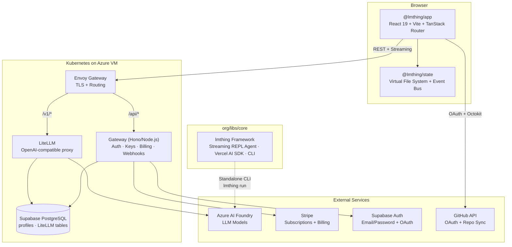
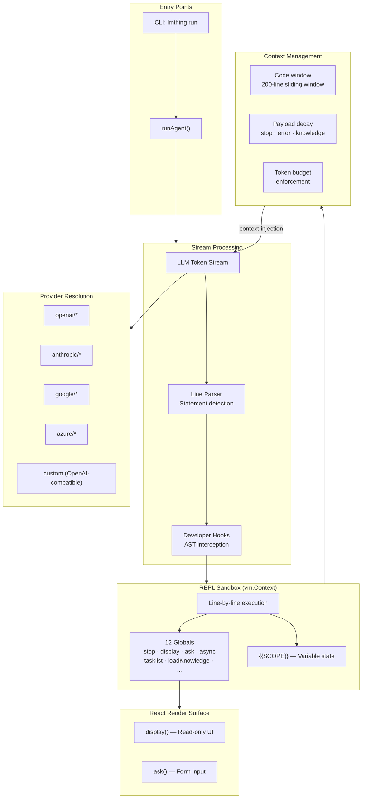
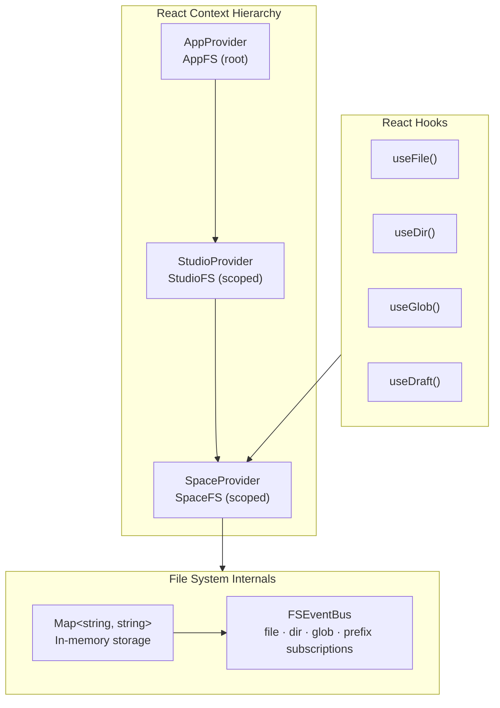
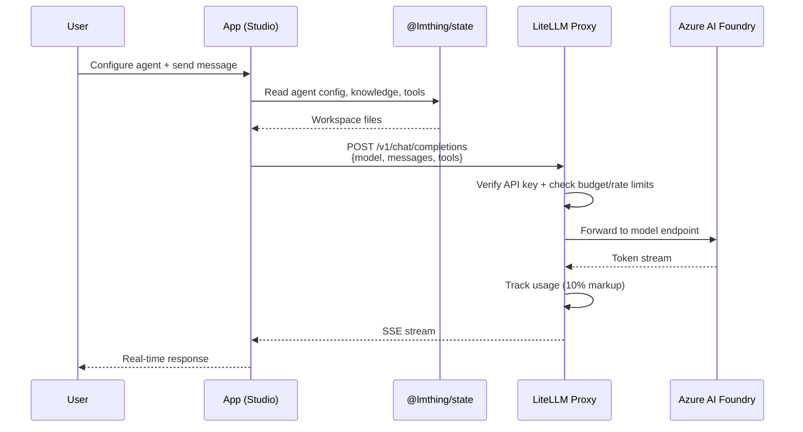
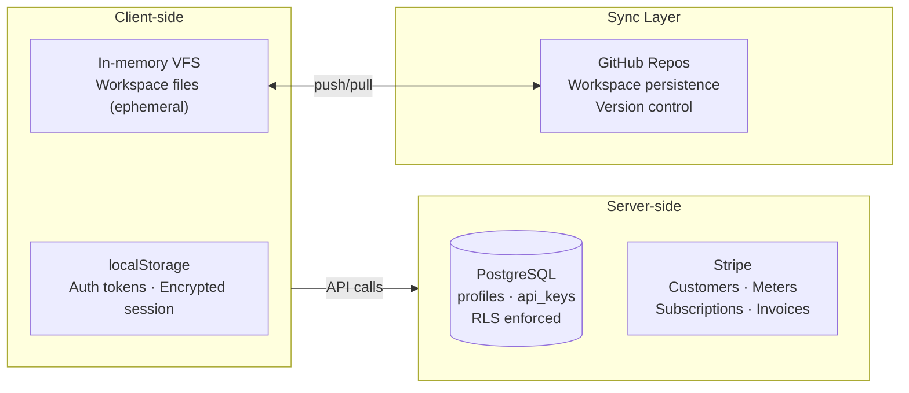

# LMThing Developer Onboarding Guide

Welcome to lmthing. This guide will get you set up and oriented in the codebase. For the full product and domain architecture, see [Architecture.md](./Architecture.md).

---

## Prerequisites

- **Node.js** ≥ 20
- **pnpm** ≥ 9
- **Git** (all workspace sync is git-based)
- A GitHub account (for OAuth and workspace persistence)

---

## Repository Structure

The monorepo is organized by TLD — each lmthing.\* domain has its own top-level directory.

```
lmthing/
├── org/                    # Non-profit / open-source
│   ├── libs/               # Shared libraries used across all domains
│   │   ├── core/           # lmthing — streaming TypeScript REPL agent (Vercel AI SDK v6)
│   │   ├── repl/           # @lmthing/repl — REPL sandbox runtime (vm.Context, TypeScript transpilation)
│   │   ├── state/          # @lmthing/state — virtual file system (React hooks, Map-based VFS)
│   │   ├── spaces/         # Shared space knowledge content
│   │   ├── css/            # Shared styles
│   │   ├── ui/             # Shared UI components
│   │   ├── auth/           # @lmthing/auth — cross-domain SSO client
│   │   ├── thing/          # @lmthing/thing — THING agent system studio (built-in spaces)
│   │   └── utils/          # Shared build utilities (Vite config)
│   └── docs/               # Documentation
├── cloud/                  # lmthing.cloud — API gateway (Hono/Node.js) + LiteLLM proxy
├── studio/                 # lmthing.studio — agent builder UI (React 19, Vite 7, TanStack Router)
├── chat/                   # lmthing.chat — personal THING interface
├── blog/                   # lmthing.blog — personalized AI news
├── computer/               # lmthing.computer — THING agent runtime (K8s compute pod, terminal access)
├── space/                  # lmthing.space — deploy spaces & publish agents
├── social/                 # lmthing.social — public hive mind
├── team/                   # lmthing.team — private agent rooms
├── store/                  # lmthing.store — agent marketplace
├── casa/                   # lmthing.casa — smart home (Home Assistant)
├── com/                    # lmthing.com — commercial landing page
├── pnpm-workspace.yaml
└── package.json
```

---

## Backend Architecture — Important

**There is no separate backend service.** The `cloud/` directory is the **sole backend** for the entire project. It runs on Kubernetes (Kubespray) on an Azure VM, with two services:

- **LiteLLM** — OpenAI-compatible LLM proxy that routes to Azure AI Foundry models, with budget enforcement, rate limiting, and token usage tracking (10% markup over Azure pricing).
- **Gateway** — Hono/Node.js service handling auth, API key management, billing (Stripe subscriptions), and webhooks.

Key details:

- **Users and all server-side data are stored in Supabase PostgreSQL** (profiles, LiteLLM tables), with Supabase Auth for user management.
- **Billing and usage metering** are handled by Stripe subscriptions, orchestrated through the gateway.
- **LLM requests** go through LiteLLM (`/v1/*`), which enforces per-user budgets and rate limits based on their tier (Free/Starter/Basic/Pro/Max).
- **Whenever any service needs backend functionality** (new API endpoint, database operation, webhook handler, etc.), it **must be implemented in the gateway (`cloud/gateway/`) or as K8s configuration**. Do not create backend services elsewhere.
- All frontend apps are static SPAs — they call `cloud/` API endpoints for any server-side logic.

---

## Getting Started

```bash
# Clone and install
git clone git@github.com:lmthing/lmthing.git
cd lmthing
pnpm install

# Run Studio (the main development surface)
cd studio
pnpm dev
```

---

## System Overview



---

## Key Packages

### org/libs/core — Streaming TypeScript REPL Agent

A streaming TypeScript REPL agent system that executes LLM-generated code line-by-line with control primitives and a React render surface. The agent writes only TypeScript — no prose — and the host runtime parses, executes, and renders in real time.

Four subsystems:

1. **Stream Controller** — LLM connection, token accumulation, bracket depth tracking, pause/resume, context injection
2. **Line Parser** — buffers tokens into complete statements, detects global calls
3. **REPL Sandbox** — executes TypeScript line-by-line via `vm.Context`, persistent scope, TS transpilation, error capture
4. **React Render Surface** — mounts components from `display`/`ask`, handles forms

Key concepts:

- **12 Globals** — `stop`, `display`, `ask`, `async`, `tasklist`, `completeTask`, `completeTaskAsync`, `taskProgress`, `failTask`, `retryTask`, `sleep`, `loadKnowledge` — injected into the sandbox at session init
- **`{{SCOPE}}`** — Variable state table regenerated every turn, the agent's source of truth
- **Context management** — code window compression (200-line sliding window), stop payload decay, knowledge decay, token budget enforcement
- **Developer hooks** — AST-based code interception with 5 actions: `continue`, `side_effect`, `transform`, `interrupt`, `skip`
- **Spaces** — self-contained workspaces with agents, flows, functions, components, and knowledge
- **Provider resolution** — `openai/*`, `anthropic/*`, `google/*`, `mistral/*`, `azure/*`, `groq/*`, or any OpenAI-compatible endpoint
- **Entry points** — `runAgent()` pipeline, `lmthing run` CLI

Built on Vercel AI SDK v6 (`streamText()`, Zod tool schemas), Node.js `vm` for sandboxing, TypeScript compiler API for AST parsing.



### org/libs/state — Virtual File System

In-memory VFS for browser-based workspace management:

- `Map<string, string>` storage with `FSEventBus` for fine-grained subscriptions (file, dir, glob, prefix)
- React context hierarchy: `AppProvider` → `StudioProvider` → `SpaceProvider`
- Hooks: `useFile()`, `useDir()`, `useGlob()`, `useDraft()`
- Persistence via GitHub sync (push/pull), conflict resolution follows standard git merge workflows



### org/libs/thing — THING Agent System Studio

Built-in spaces that ship with the THING agent. These are system-level spaces providing meta-capabilities for the entire lmthing ecosystem — from teaching users how to create spaces, to controlling each service on behalf of the user.

7 built-in spaces (12 agents, 12 flows, 17 knowledge domains):

```
org/libs/thing/
├── package.json                          # @lmthing/thing
└── spaces/
    ├── space-creator/                    # Meta-space for creating spaces
    │   ├── agents/                       # SpaceArchitect, KnowledgeDesigner, FlowAuthor
    │   ├── flows/                        # flow_create_space (6 steps), flow_design_knowledge (5 steps)
    │   └── knowledge/                    # space-structure, knowledge-design, agent-design, naming-rules, creator-context
    ├── space-ecosystem/                  # Platform overview, account & billing management
    │   ├── agents/                       # PlatformGuide, AccountManager
    │   ├── flows/                        # flow_explore_platform, flow_manage_billing
    │   └── knowledge/                    # platform-map (10 services), billing-context, user-context
    ├── space-studio/                     # Agent building, workspace management, prompt optimization
    │   ├── agents/                       # WorkspaceManager, AgentBuilder, PromptCoach
    │   ├── flows/                        # flow_create_agent, flow_manage_workspace, flow_optimize_prompts
    │   └── knowledge/                    # workspace-ops, model-selection, prompt-patterns, user-context
    ├── space-chat/                       # Personal THING chat interface
    │   ├── agents/                       # ChatAssistant
    │   ├── flows/                        # flow_start_conversation
    │   └── knowledge/                    # chat-modes, model-guide
    ├── space-computer/                   # Compute pod management & troubleshooting
    │   ├── agents/                       # ComputerAdmin, Troubleshooter
    │   ├── flows/                        # flow_setup_computer, flow_troubleshoot
    │   └── knowledge/                    # infrastructure, computer-ops, regions
    ├── space-deploy/                     # Space deployment lifecycle on K8s
    │   ├── agents/                       # DeployManager, SpaceMonitor
    │   ├── flows/                        # flow_deploy_space, flow_check_status
    │   └── knowledge/                    # space-lifecycle, deploy-config, regions
    └── space-store/                      # Agent marketplace publishing & optimization
        ├── agents/                       # StoreCurator, ListingOptimizer
        ├── flows/                        # flow_publish_agent, flow_optimize_listing
        └── knowledge/                    # distribution-models, pricing-strategy, listing-quality
```

### cloud/ — API Gateway + LiteLLM (The Only Backend)

The **sole backend** for all lmthing products. Runs on Kubernetes (Kubespray) on an Azure VM with two services:

- **LiteLLM** (`/v1/*`) — OpenAI-compatible LLM proxy routing to Azure AI Foundry, with per-user budgets, rate limits, and 10% token markup.
- **Gateway** (`/api/*`) — Hono/Node.js service for auth, API keys, billing, and Stripe webhooks.

**Tiers:**

| Tier    | Price      | Budget | Reset   | Rate Limits       |
| ------- | ---------- | ------ | ------- | ----------------- |
| Free    | $0         | $1     | 7 days  | 10K tpm / 60 rpm  |
| Starter | $5/month   | $5     | 30 days | 25K tpm / 150 rpm |
| Basic   | $10/month  | $10    | 30 days | 50K tpm / 300 rpm |
| Pro     | $20/month  | $20    | 30 days | 100K tpm / 1K rpm |
| Max     | $100/month | $100   | 30 days | 1M tpm / 5K rpm   |

Adding a new tier touches files across the monorepo — see [Adding a New Tier](#adding-a-new-tier) below.

**Gateway API routes:**

| Route                      | Method | Auth       | Purpose                                  |
| -------------------------- | ------ | ---------- | ---------------------------------------- |
| `/api/auth/register`       | POST   | Public     | Register → returns API key               |
| `/api/auth/login`          | POST   | Public     | Login → returns JWT + refresh token      |
| `/api/auth/oauth/url`      | GET    | Public     | Get Supabase OAuth URL (GitHub/Google)   |
| `/api/auth/provision`      | POST   | JWT        | Provision LiteLLM user + Stripe customer |
| `/api/auth/refresh`        | POST   | Public     | Refresh access token                     |
| `/api/auth/me`             | GET    | JWT        | User info + tier                         |
| `/api/auth/sso/create`     | POST   | JWT        | Generate SSO authorization code          |
| `/api/auth/sso/exchange`   | POST   | Public     | Exchange SSO code for session            |
| `/api/keys`                | GET    | JWT        | List API keys                            |
| `/api/keys`                | POST   | JWT        | Create API key                           |
| `/api/keys/:token`         | DELETE | JWT        | Revoke API key                           |
| `/api/billing/checkout`    | POST   | JWT        | Stripe checkout session                  |
| `/api/billing/portal`      | POST   | JWT        | Stripe billing portal                    |
| `/api/billing/usage`       | GET    | JWT        | Budget usage info                        |
| `/api/billing/checkout/status` | GET | JWT       | Check Stripe checkout session status     |
| `/api/compute/status`      | GET    | JWT        | Compute pod status                       |
| `/api/compute/env`         | GET    | JWT        | List user pod environment variables      |
| `/api/compute/env`         | PUT    | JWT        | Set user pod env vars (triggers restart) |
| `/api/stripe/webhook`      | POST   | Stripe sig | Subscription events → tier changes       |
| `/v1/chat/completions`     | POST   | API key    | OpenAI-compatible chat (via LiteLLM)     |
| `/v1/models`               | GET    | API key    | Available models (via LiteLLM)           |

**Gateway libraries** in `gateway/src/lib/`: `litellm.ts` (LiteLLM admin API client), `stripe.ts` (Stripe client), `tiers.ts` (tier definitions + model lists).

**K8s manifests** are now in `devops/argocd/` (Envoy Gateway). See `devops/CLAUDE.md` for details.


---

## Agent Execution Flow

1. User configures agent + sends message in Studio
2. Studio reads agent config from VFS (`@lmthing/state`)
3. Studio POSTs to `/v1/chat/completions` (OpenAI-compatible) with the user's LiteLLM API key
4. LiteLLM authenticates the API key, checks budget + rate limits for the user's tier
5. Request routed to Azure AI Foundry model endpoint
6. Response streams back to browser; LiteLLM tracks token usage against user's budget



---

## Data Storage

| Layer              | What                            | Where               |
| ------------------ | ------------------------------- | ------------------- |
| Client (ephemeral) | Auth tokens, encrypted sessions | localStorage        |
| Client (ephemeral) | Workspace files                 | In-memory VFS       |
| Server             | User profiles, API keys (RLS)   | Supabase PostgreSQL |
| Server             | Billing, meters, subscriptions  | Stripe              |
| Sync               | Workspace persistence           | GitHub repositories |



---

## Agent Runtimes

Different products run agents in different environments:

| Product     | Runtime                                                  |
| ----------- | -------------------------------------------------------- |
| Studio      | Browser (WebContainer for free tier)                     |
| Computer    | K8s pod (0.5 CPU, 1 GB) — THING agent + studio spaces    |
| Space       | K8s pod — deployed spaces + published agents              |
| Blog        | Shared serverless worker                                 |
| Casa        | Computer node → remote Home Assistant connection         |
| Social/Team | Shared VFS + conversation log                            |

---

## Development Workflow

- **Studio** is the primary development surface — most features are built and tested here
- **Cloud gateway** is developed locally — build and run the Hono server, deploy via `cd devops/ansible && make deploy` (ArgoCD auto-syncs manifest changes from git)
- **Core framework** changes can be tested via `lmthing run` CLI or within Studio
- All workspace data syncs through git — standard merge/conflict resolution applies

---

## Local Development

### Quick Start

```bash
pnpm install       # install all workspace dependencies
make proxy         # set up nginx reverse proxy (requires sudo)
make up            # start all services
```

### Service Ports & Domains

Each app runs on its own Vite dev server. The local proxy maps `*.local` domains via nginx.

| App      | Port | Local Domain                            |
| -------- | ---- | --------------------------------------- |
| Studio   | 3000 | [studio.local](http://studio.local)     |
| Chat     | 3001 | [chat.local](http://chat.local)         |
| Com      | 3002 | [com.local](http://com.local)           |
| Social   | 3003 | [social.local](http://social.local)     |
| Store    | 3004 | [store.local](http://store.local)       |
| Space    | 3005 | [space.local](http://space.local)       |
| Team     | 3006 | [team.local](http://team.local)         |
| Computer | 3010 | [computer.local](http://computer.local) |
| Blog     | 3007 | [blog.local](http://blog.local)         |
| Casa     | 3008 | [casa.local](http://casa.local)         |
| Cloud    | 3009 | [cloud.local](http://cloud.local)       |

Port assignments and domain mappings are defined in `services.yaml`.

### Make Targets

| Command            | Description                                                                       |
| ------------------ | --------------------------------------------------------------------------------- |
| `make up`          | Start all frontend dev servers in parallel                                        |
| `make down`        | Stop all running dev servers                                                      |
| `make proxy`       | Set up nginx + `/etc/hosts` for `*.local` domains (interactive, prompts for sudo) |
| `make proxy-clean` | Remove nginx configs and `/etc/hosts` entries                                     |
| `make install`     | Run `pnpm install`                                                                |
| `make check`       | Health check all lmthing.\* domains (DNS, TLS, HTTPS, hosting config)             |

### Proxy Setup

`make proxy` runs `.etc/scripts/local-proxy.sh`, which:

1. Installs nginx if missing (apt/brew)
2. Adds `127.0.0.1 <app>.local` entries to `/etc/hosts`
3. Creates nginx server blocks that reverse-proxy each domain to its Vite port (including WebSocket upgrade for HMR)
4. Validates the config and restarts nginx

The script is idempotent — re-running it skips already-configured services. Use `make proxy-clean` to tear everything down.

### Demo Auth

Studio, chat, and computer ship with `.env.development` files that set `VITE_DEMO_USER=true`. This makes `@lmthing/auth`'s `AuthProvider` skip SSO and use a hardcoded demo session, so you can develop without running the cloud gateway or com/.

### Running Individual Apps

To run a single app without `make up`:

```bash
cd studio && pnpm dev          # starts on default port
cd chat && pnpm vite --port 3001  # starts on assigned port
```

### Stack

All frontend apps share the same stack:

- **React 19** + **Vite 7** + **TanStack Router** (file-based routing)
- **Tailwind CSS v4** via `@tailwindcss/vite`
- Shared workspace libs: `@lmthing/ui`, `@lmthing/css`, `@lmthing/state`, `lmthing` (core)
- Path aliases: `@/` → `./src`, workspace libs resolved via Vite `resolve.alias`

---

## Useful Links

- [Architecture.md](./Architecture.md) — full product & domain architecture
- [devops/CLAUDE.md](./devops/CLAUDE.md) — infrastructure & deployment guide
- [org/libs/core/](./org/libs/core/) — streaming REPL agent framework source
- [org/libs/core/CLAUDE.md](./org/libs/core/CLAUDE.md) — detailed REPL agent architecture reference
- [org/libs/repl/](./org/libs/repl/) — REPL sandbox runtime
- [org/libs/state/](./org/libs/state/) — VFS library source
- [org/libs/css/](./org/libs/css/) — shared styles
- [org/libs/ui/](./org/libs/ui/) — shared UI components
- [org/libs/thing/](./org/libs/thing/) — THING agent system studio (built-in spaces)

---

## Skills Reference

| Topic | Skill File |
|-------|-----------|
| SPA deployment to GitHub Pages, adding new deployments, domain health checks | [deploy-spa.md](.claude/skills/deploy-spa.md) |
| Adding a new pricing tier (cross-cutting checklist) | [add-tier.md](.claude/skills/add-tier.md) |
| Auth flows, SSO, gateway routes, integrating auth in new services | [authentication.md](.claude/skills/authentication.md) |

# Agent Notes

This repository is a monorepo organized by TLD — each lmthing.\* domain has its own top-level directory.

## Shared Libraries

- `org/libs/core/` — Streaming TypeScript REPL agent framework (Vercel AI SDK v6). Executes LLM-generated code line-by-line via `vm.Context` sandbox with 12 globals (`stop`, `display`, `ask`, `async`, `tasklist`, etc.), context management (SCOPE, code window, payload decay), developer hooks (AST-based interception), spaces/agents architecture, multi-provider support, CLI (`lmthing run`).
- `org/libs/repl/` — REPL sandbox runtime (`@lmthing/repl`). Standalone package for the TypeScript REPL execution engine used by the compute pods.
- `org/libs/state/` — Virtual file system (`@lmthing/state`). In-memory Map-based VFS with FSEventBus, React context hierarchy, and hooks (`useFile`, `useDir`, `useGlob`, `useDraft`).
- `org/libs/spaces/` — Shared space knowledge content.
- `org/libs/css/` — Shared styles used across all product domains.
- `org/libs/ui/` — Shared React UI components used across all product domains.
- `org/libs/thing/` — THING agent system studio (`@lmthing/thing`). 7 built-in spaces that ship with the THING agent: `space-creator` (meta-space for creating spaces), `space-ecosystem` (platform navigation, account/billing), `space-studio` (agent building, workspace management, prompt optimization), `space-chat` (personal chat interface), `space-computer` (compute pod management, troubleshooting), `space-deploy` (space deployment lifecycle), `space-store` (marketplace publishing, listing optimization). Total: 12 agents, 12 flows, 17 knowledge domains across all spaces.

## Cloud Backend

- `cloud/` — API gateway (Hono/Node.js) + LiteLLM proxy. Gateway handles auth (Supabase Auth), API key management (LiteLLM), billing (Stripe subscriptions), and webhooks. LiteLLM provides OpenAI-compatible LLM proxy routing to Azure AI Foundry with tier-based budgets and rate limits. Gateway source in `gateway/`, migrations in `migrations/`. K8s manifests are in `devops/argocd/`.
- `devops/` — Infrastructure automation. Terraform for Azure VM provisioning, Kubespray for K8s cluster, ArgoCD for GitOps deployment. Envoy Gateway for ingress, cert-manager for TLS, per-user compute pods for lmthing.computer. K8s manifests in `devops/argocd/`, auto-synced by ArgoCD. See `devops/CLAUDE.md`.

## Product Domains

- `studio/` — Agent builder UI (React 19, Vite 7, TanStack Router, Tailwind 4, Radix UI). Primary development surface.
- `chat/` — Personal THING interface.
- `blog/` — Personalized AI news.
- `computer/` — THING agent runtime. Where the THING agent and its studio spaces live and run on a dedicated K8s compute pod. Visiting directly gives terminal access.
- `space/` — Deploy spaces to containers with running agents, or publish agents for API access via the store.
- `social/` — Public hive mind.
- `team/` — Private agent rooms.
- `store/` — Agent marketplace.
- `casa/` — Smart home (Home Assistant integration).
- `com/` — Commercial landing page.

## Spaces Architecture

A **Space** is a self-contained workspace with five pillars: **Agents**, **Flows**, **Functions**, **Components**, and **Knowledge**.

```
{space-slug}/
├── package.json              # metadata (name, version)
├── agents/                   # AI specialists
│   └── agent-{role}/
│       ├── config.json       # runtime field requirements + accessible functions/components/knowledge
│       └── instruct.md       # personality, behavior, slash actions
├── flows/                    # step-by-step workflows
│   └── flow_{action}/
│       ├── index.md          # overview + step links
│       └── {N}.Step Name.md  # numbered steps with output schemas
├── functions/                # utility functions (TypeScript)
│   └── {functionName}.tsx    # plain TS exports, injected as sandbox globals
├── components/               # React components
│   ├── view/                 # display components (for display())
│   │   └── {ComponentName}.tsx
│   └── form/                 # form input components (for ask())
│       └── {ComponentName}.tsx
└── knowledge/                # structured domain data
    └── {domain}/
        ├── config.json       # section: label, icon, color
        └── {field}/
            ├── config.json   # field: type, default, variableName
            └── option-a.md   # selectable option with frontmatter
```

### Agents

Each agent is a specialist with a distinct role (e.g., `FormulaExpert`, `DataAnalyst`). An agent's `instruct.md` defines (via YAML frontmatter):

- **title** — Agent display name (PascalCase)
- **model** — LLM model override (optional)
- **actions** — Slash commands that trigger flows (`id` = `/command`, `flow` = directory in `flows/`)

The `config.json` declares what the agent can access: **knowledge** (domain/field selectors), **components** (view + form references, including catalog components), and **functions** (local or catalog functions with optional config).

### Flows

Flows are sequential, numbered step guides (4–8 steps) that an agent executes when a slash action is invoked. Each step is a discrete markdown file (`1.Step Name.md`, `2.Step Name.md`, etc.) linked from `index.md`.

### Knowledge Base

A hierarchical, structured context system injected into agent prompts:

- **Domains** — top-level categories with `renderAs: "section"`, each with a label, emoji icon, and hex color
- **Fields** — typed inputs (`select`, `multiSelect`, `text`, `number`) with a `variableName` for template injection
- **Options** — markdown files with YAML frontmatter (`title`, `description`, `order`) containing detailed guidance

This structure lets agents pull rich, user-configured context at runtime — the knowledge base acts as a declarative configuration layer that shapes agent behavior without modifying prompts directly.

### Naming Conventions

| Thing       | Convention                    | Example                |
| ----------- | ----------------------------- | ---------------------- |
| Folders     | `kebab-case`                  | `agent-formula-expert` |
| Variables   | `camelCase`                   | `gradeLevel`           |
| Agent names | `PascalCase`                  | `FormulaExpert`        |
| Flow IDs    | `snake_case` + `flow_` prefix | `flow_generate_report` |

## Key Documentation

- [Architecture.md](./Architecture.md) — full product & domain architecture
