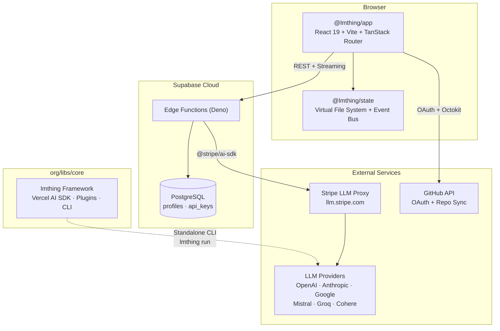
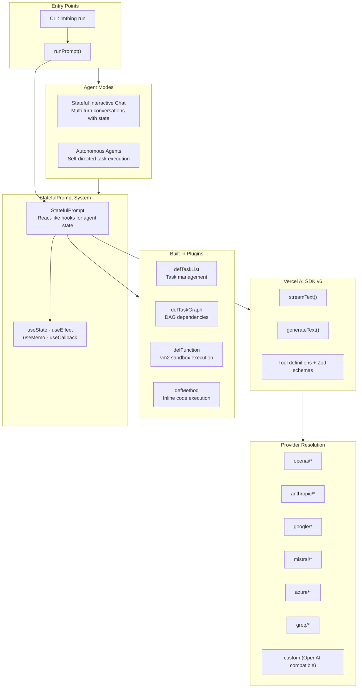
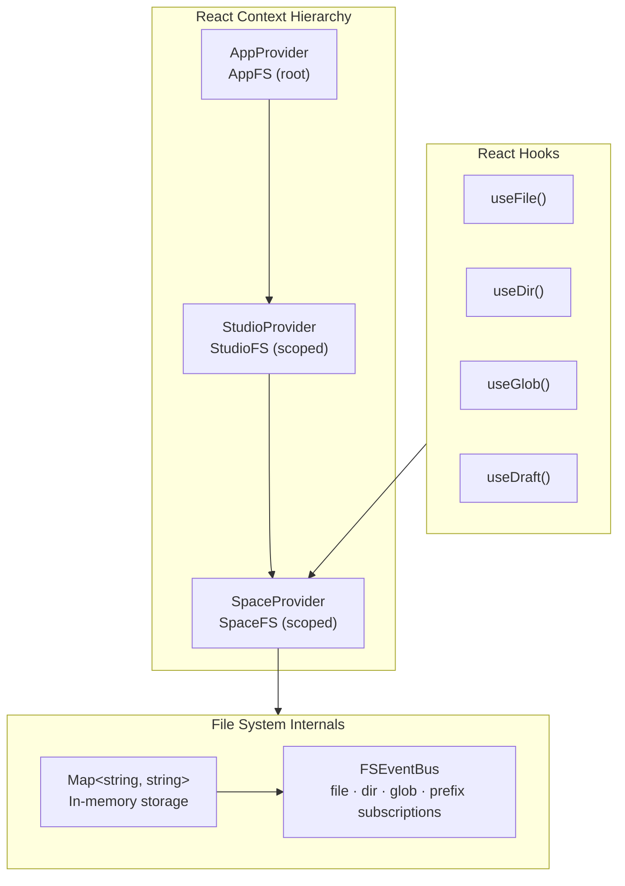
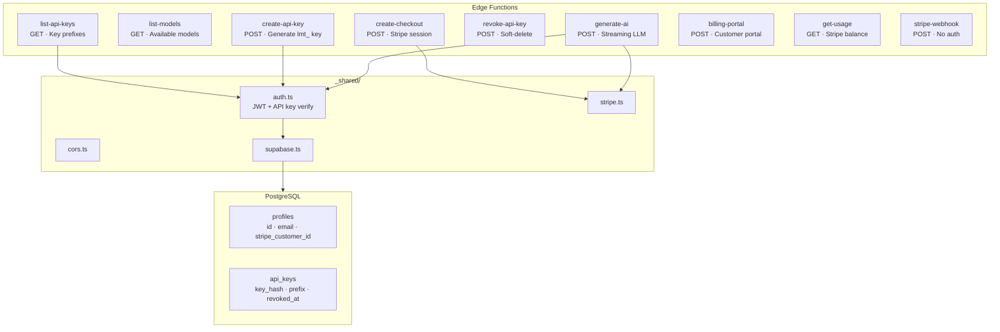
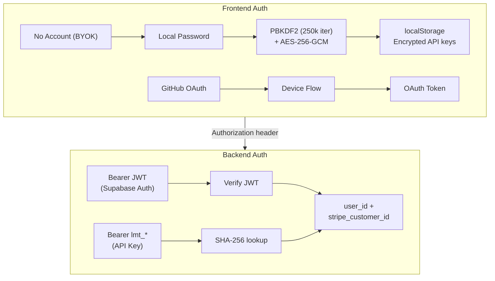
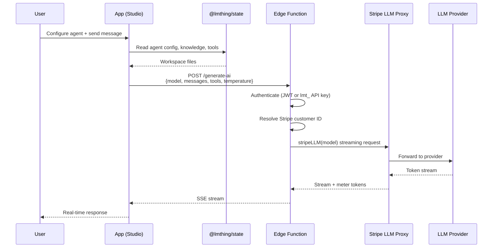
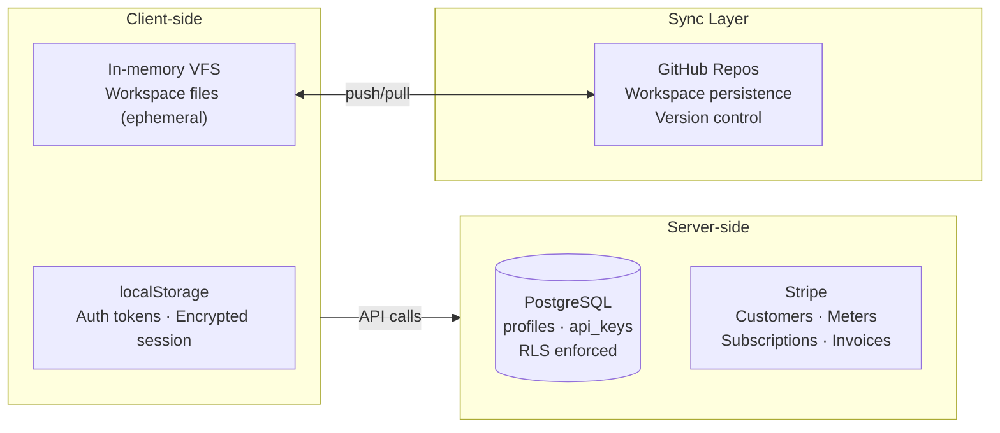

# LMThing Developer Onboarding Guide

Welcome to lmthing. This guide will get you set up and oriented in the codebase. For the full product and domain architecture, see [Architecture.md](./Architecture.md).

---

## Prerequisites

- **Node.js** ≥ 20
- **pnpm** ≥ 9
- **Deno** (for cloud/edge functions)
- **Git** (all workspace sync is git-based)
- A GitHub account (for OAuth and workspace persistence)

---

## Repository Structure

The monorepo is organized by TLD — each lmthing.* domain has its own top-level directory.

```
lmthing/
├── org/                    # Non-profit / open-source
│   ├── libs/               # Shared libraries used across all domains
│   │   ├── core/           # lmthing — agentic framework (TypeScript, Vercel AI SDK v6)
│   │   ├── state/          # @lmthing/state — virtual file system (React hooks, Map-based VFS)
│   │   ├── css/            # Shared styles
│   │   └── ui/             # Shared UI components
│   └── docs/               # Documentation
├── cloud/                  # @lmthing/cloud — Supabase Edge Functions (Deno)
├── studio/                 # lmthing.studio — agent builder UI (React 19, Vite 7, TanStack Router)
├── chat/                   # lmthing.chat — personal THING interface
├── blog/                   # lmthing.blog — personalized AI news
├── space/                  # lmthing.space — Fly.io agent runtime
├── social/                 # lmthing.social — public hive mind
├── team/                   # lmthing.team — private agent rooms
├── store/                  # lmthing.store — agent marketplace
├── casa/                   # lmthing.casa — smart home (Home Assistant)
├── com/                    # lmthing.com — commercial landing page
├── pnpm-workspace.yaml
└── package.json
```

---

## Getting Started

```bash
# Clone and install
git clone git@github.com:lmthing/lmthing.git
cd lmthing
pnpm install

# Run Studio (the main development surface)
cd studio
pnpm dev
```

---

## System Overview



---

## Key Packages

### org/libs/core — Agent Framework

The agentic framework powering all of lmthing. Two modes of operation:

- **Stateful Interactive Chat** — multi-turn conversations where the agent maintains state across turns
- **Autonomous Agents** — self-directed task execution without human input

Key concepts:
- **StatefulPrompt** — React-like hooks (`useState`, `useEffect`, `useMemo`, `useCallback`) for managing agent state
- **Plugins** — `defTaskList` (task management), `defTaskGraph` (DAG dependencies), `defFunction` (vm2 sandbox), `defMethod` (inline code)
- **Provider resolution** — `openai/*`, `anthropic/*`, `google/*`, `mistral/*`, `azure/*`, `groq/*`, or any OpenAI-compatible endpoint
- **Entry points** — `runPrompt()` programmatic API, `lmthing run` CLI

Built on Vercel AI SDK v6 (`streamText()`, `generateText()`, Zod tool schemas).



### org/libs/state — Virtual File System

In-memory VFS for browser-based workspace management:
- `Map<string, string>` storage with `FSEventBus` for fine-grained subscriptions (file, dir, glob, prefix)
- React context hierarchy: `AppProvider` → `StudioProvider` → `SpaceProvider`
- Hooks: `useFile()`, `useDir()`, `useGlob()`, `useDraft()`
- Persistence via GitHub sync (push/pull), conflict resolution follows standard git merge workflows



### cloud/ — Supabase Edge Functions

Serverless backend (Deno runtime). Nine edge functions:

| Function | Method | Purpose |
|----------|--------|---------|
| `generate-ai` | POST | Streaming LLM proxy via Stripe |
| `list-models` | GET | Available models |
| `create-api-key` | POST | Generate `lmt_` prefixed key |
| `list-api-keys` | GET | Key prefixes |
| `revoke-api-key` | POST | Soft-delete key |
| `create-checkout` | POST | Stripe checkout session |
| `billing-portal` | POST | Stripe customer portal |
| `get-usage` | GET | Stripe balance/usage |
| `stripe-webhook` | POST | Stripe webhooks (no auth) |

Shared modules in `_shared/`: `auth.ts` (JWT + API key), `cors.ts`, `stripe.ts`, `supabase.ts`.



---

## Authentication

Three auth modes:

1. **No account (BYOK)** — local password encrypts API keys in localStorage (PBKDF2 250k iterations + AES-256-GCM). No server needed.
2. **GitHub OAuth** — device flow for cloud features + workspace syncing
3. **Backend auth** — Supabase JWT (browser) or `lmt_` API key (SDK/scripts), both resolve to `user_id` + `stripe_customer_id`

Cross-domain: SSO/OAuth redirect flow between all lmthing.* domains.



---

## Agent Execution Flow

1. User configures agent + sends message in Studio
2. Studio reads agent config from VFS (`@lmthing/state`)
3. Studio POSTs to `generate-ai` edge function with `{model, messages, tools, temperature}`
4. Edge function authenticates (JWT or `lmt_` key), resolves Stripe customer ID
5. Request proxied through Stripe LLM gateway (automatic token metering)
6. Response streams back via SSE to browser



---

## Data Storage

| Layer | What | Where |
|-------|------|-------|
| Client (ephemeral) | Auth tokens, encrypted sessions | localStorage |
| Client (ephemeral) | Workspace files | In-memory VFS |
| Server | User profiles, API keys (RLS) | Supabase PostgreSQL |
| Server | Billing, meters, subscriptions | Stripe |
| Sync | Workspace persistence | GitHub repositories |



---

## Agent Runtimes

Different products run agents in different environments:

| Product | Runtime |
|---------|---------|
| Studio | Browser (WebContainer for free tier) |
| Space | Fly.io node (1 core, 1 GB) |
| Blog | Shared serverless worker |
| Casa | Space node → remote Home Assistant connection |
| Social/Team | Shared VFS + conversation log |

---

## Development Workflow

- **Studio** is the primary development surface — most features are built and tested here
- **Cloud functions** are developed locally with `supabase functions serve`
- **Core framework** changes can be tested via `lmthing run` CLI or within Studio
- All workspace data syncs through git — standard merge/conflict resolution applies

---

## Local Development

### Quick Start

```bash
pnpm install       # install all workspace dependencies
make proxy         # set up nginx reverse proxy (requires sudo)
make up            # start all services
```

### Service Ports & Domains

Each app runs on its own Vite dev server. The local proxy maps `*.local` domains via nginx.

| App | Port | Local Domain |
|-----|------|--------------|
| Studio | 3000 | [studio.local](http://studio.local) |
| Chat | 3001 | [chat.local](http://chat.local) |
| Com | 3002 | [com.local](http://com.local) |
| Social | 3003 | [social.local](http://social.local) |
| Store | 3004 | [store.local](http://store.local) |
| Space | 3005 | [space.local](http://space.local) |
| Team | 3006 | [team.local](http://team.local) |
| Blog | 3007 | [blog.local](http://blog.local) |
| Casa | 3008 | [casa.local](http://casa.local) |
| Cloud | 3009 | [cloud.local](http://cloud.local) |

Port assignments and domain mappings are defined in `proxy-services.txt`.

### Make Targets

| Command | Description |
|---------|-------------|
| `make up` | Start all frontend dev servers in parallel |
| `make down` | Stop all running dev servers |
| `make proxy` | Set up nginx + `/etc/hosts` for `*.local` domains (interactive, prompts for sudo) |
| `make proxy-clean` | Remove nginx configs and `/etc/hosts` entries |
| `make install` | Run `pnpm install` |

### Proxy Setup

`make proxy` runs `.etc/scripts/local-proxy.sh`, which:

1. Installs nginx if missing (apt/brew)
2. Adds `127.0.0.1 <app>.local` entries to `/etc/hosts`
3. Creates nginx server blocks that reverse-proxy each domain to its Vite port (including WebSocket upgrade for HMR)
4. Validates the config and restarts nginx

The script is idempotent — re-running it skips already-configured services. Use `make proxy-clean` to tear everything down.

### Running Individual Apps

To run a single app without `make up`:

```bash
cd studio && pnpm dev          # starts on default port
cd chat && pnpm vite --port 3001  # starts on assigned port
```

### Stack

All frontend apps share the same stack:

- **React 19** + **Vite 7** + **TanStack Router** (file-based routing)
- **Tailwind CSS v4** via `@tailwindcss/vite`
- Shared workspace libs: `@lmthing/ui`, `@lmthing/css`, `@lmthing/state`, `lmthing` (core)
- Path aliases: `@/` → `./src`, workspace libs resolved via Vite `resolve.alias`

---

## Useful Links

- [Architecture.md](./Architecture.md) — full product & domain architecture
- [cloud/README.md](./cloud/README.md) — cloud backend setup & deployment
- [org/libs/core/](./org/libs/core/) — agent framework source
- [org/libs/state/](./org/libs/state/) — VFS library source
- [org/libs/css/](./org/libs/css/) — shared styles
- [org/libs/ui/](./org/libs/ui/) — shared UI components


# Agent Notes

This repository is a monorepo organized by TLD — each lmthing.* domain has its own top-level directory.

## Shared Libraries

- `org/libs/core/` — Agentic framework (TypeScript, Vercel AI SDK v6). StatefulPrompt system with React-like hooks, plugins, multi-provider support, CLI (`lmthing run`).
- `org/libs/state/` — Virtual file system (`@lmthing/state`). In-memory Map-based VFS with FSEventBus, React context hierarchy, and hooks (`useFile`, `useDir`, `useGlob`, `useDraft`).
- `org/libs/css/` — Shared styles used across all product domains.
- `org/libs/ui/` — Shared React UI components used across all product domains.

## Cloud Backend

- `cloud/` — Supabase Edge Functions (Deno). Nine functions: `generate-ai`, `list-models`, `create-api-key`, `list-api-keys`, `revoke-api-key`, `create-checkout`, `billing-portal`, `get-usage`, `stripe-webhook`. Shared modules in `_shared/`.

## Product Domains

- `studio/` — Agent builder UI (React 19, Vite 7, TanStack Router, Tailwind 4, Radix UI). Primary development surface.
- `chat/` — Personal THING interface.
- `blog/` — Personalized AI news.
- `space/` — Fly.io agent runtime.
- `social/` — Public hive mind.
- `team/` — Private agent rooms.
- `store/` — Agent marketplace.
- `casa/` — Smart home (Home Assistant integration).
- `com/` — Commercial landing page.


## Spaces Architecture

A **Space** is a self-contained workspace with three pillars: **Agents**, **Flows**, and **Knowledge**.

```
{space-slug}/
├── package.json              # metadata (name, version)
├── agents/                   # AI specialists
│   └── agent-{role}/
│       ├── config.json       # runtime field requirements
│       ├── instruct.md       # personality, tools, slash actions
│       ├── values.json       # runtime state (starts empty)
│       └── conversations/
├── flows/                    # step-by-step workflows
│   └── flow_{action}/
│       ├── index.md          # overview + step links
│       └── {N}.Step Name.md  # numbered steps
└── knowledge/                # structured domain data
    └── {domain}/
        ├── config.json       # section: label, icon, color
        └── {field}/
            ├── config.json   # field: type, default, variableName
            └── option-a.md   # selectable option with frontmatter
```

### Agents

Each agent is a specialist with a distinct role (e.g., `FormulaExpert`, `DataAnalyst`). An agent's `instruct.md` defines:

- **Name** (PascalCase), **description**, **tools** (kebab-case)
- **selectedDomains** — which knowledge domains the agent can access (prefixed `domain-`)
- **slash_actions** — commands that trigger linked flows (`flowId → flow_{action}`)

The `config.json` declares **emptyFieldsForRuntime** — knowledge fields that need user input before the agent can run (mapping domain → field names).

### Flows

Flows are sequential, numbered step guides (4–8 steps) that an agent executes when a slash action is invoked. Each step is a discrete markdown file (`1.Step Name.md`, `2.Step Name.md`, etc.) linked from `index.md`.

### Knowledge Base

A hierarchical, structured context system injected into agent prompts:

- **Domains** — top-level categories with `renderAs: "section"`, each with a label, emoji icon, and hex color
- **Fields** — typed inputs (`select`, `multiSelect`, `text`, `number`) with a `variableName` for template injection
- **Options** — markdown files with YAML frontmatter (`title`, `description`, `order`) containing detailed guidance

This structure lets agents pull rich, user-configured context at runtime — the knowledge base acts as a declarative configuration layer that shapes agent behavior without modifying prompts directly.

### Naming Conventions

| Thing | Convention | Example |
|-------|-----------|---------|
| Folders | `kebab-case` | `agent-formula-expert` |
| Variables | `camelCase` | `gradeLevel` |
| Agent names | `PascalCase` | `FormulaExpert` |
| Flow IDs | `snake_case` + `flow_` prefix | `flow_generate_report` |

## Key Documentation

- [Architecture.md](./Architecture.md) — full product & domain architecture
