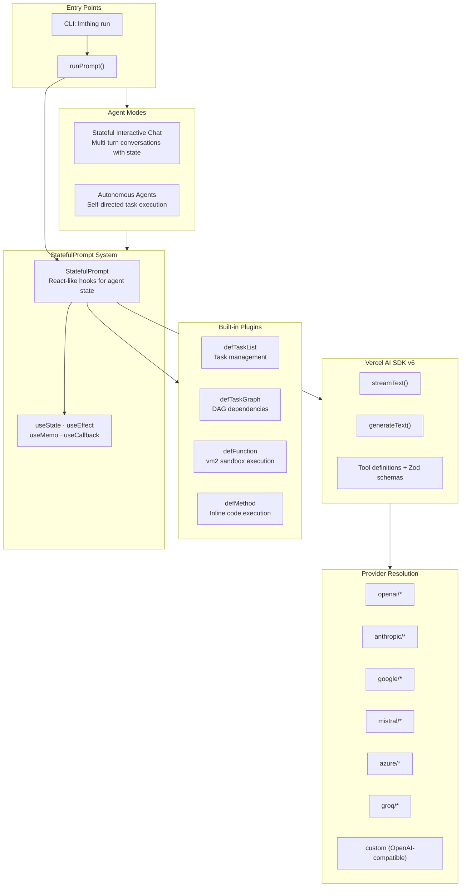
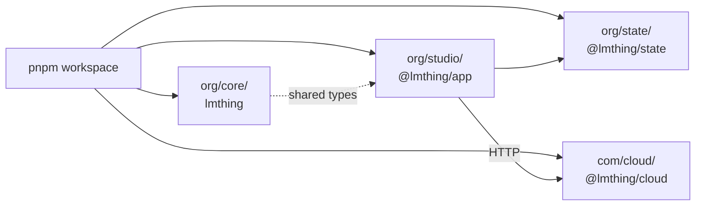
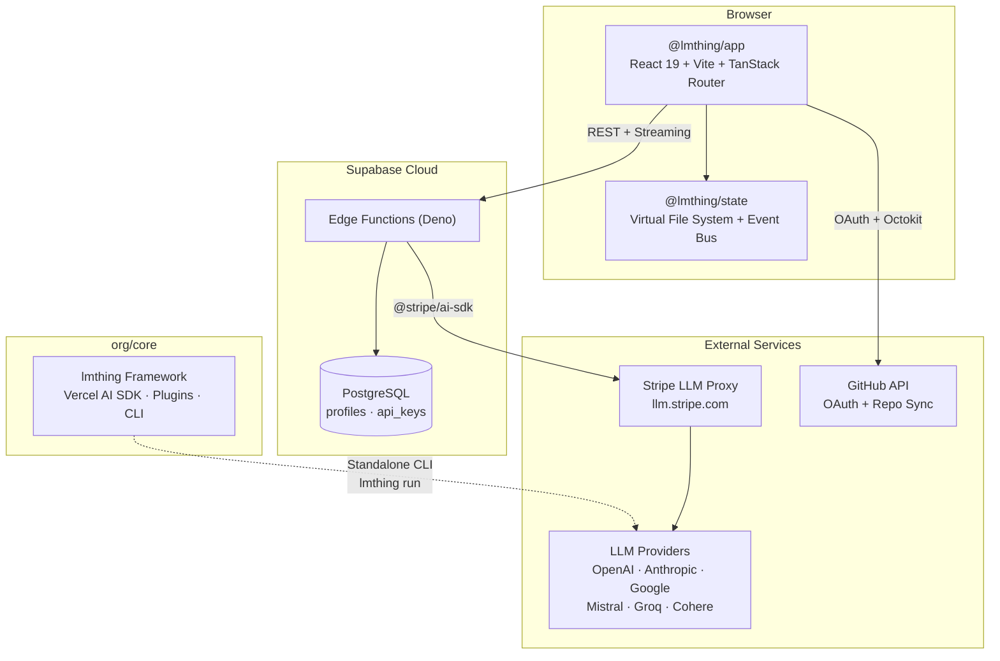
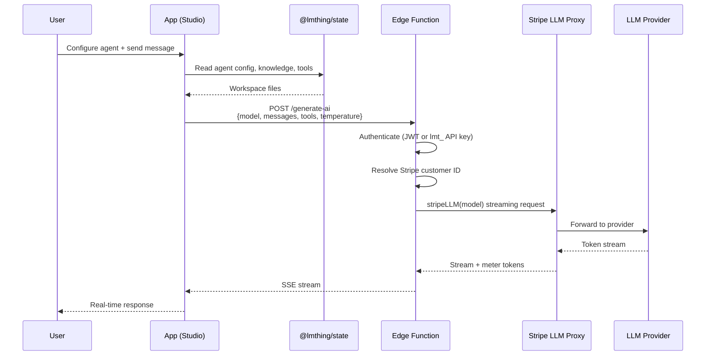
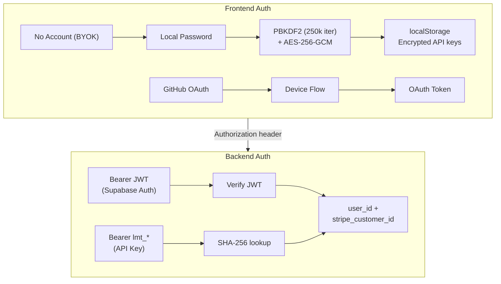
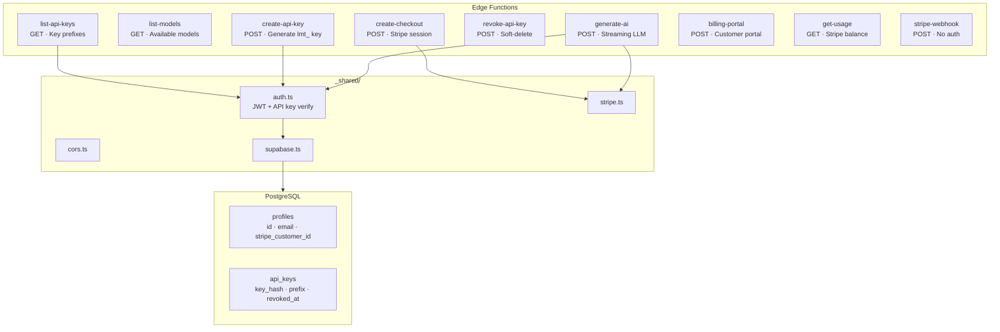
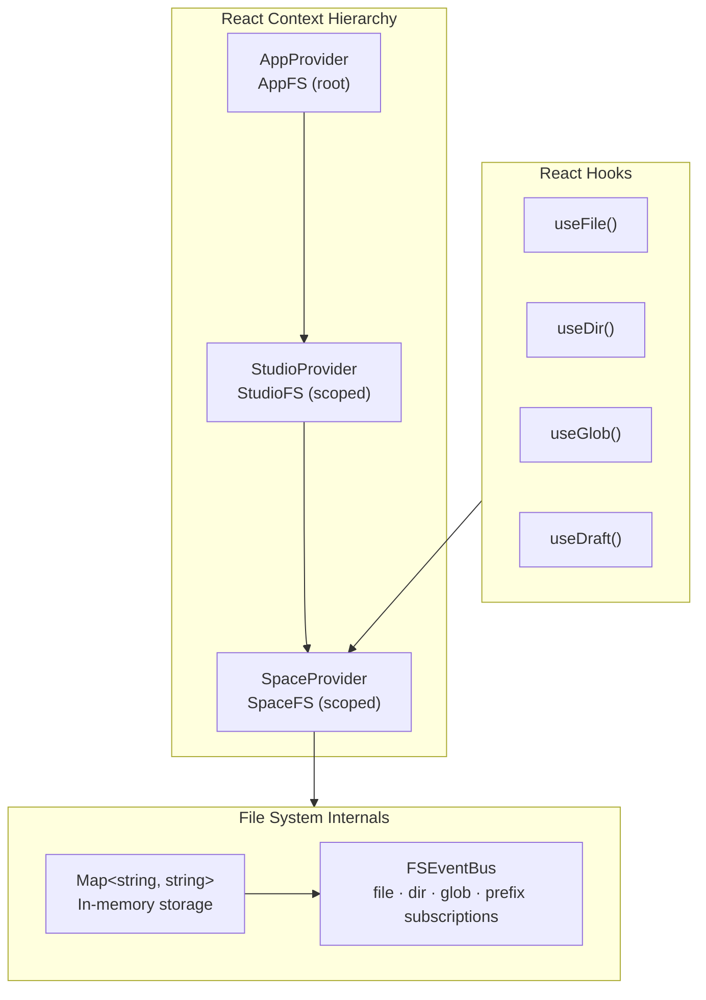
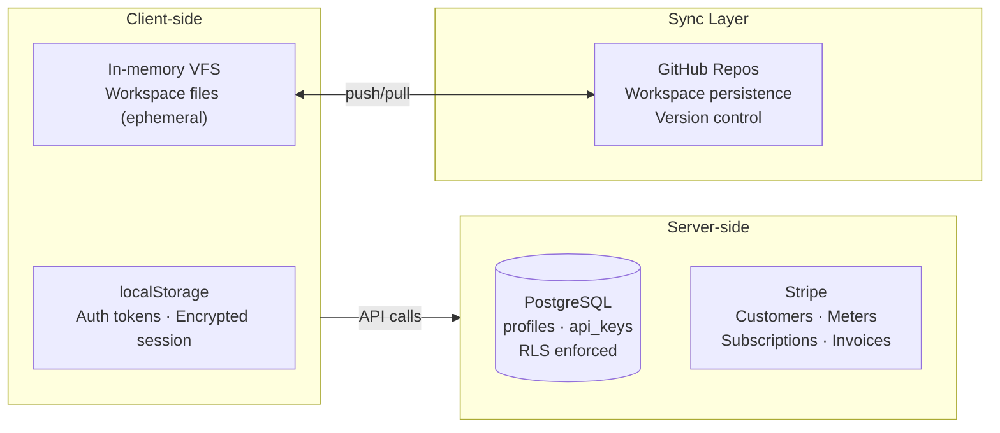

# LMTHING Technical Architecture

## Core Agent Framework (org/core)

The agentic framework that powers all of lmthing. It supports two modes: **stateful interactive chat** (multi-turn conversations where the agent maintains state across turns) and **autonomous agents** (self-directed task execution without human input). Built on the Vercel AI SDK v6, it provides a StatefulPrompt system with React-like hooks (useState, useEffect, useMemo, useCallback) for managing agent state. Built-in plugins handle task lists, DAG-based task graphs, sandboxed TypeScript execution (vm2), and inline code methods. Provider resolution supports OpenAI, Anthropic, Google, Mistral, Azure, Groq, and any OpenAI-compatible endpoint. Agents can run in the browser via Studio or standalone via the `lmthing run` CLI.

---
## Monorepo Structure

Four packages in a pnpm workspace. The app depends on the state library for file system management and calls the cloud backend over HTTP. The core framework shares types with the app and can also run independently as a CLI tool.

| Package | Name | Stack | Role |
|---------|------|-------|------|
| `org/studio/` | @lmthing/app | React 19, Vite 7, TanStack Router, Tailwind 4, Radix UI | Visual studio for building and testing AI agents |
| `org/core/` | lmthing | TypeScript, Vercel AI SDK v6, Zod, vm2 | Agentic framework — stateful prompts, plugins, tool execution, multi-provider support |
| `org/state/` | @lmthing/state | React hooks, Map-based VFS, FSEventBus | Virtual file system with scoped contexts, event subscriptions, and glob matching |
| `org/docs/` | — | Documentation | Project documentation |
| `com/cloud/` | @lmthing/cloud | Deno, Supabase Edge Functions, @stripe/ai-sdk | Serverless backend — auth, billing, LLM proxy, API key management |

---

## System Overview

The platform is built as a pnpm monorepo with four packages. The frontend app (React 19) communicates with Supabase Edge Functions for authentication, billing, and LLM proxying. The core agent framework can run both inside the browser (via Studio) and standalone via CLI. The state library provides a virtual file system that powers workspace management in the browser, with GitHub as the persistence and sync layer.

---

## Agent Execution Flow

When a user sends a message in Studio, the app reads the agent configuration from the virtual file system, then streams a request through the Supabase edge function. The edge function authenticates the user, resolves their Stripe customer ID, and proxies the request through Stripe's LLM gateway — which handles token metering automatically. The response streams back to the browser in real time.

---

## Authentication

Three modes of auth. Studio can run entirely without an account — users set a local password that encrypts their API keys in localStorage via PBKDF2 + AES-256-GCM (BYOK mode, no server needed). For cloud features, users authenticate via GitHub OAuth device flow (also enables workspace syncing). On the backend, requests are authenticated either with a Supabase JWT (browser sessions) or a programmatic API key prefixed with `lmt_` (for SDK/script access). Both server-side paths resolve to a user ID and Stripe customer ID.

---

## Cloud Backend (Supabase Edge Functions)

The serverless backend runs on Supabase Edge Functions (Deno runtime). Nine functions handle AI generation, model listing, API key lifecycle, Stripe billing, and webhooks. Shared modules provide authentication (dual JWT/API key), CORS, Stripe client initialization, and Supabase client factories. All user data is stored in PostgreSQL with row-level security enforced per user.

---

## Virtual File System (@lmthing/state)

The state library provides a layered, in-memory virtual file system for managing workspace data in the browser. It uses a `Map<string, string>` as storage and an event bus (FSEventBus) that supports fine-grained subscriptions — by file path, directory, glob pattern, or prefix. React context providers (App → Studio → Space) scope the file system at each level, and hooks like `useFile()`, `useDir()`, `useGlob()`, and `useDraft()` give components reactive access to workspace data. Files are ephemeral in memory and persisted through GitHub sync.

---

## Data Storage Map

Data lives in three tiers. Client-side storage is ephemeral — localStorage holds auth tokens and encrypted sessions, while the in-memory VFS holds workspace files that exist only for the duration of the browser session. Server-side, Supabase PostgreSQL stores user profiles and API keys with row-level security, and Stripe manages customer records, token meters, subscriptions, and invoicing. GitHub serves as the sync and persistence layer — workspaces are stored as repositories and can be pushed/pulled bidirectionally.

