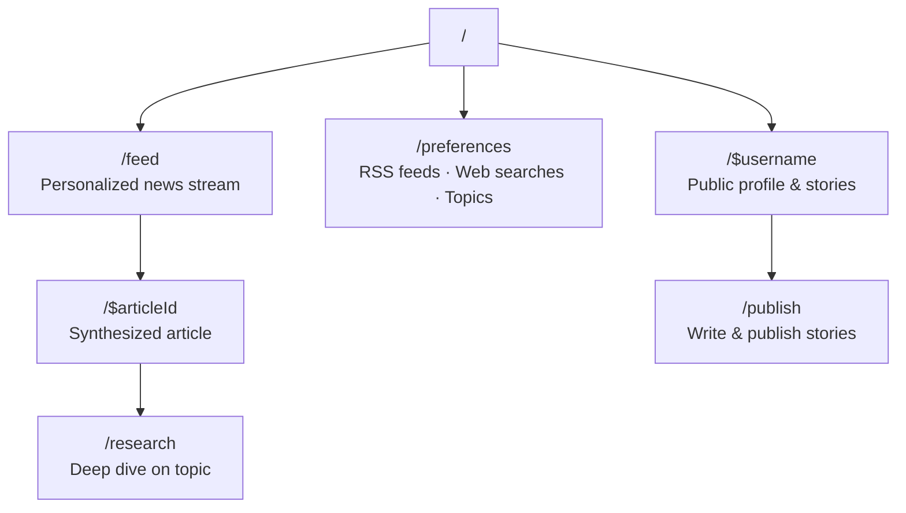

# lmthing.blog — unbuilt ideas

> **Unbuilt product ideas — not implemented, not planned, not authoritative.** Nothing on this page
> is backed by code. For what actually exists see the [README](./README.md) next to it and
> https://lmthing.org. Prices and features here were written before the product existed and
> contradict the shipped tiers (`cloud/gateway/src/lib/tiers.ts`); there is no blog subscription
> tier and no `$1/week` allowance. Preserved to keep the thinking, not to bless it.

---

Personalized AI-generated news. A THING agent continuously fetches, synthesizes, and presents news tailored to each user.

## Overview

Users subscribe to RSS feeds and web search queries. A THING agent running on a shared serverless worker (not the user's Space) fetches, synthesizes, and presents news. Users can ask for deeper research on any topic and publish stories to their public profile.

## Routing

## Revenue Model

- **Free tier** — $1/week allowance, limited RSS feed subscriptions, uses a cheap model.
- **Blog subscription** — $5/month for unlimited RSS + web search subscriptions, deep research on demand, and publishing.
