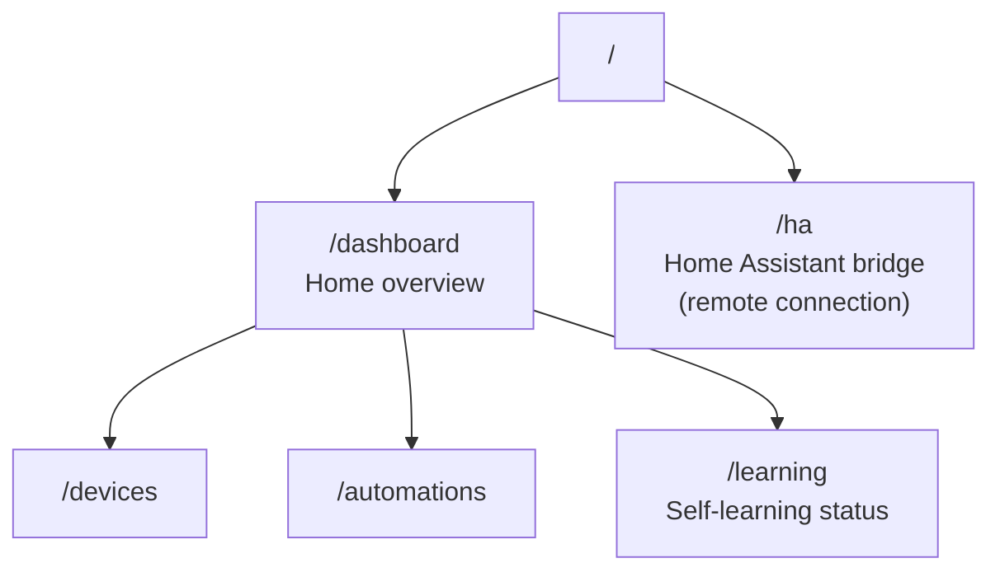

# lmthing.casa — unbuilt ideas

> **Unbuilt product ideas — not implemented, not planned, not authoritative.** Nothing on this page
> is backed by code. For what actually exists see the [README](./README.md) next to it and
> https://lmthing.org. Prices and features here were written before the product existed and
> contradict the shipped tiers (`cloud/gateway/src/lib/tiers.ts`): there is **no fine-tuning service
> anywhere in the codebase**, there is no "Stripe AI Gateway", and the routes below do not exist.
> Preserved to keep the thinking, not to bless it.

---

Full Home Assistant integration. A self-learning THING instance with complete HA control.

## Overview

Casa runs a THING agent on a Space node that connects to Home Assistant remotely. The dashboard shows device state, automations, and learning progress. Over time the agent learns household patterns and adapts automations through the SLM fine-tuning service on lmthing.cloud.

The HA bridge provides remote communication with the user's Home Assistant instance — Casa never runs on the same machine as HA, it connects over the network from its Space node.

## Routing

## Revenue Model

- **Space subscription** — Included with Pro tier ($20/month) — dedicated compute pod running the Casa agent.
- **Token usage** — per-token billing through the Stripe AI Gateway (10% markup) for all LLM calls.
- **Fine-Tuning** — $10/GPU-hour for training the self-learning SLM that adapts to household patterns.
