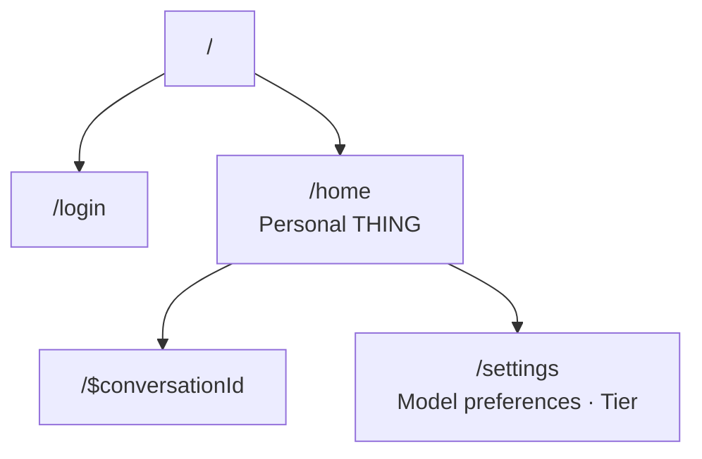

# lmthing.chat

The personal THING interface. Users log in and immediately access their personal agent for direct conversation.

## Overview

Chat is the simplest, most direct way to interact with a THING agent. Conversations are persisted and settings control model preferences and tier. This is the conversational counterpart to Studio — while Studio is for building agents, Chat is for using your personal THING.

## Routing

## Revenue Model

- **Free tier** — limited token allowance ($1/week) and select models only.
- **Pay As You Go** — premium model access with per-token billing through the Stripe AI Gateway (10% markup). Users set their own stop limits.
