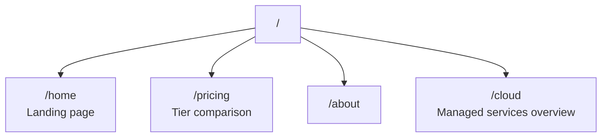

# lmthing.com — unbuilt ideas

> **Unbuilt product ideas — not implemented, not planned, not authoritative.** Nothing on this page
> is backed by code. For what actually exists see the [README](./README.md) next to it and
> https://lmthing.org. Prices and features here were written before the product existed and
> contradict the shipped tiers (`cloud/gateway/src/lib/tiers.ts`): there is no fine-tuning service
> anywhere in the codebase, no blog subscription tier, no `$20/month` compute-pod line item, and the
> `/home` and `/cloud` routes below do not exist. (The 15% markup figure does match
> `cloud/scripts/generate-litellm-models.ts`.) Preserved to keep the thinking, not to bless it.

---

The commercial landing page and home of the for-profit entity.

## Overview

lmthing.com is the commercial face of the platform. It owns and operates lmthing.cloud — the managed services that power the entire ecosystem: the Stripe-metered AI gateway, K8s compute pods, and SLM fine-tuning service.

The landing page presents the platform, pricing tiers, and funnels users into the product domains (Studio, Chat, Blog, Space, etc.).

## Routing

## Revenue Model

lmthing.com is the revenue hub. All money flows through lmthing.cloud:

| Service | Price | Cost | Margin |
|---------|-------|------|--------|
| AI Gateway | Per-token + 15% markup | Provider cost | 15% of token spend |
| Compute pods | $20/month | $10 K8s | $10/pod/month |
| Fine-Tuning | $10/GPU-hour | $7 Azure H100 | $3/GPU-hour |
| Blog subscription | $5/month | Cheap model tokens | Subscription minus token cost |
| Store commissions | Platform fee | — | Fee on source sales + API markup |
