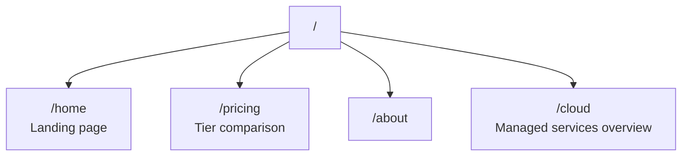

# lmthing.com

The commercial landing page and home of the for-profit entity.

## Overview

lmthing.com is the commercial face of the platform. It owns and operates lmthing.cloud — the managed services that power the entire ecosystem: the Stripe-metered AI gateway, Fly.io deploy agent, and SLM fine-tuning service.

The landing page presents the platform, pricing tiers, and funnels users into the product domains (Studio, Chat, Blog, Space, etc.).

## Routing

## Revenue Model

lmthing.com is the revenue hub. All money flows through lmthing.cloud:

| Service | Price | Cost | Margin |
|---------|-------|------|--------|
| AI Gateway | Per-token + 10% markup | Provider cost | 10% of token spend |
| Space nodes | $8/month | $5 Fly.io | $3/node/month |
| Fine-Tuning | $10/GPU-hour | $7 Azure H100 | $3/GPU-hour |
| Blog subscription | $5/month | Cheap model tokens | Subscription minus token cost |
| Store commissions | Platform fee | — | Fee on source sales + API markup |
