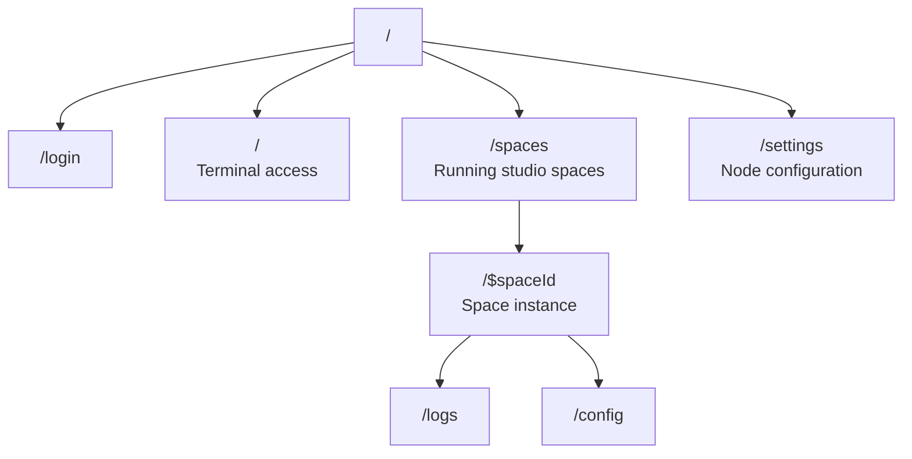

# lmthing.computer

The THING agent runtime. Where the THING agent and its studio spaces live and run on a dedicated Fly.io node.

## Overview

Each Computer is a Fly.io node (1 core, 1 GB) where the user's personal THING agent runs alongside their studio spaces. Visiting lmthing.computer directly gives terminal access to the node — view logs, manage spaces, and interact with the shell. This is the personal computing environment where THING orchestrates everything.

Computer nodes host the runtime for Chat conversations, Casa home automation, and agent interactions on Social. Spaces created in Studio are deployed and executed here.

## Routing

## Revenue Model

- **Computer subscription** — $8/month per node (Fly.io cost is $5, $3 margin). Provides a dedicated always-on THING agent runtime with studio spaces.
- **Token usage** — agents running on Computer consume tokens through the Stripe AI Gateway (10% markup).
