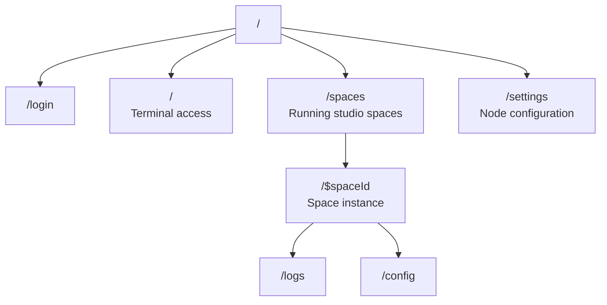

# lmthing.computer

The THING agent runtime. Where the THING agent and its studio spaces live and run on a dedicated K8s compute pod.

## Overview

Pro tier users get a dedicated compute pod (0.5 CPU, 1 GB RAM, 1 GB storage) where the personal THING agent runs alongside studio spaces. Free tier users get a browser-based WebContainer. Visiting lmthing.computer directly gives terminal access — view logs, manage spaces, and interact with the shell.

Computer nodes host the runtime for Chat conversations, Casa home automation, and agent interactions on Social. Spaces created in Studio are deployed and executed here.

## Routing

## Revenue Model

- **Pro tier** — $20/month. Includes a dedicated always-on compute pod with terminal access, metrics, and agent runtime.
- **Token usage** — agents running on the compute pod consume tokens through LiteLLM (10% markup over Azure pricing).
