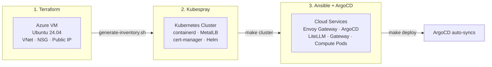
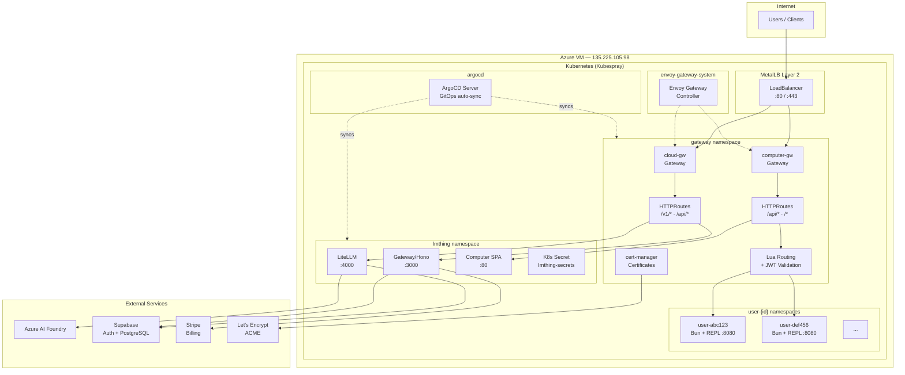
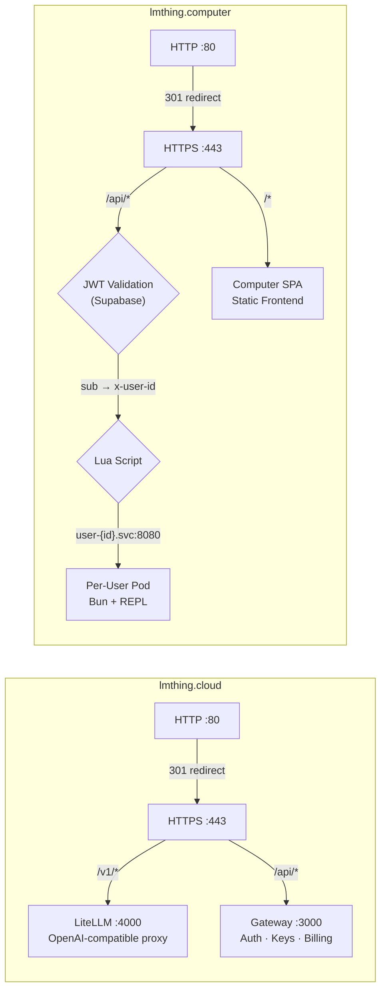
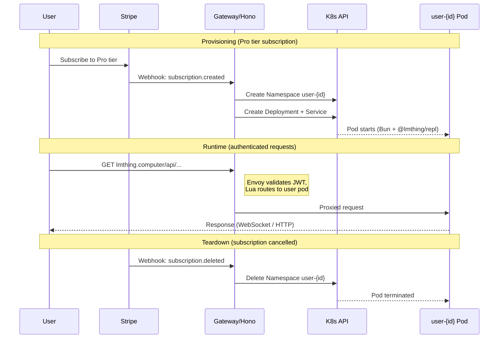
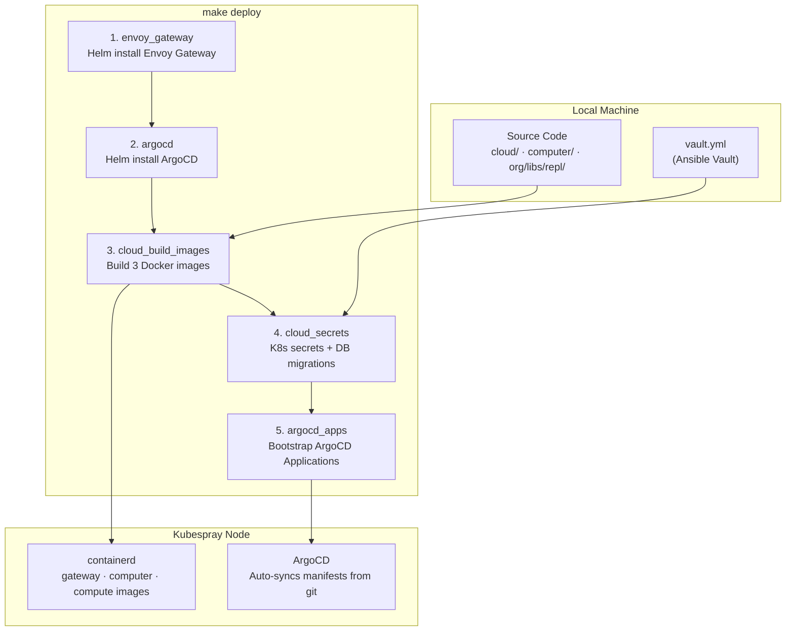
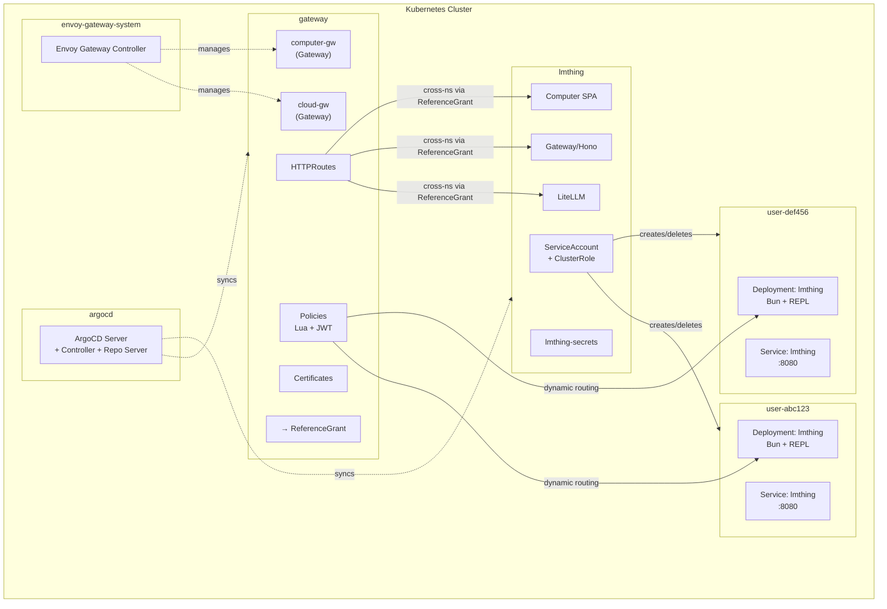
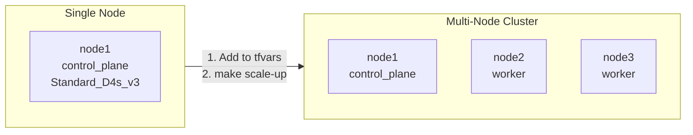

# DevOps — lmthing Infrastructure

Full infrastructure lifecycle for the lmthing platform: Azure VM provisioning (Terraform), Kubernetes cluster setup (Kubespray), and cloud service deployment via ArgoCD GitOps with Envoy Gateway ingress, cert-manager TLS, and per-user compute pods.

## Full Pipeline



## Infrastructure Overview



## Routing



## Per-User Compute



## Deployment Pipeline



## Namespace Layout



## Layout

```
devops/
├── Makefile                          # Top-level: terraform + pipeline targets
├── README.md                         # This file
├── CLAUDE.md                         # AI assistant context
├── argocd/                           # ArgoCD-managed K8s manifests (GitOps source of truth)
│   ├── apps/                         # ArgoCD Application definitions
│   │   ├── core.yaml                 # lmthing-core: core services
│   │   └── envoy.yaml                # lmthing-envoy: Envoy Gateway resources
│   ├── core/                         # Core services (→ lmthing namespace)
│   │   ├── kustomization.yaml
│   │   ├── namespace.yaml
│   │   ├── litellm.yaml
│   │   ├── gateway.yaml
│   │   ├── computer.yaml
│   │   └── compute-pod-template.yaml
│   ├── envoy/                        # Envoy Gateway resources (→ gateway namespace)
│   │   ├── kustomization.yaml
│   │   ├── config.yaml               # Domain values for Kustomize replacements
│   │   ├── cloud-gateway.yaml
│   │   ├── cloud-routes.yaml
│   │   ├── computer-routes.yaml
│   │   ├── computer-policies.yaml
│   │   ├── reference-grants.yaml
│   │   └── tls-certificates.yaml
│   └── compute/                      # Per-user compute pod resources
│       ├── Dockerfile
│       └── user-pod-template.yaml
├── terraform/                        # Azure VM provisioning
│   ├── versions.tf                   # Provider config (azurerm ~> 4.0)
│   ├── variables.tf                  # All input variables
│   ├── main.tf                       # RG, VNet, NSG, NIC, VM
│   ├── outputs.tf                    # VM IP, SSH, Ansible integration
│   ├── terraform.tfvars.example      # Variable template
│   └── generate-inventory.sh         # TF outputs → Ansible hosts.yml
├── ansible/
│   ├── Makefile                      # All targets (cluster + services + ArgoCD)
│   ├── ansible.cfg                   # Ansible configuration
│   ├── requirements.yml              # Ansible collections
│   ├── vault.yml                     # Secrets (Ansible Vault)
│   ├── playbooks/
│   │   ├── kubespray.yml             # K8s cluster provisioning
│   │   └── services.yml              # Cloud service deployment
│   ├── roles/
│   │   ├── k8s_postinstall/          # Kubeconfig setup
│   │   ├── envoy_gateway/            # Install Envoy Gateway via Helm
│   │   ├── argocd/                   # Install ArgoCD via Helm
│   │   ├── buildkit/                 # Install BuildKit for image building
│   │   ├── cloud_build_images/       # Build Docker images
│   │   ├── cloud_secrets/            # Create K8s secrets + run DB migrations
│   │   ├── argocd_apps/              # Bootstrap ArgoCD Application definitions
│   │   └── ingress_iptables/         # iptables for MetalLB ingress
│   ├── inventory/test/
│   │   ├── hosts.yml                 # Node inventory (auto-generated from TF)
│   │   └── group_vars/all.yml        # Cluster addons
│   ├── k8s/                          # [LEGACY] Old Ansible-managed manifests (use argocd/ instead)
│   └── scripts/setup/
│       └── bootstrap.sh              # Kubespray + venv setup
└── docs/getting-started/
    └── kubespray-test.md             # Cluster setup guide
```

## Quick Start

### 1. Provision Azure VM

```bash
cd devops/terraform
cp terraform.tfvars.example terraform.tfvars
vim terraform.tfvars          # Set subscription_id, region, VM size

az login                      # Authenticate to Azure
make -C .. tf-apply           # Or: terraform init && terraform apply

# Generate Ansible inventory from Terraform outputs
./generate-inventory.sh
```

### 2. Provision the Cluster

```bash
cd devops/ansible

# Bootstrap (clone Kubespray v2.30.0, create Python venv)
make bootstrap

# Verify SSH connectivity
make ping

# Deploy K8s cluster
make cluster
```

### 3. Deploy Services

```bash
# Fill in secrets and encrypt
vim vault.yml
ansible-vault encrypt vault.yml

# Update argocd/envoy/config.yaml with your domain values
vim ../argocd/envoy/config.yaml

# Deploy everything (prompts for vault password)
# Installs Envoy Gateway + ArgoCD + builds images + creates secrets + bootstraps ArgoCD apps
make deploy
```

### 4. Verify

```bash
# Check pod status (includes argocd namespace)
make status

# Check ArgoCD sync status
make argocd-apps

# Check routing and TLS
make routes

# Test endpoints
curl https://lmthing.cloud/api/health
curl https://lmthing.cloud/v1/models -H "Authorization: Bearer sk-..."
```

### Ongoing Changes

After initial setup, K8s manifest changes are deployed via GitOps:

```bash
# Edit manifests in devops/argocd/, commit, and push
git push    # ArgoCD auto-syncs within 3 minutes

# Or trigger immediate sync
cd ansible && make argocd-sync APP=lmthing-core
```

## Scaling



### Adding a Node

```bash
# 1. Add entry to terraform/terraform.tfvars
nodes = {
  node1 = { role = "control_plane" }
  node2 = { role = "worker" }         # add this
}

# 2. Provision VM + update inventory + join cluster
cd devops
make scale-up

# 3. Build images on new node
cd ansible && make deploy-images
```

### Removing a Node

```bash
# 1. Drain and remove from K8s
kubectl drain node2 --ignore-daemonsets --delete-emptydir-data
kubectl delete node node2

# 2. Remove entry from terraform/terraform.tfvars
# 3. Destroy VM + update inventory
cd devops
make scale-down
```

## Common Operations

All Ansible commands run from `devops/ansible/`. Terraform and scaling from `devops/`.

| Task | Command |
|------|---------|
| **Infrastructure** | |
| Provision VMs | `make tf-apply` |
| Destroy all VMs | `make tf-destroy` |
| Update inventory from TF | `make tf-inventory` |
| Full setup (VMs + inventory) | `make up` |
| Add worker nodes | `make scale-up` |
| Remove worker nodes | `make scale-down` |
| **Cluster** | |
| Bootstrap Ansible | `cd ansible && make bootstrap` |
| Create cluster | `cd ansible && make cluster` |
| Upgrade cluster | `cd ansible && make upgrade` |
| **Services** | |
| Full deploy | `cd ansible && make deploy` |
| Rebuild images only | `cd ansible && make deploy-images` |
| Update secrets + migrations | `cd ansible && make deploy-secrets` |
| Install/update ArgoCD + apps | `cd ansible && make deploy-argocd` |
| **Observability** | |
| Check pod status | `cd ansible && make status` |
| Check routes & certs | `cd ansible && make routes` |
| View gateway logs | `cd ansible && make logs-gateway` |
| View litellm logs | `cd ansible && make logs-litellm` |
| View ArgoCD logs | `cd ansible && make logs-argocd` |
| ArgoCD app sync status | `cd ansible && make argocd-apps` |
| Trigger manual ArgoCD sync | `cd ansible && make argocd-sync APP=lmthing-core` |
| **Secrets** | |
| Edit vault | `ansible-vault edit ansible/vault.yml` |

## Further Reading

- [Cluster Setup Guide](docs/getting-started/kubespray-test.md) — step-by-step first cluster walkthrough
- [CLAUDE.md](CLAUDE.md) — full technical reference (gotchas, RBAC, template rendering, secrets)
- [cloud/README.md](../cloud/README.md) — original K3s backend (being replaced)
