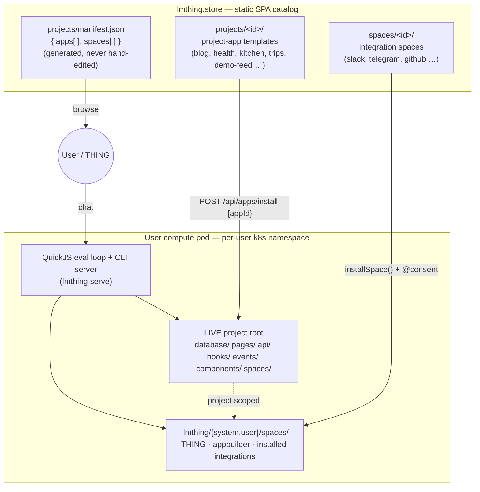

# `org/` — the lmthing project & space format

The canonical, **browsable** reference for the on-disk shape of the two authorable artifacts in
lmthing: a **project** (a project-as-application) and a **space** (a bundle of agents + tooling).

This package's *directory tree mirrors the artifacts it documents.* Open the folder that matches
the file you're authoring and its `README.md` tells you the exact shape:

- **[`project/`](./project/)** — the app: `database/ api/ pages/ components/ hooks/ events/ spaces/`.
- **[`space/`](./space/)** — the specialist bundle: `agents/ functions/ components/ tasklists/ knowledge/ events/`.

Both artifacts are plain directory trees of markdown, TypeScript, and JSON — **no build step, no
manifest you hand-write.** The pod runtime loads them directly; the **store** distributes them.

For behaviour and data-flow (not on-disk shape) see [Architecture.md](../Architecture.md),
[sdk/org/project-as-application.md](../sdk/org/project-as-application.md),
[sdk/org/SPACE_DEVELOPMENT.md](../sdk/org/SPACE_DEVELOPMENT.md), and the
`@.claude/skills/events-and-hooks.md` skill.

---

## The big picture

Two artifact kinds, one runtime, one catalog.



- A **[project](./project/)** = a full application: a project-rooted SQLite DB, worker-isolated
  Node API handlers, client React pages, in-proc hooks, plus **project-scoped spaces** under its
  own `spaces/`.
- A **[space](./space/)** = a portable bundle of AI specialists (agents), their deterministic
  helper `functions/`, `knowledge/`, `tasklists/` (DAG workflows), UI `components/`, and event
  `events/` emitter defs. Spaces live in the pod's space roots
  (`.lmthing/{system,user,my}/spaces/`) or nested inside a project (`<project>/spaces/`).
- The **store** ships both as on-disk templates and a generated `manifest.json` browse index;
  install is authenticated and happens on the pod, not in the static store.

---

## Distribution — the store catalog

The store (`store/`) is a static SPA that **browses** templates; install is authenticated on the
pod (`POST /api/apps/install` for projects; `installSpace()` + `@consent` for spaces).

```
store/
├── projects/
│   ├── <id>/               # a complete project-app template (see project/)
│   └── manifest.json       # GENERATED browse index — never hand-edit
└── spaces/
    └── <id>/               # a complete space template (see space/)
```

### `projects/manifest.json` — generated browse index

Regenerated from the templates by `store/scripts/gen-apps-manifest.mjs` (wired into the store's
Vite build). Two arrays — every field is **derived** from the on-disk template (the template is
the source of truth, the manifest is a cache):

```jsonc
{
  "apps": [                       // one entry per store/projects/<id>/
    {
      "id": "blog",
      "title": "Blog",
      "description": "…",
      "icon": null,
      "tables":    ["articles", "sources", …],          // from database/*.json
      "pages":     ["index.tsx", "feed/[articleId].tsx", …],
      "endpoints": ["articles", "sources", …],           // from api/**
      "hooks":     ["refresh-sources", "synthesize-new", …],
      "files":     [ … ]                                  // full template file list
    }
  ],
  "spaces": [                     // one entry per store/spaces/<id>/ (mostly integrations today)
    {
      "id": "integration-demo",
      "title": "Demo (Echo)",
      "description": "…",
      "icon": "🧪",
      "tags": ["integration", "messaging", "demo"],
      "kind": "integration",
      "settings": { /* JSON Schema, from package.json lmthing.settings */ },
      "events":   { "message.received": { "payload": { "text": "string", … } } },
      "inbound":  [ { "path": "demo", "verify": "hmac" } ],
      "functions":[ { "name": "demoSendMessage", "summary": "…", "signature": "…" } ],
      "agents":   [ { "slug": "demo", "actions": ["assist", "send"] } ],
      "files":    [ … ]
    }
  ]
}
```

---

## Quick reference — file kind → format

| Path | Kind | Doc | Format |
|---|---|---|---|
| `project.json` / `package.json` | project descriptor | [project/project.json.md](./project/project.json.md) · [package.json.md](./project/package.json.md) | JSON: `id/title/description/icon`; npm deps |
| `database/<table>.json` | table schema | [project/database/](./project/database/) | JSON: `title/description/columns/relations` |
| `api/<path>/<METHOD>.ts` | HTTP handler | [project/api/](./project/api/) | ESM: `name`, `description`, `Input`, `Output`, default `handler(input, ctx)` |
| `pages/<route>.tsx` | React route | [project/pages/](./project/pages/) | TSX default-export; `@app/runtime` hooks; tokens only |
| `components/<Name>.tsx` | React component | [project/components/](./project/components/) | TSX; design tokens only |
| `hooks/<slug>.ts` | automation | [project/hooks/](./project/hooks/) | default-export `{ type: cron\|database\|event, … }` |
| `events/<name>.ts` | emitter def | [space/events/](./space/events/) | default-export `{ type: webhook\|cron\|db\|internal, emits, emit }` |
| `agents/<slug>/charter.md` | persona | [space/agents/](./space/agents/) | plain markdown, no frontmatter |
| `agents/<slug>/instruct.md` | agent config | [space/agents/](./space/agents/) | YAML frontmatter (title/actions/knowledge/functions/capabilities/canDelegateTo) + body |
| `functions/<fn>.ts` | helper | [space/functions/](./space/functions/) | plain TS module, named export |
| `tasklists/<slug>/index.md` | workflow head | [space/tasklists/](./space/tasklists/) | frontmatter `input`/`connections` + overview |
| `tasklists/<slug>/NN-<id>.md` | workflow step | [space/tasklists/](./space/tasklists/) | frontmatter `id/dependsOn/output/role/forEach/optional/functions` + `ts` body |
| `knowledge/<domain>/<field>/index.md` | knowledge head | [space/knowledge/](./space/knowledge/) | frontmatter `variable`/`description` + overview |
| `knowledge/…/<aspect>.md` | knowledge leaf | [space/knowledge/](./space/knowledge/) | plain markdown |
| `store/projects/manifest.json` | catalog index | this file | GENERATED JSON `{ apps[], spaces[] }` |

---

*Authoritative sources: [sdk/org/project-as-application.md](../sdk/org/project-as-application.md),
[sdk/org/SPACE_DEVELOPMENT.md](../sdk/org/SPACE_DEVELOPMENT.md),
`@.claude/skills/events-and-hooks.md`,
`.lmthing/system/spaces/system-appbuilder/knowledge/app_building/model/`. Examples are drawn from
the real store templates (`store/projects/{blog,demo-feed}`, `store/spaces/integration-slack`).*
