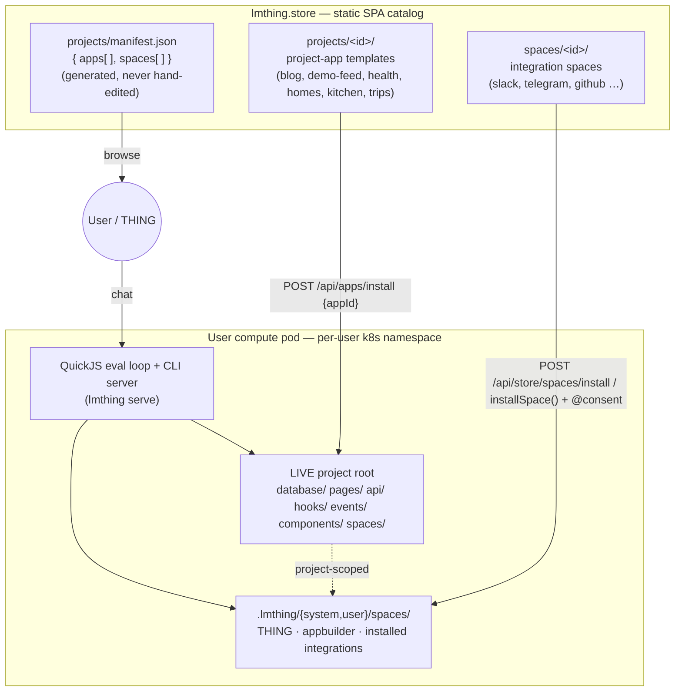

# `org/` — the lmthing project & space format

The canonical, **browsable** reference for the on-disk shape of the two authorable artifact kinds in lmthing: a **project** (a project-as-application) and a **space** (a bundle of agents + tooling). The runtime that loads them is the QuickJS eval loop + CLI server under `sdk/org/libs/{core,cli}` (`../sdk/org/CLAUDE.md`).

This package's *directory tree mirrors the artifacts it documents* — open the folder that matches the file you're authoring and its `README.md` gives the exact shape:

- **[`project/`](./project/)** — the app: `database/ api/ pages/ components/ hooks/ events/ spaces/`, siblings at the project root, gated by an agent's `capabilities:` frontmatter (`../sdk/org/libs/core/src/spaces/capabilities.ts` `parseCapabilities`).
- **[`space/`](./space/)** — the specialist bundle: `agents/ functions/ components/ tasklists/ knowledge/ events/`, loaded by `loadSpace` (`../sdk/org/libs/core/src/spaces/load.ts` `loadSpace`).

Both artifacts are plain directory trees of markdown, TypeScript, and JSON — the pod runtime loads them directly (`../sdk/org/libs/core/src/spaces/load.ts` `loadSpace`), and the **store** distributes them as templates plus a **generated** browse index that is never hand-edited (`../store/scripts/gen-apps-manifest.mjs` `generateManifestFile`).

For behaviour and data-flow (not on-disk shape) see [Architecture.md](../Architecture.md), [sdk/org/project-as-application.md](../sdk/org/project-as-application.md), [sdk/org/SPACE_DEVELOPMENT.md](../sdk/org/SPACE_DEVELOPMENT.md), and the `@.claude/skills/events-and-hooks.md` skill.

---

## The big picture

Two artifact kinds, one runtime, one catalog. A project owns a full application built on the pod runtime — a project-rooted SQLite DB, worker-isolated Node API handlers, client React pages, in-proc hooks (`../sdk/org/project-as-application.md`); a space is a portable bundle of AI specialists loaded from a space root (`../sdk/org/libs/core/src/spaces/load.ts` `loadSpace`).



- A **[project](./project/)** = a full application: a project-rooted SQLite DB, worker-isolated Node API handlers, client React pages, in-proc hooks, plus **project-scoped spaces** under its own `spaces/` (`../sdk/org/project-as-application.md`).
- A **[space](./space/)** = a portable bundle of agents, their deterministic helper `functions/` (`../sdk/org/libs/core/src/spaces/load.ts` `loadFunctionsFromDir`), `knowledge/` (`loadKnowledge`), `tasklists/` DAG workflows (`loadTasklists`), UI `components/` (`loadComponents`), and `events/` emitter defs. Spaces live in the pod's materialized space roots — `<root>/system/spaces/` and the per-project `<root>/<projectId>/spaces/` (default project id `user`) — or nested inside a project template (`<project>/spaces/`) (`../sdk/org/libs/cli/src/cli/runtime-init.ts` `runtime-init`). (The `sdk/org/CLAUDE.md` shorthand `.lmthing/{system,user,my}/spaces/` overstates this — the loader materializes only `system` and `user`; see [space/README.md](./space/README.md).)
- The **store** ships both as on-disk templates and a generated `manifest.json` browse index; install is authenticated and happens on the pod, not in the static store (`../store/README.md`).

---

## Distribution — the store catalog

The store (`store/`) is a static SPA that **browses** templates via the inlined manifest; it never installs (`../store/src/lib/apps-manifest.ts` `appsManifest`). Installing a project is authenticated on the pod through `POST /api/apps/install` (`../sdk/org/libs/cli/src/server/routes/apps.ts` `handleInstallApp`); installing a space goes through `POST /api/store/spaces/install` (`../sdk/org/libs/cli/src/server/routes/store-spaces.ts` `handleInstallStoreSpace`) or the agent-facing consent-gated `installSpace()` global (`../sdk/org/libs/core/src/globals/store.ts` `installSpace`).

```
store/
├── projects/
│   ├── <id>/               # a complete project-app template (see project/)
│   └── manifest.json       # GENERATED browse index — never hand-edit
└── spaces/
    └── <id>/               # a complete space template (see space/)
```

The two catalog dirs are resolved by the generator as `APPS_DIR = store/projects` and `SPACES_DIR = store/spaces` (`../store/scripts/gen-apps-manifest.mjs` `APPS_DIR`). Six project-apps ship today — `blog`, `demo-feed`, `health`, `homes`, `kitchen`, `trips` (`../store/projects/manifest.json` — `apps[].id`); thirteen integration spaces ship under `store/spaces/integration-*` (`../store/projects/manifest.json` — `spaces[].id`).

### `projects/manifest.json` — generated browse index

`manifest.json` is regenerated from the templates by `buildManifest`, wired into the store's Vite build as the `lmthing-apps-manifest` plugin (`../store/scripts/gen-apps-manifest.mjs` `buildManifest`; `../store/vite.config.ts` `appsManifestPlugin`). Its top level is exactly two arrays, `{ apps, spaces }` (`../store/scripts/gen-apps-manifest.mjs` `buildManifest`). Every field is **derived** from the on-disk template — the template is the source of truth, the manifest is a cache (`../store/src/lib/apps-manifest.ts` `CatalogApp`).

An `apps[]` entry is `{ id, title, description, icon, tables, pages, endpoints, hooks, files }` (`../store/scripts/gen-apps-manifest.mjs` `loadAppEntry`). `tables` is the basenames of `database/*.json`, `pages` the recursive `.tsx`/`.jsx` under `pages/`, `endpoints` the immediate subdir names under `api/`, `hooks` the basenames of `hooks/*.ts`, and `files` the full download list (every template file minus `.data/`/`types/`/`node_modules/`) so a pod's install endpoint can fetch each from `<store>/projects/<id>/<relpath>` (`../store/scripts/gen-apps-manifest.mjs` `loadAppEntry`, `listAllFiles`, `EXCLUDED_DIRS`). Metadata (`id/title/description/icon`) comes from `project.json` when present, else derived from `package.json` (`../store/scripts/gen-apps-manifest.mjs` `loadAppEntry`).

A `spaces[]` entry additionally carries a lifted producer/consumer surface — `events` (union of every `events/*.ts` def's `emits`), `inbound` (the public path + verify kind of each `webhook` def), `functions`, and `agents` — so `system-store` can fit-check an install from catalog data alone (`../store/scripts/gen-apps-manifest.mjs` `loadSpaceEntry`, `loadSpaceEvents`). The `events` field is load-bearing and transpile-validated at build time with a vendored copy of the core emitter validator, so a malformed emitter def **fails the store build loudly** (`../store/scripts/gen-apps-manifest.mjs` `validateEmitterDefVendored`, `loadEmitterDef`). The typed accessor `src/lib/apps-manifest.ts` reads this inlined JSON via `listCatalogApps()`, `getCatalogApp(id)`, `listCatalogSpaces()`, and `listCatalogIntegrations()` (`../store/src/lib/apps-manifest.ts` `listCatalogApps`).

> UNVERIFIED: the exported `CatalogApp`/`CatalogSpace` TypeScript interfaces in `store/src/lib/apps-manifest.ts` omit fields the generator actually emits — `CatalogApp` has no `files`, and `CatalogSpace` has no `events`/`inbound`/`functions`/`agents` — even though `gen-apps-manifest.mjs` writes all of them (`../store/src/lib/apps-manifest.ts` `CatalogApp`; `../store/scripts/gen-apps-manifest.mjs` `loadSpaceEntry`). The manifest JSON is the ground truth here; the accessor types appear stale.

```jsonc
// store/projects/manifest.json (real, trimmed — one app + one space)
{
  "apps": [
    {
      "id": "blog",
      "title": "Blog",
      "description": "lmthing.blog — personalized AI news, as a project-application …",
      "icon": null,
      "tables": ["alerts", "annotations", "articles", "briefings", "…"],
      "pages": ["_app.tsx", "_layout.tsx", "…"],
      "endpoints": ["…"],
      "hooks": ["…"],
      "files": ["…"]
    }
  ],
  "spaces": [
    {
      "id": "integration-slack",
      "title": "Slack",
      "icon": "🔌",
      "tags": ["integration"],
      "kind": "integration",
      "settings": { /* JSON Schema from package.json lmthing.settings */ },
      "events":   { "message.received": { "payload": { "…": "string" } } },
      "inbound":  [ { "path": "slack", "verify": "slack" } ],
      "functions": [ /* { name, summary?, signature? } */ ],
      "agents":   [ /* { slug, actions?, triggers? } */ ],
      "files":    [ "…" ]
    }
  ]
}
```

### Browse vs install

The static store only browses: `src/routes/projects/` reads the inlined manifest via the typed accessor (`../store/src/routes/projects/index.tsx`; `../store/src/lib/apps-manifest.ts` `listCatalogApps`). Install is authenticated on the user's compute pod — `POST /api/apps/install { appId, projectId?, force? }` materializes the catalog app into the pod, boots it, and builds its pages, while `GET /api/apps` proxies this same public catalog (`../sdk/org/libs/cli/src/server/routes/apps.ts` `handleInstallApp`, `handleListApps`). Spaces install through `POST /api/store/spaces/install` or the consent-gated `installSpace()` global, whose user-approval gate runs host-side in the yield router before install (`../sdk/org/libs/cli/src/server/routes/store-spaces.ts` `handleInstallStoreSpace`; `../sdk/org/libs/core/src/globals/store.ts` `installSpace`).

---

## Quick reference — one row per file kind

| Path | Kind | Doc | Format / grounding |
|---|---|---|---|
| `project.json` | project descriptor | [project/project.json.md](./project/project.json.md) | JSON `id/title/description/icon` — read by the catalog generator (`../store/scripts/gen-apps-manifest.mjs` `loadAppEntry`) |
| `package.json` | npm manifest | [project/package.json.md](./project/package.json.md) | npm deps + `lmthing.*`; spaces use `lmthing.settings/tags/kind` (`../store/scripts/gen-apps-manifest.mjs` `loadSpaceEntry`) |
| `tsconfig.json` | TS config | [project/tsconfig.json.md](./project/tsconfig.json.md) | project TypeScript config |
| `database/<table>.json` | table schema | [project/database/README.md](./project/database/README.md) | JSON `title/description/columns/relations`, fail-loud validated (`../sdk/org/libs/core/src/db/validate.ts` `validateTableSchema`) |
| `api/<path>/<METHOD>.ts` | HTTP handler | [project/api/README.md](./project/api/README.md) | ESM `name/description/Input/Output` + default `handler(input, ctx)`; endpoint=dir, method=filename (`../sdk/org/libs/cli/src/app/api/loader.ts` `loadApiRoutes`, `METHOD_FILE_RE`) |
| `pages/<route>.tsx` | React route | [project/pages/README.md](./project/pages/README.md) | TSX default-export; index→dir path, `[seg]`→`:seg` (`../sdk/org/libs/cli/src/app/build/pages.ts` `buildProjectPages`) |
| `pages/_app.tsx` | root wrapper | [project/pages/app-file.md](./project/pages/app-file.md) | `_`-prefixed wrapper, not a route (`../sdk/org/libs/cli/src/app/runtime/router.tsx` `AppRoot`) |
| `pages/_layout.tsx` | layout wrapper | [project/pages/layout-file.md](./project/pages/layout-file.md) | `_`-prefixed nested wrapper (`../sdk/org/libs/cli/src/app/runtime/router.tsx` `matchRoutes`) |
| `components/<Name>.tsx` | React component | [project/components/README.md](./project/components/README.md) | TSX, design tokens only (`../sdk/org/libs/css/DESIGN.md`) |
| `hooks/<slug>.ts` | automation | [project/hooks/README.md](./project/hooks/README.md) | default-export discriminated by `type`, validated by `validateHook` (`../sdk/org/libs/cli/src/app/hooks/loader.ts` `validateHook`) |
| `hooks/<slug>.ts` `{type:'cron'}` | scheduled hook | [project/hooks/cron.md](./project/hooks/cron.md) | exactly one of `every`/`daily`, plus exactly one of `trigger`/`handler` (`../sdk/org/libs/cli/src/app/hooks/loader.ts` `validateHook`) |
| `hooks/<slug>.ts` `{type:'database'}` | (removed) | [project/hooks/database.md](./project/hooks/database.md) | REMOVED — drop-with-warn + backstop throw (`../sdk/org/libs/cli/src/app/hooks/loader.ts` `isRemovedDatabaseHook`) |
| `hooks/<slug>.ts` `{type:'event'}` | event hook | [project/hooks/event.md](./project/hooks/event.md) | `on.event` = source-qualified `<scope>/<event>` (`../sdk/org/libs/cli/src/app/hooks/loader.ts` `EVENT_ADDR_RE`) |
| `events/<name>.ts` | emitter def | [project/events/README.md](./project/events/README.md) · [space/events/README.md](./space/events/README.md) | default-export discriminated by `type`, validated by `validateEmitterDef` (`../sdk/org/libs/core/src/spaces/emitter-load.ts` `validateEmitterDef`) |
| `events/<name>.ts` `webhook` | inbound producer | [space/events/webhook.md](./space/events/webhook.md) | `path` + `verify` (builtin slack/github or spec) (`../sdk/org/libs/core/src/spaces/emitter-load.ts` `validateWebhookVerify`) |
| `events/<name>.ts` `cron` | scheduled producer | [space/events/cron.md](./space/events/cron.md) | exactly one of `every`/`daily` (`../sdk/org/libs/core/src/spaces/emitter-load.ts` `validateEmitterDef`) |
| `events/<name>.ts` `db` | db-write producer | [space/events/db.md](./space/events/db.md) | `on:{table,event}`, event ∈ insert/update/remove (`../sdk/org/libs/core/src/spaces/emitter-load.ts` `validateEmitterDef`) |
| `events/<name>.ts` `internal` | runtime-signal producer | [space/events/internal.md](./space/events/internal.md) | `on:{signal}` from the curated set (`../sdk/org/libs/cli/src/server/internal-signals.ts` `emitInternalSignal`) |
| `agents/<slug>/charter.md` | persona | [space/agents/charter-file.md](./space/agents/charter-file.md) | plain markdown, no frontmatter (`../sdk/org/libs/core/src/spaces/load.ts` `loadAgent`) |
| `agents/<slug>/instruct.md` | agent config | [space/agents/instruct-file.md](./space/agents/instruct-file.md) · [frontmatter.md](./space/agents/frontmatter.md) | YAML frontmatter (allow-listed keys) + body (`../sdk/org/libs/core/src/spaces/load.ts` `AGENT_FRONTMATTER_ALLOWED_KEYS`) |
| `agents/<slug>` `capabilities:` | project-app grants | [space/agents/capabilities.md](./space/agents/capabilities.md) | fail-loud grant parse (`../sdk/org/libs/core/src/spaces/capabilities.ts` `parseCapabilities`) |
| `agents/<slug>` `canDelegateTo:` | delegation graph | [space/agents/delegation.md](./space/agents/delegation.md) | tri-state list, falls back to deprecated `dependencies` (`../sdk/org/libs/core/src/spaces/load.ts` `loadAgent`) |
| `functions/<fn>.ts` | helper | [space/functions/README.md](./space/functions/README.md) | plain TS module, named export (`../sdk/org/libs/core/src/spaces/load.ts` `loadFunctionsFromDir`) |
| `components/<view>.tsx` | space view | [space/components/view.md](./space/components/view.md) | component filtered to `config.components` (`../sdk/org/libs/core/src/spaces/components.ts` `getAgentComponents`) |
| `components/<form>.tsx` | space form | [space/components/form.md](./space/components/form.md) | component filtered to `config.components` (`../sdk/org/libs/core/src/spaces/components.ts` `getAgentComponents`) |
| `tasklists/<slug>/index.md` | workflow head | [space/tasklists/index-file.md](./space/tasklists/index-file.md) | frontmatter `input`/`connections` + overview (`../sdk/org/libs/core/src/spaces/load.ts` `loadTasklists`) |
| `tasklists/<slug>/NN-<id>.md` | workflow step | [space/tasklists/step-file.md](./space/tasklists/step-file.md) | frontmatter `id/dependsOn/output/role/forEach/optional/functions` + `ts` body (`../sdk/org/libs/core/src/spaces/tasklist-load.ts` `buildTaskNode`) |
| `tasklists/<slug>/NN-<id>.ts` | code node | [space/tasklists/step-file.md](./space/tasklists/step-file.md) | static metadata extracted, never executed at load (`../sdk/org/libs/core/src/spaces/tasklist-load.ts` `extractCodeNodeMeta`) |
| `knowledge/<domain>/<field>/index.md` | knowledge head | [space/knowledge/index-file.md](./space/knowledge/index-file.md) | frontmatter `type/variable/default/description` + overview (`../sdk/org/libs/core/src/spaces/load.ts` `loadKnowledge`) |
| `knowledge/…/<aspect>.md` | knowledge leaf | [space/knowledge/aspect-file.md](./space/knowledge/aspect-file.md) | option file, allow-list-validated frontmatter (`../sdk/org/libs/core/src/spaces/load.ts` `validateKnowledgeOptionFrontmatter`) |
| `store/projects/manifest.json` | catalog index | this file | GENERATED JSON `{ apps[], spaces[] }` (`../store/scripts/gen-apps-manifest.mjs` `buildManifest`) |

---

*Authoritative sources: [sdk/org/project-as-application.md](../sdk/org/project-as-application.md), [sdk/org/SPACE_DEVELOPMENT.md](../sdk/org/SPACE_DEVELOPMENT.md), `@.claude/skills/events-and-hooks.md`, and the loaders/validators under `sdk/org/libs/{core,cli}`. Examples are drawn from the real store templates (`../store/projects/blog`, `../store/spaces/integration-slack`) and the generated `../store/projects/manifest.json`.*
