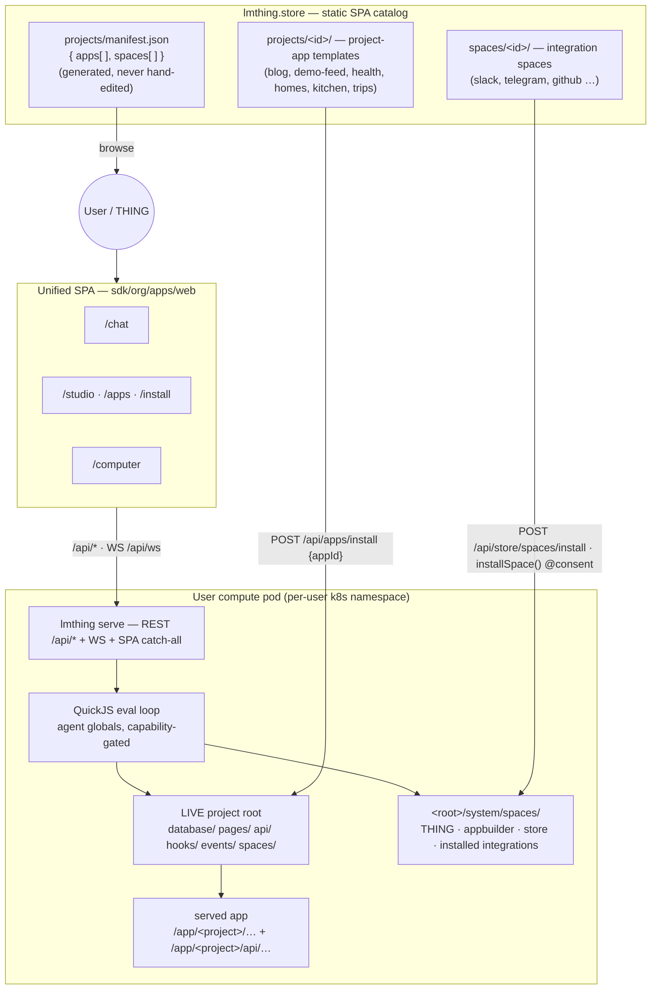

# `org/` — the lmthing documentation hub

The single **grounded** reference for lmthing: what you can author (the on-disk **format** of a project and a space), what agent code can call (**runtime globals**), what the pod exposes (**the CLI and its REST API**), and what the four web surfaces (**chat, studio, computer, app**) do with it.

Every page here is written against real source under `sdk/org/libs/{core,cli}`, `sdk/org/apps/web`, `cloud/gateway` and `store/`, and every behavioural claim carries an inline `path:Lstart-Lend` citation. This is an **index** — open a section for detail.

---

## Sections

| Section | Covers | Grounded in |
|---|---|---|
| **[format/](./format/README.md)** | The two authorable artifact kinds. **[format/project/](./format/project/README.md)** — `database/ api/ pages/ components/ hooks/ events/ spaces/` at the project root. **[format/space/](./format/space/README.md)** — `agents/ functions/ components/ tasklists/ knowledge/ events/`. | `sdk/org/libs/core/src/spaces/load.ts` `loadSpace` · `sdk/org/libs/cli/src/app/loader.ts` `loadProjectApp` |
| **[runtime-globals/](./runtime-globals/README.md)** | Everything an agent's model-authored TypeScript can call inside the QuickJS sandbox — `ask/display/inspect/fork/delegate/tasklist/fetch/apiCall/db.*/emitEvent/installSpace/…` — and the capability gate that decides which globals are injected **and** which appear in the typecheck DTS. | `sdk/org/libs/core/src/exec/bootstrap.ts:L99` `createChildVM` · `sdk/org/libs/core/src/exec/capability.ts` · `sdk/org/libs/core/src/typecheck/library-dts.ts` |
| **[cli-api/](./cli-api/README.md)** | The `lmthing` binary: subcommands (`serve`, `init`), the bare-invocation server, flags, env vars, and the materialized pod root. Plus **[cli-api/rest/](./cli-api/rest/README.md)** — the pod HTTP+WS surface every UI calls. | `sdk/org/libs/cli/src/cli/{args,bin,runtime-init}.ts` · `sdk/org/libs/cli/src/server/serve.ts` |
| **[chat/](./chat/README.md)** | The `/chat` surface (lmthing.chat): THING conversation, live WS trace, attachments, budget, consent cards, the Integrations settings tab. | `sdk/org/apps/web/src/routes/chat/**` · `sdk/org/libs/ui/src/chat/**` |
| **[studio/](./studio/README.md)** | The `/studio` surface (lmthing.studio): project/space IDE — agents, tasklists, knowledge, functions, components — plus the project-app admin tabs and the `/apps` launcher and `/install` routes. | `sdk/org/apps/web/src/routes/studio/**` · `sdk/org/libs/ui/src/studio/**` |
| **[computer/](./computer/README.md)** | The `/computer` surface (lmthing.computer): a browser IDE over the pod filesystem (Monaco + xterm terminals), a runtime dashboard, and settings. | `sdk/org/apps/web/src/routes/computer/**` · `sdk/org/libs/ui/src/computer/**` |
| **[app/](./app/README.md)** | The **served project-application**: boot, page build + serve at `/app/<id>/…`, the worker-isolated Node api runtime, the `@app/runtime` client, and generated `@app/types`. | `sdk/org/libs/cli/src/app/**` |

---

## How these fit together

You author **format** (a project directory, a space directory). The **CLI** (`lmthing serve`, or the bare `lmthing` command) materializes a pod root, loads those directories, and exposes them over its **REST/WS API** while also serving the unified SPA as a catch-all for every non-`/api` request (`sdk/org/libs/cli/src/server/serve.ts:L360-L369`). The three product **surfaces** — chat, studio, computer — are client-side routes of that one SPA, picked from the hostname (`sdk/org/apps/web/src/routes/index.tsx:L5-L23`). Inside a session, the model's TypeScript runs in the QuickJS sandbox and reaches the world only through **runtime globals**, each gated by the agent's `capabilities:` frontmatter (`sdk/org/libs/core/src/exec/bootstrap.ts:L99`). When a project has an app layer, the same pod additionally **serves** it as a real React app with its own Node API (`sdk/org/libs/cli/src/server/serve.ts:L218`, `:L306`).



---

## The three planes, in one paragraph each

**Authoring plane — [format/](./format/README.md).** A *space* is a portable bundle of agents plus their deterministic `functions/`, `knowledge/`, `tasklists/`, UI `components/` and `events/` emitter defs, loaded by `loadSpace` (`sdk/org/libs/core/src/spaces/load.ts`). A *project* is an application: a project-rooted SQLite DB from `database/*.json`, worker-isolated Node handlers in `api/`, client-side React `pages/`, in-proc `hooks/`, and its own project-scoped `spaces/` (`sdk/org/libs/cli/src/app/loader.ts` `loadProjectApp`). Ten system spaces ship with the runtime and are materialized into `<root>/system/spaces/` — `system-global`, `system-engineer`, `system-architect`, `system-research`, `system-appbuilder`, `system-vision`, `system-files`, `system-store`, `user-memory`, `user-thing` (`sdk/org/libs/core/src/spaces/system.ts#SYSTEM_SPACE_NAMES`).

**Execution plane — [runtime-globals/](./runtime-globals/README.md).** Model-authored statements are evaluated one at a time in a QuickJS VM. There is exactly **one** injection site, `createChildVM`, with three callers — the top-level session, a fork leaf, and a delegate (`sdk/org/libs/core/src/exec/bootstrap.ts:L99`; `sdk/org/libs/core/src/session/session.ts:L638`, `sdk/org/libs/core/src/fork/fork.ts:L283`, `sdk/org/libs/core/src/delegate/delegate.ts:L193`). The same `CapabilityProfile` drives both injection and the ambient DTS, so an ungranted capability is neither bound on `globalThis` nor declared — a stray call fails **typecheck**, not runtime (`sdk/org/libs/core/src/exec/capability.ts`; `sdk/org/libs/core/src/typecheck/library-dts.ts`). Thirteen capability ids exist: `db:read`, `db:write`, `db:schema`, `pages:write`, `api:write`, `hooks:write`, `api:call`, `connections:use`, `tools:use`, `project:manage`, `store:read`, `store:install`, `events:emit` (`sdk/org/libs/core/src/spaces/capabilities.ts:L27-L56`). One global is additionally **consent-marked** and cannot run without host-rendered user approval: `installSpace` (`sdk/org/libs/core/src/globals/consent.ts#CONSENT_MARKED_YIELD_KINDS`). Full grant → global table: [runtime-globals/README.md](./runtime-globals/README.md) and [format/space/agents/capabilities.md](./format/space/agents/capabilities.md).

**Serving plane — [cli-api/](./cli-api/README.md) + the surfaces.** `lmthing serve` (and the bare `lmthing` command) starts one HTTP+WS server, default port **8080** (`sdk/org/libs/cli/src/cli/bin.ts:L337`, `:L405`); the binary is `lmthing → ./dist/cli/bin.js` (`sdk/org/libs/cli/package.json:L5-L6`). Its router registers the pod REST surface (`/api/prices`, `/api/budget`, `/api/env`, `/api/sessions`, `/api/projects/*`, `/api/uploads`, `/api/fs/*`, `/api/backup`, `/api/hooks`, `/api/inbound`, `/api/apps`, `/api/store/spaces`, …) at `sdk/org/libs/cli/src/server/serve.ts:L137-L272`, mounts the project-app API and pages at `/app/:projectId/api/*` and `/app/:projectId/*` (`:L218`, `:L306`), and adds clean root mounts `/:projectId/*` **only** when `LMTHING_GATEWAY_URL` is set (`:L322-L325`). Anything unmatched that is not `/api/*` falls through to the built SPA (`:L360-L369`).

---

## Distribution — the store

The store (`store/`) is a static SPA that **browses** templates from a generated index and never installs; install is authenticated and happens on the user's pod.

```
store/
├── projects/
│   ├── <id>/            # a complete project-app template  → org/format/project/
│   └── manifest.json    # GENERATED browse index { apps[], spaces[] } — never hand-edit
└── spaces/
    └── <id>/            # a complete space template        → org/format/space/
```

The generator resolves exactly these two dirs — `APPS_DIR = store/projects`, `SPACES_DIR = store/spaces` — and emits the two-array manifest (`store/scripts/gen-apps-manifest.mjs:L40-L42`, `:L482`). Six project-apps ship today (`blog`, `demo-feed`, `health`, `homes`, `kitchen`, `trips` — `store/projects/manifest.json` `apps[].id`); the integration spaces live under `store/spaces/integration-*`.

Installing is a pod call, two ways:

- **Apps** — `GET /api/apps` lists the public catalog and `POST /api/apps/install { appId, projectId?, force? }` materializes it into the pod, boots the db and builds its pages (`sdk/org/libs/cli/src/server/routes/apps.ts` `handleListApps`, `handleInstallApp`; registered at `sdk/org/libs/cli/src/server/serve.ts:L258-L259`).
- **Spaces** — `POST /api/store/spaces/install { spaceId, projectId?, force? }` (`sdk/org/libs/cli/src/server/routes/store-spaces.ts` `handleInstallStoreSpace`; `serve.ts:L271-L272`), or the agent-facing `installSpace()` global, which is consent-marked and therefore gated on a user-approved consent card before its resolver runs (`sdk/org/libs/core/src/globals/store.ts` `createInstallSpaceGlobal`; `sdk/org/libs/core/src/globals/consent.ts#CONSENT_MARKED_YIELD_KINDS`).

Both install paths apply a pristine-vs-diverged hash guard — an already-installed, locally-edited target answers `{ ok:false, diverged:true }` (HTTP 200) unless `force:true` (`sdk/org/libs/cli/src/server/routes/apps.ts` `handleInstallApp`). Detail: [cli-api/rest/apps.md](./cli-api/rest/apps.md) · [cli-api/rest/store-spaces.md](./cli-api/rest/store-spaces.md) · [runtime-globals/store-and-consent.md](./runtime-globals/store-and-consent.md).

---

## The surfaces, at a glance

All three product surfaces are client-side routes of **one** Vite SPA (`sdk/org/apps/web`), served by the pod as a catch-all; the hostname picks the surface at `/` (`sdk/org/apps/web/src/routes/index.tsx:L5-L23`).

| Host | Route | Surface | Doc |
|---|---|---|---|
| `lmthing.chat` | `/chat` | THING conversation + live trace + integrations config | [chat/](./chat/README.md) |
| `lmthing.studio` | `/studio` | Project/space IDE + project-app admin | [studio/](./studio/README.md) |
| `lmthing.computer` | `/computer` | Pod-filesystem IDE + terminals + runtime dashboard | [computer/](./computer/README.md) |
| `lmthing.app` | `/apps` | Installed-app launcher (`/install` does the installing) | [studio/](./studio/README.md) |
| — | `/app/<project>/…` | The **served project-application** itself (pod, not SPA) | [app/](./app/README.md) |

Unknown hosts (localhost, the `*.test` dev proxy) fall back to `/studio` (`sdk/org/apps/web/src/routes/index.tsx#surfaceForHost`).

---

## Where to start

- **Authoring a space or a project?** → [format/](./format/README.md)
- **Writing the TypeScript an agent runs?** → [runtime-globals/](./runtime-globals/README.md) (and the grant table in [format/space/agents/capabilities.md](./format/space/agents/capabilities.md))
- **Calling the pod / running it locally?** → [cli-api/](./cli-api/README.md) → [cli-api/rest/](./cli-api/rest/README.md)
- **Changing a UI?** → [chat/](./chat/README.md) · [studio/](./studio/README.md) · [computer/](./computer/README.md)
- **Building the app layer (db, api, pages, hooks)?** → [app/](./app/README.md) + [format/project/api/README.md](./format/project/api/README.md) + [format/project/pages/README.md](./format/project/pages/README.md)

For system-wide data flow and deployment topology see [architecture.md](./architecture.md) and [devops/](./devops/README.md).
