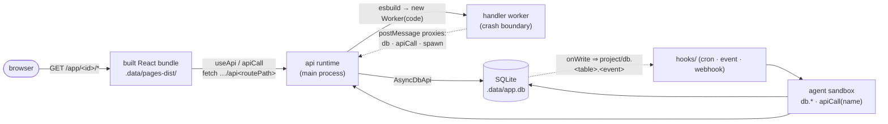

# `app/` — the served project-application

A **project-application** is what a project's on-disk app layer becomes at runtime: a project-rooted SQLite database, a set of worker-isolated Node API handlers, a client-side React bundle, and in-process hooks — all hosted by the *same* pod process that runs the agent sandbox and the REST API. There is no separate app server.

- The **on-disk format** you author (`database/ api/ pages/ components/ hooks/ events/ spaces/`) → [../format/project/README.md](../format/project/README.md).
- **This** section describes what the pod does with those files: how it boots them, builds them, serves them, and what code inside a page or handler may call.

| Page | Covers |
|---|---|
| [routes.md](./routes.md) | The URL surface — `/app/<id>/*`, `/app/<id>/api/*`, the root mount, the admin API |
| [views.md](./views.md) | Pages, the client router, `@app/runtime` hooks, `<Chat>` |
| [features.md](./features.md) | The db, the api runtime, hooks/cron, typed contracts, error handling, CSP |

---

## What is running

Six things are loaded per project, all under `sdk/org/libs/cli/src/app/`:



- **The database** — `database/*.json` schemas are turned into real `CREATE TABLE` statements in `<project>/.data/app.db` by the one `better-sqlite3`-backed store, opened with `PRAGMA journal_mode=WAL` and `PRAGMA foreign_keys=ON` (`sdk/org/libs/cli/src/app/store.ts:L267-L276`, `openProjectDb`). The same handle exposes **two** surfaces: a synchronous `DbApi` for the agent sandbox and a `Promise`-returning `AsyncDbApi` for Node code (`sdk/org/libs/cli/src/app/store.ts:L60-L71`, `ProjectDb`).
- **The api runtime** — endpoints are discovered from the file tree, the handler is transpiled with esbuild and run in a fresh `worker_threads` Worker; its `db`/`apiCall`/`spawn` are `postMessage` proxies serviced by the main process, so *every db write executes main-side* — the worker is a crash boundary, not a data path (`sdk/org/libs/cli/src/app/api/runtime.ts:L1-L21`, `createApiRuntime`).
- **The pages bundle** — `pages/` is esbuild-bundled per project into `<project>/.data/pages-dist/` with hashed assets. The build itself is **never run per request**: it short-circuits on a content hash of `pages/`/`components/`/`lib/`/`package.json` (`sdk/org/libs/cli/src/app/build/pages.ts:L1-L26,L122-L147`, `buildProjectPages`), and the server calls it on boot/install/first-request and then caches the result for its lifetime (see [Boot](#boot)).
- **Generated types** — `database/*.json` + the api handlers' `export interface Input/Output` are compiled into `<project>/types/generated.d.ts`, a git-ignored build artifact (`sdk/org/libs/cli/src/app/build/schema.ts:L341-L359`, `generateAppTypes`).
- **Hooks** — a committed db write fires the store's `onWrite` listener, which the project's hook runtime turns into a synthetic `project/db.<table>.<insert|update|remove>` event whose payload *is* the row (`sdk/org/libs/cli/src/app/hooks/runtime.ts:L46-L48,L124-L136`, `ProjectHookRuntime.onDbWrite`).
- **Project spaces** — `<project>/spaces/*` are ordinary spaces whose agents hold `db:*` capabilities over the same db → [../format/project/README.md](../format/project/README.md#capabilities-gate-who-may-author-and-touch-each-pillar).

A project with **no app layer at all** (only `spaces/` — e.g. the synthetic `system` project) loads to `hasApp: false` and never throws; boot skips it (`sdk/org/libs/cli/src/app/loader.ts:L56-L69`, `loadProjectApp`; `sdk/org/libs/cli/src/app/boot.ts:L50-L53`).

---

## Boot

`bootProjectApp(<root>/<projectId>)` runs three ordered steps and returns the open db, or `null` when there is nothing to boot (`sdk/org/libs/cli/src/app/boot.ts:L50-L90`):

1. **Restore — DR only.** If `.data/app.db` is absent and `.data/app.sql` is present, rebuild from the dump. If `app.db` exists it is never touched — live PVC data is never clobbered (`sdk/org/libs/cli/src/app/boot.ts:L60-L64`).
2. **Open the db** — WAL + foreign keys on (`sdk/org/libs/cli/src/app/boot.ts:L66-L67`).
3. **Reconcile schemas.** `database/*.json` is the *sole source of truth*: a declared table missing live is created; a declared column missing live is added with an **additive** `ALTER TABLE ADD COLUMN`; any **non-additive** divergence — a live column the schema no longer declares (a drop/rename), a primary-key move, or a text↔numeric type conflict — **fails loud** (`sdk/org/libs/cli/src/app/boot.ts:L98-L149`, `reconcileTable`).

The server boots each project's db **lazily and once**, caching the handle — and caching `null` for a spaces-only project so it is not re-probed on every session (`sdk/org/libs/cli/src/server/session-manager.ts:L515-L545`, `getProjectDb`). The api runtime is likewise created lazily and cached, and is **only** created when the project has a db — `getApiRuntime` starts at `rt = null` and only calls `createApiRuntime` inside `if (projectDb)` (`sdk/org/libs/cli/src/server/session-manager.ts:L772-L805`) — so an api-only project with no `database/*.json` has no api runtime, and `createAppApiHandler` 404s every endpoint (`sdk/org/libs/cli/src/server/routes/app-api.ts:L31-L35`).

The page bundle is built lazily on first request and cached for the server's lifetime; a build failure is logged and cached as "no page app" (`sdk/org/libs/cli/src/server/serve.ts:L292-L305`, `getOutDirForProject`).

---

## Serving

Two mounts, registered in this order — the api route **before** the page catch-all, so `…/api/*` never reaches the page server (`sdk/org/libs/cli/src/server/serve.ts:L213-L218,L289-L306`):

| Pattern | Handler | What it serves |
|---|---|---|
| `* /app/:projectId/api/*` | `createAppApiHandler` (`sdk/org/libs/cli/src/server/routes/app-api.ts:L22-L56`) | the project's Node endpoints |
| `* /app/:projectId/*` | `createPageServeHandler` (`sdk/org/libs/cli/src/app/pages-serve.ts:L91-L154`) | the built React bundle |
| `* /:projectId/api/*` · `* /:projectId/*` | the **same** handlers, mount prefix `''` | clean URLs (`lmthing.app/<project>/…`) |

The bare root mount is registered **last** and only when `process.env.LMTHING_GATEWAY_URL` is set — the gateway injects it into every per-user pod, and nothing else does. Locally it is unset, because a bare `/:projectId/*` would shadow every SPA route on the single-serve origin; that is why local apps live at `localhost:8080/app/<project>` (`sdk/org/libs/cli/src/server/serve.ts:L308-L326`).

Full route table (including the reserved admin API) → [routes.md](./routes.md) · pod REST context → [../cli-api/rest/README.md](../cli-api/rest/README.md).

### Serving model: asset-manifest match, then SPA fallback

The page server does **not** probe the filesystem. The build hands it an `assetManifest` — the exact list of files it emitted — and the handler serves a static file only when the sub-path is *in the manifest*; everything else falls back to `index.html` so the client router owns it. That is what lets a dynamic route param containing a dot (`/items/my.v2.id`) route client-side instead of 404-ing as a missing asset (`sdk/org/libs/cli/src/app/pages-serve.ts:L13-L21,L128-L153`). Hashed assets are `immutable`, `index.html` is `no-cache` (`:L139-L147`), and a `..` escape is rejected before the manifest is consulted (`:L119-L126`).

Into the shell's `<head>` the handler injects `<base href="<mountPrefix>/<project>/">` plus a nonce'd `window.__APP_BASE__`, so the identical bundle works on **both** mounts and at any route depth (`sdk/org/libs/cli/src/app/pages-serve.ts:L156-L198`, `serveIndex`).

### CSP

Every served response — assets *and* the SPA shell — carries a strict Content-Security-Policy (`sdk/org/libs/cli/src/app/pages-serve.ts:L44-L46`):

```
default-src 'self'; script-src 'self'; style-src 'self' 'unsafe-inline';
connect-src 'self'; img-src 'self' data: https:; base-uri 'self'; frame-ancestors 'self'
```

The rationale is that LLM-authored pages render third-party content: no inline script means injected markup cannot execute, and `connect-src 'self'` means even a self-XSS can neither exfiltrate nor reach the top-level admin `/api/*` (`sdk/org/libs/cli/src/app/pages-serve.ts:L23-L42`). The `__APP_BASE__` bootstrap runs under a **per-response random nonce**, which is why the shell's CSP is the same policy with `'nonce-…'` added to `script-src` (`:L178-L195`).

---

## The API: dual-addressed

The endpoint route is the **directory**, the HTTP method is the **filename** (`GET.ts`/`POST.ts`/`PUT.ts`/`PATCH.ts`/`DELETE.ts`); `[id]` → `:id`; non-method `.ts` files in a route dir are ignored (`sdk/org/libs/cli/src/app/api/loader.ts:L1-L21,L30-L32`).

```
api/feed-list/GET.ts        → GET    /feed-list      (name "feedList")
api/mark-read/POST.ts       → POST   /mark-read      (name "markRead")
api/items/[id]/GET.ts       → GET    /items/:id      (name "getItem")
api/items/[id]/PATCH.ts     → PATCH  /items/:id      (name "updateItem")
```

Every endpoint must `export const name` — the **stable agent-facing id**, unique per project, fail-loud on a duplicate (`sdk/org/libs/cli/src/app/api/loader.ts:L69-L95`). `name`/`description` are read by a light **static parse**, never by evaluating the module, because evaluating handler code in the main process would breach the crash boundary (`sdk/org/libs/cli/src/app/api/loader.ts:L17-L21,L148-L152`).

Hence one endpoint, two addresses — the browser addresses it by route, the agent addresses it by name into the *same* runtime (`ApiRuntime.handle` vs `ApiRuntime.callByName`, `sdk/org/libs/cli/src/app/api/runtime.ts:L101-L110,L305-L317`). The agent's `apiCall` global → [../runtime-globals/data-db.md](../runtime-globals/data-db.md).

**Input is one object.** Where each field travels is derived from the method, not declared per-field: path params always merge in and win on a key clash; `GET`/`DELETE` take the rest from the query string, `POST`/`PATCH`/`PUT` from the JSON body (`sdk/org/libs/cli/src/app/api/input.ts:L1-L17,L40-L53`). The assembled object is then ajv-validated with `coerceTypes` on, so a query-string `"true"` becomes a boolean (`sdk/org/libs/cli/src/app/api/runtime.ts:L200-L217`).

**One error shape, everywhere.** A handler throws `new HttpError(status, message, details?)` → that status with body `{ error: { status, message, details? } }`; any other throw → a generic `500` (the real message is logged pod-side, never leaked); an ajv mismatch → `400 { error: { status: 400, message: 'invalid input', details } }` (`sdk/org/libs/cli/src/app/api/errors.ts:L1-L16,L94-L111`). Because handlers run in a worker, an `HttpError` is serialized across the thread boundary and reconstructed main-side — `postMessage` structured-clone drops the prototype (`sdk/org/libs/cli/src/app/api/errors.ts:L63-L83`). The browser client throws the *same* shape (`sdk/org/libs/cli/src/app/runtime/client.ts:L40-L56`).

---

## `@app/runtime` — what page code may import

`@app/runtime` is not an npm package: the page build **aliases** it to this module's source (`sdk/org/libs/cli/src/app/build/pages.ts:L472-L473`, `resolveEnv`), and `@app/types` to the project's generated `types/generated.d.ts` (`:L249-L250`); both are fed to esbuild as `alias` (`:L270`). Its full surface (`sdk/org/libs/cli/src/app/runtime/index.ts:L13-L35`):

| Export | Purpose |
|---|---|
| `useApi(name, input?)` · `useApiMutation(name, {invalidates})` · `apiCall(name, input?)` | typed data access by endpoint **name** |
| `HttpError` | the shared error type |
| `useParams` · `Link` · `navigate` | the tiny file-based client router |
| `Chat` | a page-droppable `<Chat agent="space/agent" />` |
| `mountApp` · `AppRoot` · `matchRoutes` · `resolveAppBase` · `buildRequest` | used by the **generated** entry, not by page authors |

The name→route bridge is `window.__APP_ENDPOINTS__`: the build projects the endpoint contracts down to a `name → { method, routePath }` manifest (`sdk/org/libs/cli/src/app/build/pages.ts:L203-L208,L221`) and bakes it into the generated entry's `mountApp({ manifest, … })` call (`:L335-L336`), `mountApp` assigns it to the global (`sdk/org/libs/cli/src/app/runtime/router.tsx:L217-L218`), and `apiCall` reads it (`sdk/org/libs/cli/src/app/runtime/client.ts:L1-L22,L58-L63`). Detail → [views.md](./views.md).

---

## Typed contracts: one source, four consumers

TS types + JSDoc in `database/*.json` and the api handlers are the single source of truth. `generateProjectContracts` derives all four in one pass (`sdk/org/libs/cli/src/app/build/contracts.ts:L23-L34`); because it is heavy (`ts-json-schema-generator`), the server runs it **once per project** and caches the bundle — including `null` for a project with no `api/` dir (`sdk/org/libs/cli/src/server/session-manager.ts:L826-L843`, `getProjectContracts`):

| Consumer | Artifact |
|---|---|
| the api runtime | ajv `validators` (method-aware request validation) |
| the agent sandbox | `apiCallDts` — string-literal `apiCall` overloads (a wrong endpoint name or input type is a **typecheck** error, not a runtime one) |
| pages | `generatedDts` → `types/generated.d.ts` (row types + `<Name>Input`/`<Name>Output`) |
| the browser client | the `name → { method, routePath }` endpoint manifest |

A live authoring write (`writeProjectApi` / `writeProjectPage`) invalidates the cached contracts *and* disposes the project's api runtime, so the next call re-derives from the new files; page **compilation** is deliberately not done on write — the caller POSTs a rebuild (`sdk/org/libs/cli/src/server/session-manager.ts:L648-L666`, `onAppWrite`). The authoring globals → [../runtime-globals/app-authoring.md](../runtime-globals/app-authoring.md).

> The builder has its own cache-busting knob: the page build's content hash covers only the *project's* files, so a change to `@app/runtime` itself needs `BUILDER_VERSION` bumped or already-built pods keep serving the old bundle (`sdk/org/libs/cli/src/app/build/pages.ts:L76-L89`).

---

## Admin, install, and the boundary

- **Studio's admin surface** lives under the reserved `/api/projects/:projectId/app/*` — manifest, data browser, path-scoped file editor, build status/rebuild (`sdk/org/libs/cli/src/server/serve.ts:L238-L246`). The file editor is scoped: only `database|pages|api|hooks|components|lib` plus `package.json`/`tsconfig.json`, and `.data/`+`types/` are blocked (`sdk/org/libs/cli/src/server/routes/app-admin.ts:L60-L101`). Endpoints → [../cli-api/rest/projects.md](../cli-api/rest/projects.md).
- **Store install** — `POST /api/apps/install` materializes `store/projects/<id>/` into `<root>/<projectId>/`, boots the db, generates contracts, force-builds pages, and drops the cached page build (a stale asset manifest would 404 the freshly-hashed assets → a blank app) (`sdk/org/libs/cli/src/server/serve.ts:L253-L265`; `sdk/org/libs/cli/src/server/routes/apps.ts` `handleInstallApp`). Six apps ship today — `blog`, `demo-feed`, `health`, `homes`, `kitchen`, `trips` (`store/projects/manifest.json`). Endpoints → [../cli-api/rest/apps.md](../cli-api/rest/apps.md).
- **Security boundary = the pod, not the app.** Worker isolation of api handlers is a *crash* boundary (`sdk/org/libs/cli/src/app/api/runtime.ts:L6-L12`), never an auth boundary. A project-app is **single-user and carries no auth of its own**: the pod's HTTP server has no auth middleware at all — `createServer` hands every request straight to the `Router`, which matches on method + path only and has no token/JWT/session concept (`sdk/org/libs/cli/src/server/serve.ts:L343-L369`; `sdk/org/libs/cli/src/server/router.ts:L61-L82`), and neither `createAppApiHandler` nor `createPageServeHandler` reads an `Authorization` header or cookie.

  The *only* auth is the **platform picking which pod a request reaches**, and it lives at the Envoy edge, not in this codebase's app layer: the `app-jwt` `SecurityPolicy` validates the gateway-issued HS256 JWT — taken from the `Authorization: Bearer` header, an `access_token` query param, **or** an `access_token` cookie (page navigations and their `<script>`/`<link>` sub-requests cannot set a header) — and projects its `sub` claim into `x-user-id` (`devops/argocd/envoy/app-policies.yaml:L154-L194`). The `app-lua-routing` Lua filter then 401s a request with no `x-user-id` and rewrites the upstream to that user's pod, `lmthing.user-<id>.svc.cluster.local:8080` (`devops/argocd/envoy/app-policies.yaml:L35-L66`). Locally there is no gateway and no auth at all.

---

## Related

- On-disk format of everything above → [../format/project/README.md](../format/project/README.md)
- The URL surface in full → [routes.md](./routes.md) · pages & client runtime → [views.md](./views.md) · db/hooks/contracts detail → [features.md](./features.md)
- Pod REST API → [../cli-api/rest/README.md](../cli-api/rest/README.md)
- Agent-side `db.*` / `apiCall` → [../runtime-globals/data-db.md](../runtime-globals/data-db.md) · authoring globals → [../runtime-globals/app-authoring.md](../runtime-globals/app-authoring.md)
