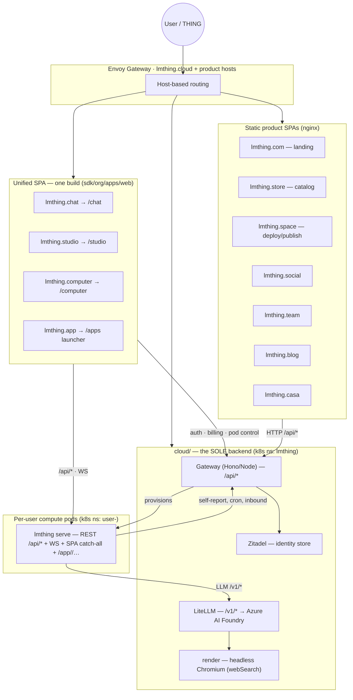

# System architecture

The bird's-eye view of lmthing: the domains, the code that serves each one, the single backend behind all of them, and how a request flows end to end. Every claim here is grounded in source.

For the doc hub and the authoring/runtime/serving planes, start at [README.md](./README.md). Deeper sections: the backend → [cloud/README.md](./cloud/README.md); the runtime → [runtime/README.md](./runtime/README.md); the static product apps → [product-spas/README.md](./product-spas/README.md); infra & deploy → [devops/README.md](./devops/README.md).

---

## The shape of the system, in one paragraph

lmthing is a fleet of **static single-page apps** plus **one shared backend** plus **one runtime per user**. Seven product SPAs (`com/ social/ team/ store/ space/ blog/ casa/`) and one *unified* SPA (`sdk/org/apps/web/`, which is the chat + studio + computer surfaces in a single build) are all React 19 / Vite / TanStack Router / Tailwind 4 bundles served by nginx (e.g. `com/package.json`, `store/package.json` — `react ^19`, `vite ^8`, `@tanstack/react-router`, `tailwindcss ^4`). None of them hold server code. Everything server-side — auth, billing, LLM proxying, compute-pod control, backups, inbound webhooks — lives in `cloud/`, a Hono/Node **Gateway** plus an upstream **LiteLLM** proxy on Kubernetes (`cloud/gateway/src/index.ts:28-38`). Each logged-in user gets a private, single-tenant **compute pod** (`@lmthing/cli`, image `compute:latest`) that the gateway provisions into a `user-<id>` namespace (`cloud/gateway/src/lib/compute.ts:543` `createUserPod`); that pod is where the THING agent's model-authored TypeScript actually runs, in a QuickJS WASM sandbox, and it also serves the unified SPA and any installed project-app.

---

## Domain map

Each `lmthing.*` domain is served by exactly one nginx image. The chat/studio/computer trio is **the same build** — one unified SPA that picks its surface from the request hostname — deployed as three separate images; every other domain is its own SPA.



| Domain | Served by | What it is |
|---|---|---|
| **lmthing.chat** | unified SPA `/chat` | THING conversation + live WS trace + integrations config (`sdk/org/apps/web/src/routes/chat/**`) → [chat/](./chat/README.md) |
| **lmthing.studio** | unified SPA `/studio` | Project/space IDE + project-app admin (`sdk/org/apps/web/src/routes/studio/**`) → [studio/](./studio/README.md) |
| **lmthing.computer** | unified SPA `/computer` | Pod-filesystem IDE + terminals + runtime dashboard (`sdk/org/apps/web/src/routes/computer/**`) → [computer/](./computer/README.md) |
| **lmthing.app** | unified SPA `/apps` | Installed project-app launcher (`sdk/org/apps/web/src/routes/index.tsx:9`) → [app/](./app/README.md) |
| **lmthing.com** | `com/` SPA | Commercial landing / marketing → [product-spas/README.md](./product-spas/README.md) |
| **lmthing.store** | `store/` SPA | Catalog of project-app templates + integration spaces → [product-spas/README.md](./product-spas/README.md) |
| **lmthing.space** | `space/` SPA | Space deploy / agent publish surface → [product-spas/README.md](./product-spas/README.md) |
| **lmthing.social** | `social/` SPA | Public agent surface → [product-spas/README.md](./product-spas/README.md) |
| **lmthing.team** | `team/` SPA | Private agent-collaboration surface → [product-spas/README.md](./product-spas/README.md) |
| **lmthing.blog** | `blog/` SPA | Personalized AI-news surface → [product-spas/README.md](./product-spas/README.md) |
| **lmthing.casa** | `casa/` SPA | Home Assistant surface → [product-spas/README.md](./product-spas/README.md) |
| **lmthing.cloud** | `cloud/` gateway + litellm | The backend (below) → [cloud/README.md](./cloud/README.md) |
| **auth.lmthing.cloud** | Zitadel | Identity store only (`org/cloud/auth.md`) |

> The hostname → surface mapping is client-side: `surfaceForHost()` maps `lmthing.chat|studio|computer|app` to `/chat|/studio|/computer|/apps` and falls back to `/studio` for any unknown host (localhost, the `*.test` dev proxy) — `sdk/org/apps/web/src/routes/index.tsx:5-23`.

---

## The backend — `cloud/` is the only one

There is **no other server** in the monorepo. `cloud/` is two processes on Kubernetes plus supporting services, all in the `lmthing` namespace:

- **Gateway** (`cloud/gateway/`, **Hono on Node 24**, port 3000 — `cloud/gateway/package.json:12-13`, `cloud/gateway/Dockerfile:1`) mounts nine route modules under `/api/*`: `auth`, `keys`, `billing`, `stripe/webhook`, `compute`, `backup`, `inbound`, `status`, `issues` (`cloud/gateway/src/index.ts:28-38`). It is the token issuer, the Stripe integration, the LiteLLM key manager, and the compute-pod controller.
- **LiteLLM** (upstream image) proxies `/v1/*` OpenAI-compatible traffic to Azure AI Foundry and enforces per-user spend caps.
- **render** — an in-cluster headless-Chromium service backing agent `webSearch`/`webFetch`.
- **Zitadel** — the identity store (user records, password verification, GitHub IDP); it never mints the tokens clients carry.

Both static SPAs and every compute pod talk to the gateway over HTTP; pods additionally call LiteLLM for LLM traffic and call back to the gateway to self-report idle state, register cron manifests, and receive inbound webhooks (`cloud/gateway/src/routes/compute.ts`, `.../inbound.ts`). Full route table, auth model, billing/tiers, LiteLLM and render detail: [cloud/README.md](./cloud/README.md) and its siblings (`org/cloud/routes.md`, `auth.md`, `billing-and-tiers.md`, `litellm.md`, `render.md`).

### Tiers and money (summary)

The tier table is defined once in `cloud/gateway/src/lib/tiers.ts` and consumed by the billing routes, the K8s pod spec, and LiteLLM. A Stripe subscription buys a *tier*; the tier's rolling-window spend caps are enforced by LiteLLM on the user's key (`org/cloud/billing-and-tiers.md`). LLM cost carries a token markup and every tier shares one model allowlist (`TIER_MODELS`). The current, code-true tiers (free, pro at $20/mo, and the others) differ mainly by **pod sizing, budget windows, and cron policy** — the exact numbers live in `cloud/gateway/src/lib/tiers.ts:L88-L163`. Author against that code table via [cloud/billing-and-tiers.md](./cloud/billing-and-tiers.md).

---

## The per-user compute pod

Every logged-in user gets a single-tenant runtime — **not** a shared backend. The gateway provisions it into a dedicated `user-<id>` namespace on first use:

- `createUserPod(userId, pod)` creates the namespace, an image-pull secret, a **1Gi** PersistentVolumeClaim, a `user-env` secret, a Deployment named `lmthing`, and a Service (`cloud/gateway/src/lib/compute.ts:543-660`). Default pod size is `500m` CPU / `1Gi` memory (`cloud/gateway/src/lib/compute.ts:182-183`, sized per tier).
- `ensureUserPod(userId, pod)` is the idempotent entry point: it creates everything on first use, else scales/updates the existing Deployment (`cloud/gateway/src/lib/compute.ts:678-691`).
- The image is `lmthingacr.azurecr.io/compute:latest` (`cloud/gateway/src/lib/compute.ts:53,69`), a build of `@lmthing/cli`.

Inside the pod, `lmthing serve` (the bare `lmthing` command) runs one HTTP+WS server that:

1. exposes the pod REST/WS surface at `/api/*` (`sdk/org/libs/cli/src/server/serve.ts:L137-L272`) → [cli-api/rest/](./cli-api/rest/README.md),
2. serves the **LIVE project** application at `/app/<project>/…` and its Node API at `/app/<project>/api/…` (`serve.ts:L218,L306`) → [app/](./app/README.md),
3. and falls back to the built unified SPA for any non-`/api` request (`serve.ts:L360-L369`).

The pod authenticates back to the gateway with a narrowly-scoped, long-lived **compute** JWT (`aud:"compute"`, 365d — `cloud/gateway/src/lib/tokens.ts`, `org/cloud/auth.md`). What actually executes there — the QuickJS eval loop, capability-gated globals, fork/delegate/tasklist orchestration — is the runtime plane: [runtime/README.md](./runtime/README.md).

---

## The store — distribution

`store/` is a static SPA that **browses** a generated catalog and never installs; installation is an authenticated call on the user's own pod.

```
store/
├── projects/
│   ├── <id>/            # a complete project-app template  → org/format/project/
│   └── manifest.json    # GENERATED { apps[], spaces[] } — never hand-edit
└── spaces/
    └── integration-<id>/  # a complete space template      → org/format/space/
```

**Six** project-apps ship today — `blog`, `demo-feed`, `health`, `homes`, `kitchen`, `trips` (dirs under `store/projects/`; `apps[].id` in `store/projects/manifest.json`). Thirteen integration spaces ship — `integration-{demo,discord,github,google,line,lmthing,mattermost,nextcloud-talk,slack,sms,synology-chat,telegram,whatsapp}` (`store/spaces/`).

Two install paths, both on the pod:

- **Apps** — `GET /api/apps` lists the catalog, `POST /api/apps/install { appId, projectId?, force? }` materializes an app, boots its DB, and builds its pages (`sdk/org/libs/cli/src/server/routes/apps.ts`; registered `serve.ts:L258-L259`).
- **Spaces** — `POST /api/store/spaces/install { spaceId, projectId?, force? }` (`sdk/org/libs/cli/src/server/routes/store-spaces.ts`; `serve.ts:L271-L272`), or the agent-facing consent-gated `installSpace()` global (`sdk/org/libs/core/src/globals/store.ts`; consent-marked at `sdk/org/libs/core/src/globals/consent.ts:L54`).

Both apply a pristine-vs-diverged hash guard: an already-installed, locally-edited target answers `{ ok:false, diverged:true }` (HTTP 200) unless `force:true`. Detail: [cli-api/rest/](./cli-api/rest/README.md), [runtime-globals/](./runtime-globals/README.md).

---

## End-to-end data flow

A THING conversation from keystroke to model output and back:

```mermaid
sequenceDiagram
    participant U as User (lmthing.chat)
    participant SPA as Unified SPA
    participant GW as Gateway (/api/*)
    participant POD as Compute pod (lmthing serve)
    participant RT as QuickJS sandbox
    participant LL as LiteLLM (/v1/*)

    U->>GW: login → HS256 access JWT (Zitadel verifies identity)
    U->>GW: POST /api/compute/ensure
    GW->>POD: provision user-<id> pod (createUserPod / scale)
    U->>SPA: type a message
    SPA->>POD: POST /api/sessions + WS /api/ws (trace)
    POD->>RT: run turn loop (inject capability-gated globals)
    RT->>LL: chat completion /v1/* (compute JWT-issued LiteLLM key)
    LL-->>RT: streamed TS statements
    RT->>RT: eval one statement at a time; yields (ask/fork/db/…)
    RT-->>POD: display / ask / tasklist events
    POD-->>SPA: WS trace + results
    SPA-->>U: rendered conversation
```

Notes grounding each hop:

- **Auth** — the SPA obtains a gateway-signed HS256 access JWT (`cloud/gateway/src/routes/auth.ts`, `cloud/gateway/src/lib/tokens.ts`); Zitadel only verified the identity. → [cloud/auth.md](./cloud/auth.md)
- **Pod control** — `POST /api/compute/ensure` provisions or wakes the pod (`cloud/gateway/src/routes/compute.ts`, `.../lib/compute.ts`).
- **Session** — the SPA drives the pod's REST/WS session surface (`sdk/org/libs/cli/src/server/serve.ts:L137-L272`). → [cli-api/rest/](./cli-api/rest/README.md)
- **Runtime** — the model streams TypeScript that the pod evaluates one statement at a time in a QuickJS VM; value-yielding globals (`ask`, `fork`, `delegate`, `db.*`, `tasklist`, …) abort the stream and resume next turn. There is exactly one injection site, `createChildVM` (`sdk/org/libs/core/src/exec/bootstrap.ts:L99`). → [runtime/README.md](./runtime/README.md)
- **LLM** — outbound completions go to LiteLLM (`/v1/*`), which enforces the tier's spend cap on the user's key. → [cloud/litellm.md](./cloud/litellm.md)

Two other flows worth naming:

- **Inbound webhooks** — a public per-user broker `POST|GET /api/inbound/:userToken/:path` on the gateway forwards to the pod's dispatcher (`cloud/gateway/src/routes/inbound.ts:51-165`); the pod turns it into an event on the unified event pipeline (`emitEvent` + event hooks).
- **Backup** — the pod's PVC workspace can be pushed to a user-authorized GitHub App repo; the gateway mints a 365d backup token and holds the install config (`cloud/gateway/src/routes/backup.ts`). This is optional persistence, not the primary store.

---

## Where the code lives (monorepo)

The repo is organized by TLD — one top-level directory per `lmthing.*` surface — plus the `sdk/org` submodule that holds the runtime and the unified SPA, and `cloud/` for the backend.

```
lmthing/
├── sdk/org/                # submodule: runtime + unified SPA + shared libs
│   ├── libs/{core,cli,state,css,ui,auth,utils,config,openclaw-compat}   # @lmthing/*
│   ├── apps/web/           # the unified SPA (/studio /computer /chat /apps)
│   └── common/
├── cloud/                  # THE backend — gateway/ (Hono/Node) + litellm/render/zitadel k8s config
├── store/                  # catalog SPA + projects/ + spaces/ templates + manifest generator
├── com/ social/ team/ space/ blog/ casa/   # static product SPAs (React 19 / Vite / Tailwind 4)
├── devops/                 # ArgoCD, Terraform, Ansible, Envoy, k8s manifests
├── org/                    # THIS doc hub
├── pnpm-workspace.yaml · package.json
```

- **Runtime + shared libs** are inside the `sdk/org` submodule (`sdk/org/libs/`), so the pod Docker image (context = `sdk/org`) builds the apps self-contained (`sdk/org/CLAUDE.md`). There are exactly **nine** packages — `auth cli config core css openclaw-compat state ui utils` (`sdk/org/libs/`); there is no `@lmthing/spaces` package. → [libs/README.md](./libs/README.md)
- **`@lmthing/core`** never imports from `cli` or `ui`; it emits events and accepts a `RenderHost` interface (`sdk/org/CLAUDE.md`).
- Deploy topology, ArgoCD/GitOps, Envoy routing, and the cluster namespace map are in [devops/README.md](./devops/README.md).

---

## Related reading

- Backend detail (routes, auth, billing, LiteLLM, render) → [cloud/README.md](./cloud/README.md)
- The runtime — turn loop, typecheck, fork/tasklists, delegation, sessions → [runtime/README.md](./runtime/README.md)
- The static product SPAs → [product-spas/README.md](./product-spas/README.md)
- Infrastructure & deployment → [devops/README.md](./devops/README.md)
- The pod CLI + REST/WS API → [cli-api/README.md](./cli-api/README.md)
- Authoring format (project + space) → [format/README.md](./format/README.md)
- The served project-application → [app/README.md](./app/README.md)
