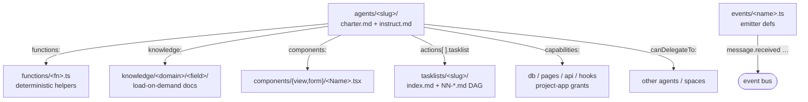

# `space/` — space format

A **space** is a directory bundle of AI specialists (**agents**) plus the tooling they reference; `loadSpace(dir)` reads it into a `Space` record of `{agents, tasklists, functions, components, knowledge}` (and `dependentSpaces`) `sdk/org/libs/core/src/spaces/load.ts:583-721`. A space must have an `agents/` directory with at least one agent subdirectory, unless the caller passes `requireAgents:false` (function-only system spaces) `sdk/org/libs/core/src/spaces/load.ts:586-603`. Each agent is a persona plus deterministic `functions/`, load-on-demand `knowledge/`, DAG `tasklists/`, agent-rendered `components/`, and typed `events/` emitter defs — all resolved by name against the sibling directories of the same space `sdk/org/libs/core/src/spaces/load.ts:652-719`.

## Where spaces live

Spaces resolve from a project directory's `spaces/` subdirectory: for any project the session-manager scans `<root>/<projectId>/spaces/` `sdk/org/libs/cli/src/server/session-manager.ts:1067`. Two roots are materialized on pod boot: **system** spaces (the shipped `thing`/architect/engineer/appbuilder set) are copied into `<root>/system/spaces/<name>/` `sdk/org/libs/cli/src/cli/runtime-init.ts:90-104`, and the default **user** project skeleton creates `<root>/user/spaces/` `sdk/org/libs/cli/src/cli/runtime-init.ts:112-114`. A space can also be **nested inside a project** — e.g. `store/projects/blog/spaces/newsroom/` ships with the `blog` app `store/projects/blog/spaces/newsroom/agents/researcher/instruct.md`. Spaces are **distributed through the store catalog** under `store/spaces/`, today mostly integrations (e.g. `store/spaces/integration-slack/`) `store/spaces/integration-slack/package.json:1-5`.

> UNVERIFIED: an earlier draft listed a third `my` space root (`.lmthing/{system,user,my}/spaces/`). Searched `sdk/org` and the repo for `my/spaces`, a `'my'` root join, and runtime-init — only `system` and `user` roots are materialized (`runtime-init.ts:90,113`), plus per-project `<project>/spaces/`. No `my` root found; removed.

## Directory layout

```
<space>/
├── package.json            # store spaces only: the `lmthing` manifest block               → package.json.md
├── README.md               # human docs (not read by the loader)
├── agents/                 # the AI specialists (required unless requireAgents:false)       → agents/
│   └── <agent-slug>/
│       ├── charter.md      # fork-safe identity/guardrails (body only, no frontmatter)
│       └── instruct.md     # YAML frontmatter (config) + operating-instructions body
├── functions/              # deterministic TS helpers callable by agents (no LLM)           → functions/
│   └── <fnName>.ts
├── components/             # agent-rendered UI                                              → components/
│   ├── view/<Name>.tsx     # display components (used with display())
│   └── form/<Name>.tsx     # interactive inputs (used with ask())
├── tasklists/              # DAG workflows an action runs                                    → tasklists/
│   └── <tasklist-slug>/
│       ├── index.md        # frontmatter (input, connections) + overview body
│       └── NN-<task-id>.md # numbered steps, sorted lexically (NN-<id>.ts = code node)
├── knowledge/              # structured, load-on-demand domain docs                          → knowledge/
│   └── <domain>/<field>/
│       ├── index.md        # frontmatter (type, variable, default, description) + overview
│       └── <aspect>.md     # one aspect each (every .md except index.md)
├── events/                 # typed emitter defs — makes the space an EVENT SOURCE           → events/
│   └── <name>.ts
└── hooks/                  # (optional) event-hook consumers, {type:'event'}                → hooks/
    └── <slug>.ts
```

Not every directory is required. The `agents/` walk skips non-directory entries and each other loader returns empty when its directory is absent, so a space can omit any of `functions/`, `components/`, `knowledge/`, `tasklists/` `sdk/org/libs/core/src/spaces/load.ts:173,213-215,259-261,359`. For example the Slack integration ships `agents/ functions/ events/ knowledge/` with **no** `tasklists/` or `components/` `store/spaces/integration-slack/package.json:1-3`, while the `newsroom` space ships `agents/ functions/ components/ tasklists/ knowledge/` with **no** `events/` `store/projects/blog/spaces/newsroom/agents/researcher/instruct.md:1-2`. `package.json` is read only for its `name` and dependency list (npm install runs only when deps are declared) `sdk/org/libs/core/src/spaces/load.ts:606-650`; its `lmthing` manifest block is used by the store, and project-nested spaces like `newsroom` have no `package.json` at all `store/spaces/integration-slack/package.json:4-19`.

**A model does not write these files directly** — there is no generic filesystem on any agent's surface. A space's files are authored through the **architect's typed builder functions**, which are space-rooted through `resolveSpaceDir` and typecheck the source before writing: `writeAgentFile`/`writeFunctionFile`/`writeComponentFile`/`writeTaskFile`/`writeKnowledgeIndex`/`writeKnowledgeOption` for the respective dirs, plus `writeEventFile` for `events/<name>.ts`, `writeHookFile` for `hooks/<slug>.ts`, and `writeManifest` for `package.json`; existing space files are read back with `readSpaceFile`/`listSpaceDir` `sdk/org/libs/core/system-spaces/system-architect/agents/architect/instruct.md:5-18` · `sdk/org/libs/core/system-spaces/system-architect/functions/writeEventFile.ts:16-40`.

## How an agent wires up



An agent's `instruct.md` frontmatter names its tooling, and every key is checked against a fail-loud allow-list (`title, knowledge, functions, components, actions, defaultAction, canDelegateTo, dependencies, capabilities, model, triggers`) so a typo throws rather than silently granting nothing `sdk/org/libs/core/src/spaces/load.ts:413-425,461-466`. `loadSpace` then validates each reference against the sibling directory, verifying **every edge** in the diagram above:

- **`functions:`** — each name must exist in `functions/`, else a load-time throw `sdk/org/libs/core/src/spaces/load.ts:684-691`; the source is loaded by `loadFunctionsFromDir` from `functions/*.ts` `sdk/org/libs/core/src/spaces/load.ts:168-206`.
- **`knowledge:`** — a `<domain>/<field>[/<option>]` ref is split and each segment must resolve in the `knowledge/` tree `sdk/org/libs/core/src/spaces/load.ts:699-718`; the tree is `knowledge/<domain>/<field>/` where `index.md` frontmatter carries `type/variable/default/description` and every other `.md` is an aspect option `sdk/org/libs/core/src/spaces/load.ts:255-328`.
- **`components:`** — each name must exist in `components/view` or `components/form`, else a throw `sdk/org/libs/core/src/spaces/load.ts:692-698`; both directories are read one `<Name>.tsx` per component `sdk/org/libs/core/src/spaces/load.ts:208-253`.
- **`actions[].tasklist`** — each action's `tasklist` must name a loaded tasklist directory, else a throw `sdk/org/libs/core/src/spaces/load.ts:662-670`; tasklists are `tasklists/<slug>/` with an `index.md` header plus lexically-sorted `NN-<id>.md` step files `sdk/org/libs/core/src/spaces/load.ts:355-404`.
- **`capabilities:`** — parsed into the project-app grant set (`db:*`/`pages:write`/`api:write`/`hooks:write`/…) by `parseCapabilities` `sdk/org/libs/core/src/spaces/load.ts:468` · `sdk/org/libs/core/src/spaces/capabilities.ts` `parseCapabilities`.
- **`canDelegateTo:`** — the delegation allowlist (falls back to the deprecated `dependencies` key) `sdk/org/libs/core/src/spaces/load.ts:477-481`.
- **`events/*.ts`** — a default-exported typed `EmitterDef` (`webhook`/`cron`/`db`/`internal`) that makes the space an **event source** on the bus `sdk/org/libs/core/src/spaces/emitter-def.ts` `EmitterDef`; e.g. the Slack space's `events/messages.ts` emits a normalized `message.received` from Slack's verified `event_callback` `store/spaces/integration-slack/events/messages.ts:1-20`.

`charter.md` and `instruct.md` are the two agent files: the charter is read body-only (no frontmatter required) `sdk/org/libs/core/src/spaces/load.ts:548-553`, and the system prompt renders the charter (`# Agent`) before the instructions (`# Agent Instructions`), then the actions list `sdk/org/libs/core/src/context/system-block.ts:229-242`.

### A real agent's frontmatter (adapted)

Every reference below points at a sibling directory of the `newsroom` space `store/projects/blog/spaces/newsroom/agents/researcher/instruct.md:1-16`:

```yaml
title: Researcher
defaultAction: deep-dive
actions:
  - id: deep-dive
    label: Deep dive
    description: Produce a grounded deep-dive research report.
    tasklist: deep-dive              # → tasklists/deep-dive/
knowledge:
  - journalism/deep-dive-method      # → knowledge/journalism/deep-dive-method/
components:
  - ResearchPreview                  # → components/view/ResearchPreview.tsx
capabilities:
  - db:read:  { tables: [articles, citations, research] }
  - db:write: { tables: [research] }
```

## Per-file-kind docs

| File | Doc |
|---|---|
| `package.json` (`lmthing` block) | [package.json.md](./package.json.md) |
| `agents/<slug>/charter.md` + `instruct.md` | [agents/](./agents/README.md) |
| `functions/<fn>.ts` | [functions/](./functions/README.md) |
| `components/{view,form}/<Name>.tsx` | [components/](./components/README.md) |
| `tasklists/<slug>/index.md` + `NN-<id>.md` | [tasklists/](./tasklists/README.md) |
| `knowledge/<domain>/<field>/index.md` + `<aspect>.md` | [knowledge/](./knowledge/README.md) |
| `events/<name>.ts` | [events/](./events/README.md) |
| `hooks/<slug>.ts` (event consumers) | [hooks/](./hooks/README.md) |

The `events/`/`hooks/` pair is the same unified event pipeline used by projects — see the project side at [../project/events/](../project/events/README.md) and [../project/hooks/](../project/hooks/README.md).
