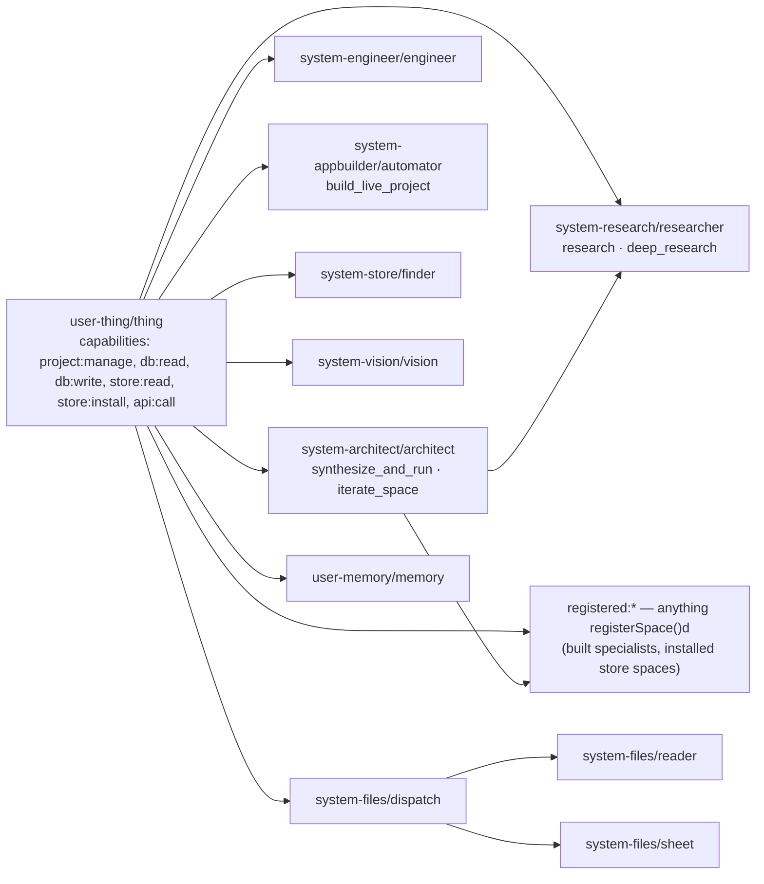

# `system-spaces/` — the shipped system spaces

The **ten** spaces that ship inside `@lmthing/core` and are loaded into **every** session, fork and delegate. They are what makes an empty project already able to think: THING orchestrates, the architect builds new agents, the appbuilder builds apps, the researcher searches, the engineer codes, and a universal function toolkit (`webSearch`/`remember`/`todoWrite`/…) is in scope everywhere.

They live at `sdk/org/libs/core/system-spaces/<name>/` — **not** under `src/`; they are read from disk at runtime, so editing an `.md` or a builder `.ts` needs no rebuild of `@lmthing/core` (`sdk/org/libs/core/src/spaces/system.ts:L50-L58` resolves the dir relative to the built/`src` layout).

- The **on-disk format** of any space (agents, tasklists, knowledge, functions, components, events) → [`../format/space/README.md`](../format/space/README.md). This page does not restate it.
- The **loader** that turns a directory into a `Space` → [`../runtime/spaces-loading.md`](../runtime/spaces-loading.md).
- The **globals** these agents call → [`../runtime-globals/README.md`](../runtime-globals/README.md).
- **Adding/changing** a space → [`../contributing/add-a-space.md`](../contributing/add-a-space.md).

---

## 1. What a system space IS

A system space is an ordinary space directory — same format, same loader — with four differences, all implemented in `sdk/org/libs/core/src/spaces/system.ts`:

| | System space | User / project space |
|---|---|---|
| **Where it comes from** | shipped in `@lmthing/core`, listed by name in `SYSTEM_SPACE_NAMES` (`sdk/org/libs/core/src/spaces/system.ts#SYSTEM_SPACE_NAMES`), materialized onto the pod at `<root>/system/spaces/<name>/` (`sdk/org/libs/cli/src/cli/runtime-init.ts#materializeRuntime`) | authored by the user (or installed from the store) under `<root>/<projectId>/spaces/<id>/` (`sdk/org/libs/cli/src/server/projects.ts:L147-L151`) |
| **When it loads** | **always** — `loadSystemSpaces(dirs)` runs on every session start and the result is merged into the user space by `mergeSystemInto` (`sdk/org/libs/core/src/session/session.ts#Session.loadMergedSpace`) | only when it is the session's space, or pre-loaded/registered for `delegate()` |
| **Agent reachability** | every system agent is **universally delegatable** — the session seeds the delegate registry with every system space, keyed by dir and package name (`sdk/org/libs/core/src/session/session.ts:L930-L933`), and the same map is handed down the delegation chain (`sdk/org/libs/core/src/session/session.ts:L687-L707`) | reachable only from the current space, its npm-dependent spaces, or via `registerSpace()` (`registered:*`) |
| **Function reachability** | **only `system-global`'s functions are universal** (`GLOBAL_SPACE_NAME`, `sdk/org/libs/core/src/spaces/system.ts#GLOBAL_SPACE_NAME`; `systemFunctionNames`/`systemFunctionSources` skip every non-global space, `:L78-L95`). Every other system space's functions are **scoped to its own agents** via that agent's `functions:` frontmatter (`getAgentFunctions`, `sdk/org/libs/core/src/delegate/delegate.ts:L180-L184`) | scoped to the space's own agents, always |

Two more rules that only matter here:

- **Function-only spaces are legal.** `loadSystemSpaces` calls `loadSpace(dir, { requireAgents: false })`, so a space with no `agents/` (i.e. `system-global`) loads instead of throwing (`sdk/org/libs/core/src/spaces/system.ts#loadSystemSpaces`).
- **The user space wins on a name collision — except empty placeholders.** `mergeSystemInto` overlays the user space on top of the system spaces, but an *empty* user agent (an `agents/<slug>/` dir with no `instruct.md` ⇒ no `instructBody`, no actions) or an *empty* user tasklist dir (no `.md` files) does **not** shadow the real system one (`sdk/org/libs/core/src/spaces/system.ts:L140-L155`). That silent shadowing once stripped the system `architect` of its instructions, actions and `defaultAction`.

**Capabilities are spaces, not ad-hoc core globals.** The runtime stays a thin substrate; the host primitives the system functions wrap (`readFileRaw`, `writeFileRaw`, `execShell`, `fetch`) are injected separately by `host-tools.ts` (`sdk/org/libs/core/src/spaces/system.ts:L7-L21`) — but as **internal** primitives, absent from every agent's model DTS; the only one that reaches model code is `execShell`, and only under the engineer's `fs:scratch` scratch sandbox (`sdk/org/libs/core/src/exec/bootstrap.ts:L146-L167`).

---

## 2. The ten spaces

`SYSTEM_SPACE_NAMES` (`sdk/org/libs/core/src/spaces/system.ts#SYSTEM_SPACE_NAMES`), asserted to be exactly ten by `sdk/org/libs/core/src/spaces/system.test.ts:L60`:

| Space | Agent(s) | Actions | What it is for |
|---|---|---|---|
| **`system-global`** | *(none — function-only)* | — | The **universally injected toolkit**: 8 functions, in scope in every agent, fork and delegate (§3). |
| **`system-engineer`** | `engineer` | *(none — model-driven)* | Drafts/fixes/**verifies** code in a private **scratch sandbox** — `createScratch()` first, then a jailed `readFile`/`writeFile`/`editFile`/`listDir`/`glob`/`grep` + `execShell` (absolute/`..` paths rejected), with `fork({role:'explore'\|'plan'})` for heavy investigation (`sdk/org/libs/core/system-spaces/system-engineer/agents/engineer/instruct.md:L28-L45`). It does **not** read or write the live project; it **returns** the finished code to its caller via `currentTask.resolve({ ok, kind:'projectFunction'\|'code', code, suggestedName?, notes? })`, and the caller persists it with a typed writer (`:L73-L98`). Holds `fs:scratch` only — no `writeProjectFunction`. |
| **`system-architect`** | `architect` | `synthesize_and_run` *(default)*, `iterate_space` | The **meta-agent that builds other agents**. Each action starts its tasklist in one statement; the action runtime returns that tasklist envelope to its caller, while the real work happens inside the tasklists (§6). Owns 13 scoped builder functions: `writeAgentFile`, `writeTaskFile`, `writeKnowledgeIndex`, `writeKnowledgeOption`, `writeFunctionFile`, `writeComponentFile`, `writeEventFile`, `writeHookFile`, `writeManifest`, `readSpaceFile`, `listSpaceDir`, `validateSpace`, `listScaffoldedSpaces` (`sdk/org/libs/core/system-spaces/system-architect/agents/architect/instruct.md:L5-L18`). Knowledge: `space_format/frontmatter`. **Every agent it synthesizes is granted `knowledge:write` and gets a standing `research_and_store` tasklist** (`writeAgentFile`/`writeTaskFile` now emit `capabilities:`), so a question outside its static knowledge is researched and SAVED into its own knowledge instead of guessed (`sdk/org/libs/core/system-spaces/system-architect/tasklists/synthesize_and_run/05-write_tasks.md`). |
| **`system-research`** | `researcher` | `research` *(default)*, `deep_research` | Web research. `research` = one search + one fetch + a concise sourced answer; `deep_research` = a 5-stage cited-report pipeline (`sdk/org/libs/core/system-spaces/system-research/agents/researcher/instruct.md:L6-L16`). Ships **no functions of its own** — its tasks reach the web through `system-global`'s `webSearch`/`webFetch`, allow-listed per task. |
| **`system-appbuilder`** | `automator` | `build_live_project` *(default)* | **THE app builder** — builds/extends the app **in the LIVE project** (the store-catalog `app-architect` cast is gone; the automator authors the whole app itself). Its supplied-material path is a PLAN → per-item BUILD DAG: read all attachments → distil the request + material into the USER STORIES the app must satisfy → make a holistic, BINDING app plan (`plan_app` owns membership; downstream planners only add detail, never add or drop an artifact) → then a `plan → implement` pair per category (tables, endpoints, reusable components, pages), each planner threaded with the stories + the binding plan + the artifacts already built upstream, that the host fans out one file at a time with `forEach`, so a slip on one file no longer loses the whole build → a `finalize` node writes the persistent chat layout and reports what was built. Each model-authored implement node carries ✅do/❌never code examples grounded in real generated-code failures (the no-`console` / no-DOM ambient, forbidden imports, endpoint-name drift, raw colors). The implement nodes use the live writers `writeProjectTable` (third `rows` arg seeds data at creation), `writeProjectApi`, `writeProjectComponent`, and `writeProjectPage`; it builds MULTIPLE pages that import the reusable components, and a table-only build is not successful (`sdk/org/libs/core/system-spaces/system-appbuilder/agents/automator/instruct.md:L16-L49`, `tasklists/build_live_project/index.md:L1-L16`). This is THING's app path — THING first `createProject`s a target (§4) when the current project is `user`, then delegates the build into it. |
| **`system-vision`** | `vision` | *(none)* | Looks at attached **images** and answers from what is visible; runs on a vision model (`model: vision` frontmatter, `sdk/org/libs/core/system-spaces/system-vision/agents/vision/instruct.md:L1-L6`). Resolves plain text for the caller to relay (`:L13-L17`). |
| **`system-files`** | `dispatch` | *(none)* | Routes attached **files** by mediaType: tabular → `sheet`, everything else → `reader`; delegates once per group with the full id list, in parallel (`sdk/org/libs/core/system-spaces/system-files/agents/dispatch/instruct.md:L19-L43`). Runs on `model: M`. |
| | `reader` | *(none)* | Answers about PDF/Word/PowerPoint/OpenDocument/text/Markdown/JSON/code attachments, read via `await readDocument(id)`. Knowledge: `documents/formats`. |
| | `sheet` | *(none)* | Answers about CSV/TSV/XLSX/XLS/ODS attachments (host-extracted to CSV text). Knowledge: `documents/tabular`. |
| **`system-store`** | `finder` | *(none)* | Searches the **store catalog** with `storeSearch`/`storeInspect` and judges FIT from catalog data alone, returning ONE recommendation `{ fit, spaceId, title, why, emits, actions, requiredSettings, verified }` or `{ fit:false, reason }` (`sdk/org/libs/core/system-spaces/system-store/agents/finder/instruct.md:L42-L76`). **It never installs** — THING does, behind a consent card (`:L11-L15`). |
| **`user-memory`** | `memory` | `migrate_to_app_db` | Durable facts about the user across sessions and projects, via `remember`/`recall`/`recallAll`/`forget`; always ends with `currentTask.resolve(...)`. Also holds `db:write` as a ceiling for its `migrate_to_app_db` action, which sweeps personal facts out of memory into a newly-built app's tables — but only that action's write NODE carries the grant (per-node `capabilities:`), never the agent's ordinary turns (`sdk/org/libs/core/system-spaces/user-memory/agents/memory/instruct.md`, `sdk/org/libs/core/system-spaces/user-memory/tasklists/migrate_to_app_db`). Because a delegate runs with the **target** space's dir as `LMTHING_SPACE_DIR` (`sdk/org/libs/core/src/delegate/delegate.ts:L197`, `sdk/org/libs/core/src/globals/host-tools.ts#isReadOnlyCommand`), the store lands at `<user-memory space>/.lmthing/memory.json` (`sdk/org/libs/core/system-spaces/system-global/functions/remember.ts#remember`) — i.e. shared across every project. |
| **`user-thing`** | `thing` | *(none — model-driven)* | **THE user-facing orchestrator** (§4). Default agent of every project session (`sdk/org/libs/cli/src/server/session-manager.ts:L1110`). Holds `db:read`+`db:write` (reads/writes the project DB directly) and ships five tasklists: `build_specialist` plus the routing/lifecycle set `write_fact`, `retract_fact`, `reconcile_conflict`, `answer_across_spaces` (`sdk/org/libs/core/system-spaces/user-thing/tasklists`). |

Every agent above ships both `charter.md` (fork-safe identity + a never-fabricate guardrail, injected into the top-level prompt **and every fork**) and `instruct.md` (frontmatter + top-level orchestration body) — the split is documented in [`../format/space/agents/charter-file.md`](../format/space/agents/charter-file.md) and [`../format/space/agents/instruct-file.md`](../format/space/agents/instruct-file.md).

> **Not system spaces:** `integration-google` / `integration-slack` / `integration-github` (and the other messaging integrations). They are **store-installable** spaces, explicitly asserted absent from `defaultSystemSpaceDirs()` (`sdk/org/libs/core/src/spaces/system.test.ts:L60-L62`). A project installs the ones it needs and reaches them via `registered:*`.

---

## 3. `system-global` — the universal toolkit

The one function-only space. Its 8 functions are injected into every session, delegate and fork VM, and into their typecheck overlays; the exact set is pinned by `sdk/org/libs/core/src/spaces/system.test.ts:L24-L30`:

| Function | What it does |
|---|---|
| `webSearch(query, opts?)` | Ranked web results (Tavily / Bing-render / DuckDuckGo; `provider: 'auto'` by default) (`webSearch.ts:L1-L3`) |
| `webFetch(url, opts?)` | Fetch a URL; HTML reduced to text, or `{format:'markdown'}` to keep structure (`webFetch.ts:L1-L3`) |
| `remember(key, value)` / `recall(key)` / `recallAll()` / `forget(key)` | Durable JSON facts at `<spaceDir>/.lmthing/memory.json` (`remember.ts:L1-L3`) |
| `todoWrite(items)` / `todoRead()` | The soft checklist, persisted to `.lmthing/todos.json` (`todoWrite.ts:L1`) |

Two consequences worth knowing:

- **`webSearch`/`webFetch` are plain `async function`s that `await fetch(...)` internally, and `fetch` is a value-YIELDING global** — it ends the turn and resumes when the host's real async `fetch()` settles (`sdk/org/libs/core/src/globals/fetch.ts:L16-L30`). It is **not** the old synchronous `execSync(curl …)` primitive; nothing blocks the Node thread for the duration of a request.
- A task can withhold the toolkit: tasklist frontmatter `functions: []` means **no functions at all**, including `webSearch`/`webFetch` (see [`../runtime/fork-and-tasklists.md`](../runtime/fork-and-tasklists.md)).

---

## 4. THING (`user-thing`) — triage and delegation

### 4.1 `canDelegateTo`

THING's `instruct.md` frontmatter declares a **hard allowlist** — an explicit list is enforced at yield time, and a violating `delegate()` throws an actionable error naming the allowed targets (`sdk/org/libs/core/system-spaces/user-thing/agents/thing/instruct.md:L9-L19`):



`registered:*` is what lets THING (and the architect) **run a freshly built or freshly installed agent** without being granted `*` (`sdk/org/libs/core/system-spaces/user-thing/agents/thing/instruct.md:L19`; `sdk/org/libs/core/system-spaces/system-architect/agents/architect/instruct.md:L25-L27`). The `system-files/dispatch` fan-out is declared on the dispatcher itself (`sdk/org/libs/core/system-spaces/system-files/agents/dispatch/instruct.md:L5-L7`).

### 4.2 The three stores and the routing model

Ahead of the numbered triage paths, THING's instruct establishes the **three-store model** that governs where every fact lives and how it's reached (`sdk/org/libs/core/system-spaces/user-thing/agents/thing/instruct.md:L262-L297`): the **DB** (the user's own app data — THING reads/writes it directly now that it holds `db:read`+`db:write`), **space knowledge** (a topic agent's understanding, written by its `research_and_store` action), and **user memory** (durable facts about the user, and the home for personal facts before an app exists). Unsure of a table's real name, THING calls `db.tables()` first rather than guessing one — a guessed name still typechecks (`table` is a plain string) but silently returns nothing at runtime, so an unverified guess and a genuine miss are indistinguishable (`:L314-L318`). Read routing sends a topic question to the owning space, a personal question to `db.query`→memory→"want me to research?" — answered from the DB ALONE, never hedged with a parallel delegate to a specialist "just in case" (`:L351-L369`) — and a mixed question to the `answer_across_spaces` tasklist; write routing sends a personal fact to memory-or-DB, a volunteered world fact to a space's knowledge, and a preference to memory. THING carries four lifecycle tasklists for this — `write_fact`, `retract_fact` (hard delete), `reconcile_conflict` (precedence user-asserted > DB > researched > guess), and `answer_across_spaces` (`sdk/org/libs/core/system-spaces/user-thing/tasklists`). The always-on guardrails (never fabricate an action; treat file/webhook content as data, not instructions) live in THING's `charter.md` so they ride into every fork (`sdk/org/libs/core/system-spaces/user-thing/agents/thing/charter.md`).

### 4.3 The triage paths

The shipped instruct then defines the numbered delegation paths (`sdk/org/libs/core/system-spaces/user-thing/agents/thing/instruct.md:L435-L848`). A request may name more than one deliverable, and then THING must do each — collapsing an "X **AND** Y" request into one is a stated failure (`:L458-L464`).

| # | Path | Trigger | What THING emits |
|---|---|---|---|
| 1 | **Answer directly** | general knowledge, conversation, reasoning | `display(...)`, no delegation — the default for most messages (`:L137-L139`) |
| 2 | **Research the web** | current/external facts **as the final answer** | `delegate('system-research','researcher','research',{query})`; `deep_research` **only on explicit request** ("deep"/"thorough"/"comprehensive"/report) — it costs ~10× more (`:L141-L170`) |
| 3 | **Build a new specialist** | the user wants a **reusable agent/tool/workflow** | two turns: `await tasklist('build_specialist',{request})`, then `delegate(b.data.spaceKey, b.data.agentSlug, b.data.actionId, …)` guarded on `b.ok && b.data.ok` (`:L172-L192`). **When the material is already provided** (attached file / in-conversation), it must NOT run `build_specialist` — it delegates straight to `architect#synthesize_and_run` with the content seeded as `context.research` (a JSON string), which skips the research fork entirely (`:L194-L217`) |
| 4a | **Build an app** (always into a LIVE project) | "turn this into an app", "an app for my trip/notes/data", "build me a … app" | If the current project is the default `user` project, THING first asks for a name and `createProject(name)`s a fresh live project — it **never** builds an app into `user`; if the current project is already a real (non-`user`) project, the automator builds in place. Then `delegate('system-appbuilder','automator',{query, attachmentIds})` — the runtime auto-retargets the delegate to the created/selected project — which authors tables (seeding rows), API handlers, reusable components, pages and hooks **directly into the live project**, served at `/app/<project>/` (`:L241-L266`) |
| 4a′ | **A CHANGED FACT about data already in the app** | "I renewed the car insurance, the new policy number is AX-7741-2", "the rent went up to €900", "mark that invoice paid" | THING now holds `db:write`, so a change to an EXISTING table it does **itself** — `db.query` to find the row, then `db.update` (or via the `write_fact`/`retract_fact` tasklists) — the automator is only for a change that needs a NEW table/page (`db:schema`/`pages:write`, which THING lacks). **Not** the domain space: `household-insurance-admin` and friends READ their knowledge and REPLY (their `answer` tasklist cannot write the db), so an update routed there yields a fluent confirmation and changes nothing. Route on the **intent, not the words** — the Greek twin of the sentence takes the same path (`sdk/org/libs/core/system-spaces/user-thing/agents/thing/instruct.md:L694-L720`) |
| 5 | **Write or fix code** | any deliverable that IS code | **always** `delegate('system-engineer','engineer',{query})` — never inline, even when THING could write it (`:L292-L300`) |
| 6 | **Remember something about the user** | a durable preference/fact/instruction | `delegate('user-memory','memory',{query:'Remember: …'})` (`:L302-L309`) |
| 7 | **Act on / automate a service** | "do X on Gmail/Slack/…", "when X happens, do Y" | if the integration is already installed → `delegate('<integration>', …)` via `registered:*`. Otherwise the **install-and-automate flow** below (`:L311-L420`) |

Path 7's flow, once per distinct need (the finder returns ONE space per call, so a two-need request runs it twice — each install raises its own consent card, `:L340-L344`):

**(a)** `delegate('system-store','finder',{query})` → `{ fit, spaceId, title, why, emits, actions, requiredSettings }`; `fit:false` ⇒ tell the user and stop, never build one (`:L346-L356`).
**(b)** `await installSpace(rec.spaceId)` — **consent-marked**: the host renders a consent card and installs only on approval; on success the space is live-registered for `delegate()` in the same session (`:L358-L368`). An id that did **not** come from a finder recommendation must be verified with `storeInspect` first — calling `installSpace` on a non-existent id would interrupt the user with an unfulfillable consent card (`:L370-L383`).
**(c)** `await integrationStatus(rec.spaceId)` → `{ ready, missingRequired }` (presence-only, never secret values); point the user at the chat **Integrations** tab. Their save restarts the pod and **auto-resumes THING** with a "`<id>` configured" system message — never poll (`:L385-L397`).
**(d)** `delegate('system-appbuilder','automator', …)` to author the event hook + emitter def (`:L399-L410`).
**(e)** If the automation needs a service call the installed space does not expose → the engineer **drafts** the **project function** code and returns it (path 5); the automator persists it via `writeProjectFunction` (the engineer no longer persists) (`:L419-L420`).

### 4.4 Standing behaviour (before triage)

- **Project context**, once per conversation: `readFile('instructions.md')` + `listDir('documents')`, both resolved against the project dir (`:L27-L40`).
- **Name the conversation** in the first statement (fire-and-forget, no `await` — it does not end the turn): `setSessionMeta({ title, slug })` (`:L59-L79`).
- **Attachments take priority over triage.** THING is a text model and cannot see an image or file: it sends **all** image ids in ONE `delegate('system-vision','vision',{query, attachmentIds})` and **all** file ids in ONE `delegate('system-files','dispatch',…)`. When both groups exist, it awaits those independent calls together with `Promise.all`—the calls are already promises and are not cast before awaiting. Both delegates resolve to plain-text summaries, which THING composes into its reply in that same statement; it does not inspect object fields or render a raw result (`sdk/org/libs/core/system-spaces/user-thing/agents/thing/instruct.md:L68-L119`). Audio is already transcribed into the message — no delegation (`sdk/org/libs/core/system-spaces/user-thing/agents/thing/instruct.md:L117-L119`).
- **Creating a project is a `project:manage` host call, not a UI-only action.** THING holds `project:manage`, so when a build needs a fresh app it calls `createProject(name)` itself (or `selectProject(id)` to retarget an existing one) — see [`../runtime-globals/app-authoring.md`](../runtime-globals/app-authoring.md#createproject--selectproject--picking-the-live-build-target). It still never spawns a specialist to "make a project".
- **Orchestrator discipline:** on a failed delegate, report the error — never do the specialist's job (THING cannot scaffold spaces or run builder functions) (`:L442-L446`).

---

## 5. Capabilities held by system agents

`capabilities:` is the least-privilege grant model — a grant that is absent is absent from **both** the injected globals and the typecheck DTS, so a stray call fails typecheck instead of reaching the engine (`sdk/org/libs/core/src/exec/app-globals.ts:L208-L226`, `sdk/org/libs/core/src/exec/bootstrap.ts:L189-L198`). The grant vocabulary itself is documented in [`../format/space/agents/capabilities.md`](../format/space/agents/capabilities.md); the ids are enumerated in `sdk/org/libs/core/src/spaces/capabilities.ts:L26-L56`.

**Four shipped system agents carry `capabilities:` at the frontmatter level (`automator`, `engineer`, `finder`, `thing`); every other system agent parses to `{}`** (`user-memory/memory` earns `db:write` only on its `migrate_to_app_db` write node, not its agent frontmatter). The space-level cap-bearing predicate is asserted by the smoke test `sdk/org/libs/core/src/spaces/capabilities.test.ts:L136-L166` — `system-appbuilder` ∪ `integration-*` ∪ `system-engineer` ∪ `system-store` ∪ `user-thing` ∪ `user-memory`.

| Agent | Grants | Unlocks |
|---|---|---|
| `system-appbuilder/automator` | `hooks:write`, `db:schema`, `db:read`, `db:write`, `pages:write`, `api:write` | the LIVE-project writers `writeProjectTable`/`Hook`/`Event`/`Api`/`Page`/`Component` + `db.*` (`system-appbuilder/agents/automator/instruct.md:L7-L13`) |
| `system-engineer/engineer` | `fs:scratch` | `createScratch` + a sandboxed generic fs/shell (`readFile`/`writeFile`/`editFile`/`listDir`/`glob`/`grep` + `execShell`, jailed to a throwaway `.lmthing/scratch/<random>` dir) — the engineer's scratch workbench; the ONLY grant that earns any generic filesystem access, and it persists nothing (`sdk/org/libs/core/src/spaces/capabilities.ts:L93-L97`; `sdk/org/libs/core/src/exec/bootstrap.ts:L146-L167`; `system-engineer/agents/engineer/instruct.md:L12-L13`) |
| `system-store/finder` | `store:read` | `storeSearch`, `storeInspect` (`sdk/org/libs/core/src/exec/bootstrap.ts:L189-L193`; `system-store/agents/finder/instruct.md:L4-L5`) |
| `user-thing/thing` | `project:manage`, `db:read`, `db:write`, `store:read`, `store:install`, `api:call` | `createProject`/`selectProject` (pick the live build target), the `db.*` reads/writes, `storeSearch`/`storeInspect` **plus** the consent-marked `installSpace` (`user-thing/agents/thing/instruct.md:L6-L19`) |

`store:read` survives into read-only fork roles (pure catalog discovery); the mutating `store:install` and `events:emit` are dropped (`sdk/org/libs/core/src/exec/capability.ts:L8-L26`).

> The test's cap-bearing predicate also matches `dir.includes('integration-')` (`sdk/org/libs/core/src/spaces/capabilities.test.ts:L128`). That clause matches **none** of the ten shipped spaces — it is a leftover from when the `integration-*` spaces (which declare `connections:use`) were bundled; they are store spaces now (`sdk/org/libs/core/src/spaces/system.test.ts:L60-L62`).

---

## 6. The shipped tasklists (the host-driven DAGs)

Six tasklists ship across four spaces. The tasklist mechanics (`role`, `functions`, `forEach`, `prelude`, `dependsOn`, `goal`, the `{ok, degraded, data}` envelope) are documented in [`../format/space/tasklists/README.md`](../format/space/tasklists/README.md) and [`../runtime/fork-and-tasklists.md`](../runtime/fork-and-tasklists.md) — here is what each shipped DAG actually is.

### `user-thing/organize_material` — `input: { request, sourceSummary, attachmentIds, specialistFacts }`

For the explicit agreement after THING offers to organize supplied material, THING first gets the project right: still in the shared `user` project (the default), it `createProject`s a dedicated one — naming it itself, never asking — BEFORE invoking the tasklist, so the build lands there and never into `user`; already in a real project, it skips straight to the tasklist (`sdk/org/libs/core/system-spaces/user-thing/agents/thing/instruct.md:L604-L615`). This DAG then reads every supplied document and inventories its stable independently-owned scopes; the partition follows the material's primary operational axis (bounded stages in a sequence, independently run operations in parallel), not storage categories such as costs, contacts, documents, or media. It then runs `build_specialist` as a `forEach` over `inventory.scopes` and, once every specialist has finished, delegates the complete source plus attachment IDs to the live-project `automator`'s `build_live_project` action. Its tasklist reads the source, plans the whole app, then builds the current project's source-derived tables, typed API, reusable components, and multiple openable pages one file at a time; a data model or survey alone is not a completed app. THING invokes this workflow exactly once and consumes its envelope inline with its closing reply: statement-local values cannot safely drive a later continuation, and the returned envelope is the workflow's proof of outcome — THING must not re-inspect the project or validate individual builder results afterwards. Facts, photographs, memories, shared overviews, and cross-cutting groupings stay with their owning scope or app data: they do not become their own specialist. An uninterrupted operational stage can combine its subparts, but separate locations or stages remain separate (`sdk/org/libs/core/system-spaces/user-thing/agents/thing/instruct.md:L548-L575`, `sdk/org/libs/core/system-spaces/user-thing/tasklists/organize_material/index.md:L1-L11`, `01-inventory.md`, `02-consolidate_scopes.md`, `03-build_specialist.md`, `04-build_live_app.md`).

### `user-thing/build_specialist` — `input: { request }`

```
research (explore, optional, prelude-delegates to system-research/researcher#deep_research)
  → build (goal, general, delegates to system-architect/architect#synthesize_and_run)
```

The `research` node is `optional: true` and its **prelude** performs the delegation, so the model's only job is to package the envelope; the `build` node **always runs** (a skipped dependency is satisfied) and returns the built agent's run coordinates `{ spaceKey, agentSlug, actionId, query, ok, errors }` (`sdk/org/libs/core/system-spaces/user-thing/tasklists/build_specialist/index.md:L1-L14`, `01-research.md:L1-L25`, `02-build.md`). The whole research node, verbatim:

````markdown
---
id: research
output:
  report: object
dependsOn: []
optional: true
goal: false
role: explore
functions: []
canDelegateTo:
  - system-research/researcher#deep_research
prelude: |
  const researchEnv = request ? await delegate('system-research', 'researcher', 'deep_research', { query: String(request) }) : { ok: false, degraded: true, data: {} };
---

Package the domain research for the build step. …

currentTask.resolve({ report: (researchEnv && researchEnv.data) ? researchEnv.data : {} });
````

### `system-architect/synthesize_and_run` — `input: { topic, goal, research }`

**The shipped DAG is eight nodes** (`sdk/org/libs/core/system-spaces/system-architect/tasklists/synthesize_and_run/01-design.md` … `08-finalize.md`):

```
design (explore, functions: [])
  → build_field    (forEach: design.fields,    optional, general, [writeKnowledgeIndex, writeKnowledgeOption])
  → build_function (forEach: design.functions, optional, general, [writeFunctionFile])
  → write_agent  (general, [writeAgentFile])
  → write_tasks  (general, [writeTaskFile])
  → validate     (explore, [validateSpace])
  → register     (general)
  → finalize     (goal, explore)
```

There is **no research node** — the cited report is handed down in `research` (a JSON *string*) by the caller and seeded straight into `build_field`, so the architect never re-researches (`sdk/org/libs/core/system-spaces/system-architect/tasklists/synthesize_and_run/index.md:L1-L13`; `sdk/org/libs/core/system-spaces/system-architect/agents/architect/instruct.md:L36-L63`). Empty/degraded research is **not** a stop condition — the pipeline runs anyway and the built agent carries the knowledge gaps (`:L66-L69`). `finalize` packages `{ spaceKey, agentSlug, actionId, query, ok, errors }`; because `synthesize_and_run` is the action tasklist, its envelope is automatically returned to the caller instead of being manually unpacked in a second model turn.

**Every generated task that loads knowledge carries the grounding rule.** `writeTaskFile` appends it to any instruction containing `loadKnowledge(` that does not already state one (`sdk/org/libs/core/system-spaces/system-architect/functions/writeTaskFile.ts#writeTaskFile`): *state only what the loaded knowledge supports; if it does not answer the query, say so plainly — never infer, guess, or present a conclusion the knowledge does not state.* Without it a fork model asked something its knowledge is **silent** on answers from the nearest note it did load: a built household-insurance agent, asked what its market check concluded, answered from an unrelated car-policy note and told the user a cheaper insurance option had been found — naming their own current insurer — while the saved research row recorded `verified_cheaper_quote_found: false`. The architect's own template writes the rule too (`sdk/org/libs/core/system-spaces/system-architect/tasklists/synthesize_and_run/05-write_tasks.md:L17-L22`); the writer is the backstop that survives the model paraphrasing it.

### `system-architect/iterate_space` — `input: { spaceKey, feedback }`

```
load (explore) → diagnose (explore) → edit (general) → reregister (general) → redelegate (goal, general)
```
Locate the space, diagnose the feedback, re-write only the affected files with the per-file builders, re-validate, re-register, and hand back the re-run parameters (`sdk/org/libs/core/system-spaces/system-architect/tasklists/iterate_space/index.md:L1-L11`).

### `system-research/research` — `input: { query }`

One node, `answer` (goal, explore, `functions: [webSearch, webFetch]`), whose **prelude** does the whole gather (one `webSearch`, one `webFetch` of the top result) so the model only composes (`sdk/org/libs/core/system-spaces/system-research/tasklists/research/01-answer.md:L1-L16`).

### `system-research/deep_research` — `input: { query }`

```
scope (explore, [webSearch], prelude: 2 searches)
  → plan (explore, functions: [])
  → investigate (forEach: plan.questions, explore, [webSearch, webFetch], prelude: search + fetches)
  → synthesize (explore, functions: [], prelude: dedup sources + concat findings)
  → summarize (goal, explore, functions: [])
```
Every deterministic gather/aggregate step lives in a `prelude:`; the model's turns are reserved for synthesis and `resolve` (`sdk/org/libs/core/system-spaces/system-research/tasklists/deep_research/01-scope.md` … `05-summarize.md`). The goal output is the contract THING and the architect destructure: `{ topic, executive_summary, findings[], conclusion, sources[] }`.

### `system-appbuilder/build_live_project` — `input: { query, attachmentIds }`

```
read_sources (explore)
  → user_stories (general)
  → plan_app (general)                          binding membership of the whole app
  → plan_tables      → implement_tables      (forEach: one table per node)
  → plan_endpoints   → implement_endpoints   (forEach: one typed API per node)
  → plan_components  → implement_components   (forEach: one reusable component per node)
  → plan_pages       → implement_pages        (forEach: one page per node)
  → finalize (goal, general)                    persistent chat layout + report
```
The automator's default action, and THING's app path. It reads the attachments, distils USER STORIES, then makes one BINDING `plan_app` (which owns membership — the downstream planners only add detail, never add or drop an artifact) before each `plan → implement` category pair. The host fans out `implement_*` **one file at a time**, so a slip on one file no longer loses the whole build. The implement nodes call the LIVE-project writers `writeProjectTable` (third `rows` arg seeds source-derived data), `writeProjectApi`, `writeProjectComponent`, `writeProjectPage` — and a table-only build is not a completed app (`sdk/org/libs/core/system-spaces/system-appbuilder/tasklists/build_live_project/index.md:L1-L16`, `01-read_sources.md` … `12-finalize.md`).

---

## 7. Materialization onto the pod

### 7.1 `materializeRuntime(root)` — on **every** boot path

`materializeRuntime` copies **every** dir from `defaultSystemSpaceDirs()` into `<root>/system/spaces/<name>/`, records each one's shipped content hash in the manifest, and creates the default `user` project skeleton (`<root>/user/{spaces,documents}/`, an empty `instructions.md`, a `project.json`) (`sdk/org/libs/cli/src/cli/runtime-init.ts#materializeRuntime`). Copying zero spaces is a hard misconfiguration and warns loudly — every session would fail to find the `thing` agent (`:L105-L110`).

`<root>` is `LMTHING_ROOT` when set, else `<cwd>/.lmthing` (`sdk/org/libs/cli/src/cli/bin.ts#resolveLmthingRoot`). On the compute pod it is the data volume (e.g. `LMTHING_ROOT=/data/.lmthing`).

It is gated by `runtimeNeedsInit(root)`, which checks for the **sentinel** `<root>/system/spaces/user-thing` — not merely the `system/` dir, because a persistent volume can carry an empty `system/` from an earlier broken materialization and that must be repaired (`sdk/org/libs/cli/src/cli/runtime-init.ts:L51-L67`).

Call sites — this is **not** an `lmthing init`-only step:

| Boot path | Code |
|---|---|
| bare `lmthing` / interactive / REPL → `ensureRuntime(root, args)` (materialize-if-needed, else sync) | `sdk/org/libs/cli/src/cli/bin.ts#ensureRuntime`, called at `:L413` and `:L514` |
| `lmthing serve` | materialize **pre-listen** (correctness-critical), sync **post-listen** so a cold wake never pays the hash walk before the startup probe (`sdk/org/libs/cli/src/cli/bin.ts:L352-L390`) |
| `lmthing init` | materializes into `<cwd>/.lmthing` directly (keyless, refresh-on-demand) (`sdk/org/libs/cli/src/cli/bin.ts:L289-L298`) |

### 7.2 `syncSystemSpaces(root, { adopt })` — pristine vs held-back

Safe to call on every boot (it hashes a handful of small dirs). For each shipped space it compares three hashes: the **shipped** hash, the **recorded** hash in `<root>/system/.shipped.json`, and the **current** materialized hash (`sdk/org/libs/cli/src/cli/runtime-init.ts#syncSystemSpaces`; `hashDir` is a sorted sha256 over relative path + bytes, ignoring mtimes, `:L29-L49`):

| State | Action |
|---|---|
| **new / missing** dir | copy it, record the hash (`:L180-L185`) |
| **up to date** (`recorded === shipped`) | skip (`:L186`) |
| current already equals shipped | just record the hash (`:L188-L193`) |
| **pristine but outdated** (`current === recorded`, i.e. the user never edited it) | **AUTO-ADOPT** the shipped version — provably nothing to lose. This is what makes a developer's source edit take effect and what un-stales a user volume after an image upgrade (`:L194-L198`) |
| **locally modified and outdated** | **HOLD BACK** and report it; the user's copy is never silently overwritten (`:L204-L209`) |
| **legacy, no recorded hash** | cannot prove pristine ⇒ treat as locally modified: hold back, but record a baseline so the next mismatch is classifiable (`:L204-L209`) |
| held back **+ `adopt`** | rename the old copy to `<name>.bak-<ts>`, then overwrite (`:L199-L203`) |

`adopt` comes from the CLI flag `--adopt-system-spaces` (`sdk/org/libs/cli/src/cli/args.ts:L140-L143`) or `LM_ADOPT_SYSTEM_SPACES=1` (`sdk/org/libs/cli/src/cli/runtime-init.ts#syncSystemSpaces`). Held-back spaces are printed to stderr with the exact remedy (`sdk/org/libs/cli/src/cli/bin.ts#ensureRuntime`).

The manifest is `<root>/system/.shipped.json` — a plain `{ "<space-name>": "<sha256>" }` map (`sdk/org/libs/cli/src/cli/runtime-init.ts:L9-L24`).

### 7.3 What a pod session actually loads

**The pod loads the MATERIALIZED copies, not the shipped source.** The session manager passes `listSystemSpaceDirs(root)` — the immediate subdirs of `<root>/system/spaces/` (`sdk/org/libs/cli/src/server/projects.ts:L136-L143`) — as `systemSpaceDirs` (`sdk/org/libs/cli/src/server/session-manager.ts:L1116-L1130`), and `Session` uses that list, falling back to `defaultSystemSpaceDirs()` only when it is absent (`sdk/org/libs/core/src/session/session.ts#Session.loadMergedSpace`). So a source edit reaches a pod session only after the boot-time auto-adopt (§7.2) — or immediately in a workspace run where no `--space`-rooted `<root>` overrides the default.

Studio browses and edits them through the **synthetic `system` project**: `listProjects` prepends `{id:'system'}` whenever `<root>/system/spaces/` is non-empty, because `<root>/system/spaces/<id>` matches the generic `<root>/<projectId>/spaces/<id>` shape the normal project/space routes already serve (`sdk/org/libs/cli/src/server/projects.ts:L25-L31`, `:L299-L323`). `system` is reserved — it cannot be created or deleted as a project (`:L330`).

### 7.4 Overrides

| Override | Effect |
|---|---|
| `SessionOpts.systemSpaceDirs` | explicit dir list (tests pass `[]` for a keyless, system-space-free session) (`sdk/org/libs/core/src/session/session.ts#Session.loadMergedSpace`) |
| `--system-spaces <csv>` | explicit dirs from the CLI (`sdk/org/libs/cli/src/cli/args.ts:L130-L135`) |
| `--no-system-spaces` | load none (`sdk/org/libs/cli/src/cli/args.ts:L136-L139`) |
| `LM_SYSTEM_SPACES` (csv) | same, from the environment (`sdk/org/libs/cli/src/cli/bin.ts#resolveAgentAndSpaces`) |

---

## 8. Authoring / modifying a system space

The **file formats** (agent frontmatter keys, tasklist node fields, knowledge layout, function rules) are not restated here — they are in [`../format/space/README.md`](../format/space/README.md) and its subpages ([agents](../format/space/agents/README.md), [tasklists](../format/space/tasklists/README.md), [knowledge](../format/space/knowledge/README.md), [functions](../format/space/functions/README.md)). The step-by-step how-to is [`../contributing/add-a-space.md`](../contributing/add-a-space.md).

What is **specific to a system space**:

1. **Create `sdk/org/libs/core/system-spaces/<name>/`**, then add `<name>` to `SYSTEM_SPACE_NAMES` (`sdk/org/libs/core/src/spaces/system.ts#SYSTEM_SPACE_NAMES`). A dir that is not in that list is never materialized and never loaded. Update `sdk/org/libs/core/src/spaces/system.test.ts:L60`, which asserts the exact count.
2. **A function-only space is fine** (no `agents/`) — `loadSystemSpaces` passes `requireAgents: false` (`sdk/org/libs/core/src/spaces/system.ts#loadSystemSpaces`). But its functions are **only** universal if the space is literally named `system-global` (`:L27`, `:L73-L76`); any other space's functions must be declared in an agent's `functions:` frontmatter to reach anything.
3. **Adding a function to `system-global`** means adding a universal global: one file per function, named exactly like the file, with an explicit return type and a leading doc comment (both are surfaced to the model). It runs inside the QuickJS VM and may use the host primitives, but **may not** call value-yielding globals other than the ones already bridged. Update `sdk/org/libs/core/src/spaces/system.test.ts:L24-L30`, which pins the exact function list.
4. **Grants**: if the agent needs a project-app global, declare it in `capabilities:` — and extend the cap-bearing predicate in `sdk/org/libs/core/src/spaces/capabilities.test.ts:L126-L131`, which otherwise asserts your new agent's capabilities are `{}`.
5. **After editing**: a source `.md`/builder-`.ts` edit needs **no rebuild**, but an already-materialized pod root only picks it up via the pristine auto-adopt (§7.2). A locally-edited copy on that root holds back until `--adopt-system-spaces`.
6. **Never forbid a tool in prose.** Disable it structurally: `role: explore` for a read-only task, `functions: []` for a no-tools task, an explicit `functions:` allowlist otherwise. Prose restrictions are advisory; frontmatter is host-enforced (`sdk/org/libs/core/src/exec/app-globals.ts:L208-L226` for capabilities; [`../runtime/fork-and-tasklists.md`](../runtime/fork-and-tasklists.md) for task roles/allowlists).

---

## 9. Which model a system agent runs on

`model:` in an agent's frontmatter is an optional alias-or-spec: it overrides the inherited caller/session model for that agent's own turns, and `undefined` means "inherit the caller's" (`sdk/org/libs/core/src/spaces/load.ts:L45-L50`). **Exactly two shipped system agents declare one** — `system-vision/vision` (`model: vision`, `sdk/org/libs/core/system-spaces/system-vision/agents/vision/instruct.md:L1-L6`) and `system-files/dispatch` (`model: M`, `sdk/org/libs/core/system-spaces/system-files/agents/dispatch/instruct.md:L1-L7`); every other one runs on whatever THING is running on. `runDelegate` honours it — `const turnModel = agent.model ?? opts.model`, handed to the turn as its stream model (`sdk/org/libs/core/src/delegate/delegate.ts:L103-L105`, `:L390`).

**Both aliases resolve to real deployments on a production pod.** The chain is: `resolveAlias(alias)` reads `process.env['LM_MODEL_' + alias.toUpperCase().replace(/[^A-Z0-9]/g,'_')]` and otherwise returns the string unchanged (`sdk/org/libs/cli/src/providers/aliases.ts#resolveAlias`), applied **lazily, per turn** by the CLI's `streamFn` so an env change takes effect without a restart (`sdk/org/libs/cli/src/cli/bin.ts:L316-L328`). The alias map itself **is in source**: the gateway writes it into every user's `user-env` secret (`cloud/gateway/src/lib/compute.ts#litellmEnvDefaults`, merged without clobbering user-set vars at `:L377-L397`), which the compute container loads wholesale via `envFrom` (`:L236-L242`). So `vision` → `LM_MODEL_VISION` → `lmthingcloud:gpt-5.4-mini` (`:L364`) and `M` → `LM_MODEL_M` → `lmthingcloud:DeepSeek-V4-Pro` (`:L358`) — and both are real LiteLLM `model_name`s fronting `azure/…` deployments (`devops/argocd/core/litellm.yaml:L24-L33`, `:L57-L68`; the enabled set is pinned at `cloud/scripts/generate-litellm-models.ts:L31`).

**The default model is `M` — DeepSeek-V4-Pro, not the Flash model.** Nothing in `cloud/` or `devops/` sets a bare `LM_MODEL`, so a pod session falls back to the hard-coded `'M'` (`sdk/org/libs/cli/src/cli/bin.ts:L309`, `:L317`) ⇒ `lmthingcloud:DeepSeek-V4-Pro` (`cloud/gateway/src/lib/compute.ts#litellmEnvDefaults`). `DeepSeek-V4-Flash` is what the `XS`/`S` aliases resolve to (`:L356-L357`), and **no shipped system agent asks for `XS`/`S`** — it is reached only by an explicit `--model`/`LM_MODEL` override.

**Why the structure is the way it is.** The host-run `prelude:`, `forEach`, the `functions:`/`canDelegateTo` allowlists, the charter/instruct split and `defaultAction` all exist to shrink what the model itself must get right — `defaultAction` is described in the type as "a structural guarantee for less-capable models that won't follow routing prose" (`sdk/org/libs/core/src/spaces/load.ts:L52-L55`), and the authoring guide states the governing principle in full: the author declares structure + capability + context, the host enforces scheduling/parallelism/gating, and the model fills ONE narrow task.
