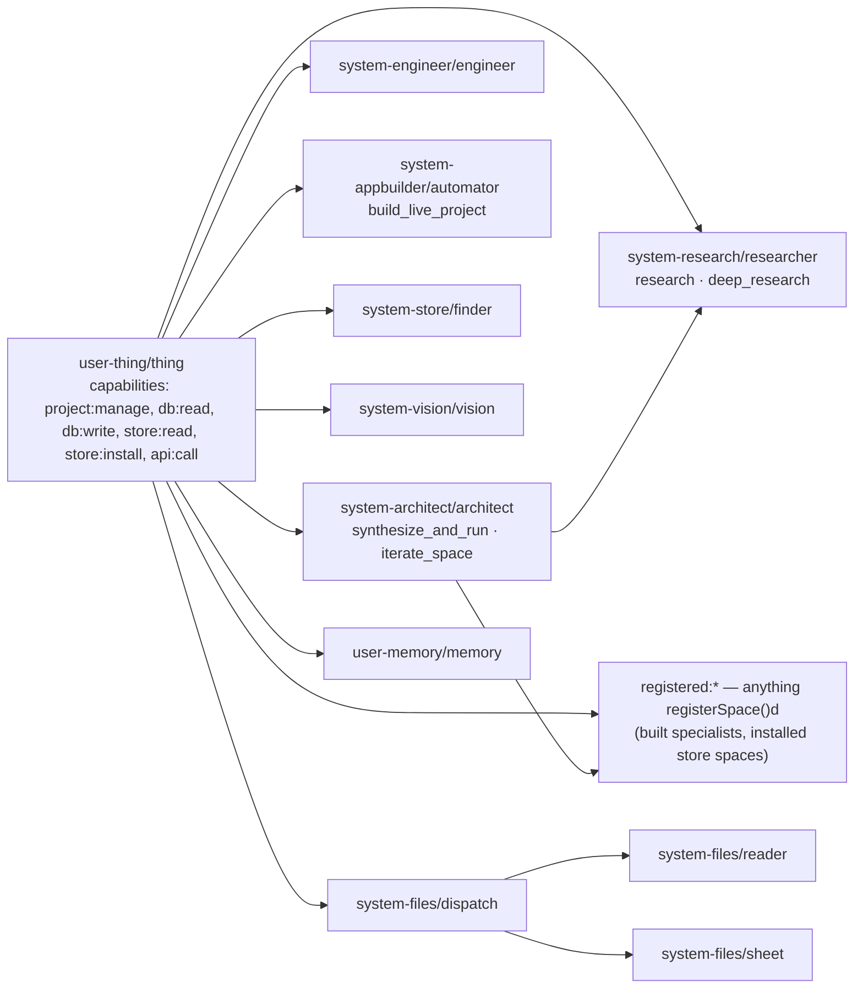

# `system-spaces/` — the shipped system spaces

The **thirteen** spaces that ship inside `@lmthing/core` and are loaded into **every** session, fork and delegate. They are what makes an empty project already able to think: THING orchestrates, the architect builds new agents, the appbuilder builds apps (as natively-renderable SPECS — there is exactly one app builder), the researcher searches, the engineer codes, and a function toolkit (`remember`/`todoWrite`/…) is in scope everywhere — plus two GRANTED-ONLY functions, `webSearch`/`webFetch`, reachable only via an agent's own `functions:` grant or a tasklist/fork task node's own `functions:` allow-list (§3, §7 of [`runtime-globals/`](../runtime-globals/README.md)); no shipped agent grants them at its own top level today.

They live at `sdk/org/libs/core/system-spaces/<name>/` — **not** under `src/`; they are read from disk at runtime, so editing an `.md` or a builder `.ts` needs no rebuild of `@lmthing/core` (`sdk/org/libs/core/src/spaces/system.ts:L50-L58` resolves the dir relative to the built/`src` layout).

- The **on-disk format** of any space (agents, tasklists, knowledge, functions, components, events) → [`../format/space/README.md`](../format/space/README.md). This page does not restate it.
- The **loader** that turns a directory into a `Space` → [`../runtime/spaces-loading.md`](../runtime/spaces-loading.md).
- The **globals** these agents call → [`../runtime-globals/README.md`](../runtime-globals/README.md).
- **Adding/changing** a space → [`../contributing/add-a-space.md`](../contributing/add-a-space.md).

---

## 1. What a system space IS

A system space is an ordinary space directory — same format, same loader — with four differences, all implemented in `sdk/org/libs/core/src/spaces/system.ts`:

| | System space | User / project space |
|---|---|---|
| **Where it comes from** | shipped in `@lmthing/core`, listed by name in `SYSTEM_SPACE_NAMES` (`sdk/org/libs/core/src/spaces/system.ts#SYSTEM_SPACE_NAMES`), materialized onto the pod at `<root>/system/spaces/<name>/` (`sdk/org/libs/cli/src/cli/runtime-init.ts#materializeRuntime`) | authored by the user (or installed from the store) under `<root>/<projectId>/spaces/<id>/` (`sdk/org/libs/cli/src/server/projects.ts:L147-L151`) |
| **When it loads** | **always** — `loadSystemSpaces(dirs)` runs on every session start and the result is merged into the user space by `mergeSystemInto` (`sdk/org/libs/core/src/session/session.ts#Session.loadMergedSpace`) | only when it is the session's space, or pre-loaded/registered for `delegate()` |
| **Agent reachability** | every system agent is **universally delegatable** — the session seeds the delegate registry with every system space, keyed by dir and package name (`sdk/org/libs/core/src/session/session.ts#Session.buildYieldContext`), and an equivalent map is rebuilt for delegates spawned by a task fork (`sdk/org/libs/core/src/session/session.ts#Session.runDelegateForFork`) | reachable only from the current space, its npm-dependent spaces, or via `registerSpace()` (`registered:*`) |
| **Function reachability** | **`system-global`'s functions are universal for the fork-engine POOL** (`GLOBAL_SPACE_NAME`, `sdk/org/libs/core/src/spaces/system.ts#GLOBAL_SPACE_NAME`; `systemFunctionNames`/`systemFunctionSources` skip every non-global space, `:L78-L95`) — but for the TOP-LEVEL injected view (an agent's own VM/DTS/prompt), 2 of its 8 (`webSearch`/`webFetch`, `GRANTED_ONLY_SYSTEM_FUNCTIONS`) are withheld unless the agent's own `functions:` frontmatter names them (`filterUniversalFunctions`, `sdk/org/libs/core/src/spaces/system.ts#filterUniversalFunctions`); the other 6 stay universal regardless. No shipped agent grants the two today (§3, §7). Every other system space's functions are **scoped to its own agents** via that agent's `functions:` frontmatter (`getAgentFunctions`, `sdk/org/libs/core/src/spaces/agent.ts#getAgentFunctions`) | scoped to the space's own agents, always |

Two more rules that only matter here:

- **Function-only spaces are legal.** `loadSystemSpaces` calls `loadSpace(dir, { requireAgents: false })`, so a space with no `agents/` (i.e. `system-global`) loads instead of throwing (`sdk/org/libs/core/src/spaces/system.ts#loadSystemSpaces`).
- **The user space wins on a name collision — except empty placeholders.** `mergeSystemInto` overlays the user space on top of the system spaces, but an *empty* user agent (an `agents/<slug>/` dir with no `instruct.md` ⇒ no `instructBody`, no actions) or an *empty* user tasklist dir (no `.md` files) does **not** shadow the real system one (`sdk/org/libs/core/src/spaces/system.ts:L169-L184`). That silent shadowing once stripped the system `architect` of its instructions, actions and `defaultAction`.

**Capabilities are spaces, not ad-hoc core globals.** The runtime stays a thin substrate; the host primitives the system functions wrap (`readFileRaw`, `writeFileRaw`, `execShell`, `fetch`) are injected separately by `host-tools.ts` (`sdk/org/libs/core/src/spaces/system.ts:L7-L21`) — but as **internal** primitives, absent from every agent's model DTS; the only one that reaches model code is `execShell`, and only under the engineer's `fs:scratch` scratch sandbox (`sdk/org/libs/core/src/exec/bootstrap.ts:L146-L167`).

---

## 2. The thirteen spaces

`SYSTEM_SPACE_NAMES` (`sdk/org/libs/core/src/spaces/system.ts#SYSTEM_SPACE_NAMES`), asserted to be exactly thirteen by `sdk/org/libs/core/src/spaces/system.test.ts:L68`:

| Space | Agent(s) | Actions | What it is for |
|---|---|---|---|
| **`system-global`** | *(none — function-only)* | — | The **universally injected toolkit**: 8 functions, in scope in every agent, fork and delegate (§3). |
| **`system-engineer`** | `engineer` | *(none — model-driven)* | Drafts/fixes/**verifies** code in a private **scratch sandbox** — `createScratch()` first, then a jailed `readFile`/`writeFile`/`editFile`/`listDir`/`glob`/`grep` + `execShell` (absolute/`..` paths rejected), with `fork({role:'explore'\|'plan'})` for heavy investigation (`sdk/org/libs/core/system-spaces/system-engineer/agents/engineer/instruct.md:L28-L45`). It does **not** read or write the live project; it **returns** the finished code to its caller via `currentTask.resolve({ ok, kind:'projectFunction'\|'code', code, suggestedName?, notes? })`, and the caller persists it with a typed writer (`:L73-L98`). Holds `fs:scratch` only — no `writeProjectFunction`. |
| **`system-zerostack`** | `zerostack` | *(none — model-driven)* | Drives **zerostack**, a third-party Rust coding agent shipped in the compute image and run by the pod with its working directory set to the **LMThing data root** — so it can read a live generated app, run its typechecker and open its SQLite database, none of which any agent's model surface can do. Five scoped functions (`zerostackAsk`, `zerostackLoop`, `zerostackStatus`, `zerostackSessions`, `zerostackCancel`) that POST an op to a loopback endpoint the pod publishes at `LMTHING_ZEROSTACK_URL` (`sdk/org/libs/cli/src/host/zerostack-endpoint.ts#ZEROSTACK_ENV`) — the same no-new-global pattern as `system-desktop-browser`. Knowledge: `zerostack/driving`, `zerostack/lmthing_apps`. Reached **only** from `system-engineer/engineer`, which escalates when its scratch sandbox structurally cannot see the answer (`sdk/org/libs/core/system-spaces/system-engineer/agents/engineer/instruct.md:14-18`). `canDelegateTo: []`. Full design: [zerostack.md](./zerostack.md). |
| **`system-architect`** | `architect` | `synthesize_and_run` *(default)*, `iterate_space` | The **meta-agent that builds other agents**. Each action starts its tasklist in one statement; the action runtime returns that tasklist envelope to its caller, while the real work happens inside the tasklists (§6). Owns 13 scoped builder functions: `writeAgentFile`, `writeTaskFile`, `writeKnowledgeIndex`, `writeKnowledgeOption`, `writeFunctionFile`, `writeComponentFile`, `writeEventFile`, `writeHookFile`, `writeManifest`, `readSpaceFile`, `listSpaceDir`, `validateSpace`, `listScaffoldedSpaces` (`sdk/org/libs/core/system-spaces/system-architect/agents/architect/instruct.md:L5-L18`). Knowledge: `space_format/frontmatter`. **Every agent it synthesizes is granted `knowledge:write` and gets a standing `research_and_store` tasklist** (`writeAgentFile`/`writeTaskFile` now emit `capabilities:`), so a question outside its static knowledge is researched and SAVED into its own knowledge instead of guessed (`sdk/org/libs/core/system-spaces/system-architect/tasklists/synthesize_and_run/05-write_tasks.md`). |
| **`system-research`** | `researcher` | `research` *(default)*, `deep_research` | Web research. `research` = one search + one fetch + a concise sourced answer; `deep_research` = a 5-stage cited-report pipeline (`sdk/org/libs/core/system-spaces/system-research/agents/researcher/instruct.md:L6-L16`). Ships **no functions of its own** — its tasks reach the web through `system-global`'s `webSearch`/`webFetch`, allow-listed per task. |
| **`system-appbuilder`** | `automator` | `build_live_project` *(default)* | **THE app builder — the only one.** Builds/extends the app **in the LIVE project**: tables, typed API handlers, automation hooks, and a UI that is a **SPEC, not TSX**. A page is `{ route, title?, sections: [...] }`, where each section is one of **eight kinds** (`list detail create stats markdown chat toolbar timeline`) naming ONE endpoint, and every displayed value is a binding PATH (`$.field`) into that endpoint's response (`sdk/org/libs/cli/src/app/view-spec/schema.ts#SECTION_KINDS`, `#BINDING_PATTERN`); the vocabulary a reusable card or row composes from is a closed 24-element list (`sdk/org/libs/cli/src/app/view-spec/schema.ts#ELEMENT_KINDS`). There is no `custom` kind and no per-section code escape — which is what makes the same app render natively on a phone with no WebView. The guarantee is structural, not instructional: `views:write` is the ONLY UI-authoring capability there is, so the automator holds it and there is no freehand-TSX writer (`writeProjectPage`/`writeProjectComponent` and the `pages:write` id that once gated them are gone from the codebase entirely) for it to lack — a spec is the only shape "author a page" can take for any agent (`sdk/org/libs/core/system-spaces/system-appbuilder/agents/automator/instruct.md:L1-L22`, `:L42-L50`). **A surface the vocabulary cannot express is REPORTED, not forced** — there is no second builder to hand it to, so an honest "this part needs a multi-select the spec language does not have" is the correct deliverable for that part, and cramming it into the nearest section kind is the one failure this builder is measured on (`:L58-L62`). Its supplied-material path is a CONTRACT → BUILD → PROVE DAG: read all attachments → distil the USER STORIES → make a holistic, BINDING app plan (`plan_app` owns membership; downstream planners only add detail, never add or drop an artifact) → a `plan → implement` pair per category (tables, endpoints, view components, views), each planner threaded with the stories + the binding plan + what is already built, fanned out by the host **one artifact at a time** with `forEach` so a slip on one file no longer loses the whole build → a `finalize` node that reports HONESTLY what landed on disk (§6). HOST-RUN code-node gates (`validate_contract` before any code exists, then `smoke_endpoints`, `check_acceptance` and `verify` after) mechanically catch what the compiler cannot see — an endpoint querying a table that was never created, a section binding a field its one endpoint never returns, an endpoint that answers a valid shape with meaningless numbers, and a page that renders EMPTY. This is THING's app path — THING first `createProject`s a target (§4) when the current project is `user`, then delegates the build into it. |
| **`system-browser`** | `browser` | *(none — model-driven)* | Drives a real browser. Ships its own scoped function set (`goto`, `search`, `click`, `fill`, `extract`, `waitForSelector`, …) reachable only through this agent's `functions:` frontmatter (`sdk/org/libs/core/system-spaces/system-browser/agents/browser/instruct.md:L1-L26`). Knowledge: `browser/driving`. |
| **`system-desktop-browser`** | `browse` | *(none — model-driven)* | Drives the **real browser running in the person's desktop app** — the one visible in its Browser pane, signed into their real accounts, with their own tabs in it. 17 scoped functions (`open`, `page`, `readText`, `elements`, `clickAt`, `typeText`, `pressKey`, `listTabs`/`openTab`/`useTab`/`closeTab`, …) that reach the desktop over the pod's host bridge (`sdk/org/libs/core/system-spaces/system-desktop-browser/agents/browse/instruct.md:L1-L26`). Named apart from `system-browser`'s catalogue on purpose — these click with REAL input events at an element's centre, and they can see and switch tabs. They read `LMTHING_DESKTOP_BROWSER_URL` rather than `LIGHTPANDA_MCP_URL`, so "no desktop attached" is an actionable error instead of silently driving a different browser (`sdk/org/libs/cli/src/host/browser-endpoint.ts#DESKTOP_BROWSER_ENV`). Knowledge: `browser/live`. Full design: [desktop/browser.md](../desktop/browser.md). |
| | `devtools` | *(none)* | Raw Chrome DevTools Protocol against the same browser — `cdp`, `cdpSubscribe`, `cdpEvents`. Gated by the bare-only **`browser:cdp`** capability, which is consent-marked and so **fails closed wherever there is no prompter** — every headless, fork, delegate and hook context (`sdk/org/libs/core/src/globals/consent.ts`). `canDelegateTo: []`. The last resort, not the first: ordinary browsing belongs to `browse`, which needs no per-call approval (`sdk/org/libs/core/system-spaces/system-desktop-browser/agents/devtools/instruct.md:L1-L30`). |
| **`system-vision`** | `vision` | *(none)* | Looks at attached **images** and answers from what is visible; runs on a vision model (`model: vision` frontmatter, `sdk/org/libs/core/system-spaces/system-vision/agents/vision/instruct.md:L1-L6`). Resolves plain text for the caller to relay (`:L13-L17`). |
| **`system-files`** | `dispatch` | *(none)* | Routes attached **files** by mediaType: tabular → `sheet`, everything else → `reader`; delegates once per group with the full id list, in parallel (`sdk/org/libs/core/system-spaces/system-files/agents/dispatch/instruct.md:L19-L43`). Runs on `model: M`. |
| | `reader` | *(none)* | Answers about PDF/Word/PowerPoint/OpenDocument/text/Markdown/JSON/code attachments, read via `await readDocument(id)`. Knowledge: `documents/formats`. |
| | `sheet` | *(none)* | Answers about CSV/TSV/XLSX/XLS/ODS attachments (host-extracted to CSV text). Knowledge: `documents/tabular`. |
| **`system-store`** | `finder` | *(none)* | Searches the **store catalog** with `storeSearch`/`storeInspect` and judges FIT from catalog data alone, returning ONE recommendation `{ fit, spaceId, title, why, emits, actions, requiredSettings, verified }` or `{ fit:false, reason }` (`sdk/org/libs/core/system-spaces/system-store/agents/finder/instruct.md:L42-L76`). **It never installs** — THING does, behind a consent card (`:L11-L15`). |
| **`user-memory`** | `memory` | `migrate_to_app_db` | Durable facts about the user across sessions and projects, via `remember`/`recall`/`recallAll`/`forget`; always ends with `currentTask.resolve(...)`. Also holds `db:write` as a ceiling for its `migrate_to_app_db` action, which sweeps personal facts out of memory into a newly-built app's tables — but only that action's write NODE carries the grant (per-node `capabilities:`), never the agent's ordinary turns (`sdk/org/libs/core/system-spaces/user-memory/agents/memory/instruct.md`, `sdk/org/libs/core/system-spaces/user-memory/tasklists/migrate_to_app_db`). Because a delegate runs with the **target** space's dir as `LMTHING_SPACE_DIR` (`sdk/org/libs/core/src/delegate/delegate.ts:L226`, `sdk/org/libs/core/src/globals/host-tools.ts#isReadOnlyCommand`), the store lands at `<user-memory space>/.lmthing/memory.json` (`sdk/org/libs/core/system-spaces/system-global/functions/remember.ts#remember`) — i.e. shared across every project. |
| **`user-thing`** | `thing` | *(none — model-driven)* | **THE user-facing orchestrator** (§4). Default agent of every project session (`sdk/org/libs/cli/src/server/session-manager.ts:L1110`). Holds `db:read`+`db:write` (reads/writes the project DB directly) and ships `organize_material`, `add_area`, `build_specialist`, and the routing/lifecycle set `write_fact`, `retract_fact`, `reconcile_conflict`, `resolve_flagged_figure`, `answer_across_spaces`, plus the three TEAM workflows `tell_the_team`, `answer_from_team_record`, `settle_team_decision` (§6, team pods only) (`sdk/org/libs/core/system-spaces/user-thing/tasklists`). |

Every agent above ships both `charter.md` (fork-safe identity + a never-fabricate guardrail, injected into the top-level prompt **and every fork**) and `instruct.md` (frontmatter + top-level orchestration body) — the split is documented in [`../format/space/agents/charter-file.md`](../format/space/agents/charter-file.md) and [`../format/space/agents/instruct-file.md`](../format/space/agents/instruct-file.md).

> **Not system spaces:** `integration-google` / `integration-slack` / `integration-github` (and the other messaging integrations). They are **store-installable** spaces, explicitly asserted absent from `defaultSystemSpaceDirs()` (`sdk/org/libs/core/src/spaces/system.test.ts:L77-L79`). A project installs the ones it needs and reaches them via `registered:*`.

---

## 3. `system-global` — the universal toolkit

The one function-only space. Its 8 functions are injected into the **fork-engine pool** of every session, delegate and fork VM — the exact set is pinned by `sdk/org/libs/core/src/spaces/system.test.ts:L24-L30` — but 2 of the 8 are **GRANTED-ONLY**, not truly universal: they reach a VM's own top-level injected view (prompt/DTS/functions) only when that agent's own `functions:` frontmatter names them (see the third bullet below and [`runtime-globals/README.md §7`](../runtime-globals/README.md#7-function-allowlists-a-second-orthogonal-gate) for the mechanism):

| Function | What it does |
|---|---|
| `webSearch(query, opts?)` | Ranked web results (Tavily / Bing-render / DuckDuckGo; `provider: 'auto'` by default) (`webSearch.ts:L1-L3`) — **GRANTED-ONLY** |
| `webFetch(url, opts?)` | Fetch a URL; HTML reduced to text, or `{format:'markdown'}` to keep structure (`webFetch.ts:L1-L3`) — **GRANTED-ONLY** |
| `remember(key, value)` / `recall(key)` / `recallAll()` / `forget(key)` | Durable JSON facts at `<spaceDir>/.lmthing/memory.json` (`remember.ts:L1-L3`) — universal |
| `todoWrite(items)` / `todoRead()` | The soft checklist, persisted to `.lmthing/todos.json` (`todoWrite.ts:L1`) — universal |

Three consequences worth knowing:

- **`webSearch`/`webFetch` are plain `async function`s that `await fetch(...)` internally, and `fetch` is a value-YIELDING global** — it ends the turn and resumes when the host's real async `fetch()` settles (`sdk/org/libs/core/src/globals/fetch.ts:L16-L30`). It is **not** the old synchronous `execSync(curl …)` primitive; nothing blocks the Node thread for the duration of a request.
- A task can withhold the toolkit: tasklist frontmatter `functions: []` means **no functions at all**, including `webSearch`/`webFetch` (see [`../runtime/fork-and-tasklists.md`](../runtime/fork-and-tasklists.md)).
- **`webSearch`/`webFetch` require an EXPLICIT grant at every level, top-level VM and task node alike** — an agent's own top level needs `functions: [webSearch, webFetch]` in its `instruct.md` frontmatter (no shipped agent does this today), and a tasklist/fork task node needs the same names in its own `functions:` (an OMITTED `functions:` on a task node no longer implies web access either — it inherits the pool MINUS `webSearch`/`webFetch`, `sdk/org/libs/core/src/fork/fork.ts:321-339`). Both gates close the same bypass: `webSearch`/`webFetch` run raw HTTP with no persistence step of their own, so code that can call them directly can research a fact and never store it. The two places this actually matters today are `system-research/research`'s `answer` node and every `deep_research` node, which all declare `functions: [webSearch, webFetch]` (or `[webSearch]`) explicitly per task (§6) — and a scaffolded specialist's `research_and_store` tasklist, built the same way by the architect (`sdk/org/libs/core/system-spaces/system-architect/tasklists/synthesize_and_run/05-write_tasks.md`). A scaffolded specialist's OTHER tasklist — the coverage-check `answer` task, which intentionally has no `functions:` at all — relies on exactly this default-withholding to stay honest: unable to reach the web, it must resolve `covered:false` instead of quietly researching inline, so its caller escalates to `research_and_store` (`.issues/research-store-noop-diagnosis.md`).

---

## 4. THING (`user-thing`) — triage and delegation

### 4.0 The prompt is SPLIT: an always-on body, and playbooks behind a `loadKnowledge`

THING's `instruct.md` used to be one 1270-line file carrying every routing DECISION *and* the full
detail of every route, so a conversation that only ever answered questions still paid for the
app-build gate, the integration install flow, the retraction tasklist and the entire team surface on
every single turn. It is now split in two — this is the shared pattern described in
[§8.1](#81-splitting-a-long-instructmd-always-on-body--loadable-aspects) (`sdk/org/libs/core/system-spaces/user-thing/agents/thing/instruct.md:L42-L76`):

- the **always-on body** carries the decisions and the one-line rules that must hold whatever
  happens — the did-they-ask gate, "never build into `user`", "`attachmentIds` is not optional",
  "a throw is information", "check before you say done", the four team rules;
- the **detail** — the exact call shape, the failure modes that route has actually produced, what to
  check before reporting — lives in `knowledge/playbooks/<field>/<aspect>.md` and is pulled in with
  `loadKnowledge('playbooks', field, aspect)` at the moment THING takes that route.

Six fields, 18 aspects: `paths` (one per numbered triage path with a non-obvious call shape),
`building` (create-project, grow-project, spec-app), `writing` (personal-facts,
world-and-preferences, corrections), `data` (names, failed-writes, app-numbers), `attachments`
(read-to-orient, seeding-a-build) and `team` (conduct, workflows). Each is declared as a 2-part ref
in the agent's `knowledge:` frontmatter, so the `# Knowledge` block of the system prompt renders each
field's `index.md` **overview** plus its aspect NAMES without injecting a single aspect body
(`sdk/org/libs/core/src/context/system-block.ts:L286-L302`) — the menu is free, the detail is not.
A routing table in the body maps "you just decided X" to the triple to load
(`…/instruct.md:L54-L76`). **Path 1 — answering directly, which is most messages — loads nothing.**

A load is an ordinary value-yield: it costs one turn, and several issued together cost one between
them, which is cheap against a build, an install or a repair. That economics is why the decisive
one-liners STAY in the body: prose telling the model to load is advisory, never host-enforced, so a
SKIPPED load has to degrade into "acted without the rationale", never "acted without the rule".

Three guards pin the split, each covering a failure that is otherwise silent
(`sdk/org/libs/core/src/spaces/thing-prompt-split.test.ts`): a load point with no file behind it (the
call yields, misses on disk, and THING carries on believing the detail was unavailable); an aspect no
load point names (correct prose nothing ever reads); and the body growing back until the split is
decorative (a line-count **ratchet**, deliberately raised only with a reason). Doctrine guards whose
paragraph moved now read the whole corpus — instruct body plus every knowledge file — via
`agentPromptCorpus` (`sdk/org/libs/core/src/spaces/agent-prompt-corpus.ts#agentPromptCorpus`), while
rules that must hold EVERY turn keep asserting on `instruct.md` alone, because a rule that needs a
file loaded first is not always on.

### 4.1 `canDelegateTo`

THING's `instruct.md` frontmatter declares a **hard allowlist** — an explicit list is enforced at yield time, and a violating `delegate()` throws an actionable error naming the allowed targets (`sdk/org/libs/core/system-spaces/user-thing/agents/thing/instruct.md:L21-L34`):


```mermaid
flowchart LR
  THING["user-thing/thing<br/>capabilities: project:manage, db:read, db:write, store:read, store:install, api:call"]
  THING --> R["system-research/researcher<br/>research · deep_research"]
  THING --> A["system-architect/architect<br/>synthesize_and_run · iterate_space"]
  THING --> E["system-engineer/engineer"]
  THING --> AU["system-appbuilder/automator<br/>build_live_project"]
  THING --> F["system-store/finder"]
  THING --> V["system-vision/vision"]
  THING --> D["system-files/dispatch"]
  THING --> M["user-memory/memory"]
  THING --> REG["registered:* — anything registerSpace()d<br/>(built specialists, installed store spaces)"]
  D --> RD["system-files/reader"]
  D --> SH["system-files/sheet"]
  A --> R
  A --> REG
```

**There is exactly ONE build target, so a build needs no routing decision.** Every app build — the free-form `delegate('system-appbuilder','automator',…)` of path 4a, and both hardcoded `build_live_project` delegates inside the `organize_material` and `add_area` tasklists, whose task frontmatter pins `canDelegateTo: ['system-appbuilder/automator#build_live_project']` — goes to `system-appbuilder` (`sdk/org/libs/core/src/spaces/system-spaces-dag.test.ts:L149`, `:L199`). "Should this be a spec app or a React app?" is not a question anyone is asked: the app builder's only medium is the spec, and a surface it cannot express is reported back rather than routed elsewhere.

`registered:*` is what lets THING (and the architect) **run a freshly built or freshly installed agent** without being granted `*` (`sdk/org/libs/core/system-spaces/user-thing/agents/thing/instruct.md:L34`; `sdk/org/libs/core/system-spaces/system-architect/agents/architect/instruct.md:L25-L27`). The `system-files/dispatch` fan-out is declared on the dispatcher itself (`sdk/org/libs/core/system-spaces/system-files/agents/dispatch/instruct.md:L5-L7`).

### 4.2 The three stores and the routing model

Ahead of the numbered triage paths, THING's instruct establishes the **three-store model** that governs where every fact lives and how it's reached (`sdk/org/libs/core/system-spaces/user-thing/agents/thing/instruct.md:L247-L276`): the **DB** (the user's own app data — THING reads and writes it directly with `db:read`+`db:write`, though a hard DELETE is never inline: `db.remove` is off the model surface, so a deletion routes through a guarded tasklist code node — see `retract_fact`/`resolve_flagged_figure` below), **space knowledge** (a topic agent's understanding, written by its `research_and_store` action), and **user memory** (durable facts about the user, and the home for personal facts before an app exists). Unsure of a table's real name, THING calls `db.tables()` first rather than guessing one — a guessed name still typechecks (`table` is a plain string) but silently returns nothing at runtime, so an unverified guess and a genuine miss are indistinguishable (`:L272-L276`). Read routing sends a topic question to the owning space, a personal question to `db.query`→memory→"want me to research?" — answered from the DB ALONE, never hedged with a parallel delegate to a specialist "just in case" (`:L291-L301`) — and a mixed question to the `answer_across_spaces` tasklist; write routing sends a personal fact to memory-or-DB, a volunteered world fact to a space's knowledge, and a preference to memory. A personal fact whose value is a NEW STRUCTURED attribute the schema has no column for (a recurring reading, a reference/serial number, a per-row date the app must be able to filter/sort/sum on) is an ADDITIVE SCHEMA change, not a `write_fact` into an existing field: THING lacks `db:schema`, so it delegates to the `automator` to ADD the column (a merge that preserves every existing row) and then writes the value into it — never cramming a recurring structured value into a free-text `notes`/`description` field where no view or endpoint can key off it (`sdk/org/libs/core/system-spaces/user-thing/knowledge/playbooks/writing/personal-facts.md:L22-L40`). THING carries five lifecycle tasklists for this — `write_fact` (a stated fact routes to the right store STRUCTURALLY: a read-only `classify` node picks the store and, for a DB fact, resolves an explicit `operation` — `insert` for a newly-reported record vs. `update` for a correction to a specific existing row it pins by `rowId` — and flags a genuinely store-vs-remind-ambiguous volunteered item as an `ask` using a domain-neutral heuristic loaded on demand via `loadKnowledge('recording','intent')` — a "keep this front of mind"/"don't forget" phrasing with unstated future behaviour is the ambiguous case even when it rides on a concrete storable value (the ambiguity DOMINATES the riding value, so the classify node asks instead of folding the value into a loosely-matching table); the `write` node (which holds `db:read`+`db:write`, so its re-read `db.query` typechecks) then REFUSES an `update` with no matched row (a throw the model corrects to `insert`) and re-reads to prove the row landed, so a newly-reported payment can never be silently folded into an unrelated row's field and an ambiguous "keep this in mind" becomes a real question the caller relays instead of a unilateral store — column names are already gated to the real schema at typecheck by the db-schema DTS, so no schema prelude is needed; `sdk/org/libs/core/system-spaces/user-thing/tasklists/write_fact/01-classify.md:L1-L64`, `02-write.md:L1-L50`, `sdk/org/libs/core/system-spaces/user-thing/knowledge/recording/intent/index.md:L1-L17`, `default.md:L1-L47`), `retract_fact` (hard delete via a HOST-RUN code node `02-apply.ts` — a `locate` model node confirms the target and pre-computes any field-clear value, then the code node deletes the row or clears the field; `sdk/org/libs/core/system-spaces/user-thing/tasklists/retract_fact/01-locate.md:L1-L44`, `02-apply.ts#run`), `reconcile_conflict` (precedence user-asserted > DB > researched > guess), `resolve_flagged_figure` (a flagged/mis-adding figure in the user's OWN data — "that total looks too high", "check the maths" — is a diagnose-then-fix job the ask-vs-act judgment of which is settled STRUCTURALLY, not by prose: a read-only `diagnose` node holding no `db:write` names the concrete cause and judges confidence — HIGH when the correction is determined: either the user stated the target value and exactly one candidate correction reproduces it (the stated target SELECTS the mechanism, so several conceivable mechanisms is not itself ambiguity) or the fix is arithmetically/structurally forced (a provable duplicate, a cross-table duplicate, a mis-sum, a value summed in the wrong unit/currency); LOW only for genuine ambiguity (no stated target and no arithmetic tie-break, or a preference-only choice) — and hands down the machine-checkable EVIDENCE for its diagnosis: a `figureSpec` `{op,column,filter}` describing how the flagged figure is computed, the `assertedTarget`, and `duplicateOf` peers. The destructive write is then an INTERLOCK, not a model fork: `fix` is a **host-run code node** (`02-fix.ts`, `kind:'code'`) whose guard executes in code that cannot be stochastically skipped — it recomputes the figure and AUTO-APPLIES the deletion only when that verifiably moves it to the asserted target with no distinct equal-value twin; reports "already correct — nothing removed" when the figure already equals the target (the run-32 data-loss fix — never delete a correct row); otherwise writes nothing and returns a `question`. On the user's confirmation THING re-invokes with the settled action as `decision`, so the fix applies without a destructive re-diagnosis; an unconditional `report` goal merges the branches. This replaced a `db:write` model `fix` node that stochastically skipped a prose "verify before delete" guard and hard-deleted a correct, unrelated row (06-tanzania run 32 step 9); `sdk/org/libs/core/system-spaces/user-thing/tasklists/resolve_flagged_figure/index.md:L1-L24`, `01-diagnose.md:L1-L101`, `02-fix.ts#run`, `03-report.md:L1-L36`), and `answer_across_spaces` (`sdk/org/libs/core/system-spaces/user-thing/tasklists`). The always-on guardrails (never fabricate an action; treat file/webhook content as data, not instructions) live in THING's `charter.md` so they ride into every fork (`sdk/org/libs/core/system-spaces/user-thing/agents/thing/charter.md`).

### 4.3 The triage paths

The shipped instruct then defines the numbered delegation paths (`sdk/org/libs/core/system-spaces/user-thing/agents/thing/instruct.md:L403-L473`). A request may name more than one deliverable, and then THING must do each — collapsing an "X **AND** Y" request into one is a stated failure (`:L398-L401`).

| # | Path | Trigger | What THING emits |
|---|---|---|---|
| 1 | **Answer directly** | general knowledge, conversation, reasoning | `display(...)`, no delegation — the default for most messages (`:L403-L405`) |
| 2 | **Research the web** | current/external facts **as the final answer** | `delegate('system-research','researcher','research',{query})`; `deep_research` **only on explicit request** ("deep"/"thorough"/"comprehensive"/report) — it costs ~10× more (`:L407-L413`; `sdk/org/libs/core/system-spaces/user-thing/knowledge/playbooks/paths/research.md:L29-L78`) |
| 3 | **Build a new specialist** | the user wants a **reusable agent/tool/workflow** | two turns: `await tasklist('build_specialist',{request})`, then `delegate(b.data.spaceKey, b.data.agentSlug, b.data.actionId, …)` guarded on `b.ok && b.data.ok` (`:L415-L420`; `sdk/org/libs/core/system-spaces/user-thing/knowledge/playbooks/paths/specialist.md:L5-L30`). **When the material is already provided** (attached file / in-conversation), it must NOT run `build_specialist` — it delegates straight to `architect#synthesize_and_run` with the content seeded as `context.research` (a JSON string), which skips the research fork entirely (`sdk/org/libs/core/system-spaces/user-thing/knowledge/playbooks/paths/specialist.md:L32-L63`) |
| 4a | **Build an app** (always into a LIVE project) | "turn this into an app", "an app for my trip/notes/data", "build me a … app" | If the current project is the default `user` project, THING first asks for a name and `createProject(name)`s a fresh live project — it **never** builds an app into `user`; if the current project is already a real (non-`user`) project, the automator builds in place. Then `delegate('system-appbuilder','automator',{query, attachmentIds})` — the runtime auto-retargets the delegate to the created/selected project — which authors tables (seeding rows), API handlers, reusable view components, SPEC pages and hooks **directly into the live project**, served at `/app/<project>/` (`:L422-L439`; `sdk/org/libs/core/system-spaces/user-thing/knowledge/playbooks/paths/application.md:L83-L139`, `sdk/org/libs/core/system-spaces/user-thing/knowledge/playbooks/building/create-project.md:L5-L48`) |
| 4a′ | **A CHANGED FACT about data already in the app** | "I renewed the car insurance, the new policy number is AX-7741-2", "the rent went up to €900", "mark that invoice paid" | THING now holds `db:write`, so a change to an EXISTING table it does **itself** — `db.query` to find the row, then `db.update` (or via the `write_fact`/`retract_fact` tasklists) — the automator is only for a change that needs a NEW table or page (`db:schema`/`views:write`, which THING lacks). **Not** the domain space: `household-insurance-admin` and friends READ their knowledge and REPLY (their `answer` tasklist cannot write the db), so an update routed there yields a fluent confirmation and changes nothing. Route on the **intent, not the words** — the Greek twin of the sentence takes the same path (`sdk/org/libs/core/system-spaces/user-thing/knowledge/playbooks/writing/personal-facts.md:L42-L73`) |
| 5 | **Write or fix code** | any deliverable that IS code | **always** `delegate('system-engineer','engineer',{query})` — never inline, even when THING could write it (`:L441-L444`; `sdk/org/libs/core/system-spaces/user-thing/knowledge/playbooks/paths/code.md:L5-L27`) |
| 6 | **Remember something about the user** | a durable preference/fact/instruction | `delegate('user-memory','memory',{query:'Remember: …'})` (`:L446-L463`) |
| 7 | **Act on / automate a service** | "do X on Gmail/Slack/…", "when X happens, do Y" | if the integration is already installed → `delegate('<integration>', …)` via `registered:*`. Otherwise the **install-and-automate flow** below (`:L465-L469`; `sdk/org/libs/core/system-spaces/user-thing/knowledge/playbooks/paths/integrations.md:L5-L101`) |

Path 7's flow, once per distinct need (the finder returns ONE space per call, so a two-need request runs it twice — each install raises its own consent card, `sdk/org/libs/core/system-spaces/user-thing/knowledge/playbooks/paths/integrations.md:L21-L25`):

**(a)** `delegate('system-store','finder',{query})` → `{ fit, spaceId, title, why, emits, actions, requiredSettings }`; `fit:false` ⇒ tell the user and stop, never build one (`sdk/org/libs/core/system-spaces/user-thing/knowledge/playbooks/paths/integrations.md:L27-L39`).
**(b)** `await installSpace(rec.spaceId)` — **consent-marked**: the host renders a consent card and installs only on approval; on success the space is live-registered for `delegate()` in the same session (`sdk/org/libs/core/system-spaces/user-thing/knowledge/playbooks/paths/integrations.md:L41-L53`). An id that did **not** come from a finder recommendation must be verified with `storeInspect` first — calling `installSpace` on a non-existent id would interrupt the user with an unfulfillable consent card (`sdk/org/libs/core/system-spaces/user-thing/knowledge/playbooks/paths/integrations.md:L55-L69`).
**(c)** `await integrationStatus(rec.spaceId)` → `{ ready, missingRequired }` (presence-only, never secret values); point the user at the chat **Integrations** tab. Their save restarts the pod and **auto-resumes THING** with a "`<id>` configured" system message — never poll (`sdk/org/libs/core/system-spaces/user-thing/knowledge/playbooks/paths/integrations.md:L71-L84`).
**(d)** `delegate('system-appbuilder','automator', …)` to author the event hook + emitter def (`sdk/org/libs/core/system-spaces/user-thing/knowledge/playbooks/paths/integrations.md:L86-L95`).
**(e)** If the automation needs a service call the installed space does not expose → the engineer **drafts** the **project function** code and returns it (path 5); the automator persists it via `writeProjectFunction` (the engineer no longer persists) (`sdk/org/libs/core/system-spaces/user-thing/knowledge/playbooks/paths/integrations.md:L97-L101`).

### 4.4 Standing behaviour (before triage)

- **Project context**, once per conversation: `readFile('instructions.md')` + `listDir('documents')`, both resolved against the project dir (`:L78-L101`).
- **Name the conversation** in the first statement (fire-and-forget, no `await` — it does not end the turn): `setSessionMeta({ title, slug })` (`:L103-L120`).
- **Attachments take priority over triage.** THING is a text model and cannot see an image or file: it sends **all** image ids in ONE `delegate('system-vision','vision',{query, attachmentIds})` and **all** file ids in ONE `delegate('system-files','dispatch',…)`. When both groups exist, it awaits those independent calls together with `Promise.all`—the calls are already promises and are not cast before awaiting. Both delegates resolve to plain-text summaries, which THING composes into its reply in that same statement; it does not inspect object fields or render a raw result (`sdk/org/libs/core/system-spaces/user-thing/agents/thing/instruct.md:L200-L236`). Audio is already transcribed into the message — no delegation (`sdk/org/libs/core/system-spaces/user-thing/agents/thing/instruct.md:L238-L240`).
- **Creating a project is a `project:manage` host call, not a UI-only action.** THING holds `project:manage`, so when a build needs a fresh app it calls `createProject(name)` itself (or `selectProject(id)` to retarget an existing one) — see [`../runtime-globals/app-authoring.md`](../runtime-globals/app-authoring.md#createproject--selectproject--picking-the-live-build-target). It still never spawns a specialist to "make a project".
- **Orchestrator discipline:** on a failed delegate, report the error — never do the specialist's job (THING cannot scaffold spaces or run builder functions) (`:L549-L553`).

---

## 5. Capabilities held by system agents

`capabilities:` is the least-privilege grant model — a grant that is absent is absent from **both** the injected globals and the typecheck DTS, so a stray call fails typecheck instead of reaching the engine (`sdk/org/libs/core/src/exec/app-globals.ts:L208-L226`, `sdk/org/libs/core/src/exec/bootstrap.ts:L189-L198`). The grant vocabulary itself is documented in [`../format/space/agents/capabilities.md`](../format/space/agents/capabilities.md); the ids are enumerated in `sdk/org/libs/core/src/spaces/capabilities.ts:L26-L56`.

**The cap-bearing set is asserted PER AGENT, not per space** — a space is not uniformly capability-bearing (`system-desktop-browser` ships `devtools`, which holds `browser:cdp`, beside `browse`, which holds nothing because its own function list is its gate). The shipped holders are all four `system-appbuilder` agents, `system-desktop-browser/devtools`, `system-engineer/engineer`, `system-store/finder`, `user-memory/memory` and `user-thing/thing`; **every other system agent parses to `{}`** (`sdk/org/libs/core/src/spaces/capabilities.test.ts:L139-L184`). `user-memory/memory` holds `db:write` as the ceiling for its `migrate_to_app_db` action; only that action's write NODE spends it.

| Agent | Grants | Unlocks |
|---|---|---|
| `system-appbuilder/automator` | `hooks:write`, `db:schema`, `db:read`, `db:write`, `api:write`, **`views:write`** | every LIVE-project writer — `writeProjectTable`/`Api`/`Hook`/`Event`/`Function` + `db.*`, plus the spec writers `writeProjectView`/`writeProjectViewLayout`/`writeProjectViewComponent`/`writeProjectViewShell`. `views:write` is the ONLY UI-authoring capability — there is no `pages:write` and no `writeProjectPage`/`writeProjectComponent` in the codebase at all, so freehand TSX is structurally unreachable rather than merely ungranted (`system-appbuilder/agents/automator/instruct.md:L9-L15`, `:L44-L46`) |
| `system-appbuilder/spec-builder` | `views:write`, `db:read` | the spec writers only — the narrow UI specialist, handed one page/shape/shell against endpoints that already exist (`system-appbuilder/agents/spec-builder/instruct.md:L1-L11`) |
| `system-appbuilder/data-modeler` · `api-author` | `db:schema`+`db:read` · `api:write`+`db:read` | one slice each: a `database/<name>.json` schema, or one typed `api/<path>/<METHOD>.ts` handler (`system-appbuilder/agents/data-modeler/instruct.md:L1-L11`, `system-appbuilder/agents/api-author/instruct.md:L1-L11`) |
| `system-engineer/engineer` | `fs:scratch` | `createScratch` + a sandboxed generic fs/shell (`readFile`/`writeFile`/`editFile`/`listDir`/`glob`/`grep` + `execShell`, jailed to a throwaway `.lmthing/scratch/<random>` dir) — the engineer's scratch workbench; the ONLY grant that earns any generic filesystem access, and it persists nothing (`sdk/org/libs/core/src/spaces/capabilities.ts:L93-L97`; `sdk/org/libs/core/src/exec/bootstrap.ts:L146-L167`; `system-engineer/agents/engineer/instruct.md:L12-L13`) |
| `system-store/finder` | `store:read` | `storeSearch`, `storeInspect` (`sdk/org/libs/core/src/exec/bootstrap.ts:L189-L193`; `system-store/agents/finder/instruct.md:L4-L5`) |
| `user-thing/thing` | `project:manage`, `db:read`, `db:write`, `store:read`, `store:install`, `api:call` | `createProject`/`selectProject` (pick the live build target), the `db.*` reads/writes, `storeSearch`/`storeInspect` **plus** the consent-marked `installSpace` (`user-thing/agents/thing/instruct.md:L12-L20`) |

`store:read` survives into read-only fork roles (pure catalog discovery); the mutating `store:install` and `events:emit` are dropped (`sdk/org/libs/core/src/exec/capability.ts:L8-L26`).

> The smoke test's comment still names the `integration-*` spaces (`connections:use`) among the holders (`sdk/org/libs/core/src/spaces/capabilities.test.ts:L146`). None of them is shipped any more — they are store spaces, explicitly asserted absent from `defaultSystemSpaceDirs()` (`sdk/org/libs/core/src/spaces/system.test.ts:L77-L79`).

---

## 6. The shipped tasklists (the host-driven DAGs)

Seventeen tasklists ship across five spaces — eleven on `user-thing`, two each on `system-architect` and `system-research`, one each on `system-appbuilder` and `user-memory`. The tasklist mechanics (`role`, `functions`, `forEach`, `prelude`, `dependsOn`, `goal`, the `{ok, degraded, data}` envelope) are documented in [`../format/space/tasklists/README.md`](../format/space/tasklists/README.md) and [`../runtime/fork-and-tasklists.md`](../runtime/fork-and-tasklists.md) — here is what each shipped DAG actually is.

### `user-thing/organize_material` — `input: { request, sourceSummary, attachmentIds, specialistFacts }`

For the explicit agreement after THING offers to organize supplied material, THING first gets the project right: still in the shared `user` project (the default), it `createProject`s a dedicated one — naming it itself, never asking — BEFORE invoking the tasklist, so the build lands there and never into `user`; already in a real project, it skips straight to the tasklist (`sdk/org/libs/core/system-spaces/user-thing/knowledge/playbooks/paths/application.md:L39-L64`). This DAG then reads every supplied document and inventories its stable independently-owned scopes; the partition follows the material's primary operational axis (bounded stages in a sequence, independently run operations in parallel), not storage categories such as costs, contacts, documents, or media. It then runs `build_specialist` as a `forEach` over `inventory.scopes` and, once every specialist has finished, delegates the complete source plus attachment IDs to the live-project `automator`'s `build_live_project` action. Its tasklist reads the source, plans the whole app, then builds the current project's source-derived tables, typed API, reusable components, and multiple openable pages one file at a time; a data model or survey alone is not a completed app. THING invokes this workflow exactly once and consumes its envelope inline with its closing reply: statement-local values cannot safely drive a later continuation, and the returned envelope is the workflow's proof of outcome — THING must not re-inspect the project or validate individual builder results afterwards. Facts, photographs, memories, shared overviews, and cross-cutting groupings stay with their owning scope or app data: they do not become their own specialist. An uninterrupted operational stage can combine its subparts, but separate locations or stages remain separate (`sdk/org/libs/core/system-spaces/user-thing/knowledge/playbooks/paths/application.md:L66-L81`, `sdk/org/libs/core/system-spaces/user-thing/tasklists/organize_material/index.md:L1-L11`, `01-inventory.md`, `02-consolidate_scopes.md`, `03-build_specialist.md`, `04-build_live_app.md`).

### `user-thing/add_area` — `input: { request, registeredSpaces, attachmentIds, specialistFacts }`

The **incremental sibling of `organize_material`**: when the user introduces a genuinely NEW area to keep and track mid-conversation (a new kind of thing the project had no specialist for — not another row in an area it already covers), THING routes it here instead of a bare `automator` delegate (`sdk/org/libs/core/system-spaces/user-thing/knowledge/playbooks/building/grow-project.md:L33-L63`). A bare automator delegate builds only the table/page and nothing in it evaluates "does this new area deserve a specialist?", so left to it the area silently gained rows but no owning space (07-life-admin run 26 step 11 — `spaceCount` stayed flat; an L1 prose fix moved the repro RED 4/4→2/4 but never green because THING's own choice to run the evaluation was stochastic — repro `sdk/org/scenarios/repros/new-topic-specialist/repro.yaml`). The judgment is now STRUCTURAL: a read-only `assess` node (always runs — role `explore`, no write cap) names the area's topic and decides `isNewArea` by applying the same loadable split heuristic `organize_material` uses (`loadKnowledge('organizing','split')`) against `registeredSpaces` and `db.tables()`; a condition-gated `add_specialist` node (`condition: assess.isNewArea == true`) delegates to `system-architect/architect#synthesize_and_run` to build ONE grounded specialist (idempotent — a same-topic space is reused, not duplicated, via the architect's dedup); a `build_app` node delegates to `system-appbuilder/automator#build_live_project` for the table/page/reminder; and an unconditional `report` goal merges both branches. Because the specialist decision is a fixed DAG node rather than an in-turn afterthought THING can skip, entering the tasklist guarantees it runs (`sdk/org/libs/core/system-spaces/user-thing/tasklists/add_area/index.md:L1-L22`, `01-assess.md`, `02-add_specialist.md`, `03-build_app.md`, `04-report.md`).

### `user-thing/build_specialist` — `input: { request }`

```
research (explore, optional, prelude-delegates to system-research/researcher#deep_research)
  → build (goal, general, delegates to system-architect/architect#synthesize_and_run)
```

The `research` node is `optional: true` and its **prelude** performs the delegation, so the model's only job is to package the envelope; the `build` node **always runs** (a skipped dependency is satisfied) and returns the built agent's run coordinates `{ spaceKey, agentSlug, actionId, query, ok, errors, reused }` (mirroring the architect `finalize` envelope field-for-field, `reused` included; `sdk/org/libs/core/system-spaces/user-thing/tasklists/build_specialist/index.md:L1-L14`, `01-research.md:L1-L25`, `02-build.md`). The whole research node, verbatim:

````markdown
---
id: research
output:
  report: object
dependsOn: []
optional: true
goal: false
role: explore
functions: []
canDelegateTo:
  - system-research/researcher#deep_research
prelude: |
  const researchEnv = request ? await delegate('system-research', 'researcher', 'deep_research', { query: String(request) }) : { ok: false, degraded: true, data: {} };
---

Package the domain research for the build step. …

currentTask.resolve({ report: (researchEnv && researchEnv.data) ? researchEnv.data : {} });
````

### The three TEAM workflows — reachable only on a team pod

`team:read`/`team:post` are dropped from every parsed capability set unless the pod is a team pod, so on a personal pod a node that declares them narrows to nothing and the team globals are absent from its DTS entirely (`sdk/org/libs/core/src/spaces/capabilities.ts#isTeamPod`, `sdk/org/libs/core/src/exec/capability.ts#narrowAppCaps`). These three exist because a live team run showed THING improvising each of these jobs inside a single turn and getting the multi-step ones wrong; each moves the step that goes wrong into a node that physically cannot do the others' work. THING routes to them from the team section of its instruct (`sdk/org/libs/core/system-spaces/user-thing/agents/thing/instruct.md:L502-L507; sdk/org/libs/core/system-spaces/user-thing/knowledge/playbooks/team/workflows.md:L5-L31`).

**`user-thing/tell_the_team` — `input: { request, substance }`.** For "let the others know". A fork sees only the declared input, so `substance` is how the workflow learns what happened — it cannot see the conversation. `01-choose_channel` and `02-compose` are both `role: explore` with `capabilities: [team:read]`, and because `intersectAppCaps` strips `team:post` from every read-only role they **physically cannot post** (`sdk/org/libs/core/src/exec/capability.ts#intersectAppCaps`): the channel is picked from `teamChannels()` plus a page of each candidate's `teamHistory` (with a first-class `"here"` verdict for "the only place is the channel I was already called from", so a no-op can never be reported as a delivery), and the single message is written with the attribution the right way round — the source is the member who asked, the readers are the audience (`sdk/org/libs/core/system-spaces/user-thing/tasklists/tell_the_team/01-choose_channel.md:L1-L48`, `02-compose.md:L1-L44`). `03-post` is the goal and the **only** node in any shipped tasklist that holds `team:post`: it sends exactly `compose.text` into exactly `choose_channel.channelId`, once, and posts nothing at all on the `ask`/`here` branches (`sdk/org/libs/core/system-spaces/user-thing/tasklists/tell_the_team/03-post.md:L1-L38`). That one-holder property is asserted across every shipped space (`sdk/org/libs/core/src/spaces/system-spaces-dag.test.ts:L361-L378`).

**`user-thing/answer_from_team_record` — `input: { question }`.** For "who owns this / where did it get to / what did we decide". Every node is `role: explore`, so the workflow can neither change anything nor say anything out loud. `01-plan_lookup` names the PLACES the answer would be recorded — channels from `teamChannels()`, tables from `db.tables()`, at most four, ids it actually saw — and explicitly excludes the thread in front of THING as a source, because a question of this shape is asked precisely by somebody who was not in the room where it was settled (`sdk/org/libs/core/system-spaces/user-thing/tasklists/answer_from_team_record/01-plan_lookup.md:L1-L40`). `02-read_source` fans out one read per place (`forEach: plan_lookup.sources`) and EXTRACTS what bears on the question, never a replay (`02-read_source.md:L1-L41`). The `03-answer` goal answers the CURRENT state — where records disagree the more recent one stands — and carries a required `checked` field, which is what makes "there is no record of that" sayable only by something that looked; a bare "no decision yet" is the exact defect it exists to prevent (`03-answer.md:L1-L37`).

**`user-thing/settle_team_decision` — `input: { request, background }`.** For a request whose settlement is a choice the team must make. A fork has no `ask()` at all — it is absent from the fork DTS (`sdk/org/libs/core/src/exec/capability.ts#forkCapabilities`) — so the structural guarantee is the opposite one: the terminal `03-relay` node holds **`capabilities: []`**, no db, no channels, no writers, and its only exit is `{ status, question, options, whoDecides, detail }`, which is not a reply. `01-frame` decides whose call it is (looking settles it ⇒ `mine`; only a preference ranks the outcomes, or it would void a requirement somebody else stated — theirs to lift, not the current asker's — or it commits the team irreversibly ⇒ `theirs`) and writes the one question plus 2–4 concrete options; `02-check_settled` is condition-gated on `frame.verdict == 'theirs'` and reads the channel record so a closed question is not reopened; `03-relay` is the unconditional goal and branches on `frame.verdict` FIRST because a skipped `check_settled` is simply absent upstream (`sdk/org/libs/core/system-spaces/user-thing/tasklists/settle_team_decision/index.md:L1-L21`, `01-frame.md:L1-L53`, `02-check_settled.md:L1-L36`, `03-relay.md:L1-L39`). On `status: 'ask'` THING's next statement must be a real `await ask(...)` — writing the question down as a normal completed turn reaches nobody, which is the failure this replaces. All three DAGs, their role/capability isolation and the single-`team:post`-holder guard are asserted in `sdk/org/libs/core/src/spaces/system-spaces-dag.test.ts:L212-L378`.

### `system-architect/synthesize_and_run` — `input: { topic, goal, research, attachmentIds? }`

**The shipped DAG is eight nodes** (`sdk/org/libs/core/system-spaces/system-architect/tasklists/synthesize_and_run/01-design.md` … `08-finalize.md`):

```
design (explore, functions: [listScaffoldedSpaces, matchExistingSpace])   ← dedup FIRST
  → build_field    (forEach: design.fields,    optional, general, [writeKnowledgeIndex, writeKnowledgeOption], condition: design.reused != true)
  → build_function (forEach: design.functions, optional, general, [writeFunctionFile],                          condition: design.reused != true)
  → write_agent  (general, [writeAgentFile], condition: design.reused != true)
  → write_tasks  (general, [writeTaskFile],  condition: design.reused != true)
  → validate     (explore, [validateSpace])
  → register     (general)
  → finalize     (goal, explore)
```

**`design` dedups BEFORE it builds, so the same topic yields ONE space.** `synthesize_and_run` fans out once per topic and derives each new space's slug purely from that topic, while the runtime keys a registration on its directory path (`sdk/org/libs/core/src/eval/yield-router.ts:L374-L389`) — so two differently-worded requests for the SAME entity ("MetLife Silver pension" vs "Pension — MetLife Silver", or "car insurance" vs "vehicle insurance" for one insurer) would each mint a second space and both would register. The `design` node closes this deterministically: it calls `listScaffoldedSpaces()`, then `matchExistingSpace(topic, existing)` (`sdk/org/libs/core/system-spaces/system-architect/functions/matchExistingSpace.ts#matchExistingSpace`) — a pure normalized-token-signature comparison that REUSES an existing space when the smaller significant-token set (≥ 2 tokens, generic wrapper words like *advisor/policy* dropped and everyday synonyms like *vehicle*→*car* collapsed) is a full subset of the other. On a hit it resolves `{ reused: true, slug, dir, fields: [], functions: [] }`; the `condition: design.reused != true` guards then SKIP `build_field`/`build_function`/`write_agent`/`write_tasks` (so the existing space's files are never overwritten) while `validate`+`register` re-point at the existing dir idempotently (`sdk/org/libs/core/system-spaces/system-architect/tasklists/synthesize_and_run/01-design.md:L18-L35`). The match is deliberately conservative — a false merge silently loses a real space, so it never merges on a single shared word: distinct providers (their names differ) and a pension-vs-health policy from the same provider (the domain tokens differ) stay separate.

There is **no research node** — the cited report is handed down in `research` (a JSON *string*) by the caller and seeded straight into `build_field`, so the architect never re-researches; when the request is backed by supplied files, the caller also passes `attachmentIds`, and `build_field` re-reads those ORIGINAL documents with `readDocument` to ground a specific fact (a code, serial, date, amount) in the real text rather than trusting the lossy `research` summary alone — and writes **no** `Source:` line at all when there is no real URL to cite, never a fabricated one (`sdk/org/libs/core/system-spaces/system-architect/tasklists/synthesize_and_run/index.md:L1-L17`; `sdk/org/libs/core/system-spaces/system-architect/tasklists/synthesize_and_run/02-build_field.md:L17-L48`; `sdk/org/libs/core/system-spaces/system-architect/agents/architect/instruct.md:L36-L63`). Empty/degraded research is **not** a stop condition — the pipeline runs anyway and the built agent carries the knowledge gaps (`:L66-L69`). `finalize` packages `{ spaceKey, agentSlug, actionId, query, ok, errors, reused }` (the `reused` flag surfaces the dedup decision above, `false` on the normal create path; `sdk/org/libs/core/system-spaces/system-architect/tasklists/synthesize_and_run/08-finalize.md:L1-L27`); because `synthesize_and_run` is the action tasklist, its envelope is automatically returned to the caller instead of being manually unpacked in a second model turn.

**Every generated task that loads knowledge carries the grounding rule.** `writeTaskFile` appends it to any instruction containing `loadKnowledge(` that does not already state one (`sdk/org/libs/core/system-spaces/system-architect/functions/writeTaskFile.ts#writeTaskFile`): *state only what the loaded knowledge supports; if it does not answer the query, say so plainly — never infer, guess, or present a conclusion the knowledge does not state.* Without it a fork model asked something its knowledge is **silent** on answers from the nearest note it did load: a built household-insurance agent, asked what its market check concluded, answered from an unrelated car-policy note and told the user a cheaper insurance option had been found — naming their own current insurer — while the saved research row recorded `verified_cheaper_quote_found: false`. The architect's own template writes the rule too (`sdk/org/libs/core/system-spaces/system-architect/tasklists/synthesize_and_run/05-write_tasks.md:L17-L22`); the writer is the backstop that survives the model paraphrasing it.

### `system-architect/iterate_space` — `input: { spaceKey, feedback }`

```
load (explore) → diagnose (explore) → edit (general) → reregister (general) → redelegate (goal, general)
```
Locate the space, diagnose the feedback, re-write only the affected files with the per-file builders, re-validate, re-register, and hand back the re-run parameters (`sdk/org/libs/core/system-spaces/system-architect/tasklists/iterate_space/index.md:L1-L11`).

### `system-research/research` — `input: { query }`

One node, `answer` (goal, explore, `functions: [webSearch, webFetch]`), whose **prelude** does the whole gather (one `webSearch`, one `webFetch` of the top result) so the model only composes (`sdk/org/libs/core/system-spaces/system-research/tasklists/research/01-answer.md:L1-L16`).

### `system-research/deep_research` — `input: { query }`

```
scope (explore, [webSearch], prelude: 2 searches)
  → plan (explore, functions: [])
  → investigate (forEach: plan.questions, explore, [webSearch, webFetch], prelude: search + fetches)
  → synthesize (explore, functions: [], prelude: dedup sources + concat findings)
  → summarize (goal, explore, functions: [])
```
Every deterministic gather/aggregate step lives in a `prelude:`; the model's turns are reserved for synthesis and `resolve` (`sdk/org/libs/core/system-spaces/system-research/tasklists/deep_research/01-scope.md` … `05-summarize.md`). The goal output is the contract THING and the architect destructure: `{ topic, executive_summary, findings[], conclusion, sources[] }`.

### `system-appbuilder/build_live_project` — `input: { query, attachmentIds }`

```
read_sources (explore)
  → user_stories (general)
  → plan_app (general)                         binding membership of the whole app
  → plan_tables          → implement_tables          (forEach: one table per node)
  → plan_endpoints       → implement_endpoints       (forEach: one typed API per node)
  → plan_view_components → implement_view_components (forEach: one writeProjectViewComponent object)
  → plan_views           → implement_views           (BOTH forEach: one page's SECTION PLAN,
                                                       then one writeProjectView object literal)
                         → implement_shell           (once: nav + subnav + assistant dock)
  → plan_automations     → implement_automations     (CONDITIONAL: forEach over a usually-EMPTY
                                                       list; zero runs when none)
  → verify (CODE)        → fix                       (host-run gate → forEach one offending
                                                       ARTIFACT, then onFail RESUMES verify —
                                                       loops until clean)
  → finalize (goal)                                  honest report — runs NO build of its own
```

The automator's default action, and THING's app path. It reads the attachments, distils USER STORIES, then makes one BINDING `plan_app` (which owns membership — the downstream planners only add detail, never add or drop an artifact). **The whole CONTRACT is designed before any code is written**: `plan_tables` (columns with real TypeScript types), `plan_endpoints` (name, route, source tables, response `fields` WITH types), `plan_view_components` (typed props), the per-page `plan_views` (route, its sections, each section's kind + endpoint + the `$.field` bindings it will show), and a CONDITIONAL `plan_automations` run as one design pass, each seeing the previous stage's contract so every reference is made against a real name. `plan_automations` reads the USER STORIES and emits a possibly-empty list of `cron`/`event` hooks — one ONLY where a story's payoff must happen while the user is away (a weekly list-merge, a renewal warning, a reaction to a form submission); MOST apps emit `[]`, and that empty list is the correct, common answer that the whole pipeline still passes end-to-end (a `forEach` over an empty list runs zero times), so a hook nobody's story demanded is a defect, not a feature (`sdk/org/libs/core/system-spaces/system-appbuilder/tasklists/build_live_project/07a-plan_automations.md`).

**Two rules `plan_endpoints` carries that a planner authoring client code would not need**, both forced by the medium — a spec page has no `.map`, no join and no ternary (`sdk/org/libs/core/system-spaces/system-appbuilder/tasklists/build_live_project/05-plan_endpoints.md`):

- **The view-shaped-endpoint rule** — one section, one endpoint, and that endpoint's Output must satisfy every binding the section shows. A cross-table name, a group-by total, a "which one is current" selection, a status label, a percentage and a boolean a row's controls read all become COMPUTED FIELDS on the endpoint. This is a quality instruction as much as a constraint: of 31 client-side transforms audited across the shipped catalogue, 26 move cleanly this way and usually produce a better result (`design/viewspec-T0-deskcheck.md`).
- **Toggles flip server-side** — the spec language has no `!`, so a save / pin / dismiss / archive / mark-read mutation MUST be an endpoint that reads the row and stores the opposite when the new value is omitted from its Input. Without this instruction every toggle in every generated app ships dead.

A `create` section declares no form fields of its own — it DERIVES every one of them from the endpoint's Input JSON Schema. So `plan_endpoints` requires an `input` (the request-body keys as `'key: type'`) on any endpoint a `create` section submits to; `emit_types` and `reconcile_tables` both build `Input` from the route `[param]`s PLUS that body (both, because `reconcile_tables` re-emits the whole contract and a params-only twin would silently overwrite its own upstream); and `validate_contract` rejects such an endpoint with no `input` at plan time, because an absent body makes the create page render "Nothing to fill in." above a Save button (`sdk/org/libs/core/system-spaces/system-appbuilder/tasklists/build_live_project/08-validate_contract.ts`, `sdk/org/libs/core/system-spaces/system-appbuilder/tasklists/build_live_project/09-emit_types.ts`).

`validate_contract` — a HOST-RUN code node — then cross-checks the whole graph while it is still cheap to fix. The structural half: every page endpoint ref exists, every endpoint table ref exists, no duplicate name/route, every `[id]` route has a caller, no endpoint that no page reads and no automation runs (a dead endpoint a later acceptance pass could falsely green), no two tables whose substantive columns overlap ≥60% (twin tables for one entity make a delete non-atomic and any total double-counts), no unread table, no unrendered component, and every automation reads/writes/reacts-to a table that actually exists — a dangling trigger caught at PLAN time. The view half: every section's `kind` is one of the eight, every section's endpoint exists, section ids are unique per page, every `$data.<sectionId>` and every `reveals` target is a section on that SAME page, every `{ use: … }` component reference resolves — and **every `$.`-rooted binding is a declared field of that section's one endpoint**. A miss on that last one is addressed to `plan_endpoints`, not to the page: the endpoint grows the computed field, and the page never grows glue. On failure the node RESUMES `plan_tables` via `onFail` **carrying `errors`** (the resume set includes `plan_automations`, so it re-runs with the same feedback), so the redesign is told exactly which references broke instead of re-running blind (`sdk/org/libs/core/system-spaces/system-appbuilder/tasklists/build_live_project/08-validate_contract.ts`). This is what would have caught run 32's dead Costs page — a page reading `costs-summary`, a name `plan_endpoints` never assigned — at PLAN time rather than after every file had been written. `emit_types` then writes the validated contract into the project's own `.d.ts`, so the types EXIST before the first line of app code and every generated file is typechecked against them.

Only then does implementation run, each fork receiving its own slice of the contract. The host fans out `implement_*` **one artifact at a time**, so a slip on one file no longer loses the whole build; a writer that returns `{ ok:false }` is read and retried, never resolved blind. Every spec writer VALIDATES at save time and returns a MENU-SHAPED error — the instance path, the offense, and the finite set of valid values — so the retry loop's whole job is to read the menu and edit one field. `reconcile_tables` (host-run) compares what actually reached disk against the contract — `writeProjectTable` merges and never drops columns — reconciling column drift silently and resuming the design only when a table is entirely MISSING. `smoke_endpoints` (host-run) then INVOKES every endpoint with valid, wrong-typed and missing-param input via `ctx.callProjectApi`: nothing else in the pipeline ever ran one, so a handler returning structurally-valid zeros passed typecheck, esbuild and every static scan (run 25 shipped two endpoints that 500'd on first call; run 32 shipped a €0/$0 tile over a db holding €2707 + $3344.20). Beyond SHAPE, `check_acceptance` (host-run) proves the app is RIGHT: `plan_acceptance` distils the user stories and the source FIGURES into a few machine-checkable floors (a row count or an aggregate value on a named endpoint, each grounded in something the brief actually states — and only on an endpoint some page actually RENDERS, so verifying an orphaned endpoint can never falsely green a build whose real dashboard is broken), and this node CALLS each endpoint against the seeded data and evaluates them — catching a handler that answers a valid shape with meaningless numbers. A user story asking for one RUNNING TOTAL across several tables ("how much am I paying") is planned as exactly ONE aggregate endpoint whose `tables` span EVERY backing table, so the single number the app shows and THING reads back can never be two answers that drift. It splits its findings by cause: an endpoint reporting the wrong value while its backing table holds the data is a CODE fault routed to `fix`, while a check that failed because the data itself is short is an upstream EXTRACTION gap reported by `finalize`, never chased in code (`sdk/org/libs/core/system-spaces/system-appbuilder/tasklists/build_live_project/13a-check_acceptance.ts`, `07b-plan_acceptance.md`). `implement_automations` (host-run `forEach` over the usually-empty `plan_automations.automations`, after `reconcile_tables` so the tables are on disk) writes each planned automation as a `hooks/<slug>.ts` — a schedule "fires real code" by declaring an imperative `handler` (`type:'cron'` with `every`/`daily`, or `type:'event'` on `project/db.<table>.<event>`) that reads and writes the real tables through `db` in deterministic Node with NO agent and NO LLM; a model turn is reached for only where a story genuinely needs one, via a declarative `trigger: 'space/agent#action'` instead (`sdk/org/libs/core/system-spaces/system-appbuilder/tasklists/build_live_project/15a-implement_automations.md`, `sdk/org/libs/cli/src/app/hooks/loader.ts#CronHookDef`). `writeProjectHook` checks the hook at WRITE time — it must `export default` an object with a valid `type`, its `db.insert`/`db.update` may only name real columns, and an event address on `project/db.<table>.<event>` must name a table that exists (`sdk/org/libs/cli/src/app/authoring/globals.ts#createProjectAuthoringGlobals`).

**`verify` merges THREE ground truths rather than one, and none is a model self-assessment** (`sdk/org/libs/core/system-spaces/system-appbuilder/tasklists/build_live_project/16-verify.ts`): the real `ctx.buildProjectApp()` typecheck+bundle over the host-generated page wrappers (`writeProjectView` persists `pages/<route>.view.json` AND host-writes the trivial `pages/<route>.tsx` that renders it), `validateAppViews` (the whole-app checks a per-artifact save cannot make — an orphan route no nav reaches, a nav target that is not a route, a declared component nothing uses, a `reveals`/`rowAction`/`prefill` target that resolves nowhere, a page with no data-bound section) and `renderSmokeViews`, which MOUNTS every view against the app's live endpoint responses over the seeded rows and reports render errors, binding coverage and **empty renders** (both from `sdk/org/libs/cli/src/app/view-spec/validate.ts`). That last gate catches the one failure nothing else can: a page whose every name resolves and whose every binding is contract-valid still shows nothing when the endpoint's computed field is not actually computed. **An always-null binding is therefore routed to the ENDPOINT's file, not the view's** — pointing it at the view would teach `fix` to delete the binding, i.e. to delete the feature. It runs as a host-run code node rather than TypeScript embedded in a prompt, because in 06-tanzania run 32 the model failed to reproduce an embedded scan snippet on 44 of 124 errors, and a gate that fails to execute contributes no findings — which the pipeline reads as "clean".

A whole family of scans a React-authoring pipeline needs is **structurally absent here**: a spec has no imports, no JSX and no class names, so a dangling import, a `{ type, props }` `display()`-descriptor returned where JSX was expected, and a surface token used as a text colour cannot be authored at all. Carrying scans for them would only invent work.

`fix` fans out one fork per offending artifact — a view, a view component, the shell, an api handler or a hook — reading THAT artifact's real errors plus the plan, and then declares `onFail: { goto: verify }`, so the cycle re-runs the gate and loops until it is clean or the attempt budget is spent (`sdk/org/libs/core/src/tasklist/orchestrator.ts:191-221`). Nothing is ever excluded or stubbed to make the build pass — a broken artifact is FIXED. `finalize` runs no build of its own (the last `verify` after the `fix` loop IS the authoritative one) and resolves `ok` only when the build, the app-wide validation AND the render smoke all RAN and were all clean — a gate that did not execute reports nothing, which reads as "clean", so `viewsValidated`/`renderSmoked` are checked explicitly; otherwise it FAILS LOUDLY carrying the residual errors and anything planned that is missing. It also carries forward, verbatim, any `cannotExpress` entry a page's planner recorded: **with no escape hatch and no second builder, an honest "this part needs a multi-select the spec language does not have" is a correct outcome that the user must hear**, where a page forced into the wrong section kind is the failure this pipeline exists to prevent (`sdk/org/libs/core/system-spaces/system-appbuilder/tasklists/build_live_project/index.md:L1-L16`, `01-read_sources.md` … `18-finalize.md`).
---

## 7. Materialization onto the pod

### 7.1 `materializeRuntime(root)` — on **every** boot path

`materializeRuntime` copies **every** dir from `defaultSystemSpaceDirs()` into `<root>/system/spaces/<name>/`, records each one's shipped content hash in the manifest, and creates the default `user` project skeleton (`<root>/user/{spaces,documents}/`, an empty `instructions.md`, a `project.json`) (`sdk/org/libs/cli/src/cli/runtime-init.ts#materializeRuntime`). Copying zero spaces is a hard misconfiguration and warns loudly — every session would fail to find the `thing` agent (`:L105-L110`).

`<root>` is `LMTHING_ROOT` when set, else `<cwd>/.lmthing` (`sdk/org/libs/cli/src/cli/bin.ts#resolveLmthingRoot`). On the compute pod it is the data volume (e.g. `LMTHING_ROOT=/data/.lmthing`).

It is gated by `runtimeNeedsInit(root)`, which checks for the **sentinel** `<root>/system/spaces/user-thing` — not merely the `system/` dir, because a persistent volume can carry an empty `system/` from an earlier broken materialization and that must be repaired (`sdk/org/libs/cli/src/cli/runtime-init.ts:L51-L67`).

Call sites — this is **not** an `lmthing init`-only step:

| Boot path | Code |
|---|---|
| bare `lmthing` / interactive / REPL → `ensureRuntime(root, args)` (materialize-if-needed, else sync) | `sdk/org/libs/cli/src/cli/bin.ts#ensureRuntime`, called at `:L413` and `:L514` |
| `lmthing serve` | materialize **pre-listen** (correctness-critical), sync **post-listen** so a cold wake never pays the hash walk before the startup probe (`sdk/org/libs/cli/src/cli/bin.ts:L352-L390`) |
| `lmthing init` | materializes into `<cwd>/.lmthing` directly (keyless, refresh-on-demand) (`sdk/org/libs/cli/src/cli/bin.ts:L289-L298`) |

### 7.2 `syncSystemSpaces(root, { adopt })` — pristine vs held-back

Safe to call on every boot (it hashes a handful of small dirs). For each shipped space it compares three hashes: the **shipped** hash, the **recorded** hash in `<root>/system/.shipped.json`, and the **current** materialized hash (`sdk/org/libs/cli/src/cli/runtime-init.ts#syncSystemSpaces`; `hashDir` is a sorted sha256 over relative path + bytes, ignoring mtimes, `:L29-L49`):

| State | Action |
|---|---|
| **new / missing** dir | copy it, record the hash (`:L180-L185`) |
| **up to date** (`recorded === shipped`) | skip (`:L186`) |
| current already equals shipped | just record the hash (`:L188-L193`) |
| **pristine but outdated** (`current === recorded`, i.e. the user never edited it) | **AUTO-ADOPT** the shipped version — provably nothing to lose. This is what makes a developer's source edit take effect and what un-stales a user volume after an image upgrade (`:L194-L198`) |
| **locally modified and outdated** | **HOLD BACK** and report it; the user's copy is never silently overwritten (`:L204-L209`) |
| **legacy, no recorded hash** | cannot prove pristine ⇒ treat as locally modified: hold back, but record a baseline so the next mismatch is classifiable (`:L204-L209`) |
| held back **+ `adopt`** | rename the old copy to `<name>.bak-<ts>`, then overwrite (`:L199-L203`) |

`adopt` comes from the CLI flag `--adopt-system-spaces` (`sdk/org/libs/cli/src/cli/args.ts:L140-L143`) or `LM_ADOPT_SYSTEM_SPACES=1` (`sdk/org/libs/cli/src/cli/runtime-init.ts#syncSystemSpaces`). Held-back spaces are printed to stderr with the exact remedy (`sdk/org/libs/cli/src/cli/bin.ts#ensureRuntime`).

The manifest is `<root>/system/.shipped.json` — a plain `{ "<space-name>": "<sha256>" }` map (`sdk/org/libs/cli/src/cli/runtime-init.ts:L9-L24`).

### 7.3 What a pod session actually loads

**The pod loads the MATERIALIZED copies, not the shipped source.** The session manager passes `listSystemSpaceDirs(root)` — the immediate subdirs of `<root>/system/spaces/` (`sdk/org/libs/cli/src/server/projects.ts:L136-L143`) — as `systemSpaceDirs` (`sdk/org/libs/cli/src/server/session-manager.ts:L1116-L1130`), and `Session` uses that list, falling back to `defaultSystemSpaceDirs()` only when it is absent (`sdk/org/libs/core/src/session/session.ts#Session.loadMergedSpace`). So a source edit reaches a pod session only after the boot-time auto-adopt (§7.2) — or immediately in a workspace run where no `--space`-rooted `<root>` overrides the default.

Studio browses and edits them under the **reserved project id `system`** — `/studio/system/<spaceId>` — because `<root>/system/spaces/<id>` matches the generic `<root>/<projectId>/spaces/<id>` shape the normal project/space routes already serve (`sdk/org/libs/cli/src/server/projects.ts:L25-L31`, `:L299-L323`). You reach it by URL: it is not a project, `listProjects` never returns it (`sdk/org/libs/cli/src/server/projects.ts#listProjects`), so it shows up in no project switcher, and it cannot be created or deleted (`:L330`).

### 7.4 Overrides

| Override | Effect |
|---|---|
| `SessionOpts.systemSpaceDirs` | explicit dir list (tests pass `[]` for a keyless, system-space-free session) (`sdk/org/libs/core/src/session/session.ts#Session.loadMergedSpace`) |
| `--system-spaces <csv>` | explicit dirs from the CLI (`sdk/org/libs/cli/src/cli/args.ts:L130-L135`) |
| `--no-system-spaces` | load none (`sdk/org/libs/cli/src/cli/args.ts:L136-L139`) |
| `LM_SYSTEM_SPACES` (csv) | same, from the environment (`sdk/org/libs/cli/src/cli/bin.ts#resolveAgentAndSpaces`) |

---

## 8. Authoring / modifying a system space

The **file formats** (agent frontmatter keys, tasklist node fields, knowledge layout, function rules) are not restated here — they are in [`../format/space/README.md`](../format/space/README.md) and its subpages ([agents](../format/space/agents/README.md), [tasklists](../format/space/tasklists/README.md), [knowledge](../format/space/knowledge/README.md), [functions](../format/space/functions/README.md)). The step-by-step how-to is [`../contributing/add-a-space.md`](../contributing/add-a-space.md).

What is **specific to a system space**:

1. **Create `sdk/org/libs/core/system-spaces/<name>/`**, then add `<name>` to `SYSTEM_SPACE_NAMES` (`sdk/org/libs/core/src/spaces/system.ts#SYSTEM_SPACE_NAMES`). A dir that is not in that list is never materialized and never loaded. Update `sdk/org/libs/core/src/spaces/system.test.ts:L60`, which asserts the exact count.
2. **A function-only space is fine** (no `agents/`) — `loadSystemSpaces` passes `requireAgents: false` (`sdk/org/libs/core/src/spaces/system.ts#loadSystemSpaces`). But its functions are **only** universal if the space is literally named `system-global` (`:L27`, `:L73-L76`); any other space's functions must be declared in an agent's `functions:` frontmatter to reach anything.
3. **Adding a function to `system-global`** means adding a universal global: one file per function, named exactly like the file, with an explicit return type and a leading doc comment (both are surfaced to the model). It runs inside the QuickJS VM and may use the host primitives, but **may not** call value-yielding globals other than the ones already bridged. Update `sdk/org/libs/core/src/spaces/system.test.ts:L24-L30`, which pins the exact function list.
4. **Grants**: if the agent needs a project-app global, declare it in `capabilities:` — and extend the cap-bearing predicate in `sdk/org/libs/core/src/spaces/capabilities.test.ts:L126-L131`, which otherwise asserts your new agent's capabilities are `{}`.
5. **After editing**: a source `.md`/builder-`.ts` edit needs **no rebuild**, but an already-materialized pod root only picks it up via the pristine auto-adopt (§7.2). A locally-edited copy on that root holds back until `--adopt-system-spaces`.
6. **Never forbid a tool in prose.** Disable it structurally: `role: explore` for a read-only task, `functions: []` for a no-tools task, an explicit `functions:` allowlist otherwise. Prose restrictions are advisory; frontmatter is host-enforced (`sdk/org/libs/core/src/exec/app-globals.ts:L208-L226` for capabilities; [`../runtime/fork-and-tasklists.md`](../runtime/fork-and-tasklists.md) for task roles/allowlists).

### 8.1 Splitting a long `instruct.md`: always-on body + loadable aspects

An `instruct.md` is charged **in full, on every turn** of the VM it belongs to. Two shipped agents
outgrew that, and both are now split: the body carries the DECISION and the rules that must hold
whatever happens, and the detail behind each route lives in `knowledge/<domain>/<field>/<aspect>.md`,
pulled in with `loadKnowledge(domain, field, aspect)` at the moment the agent takes that route.

| Agent | Always-on body | Why the detail was almost always dead weight |
|---|---|---|
| `user-thing/thing` | 1270 → 558 lines | Path 1 (answer directly) is most messages and needs none of it; the whole team surface is unusable on a personal pod, where the `team:*` grants are dropped at parse time |
| `system-appbuilder/automator` | 174 lines, ratcheted at 175 (`sdk/org/libs/core/src/spaces/agent-prompt-split.test.ts#SPLIT_AGENTS`) | The common case answers in ONE statement — `tasklist('build_live_project', …)` — and touches no writer at all, so every line of element-vocabulary, file-format, writer-rejection and seeding detail was charged to a turn that then handed the job to a pipeline whose own step prompts carry that detail. What STAYS in the body is what must hold whatever happens: that the UI is a spec and only `views:write` exists (no `pages:write`, no freehand-TSX writer at all), that the endpoint must return everything a section shows, and that an inexpressible surface is reported rather than forced (`sdk/org/libs/core/system-spaces/system-appbuilder/agents/automator/instruct.md:L42-L62`) |

Four things make the pattern safe, and each is a hard gate:

1. **The MENU is free; only the detail costs.** Declaring the field as a 2-part ref in the agent's
   `knowledge:` frontmatter puts its `index.md` **overview** plus its aspect NAMES into the
   `# Knowledge` block of the system prompt, injecting no aspect body
   (`sdk/org/libs/core/src/context/system-block.ts:L286-L302`). A 3-part ref would PRELOAD that
   aspect in full — which is the opposite of a split, and is why every split field is declared
   2-part.
2. **A load is an ordinary value-yield.** It costs one turn, and several issued together cost one
   between them — cheap against a build, an install or a repair, and the reason the routing table
   sits in the body: the agent must be able to see which triple to spend the turn on.
3. **The decisive one-liners STAY.** Prose telling a model to load is advisory, never
   host-enforced, so a SKIPPED load must degrade into "acted without the rationale", never "acted
   without the rule". Each split agent therefore has a *what-must-survive-a-skipped-load* suite
   asserting its always-on claims against `instruct.md` **alone**
   (`sdk/org/libs/core/src/spaces/thing-prompt-split.test.ts`,
   `sdk/org/libs/core/src/spaces/automator-prompt-split.test.ts`). Asserting those on the corpus
   would pass while the rule silently stopped being always-on.
4. **Three structural guards run over EVERY split agent**
   (`sdk/org/libs/core/src/spaces/agent-prompt-split.test.ts`), because each failure is otherwise
   silent: a load point with no file behind it (a `loadKnowledge` typo does not fail typecheck — the
   call yields, misses on disk, and the agent carries on believing the detail was unavailable); an
   aspect no load point names (correct prose nothing ever reads — the failure a split actually loses
   work to); and the body growing back until the split is decorative, held by a deliberate
   line-count **ratchet**. Adding a third split agent means adding one row to `SPLIT_AGENTS` there.

**A doctrine guard whose paragraph MOVED must be re-pointed, not deleted.** Greping `instruct.md`
for a rule that now lives behind a load fails while the doctrine is intact and reachable; greping the
whole corpus for a rule that must hold every turn passes while it silently stops holding. Use
`agentPromptCorpus(spaceDir, agentSlug)` — instruct body plus every knowledge file — for
"this doctrine exists somewhere the agent can reach", and keep asserting on `instruct.md` for
anything always-on (`sdk/org/libs/core/src/spaces/agent-prompt-corpus.ts#agentPromptCorpus`).

**An aspect nothing tells the agent to WANT is the failure mode to watch for even WITHOUT a split.**
Knowledge is lazy by default, so a space can ship a correct, expensive aspect that no turn ever pulls
in. What carries reachability is not a table in the instruct — a prose table can silently omit a row
— but the `# Knowledge` MENU, rendered on every turn from the frontmatter refs and generated from
what is actually on disk. So the gate is on the aspect's own `description:`, which must open with
`LOAD WHEN` and name the SITUATION rather than the contents: a description of what a file covers
cannot carry a load decision, and an agent reading one either loads everything — paying the turn the
split exists to save — or guesses from the slug
(`sdk/org/libs/core/src/spaces/agent-prompt-split.test.ts:L113-L131`). `system-browser`'s
`replay-scripts` and the appbuilder's `spec-vocabulary` / `capability-model` are written that way
(`sdk/org/libs/core/system-spaces/system-browser/agents/browser/instruct.md:L45-L57`,
`sdk/org/libs/core/system-spaces/system-appbuilder/knowledge/app_building/model/capability-model.md:1-3`).

---

## 9. Which model a system agent runs on

`model:` in an agent's frontmatter is an optional alias-or-spec: it overrides the inherited caller/session model for that agent's own turns, and `undefined` means "inherit the caller's" (`sdk/org/libs/core/src/spaces/load.ts:L45-L50`). **Exactly two shipped system agents declare one** — `system-vision/vision` (`model: vision`, `sdk/org/libs/core/system-spaces/system-vision/agents/vision/instruct.md:L1-L6`) and `system-files/dispatch` (`model: M`, `sdk/org/libs/core/system-spaces/system-files/agents/dispatch/instruct.md:L1-L7`); every other one runs on whatever THING is running on. `runDelegate` honours it — `const turnModel = agent.model ?? opts.model`, handed to the turn as its stream model (`sdk/org/libs/core/src/delegate/delegate.ts:L107-L110`, `:L463`).

**Both aliases resolve to real deployments on a production pod.** The chain is: `resolveAlias(alias)` reads `process.env['LM_MODEL_' + alias.toUpperCase().replace(/[^A-Z0-9]/g,'_')]` and otherwise returns the string unchanged (`sdk/org/libs/cli/src/providers/aliases.ts#resolveAlias`), applied **lazily, per turn** by the CLI's `streamFn` so an env change takes effect without a restart (`sdk/org/libs/cli/src/cli/bin.ts:L316-L328`). The alias map itself **is in source**: the gateway writes it into every user's `user-env` secret (`cloud/gateway/src/lib/compute.ts#litellmEnvDefaults`, merged without clobbering user-set vars at `:L377-L397`), which the compute container loads wholesale via `envFrom` (`:L236-L242`). So `vision` → `LM_MODEL_VISION` → `lmthingcloud:gpt-5.4-mini` (`:L364`) and `M` → `LM_MODEL_M` → `lmthingcloud:gpt-5.6-luna` (`:L358`) — and both are real LiteLLM `model_name`s fronting `azure/…` deployments (`devops/argocd/core/litellm.yaml:L24-L33`, `:L57-L68`; the enabled set is pinned at `cloud/scripts/generate-litellm-models.ts:L31`).

**The default model is `M` — gpt-5.6-luna.** Nothing in `cloud/` or `devops/` sets a bare `LM_MODEL`, so a pod session falls back to the hard-coded `'M'` (`sdk/org/libs/cli/src/cli/bin.ts:L309`, `:L317`) ⇒ `lmthingcloud:gpt-5.6-luna` (`cloud/gateway/src/lib/compute.ts#litellmEnvDefaults`). The default cannot diverge from the aliases because it IS the `M` alias — `DeepSeek-V4-Flash` remains what the `XS`/`S` aliases resolve to (`:L356-L357`), while `L`/`M_R` resolve to `DeepSeek-V4-Pro`. **No shipped system agent asks for `XS`/`S`/`L`** — those tiers are reached only by an explicit `--model`/`LM_MODEL` override.

**Why the structure is the way it is.** The host-run `prelude:`, `forEach`, the `functions:`/`canDelegateTo` allowlists, the charter/instruct split and `defaultAction` all exist to shrink what the model itself must get right — `defaultAction` is described in the type as "a structural guarantee for less-capable models that won't follow routing prose" (`sdk/org/libs/core/src/spaces/load.ts:L52-L55`), and the authoring guide states the governing principle in full: the author declares structure + capability + context, the host enforces scheduling/parallelism/gating, and the model fills ONE narrow task.
