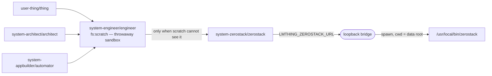

# `system-zerostack` — the external coding agent

**zerostack** is a third-party coding agent — a ~26 MB static Rust binary ([gi-dellav/zerostack](https://github.com/gi-dellav/zerostack), GPL-3.0) — shipped inside the compute image and run by the pod over the **LMThing data directory**. `system-zerostack` is the space that lets an LMThing agent hand it work and read the result back.

It exists because of one structural limit: **there is no generic filesystem on any agent's model surface**, and the single exception — the engineer's `fs:scratch` sandbox — is jailed to a throwaway directory (`sdk/org/libs/core/system-spaces/system-engineer/agents/engineer/instruct.md:33-45`). Nothing in the system could look at a *live* generated app: read the project the user is complaining about, run its typechecker, open its SQLite database. zerostack can, because it is an ordinary process with an ordinary shell.

- The space format these files follow → [`../format/space/README.md`](../format/space/README.md).
- What a system space *is*, and the twelve of them → [`README.md`](./README.md).
- The sibling loopback bridge this one is modelled on → [`../desktop/browser.md`](../desktop/browser.md).

---

## 1. Shape

| | |
|---|---|
| **Agent** | `zerostack` — model-driven, no actions (`sdk/org/libs/core/system-spaces/system-zerostack/agents/zerostack/instruct.md:1-16`) |
| **Functions** | `zerostackAsk`, `zerostackLoop`, `zerostackStatus`, `zerostackSessions`, `zerostackCancel` |
| **Knowledge** | `zerostack/driving` (how to drive it), `zerostack/lmthing_apps` (the repair skillset for generated apps) |
| **`canDelegateTo`** | `[]` — a leaf. It drives a shell; it does not re-delegate. |
| **Reached by** | `system-engineer/engineer`, and only it (`sdk/org/libs/core/system-spaces/system-engineer/agents/engineer/instruct.md:14-18`) |

### The escalation chain

The engineer is the **sole caller** on purpose. Escalation is a judgement about whether a scratch sandbox is enough, and the engineer is the one agent whose own limits make that judgement concrete — so the decision lives where the constraint is, rather than being repeated in every builder's prompt. Every ref in this chain is asserted resolvable by `sdk/org/libs/core/src/spaces/system-delegation.test.ts:69-81`; nothing in `loadSpace` can check a `canDelegateTo` ref, because it points *across* spaces.

---

## 2. How the space reaches the binary

The functions are thin `fetch` wrappers onto a **loopback HTTP endpoint** published by the pod at `LMTHING_ZEROSTACK_URL` (`sdk/org/libs/cli/src/host/zerostack-endpoint.ts#ZEROSTACK_ENV`), started once per pod from `startSessionServer` (`sdk/org/libs/cli/src/host/zerostack-endpoint.ts#startZerostackEndpoint`).

This is the same pattern as the desktop browser endpoint, and for the same two reasons documented there: `process.env` is snapshot-copied into each QuickJS VM at injection time, and the VM's `fetch` is a sandbox yield resolved host-side by real Node `fetch` — so a `127.0.0.1` address is reachable from inside the sandbox and the integration needs no new global, no capability, and no DTS entry (`sdk/org/libs/cli/src/host/browser-endpoint.ts:20-35`).

Loopback rather than a pod route: a `router.add(...)` route would pass through `guardRequest` (which 401s on a team pod) and would publish a public surface for something that only talks to itself. An ephemeral port on `127.0.0.1` is unreachable from outside the pod at all — which matters more here than for the browser, because this endpoint runs arbitrary code against the person's entire data directory.

**The URL is published even when the binary is absent** (`sdk/org/libs/cli/src/host/zerostack-endpoint.ts:514-520`). An unset variable would make every function report the same uninformative "not configured"; a reachable endpoint can say which of the two things is actually wrong.

### Ops

| `op` | Wrapper | Effect |
|---|---|---|
| `status` | `zerostackStatus` | version, working dir, model, session count — or why it is unusable |
| `ask` | `zerostackAsk` | **starts** one turn (`zerostack -p [-c] -- <message>`), returns `{ sessionId, running: true }` |
| `loop` | `zerostackLoop` | **starts** a headless loop: adds `--loop --loop-prompt --loop-max --loop-run` |
| `wait` | *(internal to both)* | long-polls one turn; `{ running: true }` or the finished result |
| `sessions` | `zerostackSessions` | existing conversations, newest first, with `busy` |
| `cancel` | `zerostackCancel` | `SIGTERM` the in-flight turn of one session |

### Why a turn is started and polled, never awaited

The sandbox's `fetch` aborts at **25 seconds** and reports the failure as `status: 0` (`sdk/org/libs/core/src/eval/fetch-yield.ts:15,28`). A coding turn takes **minutes**. So a blocking `ask` could essentially never come back — and `status: 0` is indistinguishable from a dead endpoint, which is exactly the wrong conclusion to invite: the turn is still running, and starting over is the one thing that must not happen.

This was not theoretical. A live engineer→zerostack run over a genuinely broken project hit it **eight times**, twice announcing that the service was down before blundering into a call short enough to survive. Every unit test used a fake binary that answered instantly, so none of them could see it — the "wiring gaps need live runs" class of fault.

`ask`/`loop` therefore start the child and answer immediately with a `sessionId`; `wait` long-polls in 15-second slices, comfortably inside the sandbox limit (`sdk/org/libs/cli/src/host/zerostack-endpoint.ts#WAIT_SLICE_MS`). The space functions loop over `wait` internally, so the agent-facing shape is unchanged — `zerostackAsk` still just returns the answer (`sdk/org/libs/core/system-spaces/system-zerostack/functions/zerostackAsk.ts#runZerostack`).

A result is recorded when the turn's promise settles in `startTurn`, **not** in the child's own settle path (`sdk/org/libs/cli/src/host/zerostack-endpoint.ts:464-471`): a turn refused up front — no binary, unusable model, unknown session — resolves without ever spawning a child, and a `wait` that found neither a pending nor a finished turn would report "no turn is running" instead of the actual reason.

The regression test runs a child that outlives many slices, asserting each slice returns promptly, that at least one poll was genuinely needed, and that the answer survives intact (`sdk/org/libs/cli/src/host/zerostack-endpoint.test.ts:297-323`).

---

## 3. The session model — one data dir per conversation

zerostack mints its own session ids, and `--session` loads them **by id prefix**; there is no flag that creates a session under an id the caller chose. Rather than parse its session files to discover what it picked — a private format that can change underneath us — the bridge gives **each logical session its own `XDG_DATA_HOME`** under `<dataDir>/.zerostack/agents/<uuid>/` (`sdk/org/libs/cli/src/host/zerostack-endpoint.ts:262-268`).

With exactly one session in that directory, `-c` ("continue most recent session") is unambiguous **by construction**, and the id the agent holds is ours. A first turn therefore runs *without* `-c` — passing it on a fresh data dir asks zerostack to continue a session that does not exist yet — and every resume adds it (`sdk/org/libs/cli/src/host/zerostack-endpoint.ts:320-324`).

The cost is that zerostack's own cross-session memory is per-LMThing-session. That is the deliberate trade: a resume that silently attaches to the *wrong* conversation is a far worse failure than a narrower memory, and agents resume deliberately by passing a `sessionId` back.

An unknown `sessionId` is **refused**, never silently promoted to a new conversation (`sdk/org/libs/cli/src/host/zerostack-endpoint.ts:300-307`), and a session already mid-turn refuses a second concurrent call rather than queueing it.

> **The message is a positional argument.** `-p` is zerostack's print-and-exit *flag*, not a value flag (`--print` in its clap definition). The bridge passes `--` before the message so one beginning with `-` is never parsed as options.

---

## 4. What it runs as

**Working directory = the LMThing data root** (`<root>/.lmthing`, `/data/.lmthing` in a pod). That *is* the "full data directory" grant: every project, every generated app, every app's SQLite database, every project space.

`serve.ts` passes the resolved root and **never a `process.cwd()` fallback**. With no root the endpoint refuses every turn and says so in `status`, and `ensureWorkspace` writes nothing — because "anything other than the data root" is somebody's repository or home directory. This is not hypothetical: while it did fall back, a test server started without a root materialized `AGENTS.md` and `ARCHITECTURE.md` into the checkout (`sdk/org/libs/cli/src/host/zerostack-endpoint.test.ts:173-196`).

**Permission mode = `yolo`**, written into a generated `config.toml` (`sdk/org/libs/cli/src/host/zerostack-endpoint.ts#renderConfigToml`). This is not a preference — it is the only mode that works headless. Every other zerostack mode prompts on a terminal, and nothing is attached to one, so an "ask" would block until the turn timeout and present as a mysterious stall. `yolo` still refuses destructive bash (`rm`, `dd`, `mkfs`); that refusal is a backstop, not the policy, and it does not cover a `DROP TABLE` or a truncating write.

**File tools are confined to the data directory** by a generated `permission.external_directory` block (`/data/.lmthing/** = allow`, `/** = deny`). The runtime image under `/app` and the rest of the container are not merely denied — they are unreachable by the file tools. Bash is bounded only by yolo's destructive-command list.

**Model = the pod's own model, through the pod's own key.** The bridge maps `SessionManager.defaultModel` (`sdk/org/libs/cli/src/server/session-manager.ts#SessionManager.defaultModel`) onto a zerostack `custom_providers` entry via `mapProvider` (`sdk/org/libs/cli/src/host/zerostack-endpoint.ts#mapProvider`), so its spend lands on the same LiteLLM budget windows as every other agent. The key is named by **env var** (`api_key_env`), never inlined into the config file.

A provider with no OpenAI-compatible endpoint — `azure:` is the one that arises in practice — is **refused with a reason** rather than falling back. zerostack's own default provider is OpenRouter, so a silent fallback would bill an entirely different account, or fail deep inside the child complaining about a key nobody set. In production the pod runs `lmthingcloud:` (a LiteLLM proxy speaking OpenAI `/v1`), which maps cleanly.

### MCP is disabled outright

zerostack ships **three third-party MCP servers enabled by default** — Exa (`mcp.exa.ai`), Context7 and grep.app — and a live run confirmed the Exa one opens a session even with no `EXA_API_KEY` set. Inside a pod that is pure data egress: this agent works over the person's entire data directory, so anything it reads could be shipped to a third party nobody consented to, billed to an account nobody configured.

The generated config disables it two ways, because they fail differently (`sdk/org/libs/cli/src/host/zerostack-endpoint.ts#renderConfigToml`). `mcp_servers = {}` is load-bearing: the three defaults apply only while that key is **unset**, so an explicit empty map leaves no server defined and a future upstream release cannot add a fourth default underneath us. The `enable-exa-mcp` / `enable-context7-mcp` / `enable-grepapp-mcp` toggles then also refuse each one by name, so a regression that reinstated the defaults for an explicitly-empty map would still find them switched off. `allow_all_mcp_calls = false` completes it.

> TOML is positional — a top-level key written after the first `[table]` header silently joins that table instead. Every top-level key is emitted before `[custom_providers.…]`, and a test asserts the ordering (`sdk/org/libs/cli/src/host/zerostack-endpoint.test.ts:119-126`).

### The two documents zerostack reads

Three documents, three audiences, and merging any two of them is the easy mistake:

| document | audience | holds |
|---|---|---|
| the space's `knowledge/` | the **LMThing agent** | how to *drive* zerostack — phrasing a task, reading a result |
| `ZEROSTACK_ARCHITECTURE_MD` (`sdk/org/libs/cli/src/host/zerostack-architecture.ts#ZEROSTACK_ARCHITECTURE_MD`) | **zerostack** | the REFERENCE — what LMThing is, what is in the data directory, the exact shape of every format |
| `ZEROSTACK_AGENTS_MD` (`sdk/org/libs/cli/src/host/zerostack-agents.ts#ZEROSTACK_AGENTS_MD`) | **zerostack** | the CONTRACT — what is off-limits, how to verify, how to report back |

Both of the latter are written into the data directory and loaded automatically as context files, which is why the bridge does *not* pass `--no-context-files`.

**They are materialized on the FIRST TURN, not at boot** (`sdk/org/libs/cli/src/host/zerostack-endpoint.ts:275-304`). The data root is the person's own directory — their projects sit in it and they look at it — and most pods never call zerostack at all, so a feature nobody used has no business dropping two files at the top of it on every boot. Nothing is created until the moment it is needed: `startZerostackEndpoint` writes nothing, `status` stays a pure read (asking whether zerostack works must not be what creates it), and the first `ask`/`loop` materializes `.zerostack/`, `config.toml` and both primers together.

The guard is **once per process, always overwriting** — not "write if absent". A pod volume outlives the image, so writing only when missing would let a primer authored by an older runtime survive an upgrade unnoticed, describing formats that have since changed; that is worse than no primer at all. The first call after a boot rewrites both; every later call in the same boot costs nothing.

`ARCHITECTURE.md` must also be in place *before the first child starts*, which is why `ensureWorkspace` runs in `startTurn` rather than lazily around the spawn: without it zerostack asks "No ARCHITECTURE.md found … Create one? [y/N]", and it asks even under `-p`.

`ARCHITECTURE.md` carries what is genuinely unguessable from the files alone, and is asserted to keep carrying it (`sdk/org/libs/cli/src/host/zerostack-endpoint.test.ts:195-208`): that a project *is* an application; that `api/` filenames **are** the HTTP method and any other filename is unrouted; that `ctx.db` is an async proxy where a missing `await` fails silently; that a page is a `.view.json` **spec** against a closed 8-kind / 24-element vocabulary with no React escape hatch, beside a generated `.tsx` wrapper; that a table schema failing validation takes the **whole app** down rather than one table; that a space load is all-or-nothing behind a frontmatter allow-list; that space functions run in QuickJS with no filesystem and no `child_process`; and that `types/generated.d.ts`, `.data/` and `system/spaces/` are generated or re-materialized (`sdk/org/libs/cli/src/cli/runtime-init.ts#materializeRuntime`).

The bridge gives the child no stdin, so that prompt would EOF and continue anyway — but that is the question failing safe, not the question not being asked.

---

## 5. Timeouts, and why a timeout is its own outcome

A turn defaults to 10 minutes and is capped at 30; a loop is capped at 60 (`sdk/org/libs/cli/src/host/zerostack-endpoint.ts:60-67`). A coding turn is not a web request — read, edit, typecheck, read the failure, edit again routinely runs into minutes.

On timeout the bridge sends `SIGTERM` first (so zerostack can flush its session file), then `SIGKILL` after 5s, and returns `timedOut: true` **with the partial output** (`sdk/org/libs/cli/src/host/zerostack-endpoint.ts:363-396`). This is the result that must not be rounded to either "done" or "failed": zerostack has usually already edited files, so half-applied edits are on disk and the correct move is to *resume the session*, not to start over on top of them.

Output is capped at 2 MB and explicitly marked when truncated.

---

## 6. Shipping the binary

The compute image downloads a pinned release into `/usr/local/bin/zerostack` (`devops/argocd/compute/Dockerfile:114-146`) and runs `zerostack --version` as a build step, so a broken binary fails the **build** rather than surfacing inside a pod when a user asks for the one feature that needs it.

Two constraints on the asset choice:

- **The full build, not `zerostack-lite-*`.** Upstream builds the full asset with `--all-features` and the lite one with `--no-default-features`, which drops `loop`, `mcp`, `subagents` and `git-worktree`. `zerostackLoop` drives `--loop`, so the lite binary would fail at an unknown-argument error that points nowhere near the cause.
- **`-musl`, not `-gnu`.** The `-gnu` asset for v1.7.2 links against `GLIBC_2.38`/`2.39`, which does not exist on the base image (`node:24-slim` is Debian bookworm, glibc 2.36) — `zerostack --version` fails at the build step with a "version `GLIBC_2.38' not found" error. `-musl` is a static-pie binary with no dynamic glibc dependency, so it runs unchanged on bookworm. Its binary inside the tarball is also arch-suffixed (`zerostack-x86_64-unknown-linux-musl`) rather than plain `zerostack` like the gnu asset, which the extraction step's `find` pattern has to match too.

The version is pinned exactly rather than tracking `latest`: this binary executes model-authored code against the person's entire data directory, so a silent upstream change in behaviour or permission handling is not something to inherit on the next unrelated image rebuild.

`LMTHING_ZEROSTACK_BIN` overrides the location for local development and tests.

---

## 7. Failure modes the design forecloses

| Failure | What prevents it |
|---|---|
| A resume silently starts a new conversation | one `XDG_DATA_HOME` per session makes `-c` unambiguous; an unknown id is refused |
| Spend lands on an unrelated OpenRouter account | `mapProvider` refuses a non-OpenAI-compatible provider instead of falling back |
| The primers get written into a repo or home directory instead of a data root | `dataDir` is the resolved lmthing root or nothing; no root ⇒ turns refused, nothing written |
| Files from a private data directory leak to a third-party MCP server | `mcp_servers = {}` plus each default refused by name; upstream ships three ON |
| A "fix" to `system/spaces/` reports success and reverts on reboot | stated in `AGENTS.md`, in the agent's rules, and in the `lmthing_apps` knowledge |
| A turn hangs forever waiting on a permission prompt | `yolo` is written into the generated config; no mode that prompts is reachable |
| The binary is missing and every function says "not configured" | the endpoint is published regardless and `status` reports the real reason |
| A minutes-long turn dies at the sandbox's 25s fetch cap, reported as a dead endpoint | `ask` starts and returns; `wait` polls in 15s slices |
| A `canDelegateTo` typo silently disables the escalation | `sdk/org/libs/core/src/spaces/system-delegation.test.ts:38-60` resolves every shipped ref |
| An unverified fix is relayed as done | the agent's rules and the `reading-a-result` aspect both require the command and its output |
