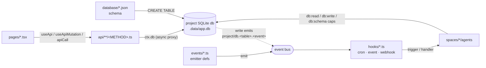

# `project/` — the project-as-application format

A **project** can own a full **app** built on the shared pod runtime: a project-rooted SQLite DB, worker-isolated Node API handlers, client-side React pages, in-proc hooks, and its own project-scoped spaces — the app layer lives at the project level as siblings of `spaces/` (`sdk/org/project-as-application.md` §"The model"). Apps are authored by the **`system-appbuilder`** space (THING delegates "build me an app" to its `app-architect`) and distributed via the **`store/projects/`** catalog (`sdk/org/project-as-application.md` §"The `system-appbuilder` space"; `sdk/org/libs/cli/src/server/routes/apps.ts` `handleInstallApp`). Two shipped reference apps: the full `store/projects/blog/` and the minimal hand-authored `store/projects/demo-feed/` (`store/projects/manifest.json`).

## Directory layout

The app's pillars sit at the project root, siblings of `spaces/` (`store/projects/blog/` — `api/ components/ database/ hooks/ pages/ spaces/`; `sdk/org/project-as-application.md` §"Directory layout").

```mermaid
graph TD
  ROOT["&lt;project&gt;/"]
  ROOT --> PJ["project.json — descriptor (id/name/title/icon)"]
  ROOT --> PKG["package.json — npm metadata + deps (react, @lmthing/ui, @lmthing/css)"]
  ROOT --> TS["tsconfig.json — app typecheck config"]
  ROOT --> DB["database/ — table SCHEMAS (one JSON per table)"]
  ROOT --> API["api/ — worker-isolated Node HTTP handlers, file-routed"]
  ROOT --> PG["pages/ — client-side React routes, file-routed"]
  ROOT --> CO["components/ — shared React components imported by pages"]
  ROOT --> HK["hooks/ — in-proc automation: cron | event | webhook"]
  ROOT --> EV["events/ — (optional) typed emitter defs (webhook/cron/db/internal)"]
  ROOT --> SP["spaces/ — project-scoped spaces (the app's own specialists)"]
  ROOT -.->|generated / git-ignored| GEN["types/ · .data/app.db"]
```



- The project **descriptor** is `project.json` (`{id, name/title, icon, …}`), read by the server's `readProjectMeta` — display name falls back `name → title → id` (`sdk/org/libs/cli/src/server/projects.ts` `readProjectMeta`). See [project.json.md](./project.json.md).
- `package.json` carries npm metadata + the app's React/UI deps and drives the per-project page build (`store/projects/blog/package.json`; `sdk/org/libs/cli/src/app/build/pages.ts` `buildProjectPages`). See [package.json.md](./package.json.md).
- `tsconfig.json` is the app's typecheck config. See [tsconfig.json.md](./tsconfig.json.md).
- `database/`, `api/`, `pages/`, `hooks/` are the **four pillars**; `components/`, `events/`, and `spaces/` are additional (optional) siblings (`store/projects/blog/`).
- `types/` (generated row + endpoint I/O types, `sdk/org/libs/cli/src/app/build/schema.ts` `generateAppTypes`) and `.data/app.db` (the SQLite store, `sdk/org/libs/cli/src/app/store.ts`) are build/runtime artifacts, git-ignored (`sdk/org/project-as-application.md` §"Directory layout").

## The four pillars map to four runtime tiers

Each pillar is loaded and served by a distinct runtime tier, all in `@lmthing/cli` under `sdk/org/libs/cli/src/app/`, over interfaces defined in `@lmthing/core`.



- **`database/*.json`** — each JSON declares one table (name = file basename); the `better-sqlite3`-backed store turns them into real `CREATE TABLE` statements in `<project>/.data/app.db` with `PRAGMA foreign_keys=ON` (`sdk/org/libs/cli/src/app/store.ts`). Schemas are validated fail-loud (required descriptions, exactly one primary key, resolvable references/relations) by `validateTableSchema` (`sdk/org/libs/core/src/db/validate.ts`). See [database/README.md](./database/README.md).
- **`api/**/<METHOD>.ts`** — the endpoint route is the directory, the HTTP method is the filename (`GET.ts`/`POST.ts`/`PUT.ts`/`PATCH.ts`/`DELETE.ts`); `[seg]` → `:seg` dynamic params; `name` (from `export const name`) is the stable agent-facing id, unique per project (`sdk/org/libs/cli/src/app/api/loader.ts` `loadApiRoutes`, `METHOD_FILE_RE`). Handlers run worker-isolated in Node with an **async** `ctx.db`/`ctx.apiCall`/`ctx.spawn` proxied to the main process — the worker is a crash boundary, every db write executes main-side (`sdk/org/libs/cli/src/app/api/runtime.ts` `createApiRuntime`; `sdk/org/libs/core/src/db/types.ts` `AsyncDbApi`). See [api/README.md](./api/README.md).
- **`pages/*.tsx`** — client-side React routes, esbuild-bundled per project (`index.tsx` = dir path, `[id]` → `:id`, `_app`/`_layout` are wrappers not routes) (`sdk/org/libs/cli/src/app/build/pages.ts` `buildProjectPages`). Pages fetch data through the `@app/runtime` hooks `useApi`/`useApiMutation` and the bare `apiCall` (`sdk/org/libs/cli/src/app/runtime/hooks.tsx`; `sdk/org/libs/cli/src/app/runtime/client.ts` `apiCall`). See [pages/README.md](./pages/README.md), [pages/app-file.md](./pages/app-file.md), [pages/layout-file.md](./pages/layout-file.md), [components/README.md](./components/README.md).
- **`hooks/*.ts`** — in-proc automation. The three current kinds are **`cron`** (declarative `trigger` only), **`event`** (subscribes to a source-qualified `<sourceId>/<name>`, `trigger` or `handler`), and **`webhook`** (external inbound POST) (`sdk/org/libs/cli/src/app/hooks/loader.ts` `validateHook`:384-434). A hook is either declarative (`trigger: 'space/agent#action'`) or imperative (`handler(ctx)`) (`sdk/org/libs/cli/src/app/hooks/loader.ts`:400,434). See [hooks/README.md](./hooks/README.md), [hooks/cron.md](./hooks/cron.md), [hooks/event.md](./hooks/event.md), [hooks/database.md](./hooks/database.md).

> `{type:'database'}` hooks are **REMOVED (no back-compat)** — a db write instead auto-emits a synthetic `project/db.<table>.<event>` event whose payload IS the written row, which you consume with an **event** hook (`sdk/org/libs/cli/src/app/hooks/loader.ts`:49-53,414; `sdk/org/libs/cli/src/app/hooks/runtime.ts` `onDbWrite`:130-131). The `database.md` doc covers this db-write-as-event pattern (`store/projects/demo-feed/hooks/enrich-on-add.ts` subscribes `on:{event:'project/db.feed_items.insert'}`).

- **`events/*.ts`** (optional) — typed emitter defs, the PRODUCER side of the event pipeline; scanned at PROJECT scope `<root>/<projectId>/events/*.ts` and per space (`sdk/org/libs/cli/src/server/emitter-manifests.ts`:158). No shipped project app ships an `events/` dir — project apps drive hooks off the synthetic db events above; emitter defs are used by store integration **spaces** (`store/spaces/integration-slack/events/`). See [events/README.md](./events/README.md).
- **`spaces/*/agents`** — the app's project-scoped specialists that read/write the same db, gated by `capabilities:` grants (`store/projects/blog/spaces/` has `newsroom`/`editorial`/`research`/`assistant`). See [spaces/README.md](./spaces/README.md) → [../space/README.md](../space/README.md).

Emitted/synthetic events are source-qualified `<scope>/<event>` and matched against subscribing event hooks by the bus (`sdk/org/libs/cli/src/server/event-dispatch.ts` `dispatchEmittedEvents`, `matchEventHooks`). Db-write events flow through a coalescing queue that drains after the current eval unwinds — hooks never fire re-entrantly inside a write (`sdk/org/libs/cli/src/app/hooks/runtime.ts` `onDbWrite`:130-136).

## Per-file-kind docs

| File | Doc |
|---|---|
| `project.json` | [project.json.md](./project.json.md) |
| `package.json` | [package.json.md](./package.json.md) |
| `tsconfig.json` | [tsconfig.json.md](./tsconfig.json.md) |
| `database/<table>.json` | [database/README.md](./database/README.md) |
| `api/<path>/<METHOD>.ts` | [api/README.md](./api/README.md) |
| `pages/<route>.tsx` | [pages/README.md](./pages/README.md) · [pages/app-file.md](./pages/app-file.md) · [pages/layout-file.md](./pages/layout-file.md) |
| `components/<Name>.tsx` | [components/README.md](./components/README.md) |
| `hooks/<slug>.ts` | [hooks/README.md](./hooks/README.md) · [cron.md](./hooks/cron.md) · [event.md](./hooks/event.md) · [database.md](./hooks/database.md) |
| `events/<name>.ts` | [events/README.md](./events/README.md) |
| `spaces/<space>/…` | [spaces/README.md](./spaces/README.md) → [../space/README.md](../space/README.md) |

## Capabilities gate who may author and touch each pillar

Every authoring/data power is a **capability** granted in an agent's `instruct.md` frontmatter under the `capabilities:` key, host-injected only when the grant is present (a missing grant is also stripped from the typecheck DTS, so a stray call fails typecheck) (`sdk/org/libs/core/src/spaces/capabilities.ts` `CAPABILITY_IDS`; `sdk/org/libs/core/src/exec/app-globals.ts` `injectAppGlobals`:198-221). The full grant id set is `db:read`, `db:write`, `db:schema`, `pages:write`, `api:write`, `hooks:write`, `api:call`, `connections:use`, `tools:use`, `project:manage`, `store:read`, `store:install`, `events:emit` (`sdk/org/libs/core/src/spaces/capabilities.ts`:42-55). The pillar-relevant subset:

| Capability | Unlocks (project-app pillar) |
|---|---|
| `db:read` | `db.query`, `db.tables` (`sdk/org/libs/core/src/exec/app-globals.ts` `buildScopedDb`:122) |
| `db:write` | `db.insert`, `db.update`, `db.remove` (`app-globals.ts`:123) |
| `db:schema` | `db.createTable`/`addColumn`, `writeTableSchema`/`writeProjectTable` (`app-globals.ts`:124,214-218) |
| `pages:write` | `writePage`/`writeProjectPage` (`app-globals.ts`:198,204) |
| `api:write` | `writeApi`/`writeProjectApi` (`app-globals.ts`:199,205) |
| `hooks:write` | `writeHook`/`writeProjectHook`/`writeProjectEvent`/`writeProjectFunction` (`app-globals.ts`:206,211-213) |
| `api:call` | `apiCall(name, input)` — requires a non-empty `{allow:[...]}` (`sdk/org/libs/core/src/spaces/capabilities.ts` `parseApiCallConfig`) |
| `project:manage` | `createProject`, `selectProject` (`app-globals.ts`:219-221) |

`db:*` grants narrow to named tables via `{tables:[...]}`, enforced per-verb at every call by `assertTableAllowed` (`sdk/org/libs/core/src/exec/app-globals.ts` `assertTableAllowed`). This keeps two agents in one project in their own lanes on the shared db (`store/projects/blog/spaces/newsroom/agents/fetcher/instruct.md`). Full grant/config/fail-loud rules → [../space/agents/capabilities.md](../space/agents/capabilities.md).

## Worked example — a project-scoped agent's grants

Adapted from `store/projects/blog/spaces/newsroom/agents/fetcher/instruct.md` — an agent that reads two tables and writes to a narrower set, expressed entirely in `capabilities:` frontmatter (per-verb table narrowing validated fail-loud against the project's `database/`):

```yaml
---
title: Fetcher
defaultAction: refresh
capabilities:
  - db:read:  { tables: [sources, raw_items] }
  - db:write: { tables: [raw_items, sources] }
---
```

## Related

- Full design & data flow → [../../sdk/org/project-as-application.md](../../sdk/org/project-as-application.md)
- Project-scoped spaces & agents → [spaces/README.md](./spaces/README.md) · [../space/README.md](../space/README.md)
- Capability grants (full spec) → [../space/agents/capabilities.md](../space/agents/capabilities.md)
