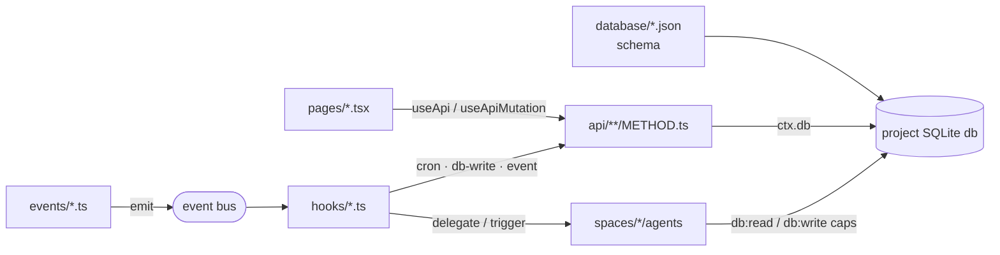

# `project/` — project-application format

A **project** owns a full **app** built on the shared pod runtime: a project-rooted SQLite DB,
worker-isolated Node API handlers, client-side React pages, in-proc hooks, and its own
project-scoped spaces. Apps are authored by the **`system-appbuilder`** space (THING delegates
"build me an app" to its `app-architect`) and distributed via the **`store/projects/`** catalog.

## Directory layout

The app's pillars are siblings of `spaces/` at the project root:

```
<project>/
├── project.json            # OR package.json — project descriptor (id/title/description/icon)  → project.json.md
├── package.json            # npm metadata + deps (react, @lmthing/ui, @lmthing/css)             → package.json.md
├── tsconfig.json           # app typecheck config                                               → tsconfig.json.md
├── README.md               # human docs (optional)
│
├── database/               # table SCHEMAS — one JSON per table                                 → database/
│   └── <table>.json
├── api/                    # worker-isolated Node HTTP handlers, file-routed                    → api/
│   └── <path…>/<METHOD>.ts # last path segment = HTTP verb (GET|POST|PUT|PATCH|DELETE)
├── pages/                  # client-side React routes, file-routed                              → pages/
│   ├── _app.tsx            # optional root wrapper
│   ├── _layout.tsx         # optional shared layout
│   ├── index.tsx           # "/" route
│   └── <route>.tsx         # "/route"; [seg] = dynamic param
├── components/             # shared React components imported by pages                          → components/
│   └── <Name>.tsx
├── hooks/                  # in-proc automation: cron | database | event                        → hooks/
│   └── <slug>.ts
├── events/                 # (optional) typed event emitter defs (webhook/cron/db/internal)     → events/
│   └── <name>.ts
└── spaces/                 # project-scoped spaces — the app's own specialists                  → spaces/
    └── <space>/…

# generated / runtime, git-ignored:  types/  .data/
```

Real reference templates: `store/projects/blog/` (full app) and `store/projects/demo-feed/`
(minimal hand-authored reference).

## How the pillars connect



- **`database/*.json`** declare tables → compiled into one project SQLite db.
- **`api/**/<METHOD>.ts`** read/write the db via `ctx.db` and expose typed JSON endpoints.
- **`pages/*.tsx`** call those endpoints via `@app/runtime` hooks (`useApi`, `useApiMutation`).
- **`hooks/*.ts`** fire on a cron, a db write, or an event — either running plain Node code or
  delegating to an agent.
- **`spaces/*/agents`** are the app's specialists; they touch the same db, gated by
  `capabilities:` grants (see [../space/agents/](../space/agents/)).
- **`events/*.ts`** turn writes / polls / signals into typed events on the bus.

## Per-file-kind docs

| File | Doc |
|---|---|
| `project.json` | [project.json.md](./project.json.md) |
| `package.json` | [package.json.md](./package.json.md) |
| `tsconfig.json` | [tsconfig.json.md](./tsconfig.json.md) |
| `database/<table>.json` | [database/](./database/) |
| `api/<path>/<METHOD>.ts` | [api/](./api/) |
| `pages/<route>.tsx` | [pages/](./pages/) |
| `components/<Name>.tsx` | [components/](./components/) |
| `hooks/<slug>.ts` | [hooks/](./hooks/) |
| `events/<name>.ts` | [events/](./events/) |
| `spaces/<space>/…` | [spaces/](./spaces/) → [../space/](../space/) |

## Capabilities — how an agent is allowed to author/touch these

Each authoring/data power is a **capability** granted in an agent's `instruct.md` frontmatter and
host-injected only when granted (a missing grant is also stripped from the typecheck DTS):

| Capability | Unlocks |
|---|---|
| `db:schema` | `writeTableSchema`, `db.createTable`/`addColumn` |
| `db:read` | `db.query`, `db.tables` |
| `db:write` | `db.insert`, `db.update`, `db.remove` |
| `pages:write` | `writePage` |
| `api:write` | `writeApi` |
| `hooks:write` | `writeHook` |
| `api:call` | `apiCall(name, input)` (requires `{ allow: [...] }`) |
| `project:manage` | `createProject`, `selectProject` |

Full grant/config table → [../space/agents/](../space/agents/).
