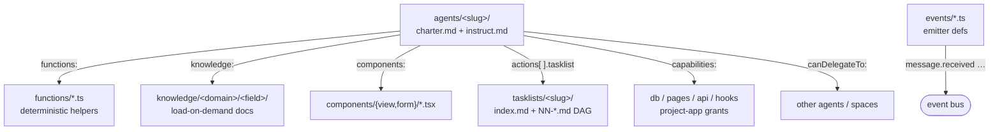

# `space/` — space format

A **space** is a portable bundle of AI specialists (**agents**) plus everything they need:
deterministic helper `functions/`, `knowledge/`, `tasklists/` (DAG workflows), agent-rendered UI
`components/`, and typed `events/` emitter defs. Spaces live in the pod's space roots
(`.lmthing/{system,user,my}/spaces/`), inside a project ([`<project>/spaces/`](../project/spaces/)),
or are distributed through the store (`store/spaces/` — mostly integrations today).

## Directory layout

```
<space>/
├── package.json            # store spaces only: the `lmthing` manifest block               → package.json.md
├── README.md               # human docs
├── agents/                 # the AI specialists                                            → agents/
│   └── <agent-slug>/
│       ├── charter.md      # persona / system preamble (plain markdown, no frontmatter)
│       └── instruct.md     # YAML frontmatter (config) + operating-instructions body
├── functions/              # deterministic TS helpers callable by agents (no LLM)          → functions/
│   └── <fnName>.ts
├── components/             # agent-rendered UI                                             → components/
│   ├── view/<Name>.tsx     # display components (used with display())
│   └── form/<Name>.tsx     # interactive inputs (used with ask())
├── tasklists/              # DAG workflows an action runs                                   → tasklists/
│   └── <tasklist-slug>/
│       ├── index.md        # frontmatter (input, connections) + overview body
│       └── NN-<task-id>.md # numbered steps, sorted lexically
├── knowledge/              # structured, load-on-demand domain docs                         → knowledge/
│   └── <domain>/<field>/
│       ├── index.md        # frontmatter (variable, description) + overview
│       └── <aspect>.md     # one aspect each (not a single overview.md)
├── events/                 # typed emitter defs — makes the space an EVENT SOURCE          → events/
│   └── <name>.ts
└── hooks/                  # (optional) event-hook consumers, {type:'event'}               → hooks/
    └── <slug>.ts
```

Not every directory is required — an integration space may be just `agents/ functions/ events/
knowledge/` (e.g. `store/spaces/integration-slack/`); a workflow-heavy space adds `tasklists/`.

## How an agent wires up



An agent's `instruct.md` frontmatter references its tooling by name: `functions:`, `knowledge:`,
`components:`, `actions[].tasklist`. Those references resolve against the sibling directories above.

## Per-file-kind docs

| File | Doc |
|---|---|
| `package.json` (`lmthing` block) | [package.json.md](./package.json.md) |
| `agents/<slug>/charter.md` + `instruct.md` | [agents/](./agents/) |
| `functions/<fn>.ts` | [functions/](./functions/) |
| `components/{view,form}/<Name>.tsx` | [components/](./components/) |
| `tasklists/<slug>/index.md` + `NN-<id>.md` | [tasklists/](./tasklists/) |
| `knowledge/<domain>/<field>/index.md` + `<aspect>.md` | [knowledge/](./knowledge/) |
| `events/<name>.ts` | [events/](./events/) |
| `hooks/<slug>.ts` (event consumers) | [hooks/](./hooks/) |

The `events/`/`hooks/` pair is the same unified event pipeline used by projects — see the project
side at [../project/events/](../project/events/) and [../project/hooks/](../project/hooks/).
