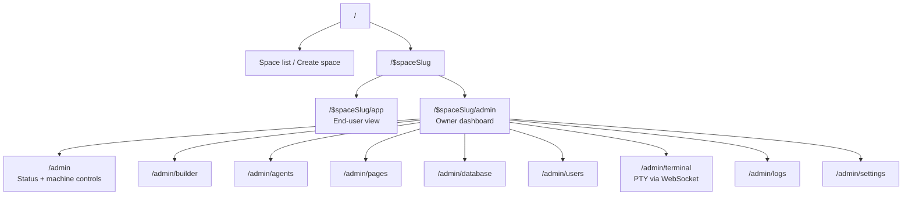

# lmthing.space

Deploy spaces to Fly.io containers with running agents, or publish agents for API access via the store.

## Overview

Each Space is a self-contained workspace backed by a dedicated Fly.io machine (1 core, 1 GB). Spaces have three pillars: **Agents**, **Flows**, and **Knowledge**. Users get a full admin panel with terminal access, logs, agent management, and settings.

## Routing



## Fly.io Integration

Spaces run on Fly.io Machines, managed through the `@lmthing/container` library.

### Lifecycle

1. User creates a space → `create-space` edge function provisions a Fly app + volume + machine
2. Machine boots the `@lmthing/server` container image
3. Admin panel connects via WebSocket for terminal, metrics, logs
4. Owner can start/stop/restart from the admin overview
5. Deleting a space destroys the machine, volume, and Fly app

### Deploying the container image

```bash
# Authenticate with Fly.io registry
flyctl auth docker

# Build and push
cd org/libs/server
docker build -t registry.fly.io/lmthing-space:latest .
docker push registry.fly.io/lmthing-space:latest
```

### Required Supabase secrets

```bash
pnpx supabase secrets set \
  FLY_API_TOKEN="<fly token>" \
  FLY_ORG=lmthing \
  SPACE_TOKEN_SECRET=$(openssl rand -hex 32) \
  COMPUTER_TOKEN_SECRET=$(openssl rand -hex 32) \
  COMPUTER_PRICE_ID=price_xxxx
```

| Secret | Source |
|--------|--------|
| `FLY_API_TOKEN` | `flyctl auth token` or Fly.io Dashboard → Access Tokens |
| `FLY_ORG` | Your Fly.io org slug |
| `SPACE_TOKEN_SECRET` | `openssl rand -hex 32` |
| `COMPUTER_TOKEN_SECRET` | `openssl rand -hex 32` |
| `COMPUTER_PRICE_ID` | Stripe Dashboard → Products → Computer tier price ID |

## Revenue Model

- **Space subscription** — $8/month per node (Fly.io cost is ~$5, ~$3 margin)
- **Token usage** — agents running on Space consume tokens through the Stripe AI Gateway (10% markup)
