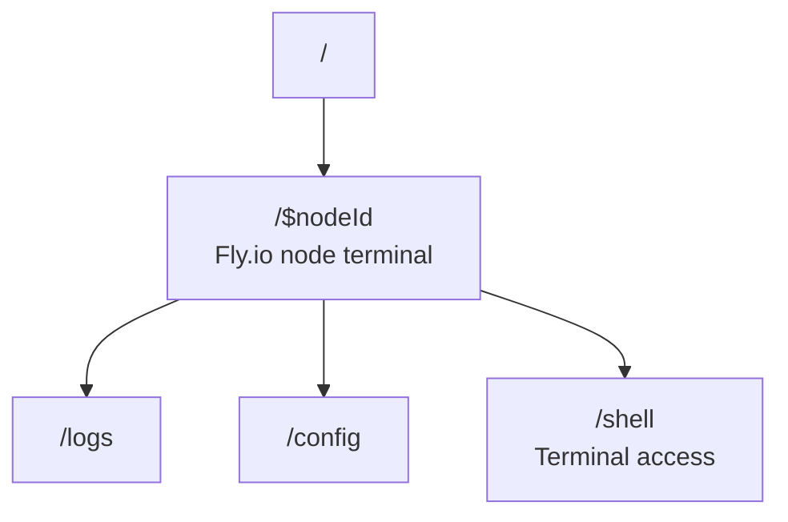

# lmthing.space

The Fly.io agent runtime environment. This is where THING personal agents live and execute.

## Overview

Each Space node is a Fly.io instance (1 core, 1 GB) where a THING personal agent is deployed and running. Users get terminal access to the environment — view logs, adjust configuration, and interact with the shell directly. Space nodes are the always-on runtime that powers Chat conversations, Casa home automation, and agent interactions on Social.

## Routing

## Revenue Model

- **Space subscription** — $8/month per node (Fly.io cost is $5, $3 margin). Provides a dedicated always-on personal THING agent runtime.
- **Token usage** — agents running on Space consume tokens through the Stripe AI Gateway (10% markup).
