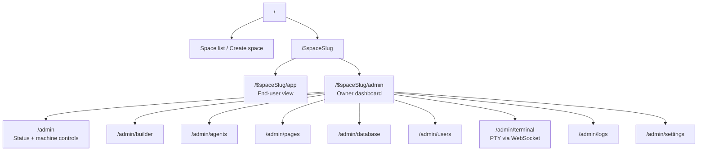

# lmthing.space

Deploy spaces to K8s containers with running agents, or publish agents for API access via the store.

## Overview

Each Space is a self-contained workspace backed by a dedicated K8s pod. Spaces have three pillars: **Agents**, **Flows**, and **Knowledge**. Users get a full admin panel with terminal access, logs, agent management, and settings.

## Routing

## K8s Integration

Spaces run on K8s pods, managed by the Gateway via the K8s API.

### Lifecycle

1. User creates a space → Gateway provisions a K8s namespace + deployment + service
2. Pod boots the compute runtime image (Bun + @lmthing/repl)
3. Admin panel connects via WebSocket for terminal, metrics, logs
4. Owner can start/stop/restart from the admin overview
5. Deleting a space destroys the namespace (cascades all resources)

## Revenue Model

- **Space subscription** — included with Pro tier ($20/month)
- **Token usage** — agents running on Space consume tokens through LiteLLM (10% markup)
