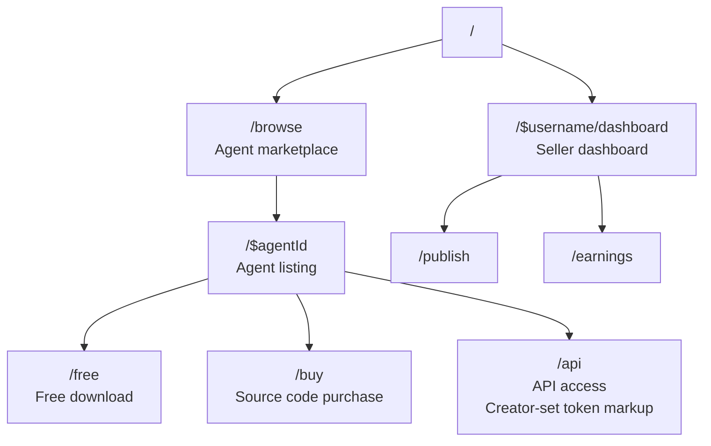

# lmthing.store

The agent marketplace. Creators publish agents, buyers discover and acquire them.

## Overview

Store offers three distribution models for agents:

- **Free** — open download, no cost.
- **Source purchase** — one-time fee for the full agent workspace (prompts, knowledge, tools, workflows).
- **API access** — the creator hosts the agent and sets a per-token markup. Buyers call the agent through lmthing.cloud without seeing the source.

Creators publish agents built in Studio. Buyers browse, preview, and acquire agents — source purchases give the full workspace, API access routes calls through the Stripe AI Gateway.

## Routing

## Revenue Model

- **Source purchases** — lmthing takes a platform fee on one-time source code sales.
- **API access** — creators set their own per-token markup on top of provider costs. lmthing collects the standard 10% gateway markup plus any platform commission.
- **Gateway traffic** — all API-access agents route through the Stripe AI Gateway, generating per-token revenue.
