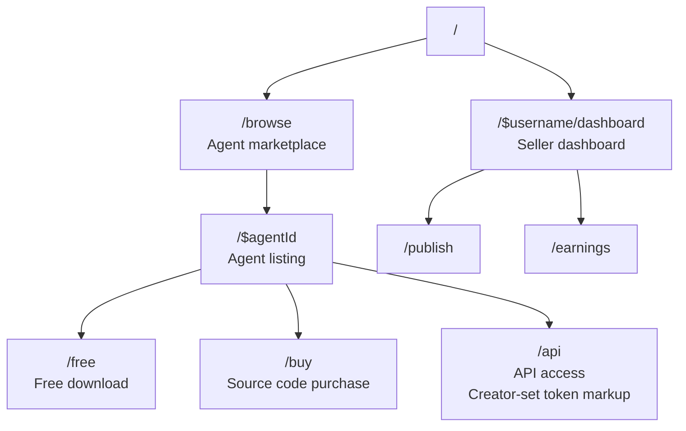

# lmthing.store

The agent marketplace. Creators publish agents, buyers discover and acquire them.

## Overview

Store offers three distribution models for agents:

- **Free** — open download, no cost.
- **Source purchase** — one-time fee for the full agent workspace (prompts, knowledge, tools, workflows).
- **API access** — the creator hosts the agent and sets a per-token markup. Buyers call the agent through lmthing.cloud without seeing the source.

Creators publish agents built in Studio. Buyers browse, preview, and acquire agents — source purchases give the full workspace, API access routes calls through the Stripe AI Gateway.

## Project-apps (`projects/`)

Beyond single agents, the store distributes **project-applications** — a project that owns a full
app (`database/ pages/ api/ hooks/` + its project-scoped `spaces/`) built on the pod runtime. See
[project-as-application](../sdk/org/project-as-application.md) for the model.

- Each catalog app is a complete on-disk template under `projects/<id>/` (`database/`, `pages/`,
  `api/`, `hooks/`, `components/`, `spaces/`, plus `package.json`/`project.json`). Five ship today:
  `blog`, `health`, `kitchen`, `trips`, `demo-feed`.
- `projects/manifest.json` is the generated browse index (`{ apps: [{ id, title, description,
  icon, tables, pages, endpoints, hooks, files }] }`). It's regenerated from the `projects/<id>/`
  templates by `scripts/gen-apps-manifest.mjs`, wired into the Vite build (`vite.config.ts`), which
  also copies each template into the dist output so nginx serves them as static assets at
  `lmthing.store/projects/<id>/<path>`.
- The static store only **browses** (`src/routes/projects/`, via `src/lib/apps-manifest.ts`).
  Installing is authenticated and happens on the user's compute pod: the store's "Install" action
  hands off to the lmthing.app install page (`src/lib/pod-api.ts`), which calls the pod CLI
  server's `POST /api/apps/install {appId}` — it downloads the template, materializes it into
  `<lmthingRoot>/<projectId>/`, boots the app, and builds its pages. The pod's `GET /api/apps`
  lists this same public catalog.

## Routing

## Revenue Model

- **Source purchases** — lmthing takes a platform fee on one-time source code sales.
- **API access** — creators set their own per-token markup on top of provider costs. lmthing collects the standard 15% gateway markup plus any platform commission.
- **Gateway traffic** — all API-access agents route through the Stripe AI Gateway, generating per-token revenue.
