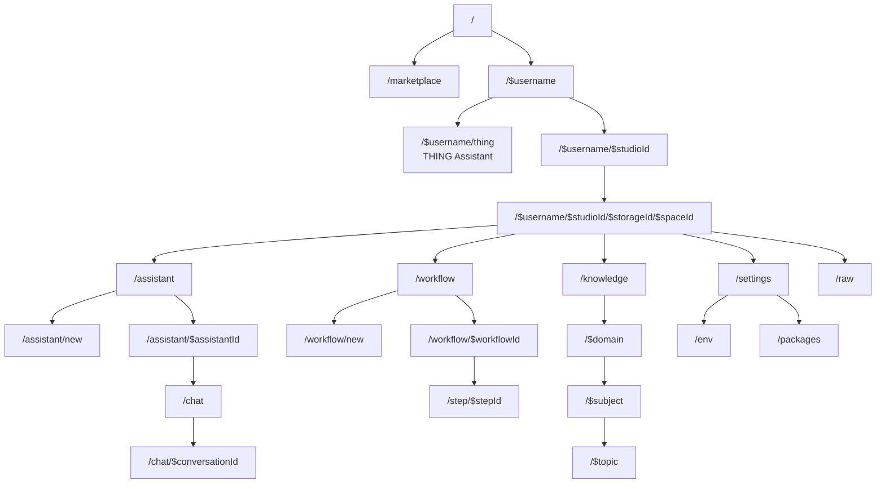

# lmthing.studio

The visual agent builder. Studio is the primary development surface for lmthing — design agents with prompts, tools, knowledge, and workflows with the help of THING.

## Overview

Each studio contains spaces (workspaces) where agents, workflows, and knowledge domains are created and edited. Studio can run without an account — users set a local password to encrypt API keys in localStorage (BYOK mode).

The THING assistant provides AI-powered workspace generation from natural language. THING can spawn agents as background processes that run independently and trigger responses back asynchronously, enabling parallel agentic workflows within the studio.

Studio supports agent evaluation through metrics — using LLM-as-a-judge or human evaluation. THING can iteratively test an agent until all metrics pass, and autonomously generate datasets to fine-tune SLMs via lmthing.cloud.

## Routing



## Revenue Model

Studio itself is free. It drives revenue through:

- **Free tier** — runs entirely in the browser via WebContainers with a $1/week token allowance. No server needed. BYOK mode requires no account at all.
- **Pay As You Go** — per-token usage through the Stripe AI Gateway with a 10% markup on provider costs.
- **Fine-Tuning** — $10/GPU-hour ($7 Azure cost) for training specialized SLMs via the evaluation/dataset pipeline.
- **Store publishing** — agents built in Studio can be published to lmthing.store for sale.

## Tech Stack

- React 19, Vite 7, TanStack Router
- Tailwind CSS 4, Radix UI
- @lmthing/state (VFS), @lmthing/core (agent framework)

## Development

```bash
cd studio
pnpm install
pnpm dev
# Open http://localhost:5173
```
