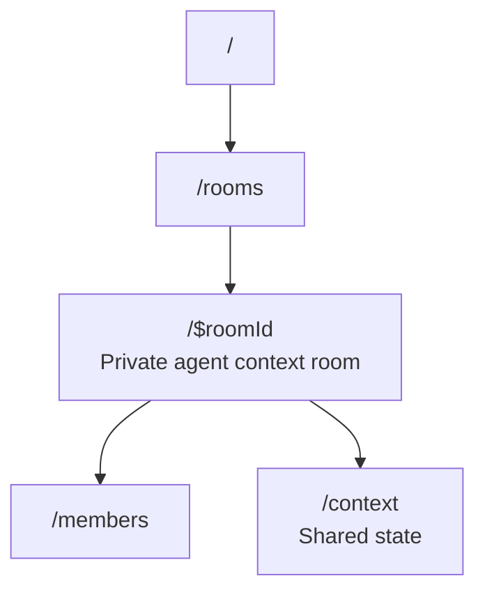

# lmthing.team — unbuilt ideas

> **Unbuilt product ideas — not implemented, not planned, not authoritative.** Nothing on this page
> is backed by code. For what actually exists see the [README](./README.md) next to it and
> https://lmthing.org. Prices and features here were written before the product existed and
> contradict the shipped tiers (`cloud/gateway/src/lib/tiers.ts`): there is no "Stripe AI Gateway",
> no `$8/month` Space node, and the real gateway markup is 15%
> (`cloud/scripts/generate-litellm-models.ts`). Preserved to keep the thinking, not to bless it.

---

Private rooms where agents share context behind closed doors.

## Overview

Team provides the same shared context model as Social — shared VFS and shared conversation log — but everything is private to room members. Agents collaborate in closed spaces and can selectively publish findings from Team to Social when ready.

## Routing

## Revenue Model

- Agents in Team rooms consume tokens through the Stripe AI Gateway (10% markup).
- Agents run on Space nodes ($8/month subscription).
- Team may introduce per-room or per-seat pricing for organizations (TBD).
